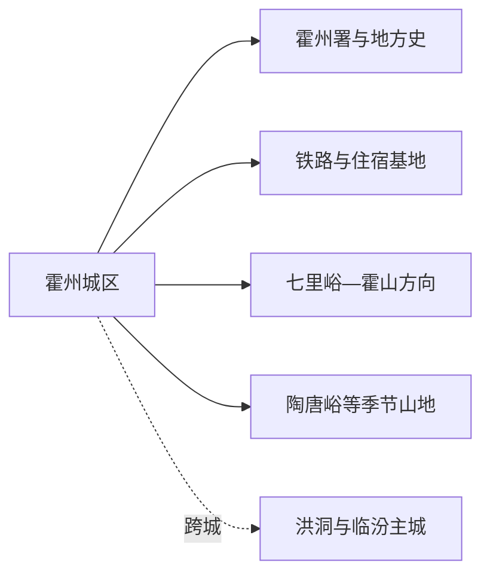
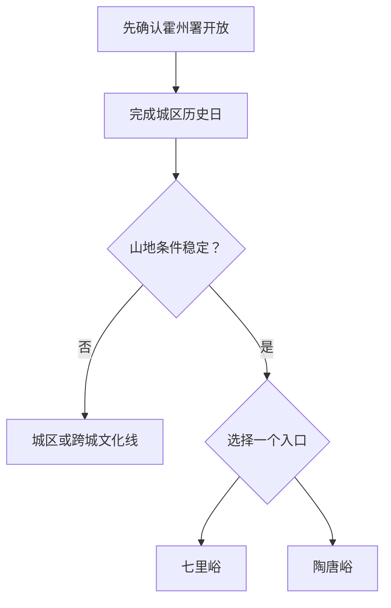

# 霍州旅行指南

霍州位于临汾北部、汾河谷地与霍山西麓之间。首访先用霍州署和城区文物理解古代州治与晋南城市，再根据季节选择七里峪、陶唐峪或其他正式开放的霍山游览区。城区半日至一日即可，山地另留整日；把古建日与山地日分开，路线更稳，也更容易应对修缮、防火和天气变化。

## 城市速览

| 项目 | 信息 |
|---|---|
| 旅行主线 | 霍州署、城区古建与地方史、霍山—七里峪山地、晋南面食 |
| 建议停留 | 1 天城区；2 天加入一条山地线；3 天可再选另一季节方向 |
| 住宿基地 | 霍州城区，便于铁路、餐饮和早晚补给 |
| 步行强度 | 城区低至中；古建有门槛台阶，山地中高至高 |
| 主要天气 | 雷暴、短时强降雨、山洪、地质灾害、森林火险、寒潮与结冰 |
| 文保重点 | 霍州署、古建、庙宇和石刻按开放殿院、摄影与修缮规则参观 |
| 亲子 | 霍州署讲解加一段城区公共空间；山地选择短游径 |
| 低体力 | 城区单馆最稳定，山地只选景区车可近达区域 |
| 生产边界 | 矿山、林场、铁路、河道施工和普通村道按管理范围活动 |
| 无障碍 | 设施连续性需向官方确认，古建门槛、坡道、卫生间和落客点逐处核对 |

## 城市格局与游览区域

霍州市是临汾市代管县级市，法定代码 `141082`。固定 GeoNames `1788462` 名为 Xinzhi，对应辛置镇实体 `Q14184959`，是市域南部镇区点；法定霍州市实体为 `Q1207117`，其 `P1566` 连接 `1806624`、`1806625` 两条其他记录。本页以固定候选点进入覆盖，以法定代码组织霍州城区、乡镇和霍山方向。

| 区域 | 旅行价值 | 怎么安排 |
|---|---|---|
| 霍州城区 | 霍州署、公共文化、餐饮和交通 | 半日至一日；抵达与雨天基地 |
| 辛置及南部镇区 | 固定 GeoNames 点位、工业与铁路城镇背景 | 以公共道路和城市服务为主，生产区按管理边界活动 |
| 七里峪—霍山方向 | 森林、峡谷、季节景观 | 单独一日，先锁开放入口和车辆 |
| 陶唐峪等山地 | 山谷、森林与季节活动 | 与七里峪二选一，按正式景区信息安排 |

## 主要景点

### 城区历史与文博

| 景点 | 所在区域 | 类型 | 核心看点 | 建议用时 | 室内/室外 | 体力 | 预约难度 | 天气敏感度 | 适合旅程 |
|---|---|---|---|---|---|---|---|---|---|
| 霍州署 | 霍州城区 | 古代官署、全国重点文保 | 州署格局、仪门堂宇与地方行政史 | 2–3 小时 | 混合 | 低至中 | 中高 | 中 | A |
| 霍州地方公共文化场馆 | 城区 | 地方史与公共文化 | 当期地方史、非遗、文物或专题展览 | 1–2 小时 | 室内 | 低 | 中 | 低 | B |
| 城区古建与公共街区短线 | 城区 | 城市历史路线 | 古城空间、公共生活与经确认开放的文保建筑 | 1.5–3 小时 | 混合 | 中 | 中 | 中 | B |
| 千佛崖等文物保护点 | 市域公开展示区 | 石刻与文物保护 | 石刻、佛教艺术与文保环境 | 1–2 小时 | 室外 | 中 | 高 | 高 | C |

### 霍山与山谷

| 景点 | 所在区域 | 类型 | 核心看点 | 建议用时 | 室内/室外 | 体力 | 预约难度 | 天气敏感度 | 适合旅程 |
|---|---|---|---|---|---|---|---|---|---|
| 七里峪景区 | 霍山方向 | 森林、峡谷与季节山地 | 林谷、山地步道和当期开放项目 | 5–8 小时 | 室外 | 中高 | 高 | 极高 | A |
| 陶唐峪旅游方向 | 霍山方向 | 山谷、森林与季节活动 | 山谷景观、森林环境和正式开放游径 | 5–7 小时 | 室外 | 中高 | 高 | 极高 | B |
| 霍山公开游览单元 | 市域东部 | 山地文化与自然背景 | 霍山地形、林地与经主管部门开放的游览区 | 4–7 小时 | 室外 | 高 | 高 | 极高 | C |

霍山是一片大尺度山地，七里峪、陶唐峪和其他入口分别核对。林场、防火封控、地质灾害隐患点和普通穿山道路不是替代入口；行程只使用景区公布的开放游径、停车和服务设施。

## 美食与餐饮

| 类型 | 适合场景 | 份量 | 过敏与饮食提示 | 选择方法 |
|---|---|---|---|---|
| 霍州饸饹面 | 早餐或午餐 | 一人一碗 | 小麦、荞麦或混合粉；卤汁可能含肉、大豆和蛋 | 问清面粉、浇头和汤底 |
| 晋南面食 | 日常简餐 | 一人份 | 小麦、醋、辣椒、肉汤与共厨 | 选择现做、菜单和份量清楚的面馆 |
| 羊汤与熟肉 | 早餐或冬季正餐 | 一碗或共享盘 | 羊肉、内脏、高盐和动物脂肪 | 一人先点小碗，熟肉按重量少量购买 |
| 山地家常合菜 | 山地日前后 | 多人分享 | 菌类、野菜来源、肉类和酒料 | 在城区或正规景区餐饮用餐，问清食材来源 |

## 经典行程

### 一日经典路线

**路线**：霍州署 → 城区午餐 → 公共文化场馆或古城短线 → 城区晚餐

- **串联逻辑**：以官署为核心，再用地方展陈和城市生活补足背景。
- **预约锚点**：霍州署开馆、修缮、讲解和公共场馆活动。
- **休息安排**：古建参观后在城区餐馆长休，下午只加一个短项。
- **时间不足时**：保留霍州署和一顿面食。

### 两日城区与七里峪路线

**第 1 天**：霍州署 → 城区文化短线 
**第 2 天**：城区 → 七里峪当期开放入口 → 原路返回

- **串联逻辑**：历史与山地分日，第二天完整留给交通和步道。
- **预约锚点**：景区开放、停车、景区车、天气、防火和返程车辆。
- **休息安排**：第二天使用游客服务区，午后保留至少一小时缓冲。
- **时间不足时**：山地日只走近入口短游径并提前返程。

### 三日深度路线

**第 1 天**：霍州城区 
**第 2 天**：七里峪 
**第 3 天**：陶唐峪 **或** 返回临汾／洪洞联程

- **串联逻辑**：第三天在第二条山地和跨城文化线之间二选一。
- **预约锚点**：第三天景区、铁路、住宿切换与行李寄存。
- **休息安排**：连续山地旅行时第三天降低步行量。
- **时间不足时**：删去第三天，保留城区加一条山地线。

### 雨雪路线

**路线**：霍州署 → 室内午餐 → 公共文化场馆 → 住宿

- **适用条件**：城区道路和场馆正常开放。
- **串联逻辑**：活动集中在城区，山地留到预警解除后。
- **预约锚点**：古建临时关闭、铁路调整和道路结冰。
- **休息安排**：全程使用室内场馆和短程车辆。
- **时间不足时**：只参观霍州署。

### 亲子路线

**路线**：霍州署讲解 → 午餐 → 城区公共文化活动 → 公园短段

- **适用条件**：讲解时长、儿童票和活动年龄已经确认。
- **串联逻辑**：用官署故事、互动展陈和短户外组成一天。
- **预约锚点**：亲子讲解、卫生间、儿童座椅与寄存。
- **休息安排**：午间回餐馆或住宿，古建台阶由成人看护。
- **时间不足时**：保留霍州署与简短讲解。

### 低体力路线

**路线**：住宿 → 霍州署重点殿院 → 午间长休 → 城区短程观览

- **适用条件**：门槛、台阶、落客点、座椅和卫生间已确认。
- **串联逻辑**：一座主景点配一段可随时结束的城市短线。
- **预约锚点**：最近入口、轮椅可达范围和车辆等候。
- **休息安排**：午间至少两小时，古建内按允许位置休息。
- **时间不足时**：只看霍州署核心开放区域。

### 霍山主题路线

**路线**：霍州城区 → 选定的七里峪或陶唐峪入口 → 正式游径 → 原路返回

- **适用条件**：只选择一个开放景区，天气、体力和车辆条件匹配。
- **串联逻辑**：保持同一山谷和入口，减少跨山折返。
- **预约锚点**：防火、地灾、景区车、最晚入园与返程。
- **休息安排**：游客中心和城区承担补给，不在林场道路停留。
- **时间不足时**：缩短步道，保持原路返程。

## 住宿区域

| 区域 | 优点 | 取舍 | 适合人群 | 交通提示 |
|---|---|---|---|---|
| 霍州城区 | 铁路、餐饮、霍州署和补给集中 | 山地仍需整日车辆 | 首访、两日旅行和公共交通者 | 订房时确认到霍州站或霍州东站的接驳 |
| 霍州东站方向 | 高铁抵离方便 | 与古城和餐饮核心有末段距离 | 晚到早走、行李多 | 核对公交、出租和夜间上客点 |
| 正规山地接待点 | 减少山地日往返 | 供暖、餐饮、医疗与通信差异大 | 已确认开放项目的慢游者 | 询问消防、热水、返程和恶劣天气退改 |

## 市内交通

霍州站与霍州东站服务不同列车，购票时逐字核对。城区内用公交、出租和分段步行；七里峪、陶唐峪和其他霍山入口依靠公路，车辆应按实际入口、路况和最晚返程安排。前往洪洞或临汾是跨城行程。

| 场景 | 怎么走 | 出发前确认 |
|---|---|---|
| 铁路抵达 | 按票面站名接入城区住宿 | 车次、出站口、公交、出租和行李 |
| 城区古建 | 步行加短程车辆 | 开馆、修缮、停车和步行连续性 |
| 霍山远线 | 正规包车、自驾或当期景区交通 | 入口、道路、防火、地灾、通信与返程 |
| 临汾—洪洞联程 | 铁路或道路换城 | 车次、住宿切换和目的地独立预约 |

## 不同旅行者须知

| 旅行者 | 更合适的安排 | 重点核对 |
|---|---|---|
| 亲子家庭 | 霍州署讲解加城区短线 | 古建门槛、护栏、卫生间和活动年龄 |
| 长者或低体力 | 城区一日；山地只选景区车可近达段 | 落客、座椅、坡度、医疗与返程 |
| 古建爱好者 | 霍州署为主，其他文保点按开放选一处 | 修缮、殿院、讲解、摄影和消防规则 |
| 山地旅行者 | 七里峪与陶唐峪分日 | 防火、雷暴、山洪、地灾和冬季结冰 |

## 行前核对

| 项目 | 为什么会变 | 何时核对 | 官方入口 |
|---|---|---|---|
| 霍州署与古建 | 修缮、消防、活动和开放殿院调整 | 前一周、前一日、当天 | [山西省文化和旅游厅](https://wlt.shanxi.gov.cn/)及霍州属地公告 |
| 七里峪与霍山 | 防火、天气、道路和季节运营影响开放 | 订车前及当天 | 山西文旅、林草、应急与景区公告 |
| 铁路 | 站名、车次和停靠动态变化 | 购票及出发前一日 | [中国铁路 12306](https://www.12306.cn/) |
| 天气与地灾 | 山洪、滑坡、结冰影响山地路线 | 出发前三日滚动查看 | [山西省气象局](https://sx.cma.gov.cn/)及自然资源部门 |

## 来源与更新记录

| 来源 | 支持内容 | 核验日期 |
|---|---|---|
| [文化和旅游部：临汾历史文化线路](https://zhuanti.mct.gov.cn/csxz2022/shanxi/detail_g7yU_708/4402.html) | 霍州署、霍山方向与临汾北部文化线路 | 2026-08-13 |
| [山西省文化和旅游厅](https://wlt.shanxi.gov.cn/) | 文旅、古建修缮和景区动态入口 | 2026-08-13 |
| [山西省国资委：七里峪森林康养项目](https://gzw.shanxi.gov.cn/xwfb/qyfz/202208/t20220829_7027058.shtml) | 七里峪山地旅游与康养运营背景；当前开放另行核对 | 2026-08-13 |
| [民政部行政区划代码服务](https://dmfw.mca.gov.cn/xzqh/getList?code=14&trimCode=true&maxLevel=3) | 霍州市法定层级与代码 `141082` | 2026-08-13 |
| [GeoNames 1788462](https://www.geonames.org/1788462/xinzhi.html) | 固定辛置镇点名称、坐标与要素分类 | 2026-08-13 |
| [Wikidata Q1207117](https://www.wikidata.org/wiki/Q1207117) | 法定霍州市实体、P1566 与行政代码交叉核对 | 2026-08-13 |
| [中国铁路 12306](https://www.12306.cn/) | 实时铁路车次与站名 | 2026-08-13 |
| [山西省气象局](https://sx.cma.gov.cn/) | 天气与预警入口 | 2026-08-13 |
| [国家文物局](https://www.ncha.gov.cn/) | 全国重点文物保护单位和文保政策入口 | 2026-08-13 |

| 日期 | 更新 |
|---|---|
| 2026-08-13 | 首次完成霍州公众旅行指南；建立城区古建与霍山分日结构，并说明辛置固定点、文保、山地和跨城边界。 |
