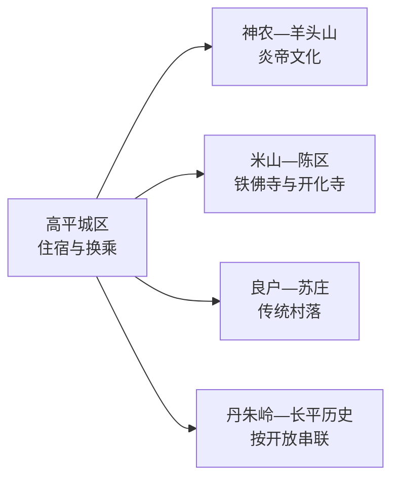
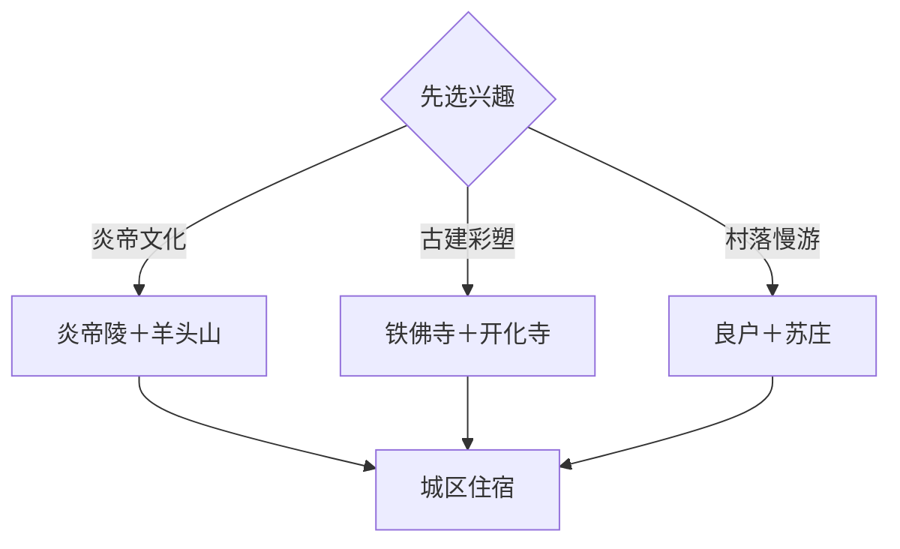

# 高平旅行指南

高平位于晋城北部，适合围绕炎帝文化、长平之战、宋金古建与太行山前村落安排 2–3 天。高平城区是住宿与交通基点，羊头山、炎帝陵、铁佛寺—开化寺和良户—苏庄分属不同方向；先选一条文化主线，再组合古建或村落，可把公路时间控制在合理范围。

本页绑定高平同名聚居点 **GeoNames 1810435**。该点人口字段未进入项目固定 `cities500` 快照，因此只用于法定县级市覆盖；Wikidata 的 GeoNames 属性连接到同域行政记录 1810434，两者分别表达城市点和行政实体。

## 城市速览

| 项目 | 信息 |
|---|---|
| 主线 | 炎帝文化—长平历史—古建彩塑—太行村落 |
| 停留 | 2 天可选两条方向；3 天加入古村或工业旅游正式开放区 |
| 住宿 | 高平城区便于换乘；主题活动明确时可在景区周边换宿 |
| 交通 | 高平东站、高平站与公路客运承担抵离，远点以公交、出租或预约车辆接驳 |
| 季节 | 春秋适合古建与村落步行；夏季留意强对流；冬季按冰雪和日照缩短户外段 |
| 预算 | 城区餐饮平实，包车、景区交通、讲解和演出是主要增量 |

## 城市格局与游览区域

城区适合补给和理解地方历史；羊头山、炎帝陵组成北部炎帝文化方向；铁佛寺与开化寺以古建、彩塑和壁画见长；良户、苏庄与卧龙湾偏向村落生活和休闲。长平之战相关遗址跨越较大空间，纪念馆和正式展示点比自行追逐零散地名更适合作为旅行入口。

## 主要景点

| 景点 | 区域 | 类型 | 核心体验 | 用时 | 环境 | 体力 | 预约风险 | 天气影响 | 优先级 |
|---|---|---|---|---:|---|---|---|---|---|
| 炎帝陵景区 | 神农镇方向 | 文化景区 | 炎帝祭祀、地方历史与园区展陈 | 2–3小时 | 混合 | 低中 | 节庆时高 | 中 | A |
| 羊头山炎帝文化旅游区 | 神农镇方向 | 山地遗址 | 羊头山石窟、山前景观与炎帝文化线索 | 半天 | 室外为主 | 中高 | 中 | 高 | A |
| 铁佛寺 | 米山镇米西村 | 古建与彩塑 | 古寺格局和造像艺术，按文保开放范围参观 | 1–2小时 | 混合 | 低中 | 高 | 中 | A |
| 开化寺 | 陈区镇方向 | 古建与壁画 | 宋代大殿、壁画和寺院空间 | 1.5–2小时 | 混合 | 低中 | 高 | 中 | A |
| 长平之战纪念馆 | 长平历史方向 | 纪念馆 | 战役背景、遗址分布与地方记忆 | 1.5–2.5小时 | 室内为主 | 低 | 高 | 低 | A |
| 良户古村 | 原村乡方向 | 传统村落 | 古院落、街巷和活态村落 | 2–3小时 | 混合 | 中 | 中 | 中 | B |
| 喜镇苏庄 | 河西镇方向 | 古村与文旅街区 | 传统村落、民俗展陈和当期运营活动 | 2–3小时 | 混合 | 低中 | 活动时高 | 中 | B |
| 丹朱岭工业旅游区 | 寺庄镇方向 | 工业旅游 | 运营方开放的矿业展陈与工业城市背景 | 3–4小时 | 混合 | 中 | 很高 | 中 | B |
| 古香中庙 | 神农镇方向 | 古建 | 炎帝文化线路上的古建筑与乡村环境 | 1–1.5小时 | 混合 | 低中 | 高 | 中 | B |
| 珐华田园或卧龙湾 | 市域乡村 | 乡村休闲 | 珐华文化、田园或滨水休闲，按季节二选一 | 2–3小时 | 混合 | 低 | 活动时中 | 高 | C |

## 美食与餐饮

高平十大碗适合多人分享，可在点餐时确认菜数和份量；烧豆腐、小米与晋东南面食更适合一人或轻量体验。城区餐饮选择稳定，村镇线路适合先确认午餐营业时间。豆制品、肉汤、面食和油炸小吃分别涉及大豆、肉类、麸质与较高油盐需求，点单时直接说明即可。

## 经典行程

### 炎帝文化一日线
**路线**：高平城区—炎帝陵—羊头山—城区。**逻辑**：同一文化主题由展陈进入山地遗址。**预约锚点**：两处开放与景区交通。**休息**：炎帝陵服务区。**删除条件**：高温、雷雨或体力不足时保留炎帝陵，缩短羊头山步道。

### 古建彩塑一日线
**路线**：铁佛寺—午餐—开化寺—城区。**逻辑**：用一天比较彩塑、壁画和不同时期古建。**预约锚点**：文保单位开放和讲解。**休息**：米山或城区。**删除条件**：一处临时关闭时改为长平之战纪念馆。

### 长平历史专题线
**路线**：地方文博线索—长平之战纪念馆—正式开放展示点。**逻辑**：先建立史实框架，再理解地理空间。**预约锚点**：纪念馆与展示点开放。**休息**：城区。**删除条件**：田野点缺少明确开放信息时只保留馆内展陈。

### 古村慢游线
**路线**：良户古村—乡村午餐—喜镇苏庄。**逻辑**：两处村落用建筑和生活场景形成对照。**预约锚点**：当期活动与展馆。**休息**：村内正式经营区。**删除条件**：降雨或道路调整时只选一村。

### 雨天文化线
**路线**：长平之战纪念馆—城区公共文化场馆—地方餐饮。**逻辑**：以室内内容维持完整主题。**预约锚点**：场馆开放。**休息**：城区商业区。**删除条件**：极端天气预警时按属地安排暂停出行。

### 亲子低体力线
**路线**：炎帝陵短线—午餐—长平之战纪念馆。**逻辑**：车辆近达、室内外相间。**预约锚点**：场馆儿童规则。**休息**：景区服务区和城区。**删除条件**：疲劳时保留单一场馆。

### 三日完整线
**路线**：首日炎帝文化，次日铁佛寺—开化寺，第三日良户—苏庄。**逻辑**：按方向分日，减少折返。**预约锚点**：古建开放与第二日车辆。**休息**：连续住城区。**删除条件**：压缩为两天时优先删村落日。

## 住宿区域

高平城区适合首次到访，铁路、公路、餐饮与晚间补给较集中。高平东站周边适合高铁抵离，但晚餐和景点接驳仍应与城区距离一起比较；古村或山地周边住宿更适合已落实自驾、停车和次日开放的旅行者。

## 市内交通

高平东站与高平站服务不同列车，订票后按站名安排接送。城区到各乡镇景点通常需要公路移动；同方向景点适合预约车辆或核对城乡公交后组合。山地和村落道路按天气、施工与停车引导通行，在产矿区、企业道路和专用设施执行生产边界。

## 不同旅行者须知

古建爱好者把讲解和开放确认放在首位；亲子家庭优先炎帝陵与纪念馆；低体力旅行者采用“车辆近达景点＋城区休息”；摄影旅行者可在公开村巷和景区步道安排晨昏。寺庙殿内、壁画和彩塑摄影按现场规定执行；考古区、文物修缮区、在产矿井及林地防火封控区保持明确边界。

## 行前核对

- 通过高平市政府和山西文旅渠道核对铁佛寺、开化寺、纪念馆及乡村展馆开放。
- 通过 12306 核对高平东站、高平站的车次和站名，并落实远点返程。
- 山地日核对雷雨、道路、森林火险和景区交通；节庆日另查预约与人流组织。
- 工业旅游只进入运营方公布的正式接待区域，并按实名、装备与年龄规则预约。

## 来源与更新记录

| 来源 | 支持内容 | 核验日期 |
|---|---|---|
| [高平市政府：五条主题线路](https://www.sxgp.gov.cn/xwzx_358/jcdt_363/202504/t20250430_2137619.shtml) | 炎帝、长平、古村、古建与工业旅游线路 | 2026-09-04 |
| [高平市政府：2026 年主题线路](https://www.sxgp.gov.cn/xwzx_358/jcdt_363/202604/t20260425_2344520.shtml) | 铁佛寺、开化寺、良户、苏庄与羊头山组合 | 2026-09-04 |
| [高平市政府：羊头山资料](https://www.sxgp.gov.cn/zjgp/lsrw_426/202509/t20250915_2248535.shtml) | 羊头山位置、石窟与历史线索 | 2026-09-04 |
| [GeoNames 1810435](https://www.geonames.org/1810435/) | 高平同名城市点与坐标 | 2026-09-04 |

