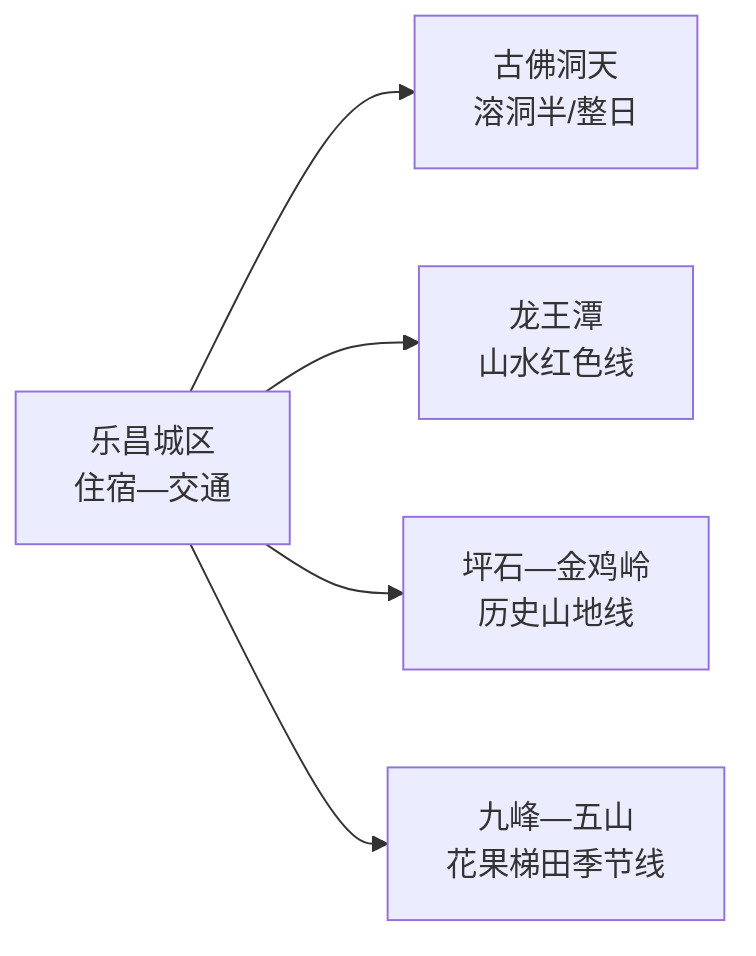
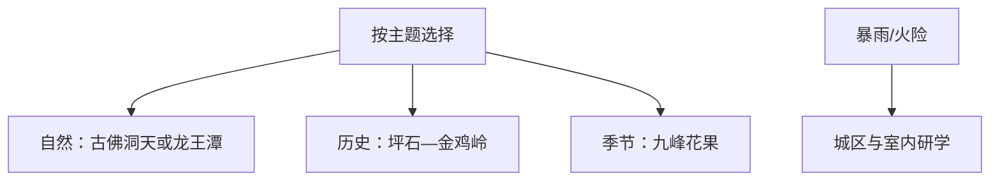

# 乐昌旅行指南

乐昌的景点沿京广铁路与南岭山地分散：城区负责住宿和换乘，坪石方向适合金鸡岭与华南教育历史，古佛洞天、龙王潭和九峰花果则各自占半天到一天。首次到访用两天完成“一条山水线＋一条历史线”最从容。

> 建议停留：2–3 天  
> 关键词：金鸡岭、坪石、古佛洞天、龙王潭、九峰、南岭山地  
> 主要体力：城区低；溶洞与山地中至高  
> 最近研究：2026-08-13

## 城市速览

| 项目 | 信息 |
|---|---|
| 主要价值 | 粤北山水、溶洞、红色历史和季节花果村落 |
| 建议停留 | 1天选一处核心景区；2天加坪石历史线；3天加九峰或乡村季节线 |
| 舒适季节 | 春季花景、夏季溶洞与瀑布、秋季果乡；冬季山地关注低温结冰 |
| 预算 | 城区适中；景区票务、乡镇车辆和季节住宿是变量 |
| 体力 | 溶洞湿滑、金鸡岭和龙王潭步道有爬升 |
| 风险 | 暴雨、山洪、雷电、低温结冰、森林火险和落石 |
| 独行 | 城区与铁路沿线方便；山地先定返程 |
| 亲子 | 溶洞、研学基地和兰花园可选；山水步道按年龄 |
| 低体力 | 坪石历史与车辆可达景点优先 |
| 无障碍 | 新建景区服务可询问；溶洞、古村和山地设施连续性需向官方确认 |

## 城市格局与游览区域

固定 GeoNames `1804252` 实为乐城街道主城点，对应 `Q10878334`；法定县级乐昌市采用 `Q1023909`、代码 `440281`，其 `P1566` 指向行政记录 `1804254`。本页透明保留两种粒度，并按完整乐昌市域组织。

| 区域 | 内容 | 怎么选 | 边界 |
|---|---|---|---|
| 乐昌城区 | 住宿、餐饮、铁路和城市补给 | 多日基地 | 与坪石相距较远 |
| 坪石—金鸡岭 | 丹霞地貌、铁路门户、华南教育历史 | 历史与山地完整日 | 景区和历史基地分别核开放 |
| 古佛洞天 | 溶洞与经营景区 | 高温或普通雨天可选 | 强降雨时仍关注洞内外安全 |
| 龙王潭 | 瀑布、山谷与长征主题 | 户外整日 | 水量、步道和天气决定强度 |
| 九峰—五山 | 桃李花果、梯田与乡村 | 只在花期、果期或活动匹配时加入 | 果园、农田、林场首先是生产空间 |
| 南岭保护地 | 自然保护区、林场和水源地 | 选择正式景区或自然教育线 | 核心保护区域、封闭林道和水库设施有明确限制 |

## 主要景点

| 景点 | 片区 | 类型 | 看点 | 用时 | 环境 | 体力 | 预约 | 天气 | 优先级 |
|---|---|---|---|---|---|---|---|---|---|
| 金鸡岭风景区 | 坪石 | 山地与地貌 | 丹霞山体、历史景观和登高视野 | 4–6小时 | 室外 | 高 | 高 | 很高 | A |
| 古佛洞天景区 | 城区近郊 | 溶洞景区 | 喀斯特洞穴、灯光游线与地质景观 | 3–5小时 | 混合 | 中 | 高 | 高 | A |
| 龙王潭生态旅游区 | 山地方向 | 山水与红色旅游 | 瀑布、峡谷和长征主题步道 | 4–6小时 | 室外 | 中至高 | 高 | 很高 | A |
| 华南教育历史研学基地（坪石） | 坪石 | 历史与研学 | 抗战时期教育史与旧址群 | 2–4小时 | 混合 | 中 | 高 | 中 | B |
| 九福兰花公园 | 近城或乡村 | 花卉与园艺 | 兰花展示、园艺与季节活动 | 2–3小时 | 混合 | 低至中 | 高 | 中 | B |
| 九峰花果乡村线 | 九峰镇 | 乡村与季节景观 | 桃李花、黄金柰李和山地村落 | 4–7小时 | 室外 | 中 | 高 | 很高 | B |

## 美食与餐饮

| 类型 | 场景 | 份量 | 注意 | 选择 |
|---|---|---|---|---|
| 乐昌马蹄制品 | 小吃伴手礼 | 少量 | 糖分、加工添加与储存 | 看配料和生产标识 |
| 梅花酸姜 | 配菜 | 少量 | 酸、盐、糖 | 与正餐少量搭配 |
| 芋头、笋与山野菜 | 家常菜 | 共享 | 猪油、辣椒与采摘来源 | 选正规餐馆，不自行采食野生植物 |
| 粤北客家菜 | 午晚餐 | 2–4人共享 | 肉类、酿制品、豆制品和盐 | 按人数点菜并问小份 |
| 黄金柰李等鲜果 | 果期 | 少量分食 | 果酸、糖分、清洗 | 正规销售点购买，果园按接待规则进入 |

## 经典行程

### 一日经典
- **路线**：古佛洞天 → 城区午餐 → 九福兰花公园或城区慢游。
- **串联逻辑**：用溶洞主景加一处轻量园艺体验。
- **预约锚点**：古佛洞天票务与项目优先。
- **休息安排**：午餐长休，洞内注意防滑。
- **时间不足时**：只留古佛洞天。

### 两日组合
- **路线**：第1天古佛洞天；第2天坪石华南教育历史基地 → 午餐 → 金鸡岭。
- **串联逻辑**：自然与历史分日，坪石同方向串联。
- **预约锚点**：历史基地、金鸡岭与铁路返程。
- **休息安排**：坪石午餐后再登山。
- **时间不足时**：坪石日保留历史基地或金鸡岭其一。

### 三日深度
- **路线**：前两日按上；第3天龙王潭或九峰季节线二选一。
- **适用条件**：天气与物候匹配。
- **预约锚点**：景区或乡镇接待、车辆和返程。
- **休息安排**：正式服务点午休。
- **时间不足时**：选离住宿更近的一处。

### 雨天路线
- **路线**：普通降雨时古佛洞天 → 午餐 → 华南教育历史室内展陈；强降雨预警时只留城区。
- **串联逻辑**：以室内和受控游线为主。
- **预约锚点**：核景区是否因雨关闭。
- **休息安排**：减少山路换乘。
- **时间不足时**：单点室内参观。

### 亲子与低体力
- **路线**：九福兰花公园 → 午餐 → 华南教育历史核心展。
- **减负方式**：亲子可选园艺和历史；低体力删山地爬升。
- **预约锚点**：活动年龄、落客点和卫生间。
- **休息安排**：午后留坐席休息。
- **时间不足时**：只选一处。

### 季节远线
- **路线**：九峰花果、五山梯田或龙王潭中选一条完整日。
- **适用条件**：花果期、天气、道路和接待明确。
- **预约锚点**：乡镇、景区、车辆和采摘规则。
- **休息安排**：村镇正式餐饮与补水。
- **时间不足时**：只保留一个公开观景点。

## 住宿区域

| 区域 | 优点 | 取舍 | 适合 | 建议 |
|---|---|---|---|---|
| 乐昌城区 | 多方向交通、餐饮稳定 | 坪石需换乘 | 首次到访 | 选靠车站但安静的位置 |
| 坪石镇 | 靠近金鸡岭与历史线 | 与城区景点分离 | 两日历史山地 | 核铁路、公路和前台 |
| 九峰等乡村住宿 | 靠近季节景观 | 房量、供餐和退改波动 | 自驾摄影 | 核资质、停车、供餐、取暖 |

## 市内交通

乐昌站、乐昌东站与坪石站服务不同线路和片区，购票使用完整站名。城区到坪石、九峰、龙王潭分属不同方向，远线一日一条更稳妥。

| 场景 | 做法 | 核对 |
|---|---|---|
| 铁路 | 按目的地区分乐昌城区与坪石 | 车次、站名、夜间接驳 |
| 近郊 | 公交、出租车或叫车 | 入口、末班和叫车覆盖 |
| 山地乡村 | 自驾或正规包车 | 路况、停车、信号、返程 |

## 不同旅行者须知

| 人群 | 推荐 | 留意 | 核对 |
|---|---|---|---|
| 独行 | 城区/坪石择一基地 | 山地返程 | 车辆、末班、住宿电话 |
| 亲子 | 溶洞、兰花、研学 | 湿滑、水边和车辆 | 年龄、护栏、卫生间 |
| 长者低体力 | 历史展陈和园艺 | 台阶、洞穴与山地 | 落客、轮椅、座椅 |
| 摄影 | 九峰花期与金鸡岭 | 客流、日落返程、无人机 | 物候、天气、拍摄规则 |
| 生态旅行 | 正式景区与自然教育 | 保护区与林场限制 | 开放线、防火、向导 |

## 行前核对

| 事项 | 原因 | 时间 | 入口 |
|---|---|---|---|
| 五个A级景区 | 开放、活动和票务变化 | 前一日 | [乐昌市政府文旅动态](https://www.lechang.gov.cn/zwgk/zwdt/content/post_2716428.html) |
| 九峰花果 | 物候和交通变化 | 出发前一周 | [乐昌市人民政府](https://www.lechang.gov.cn/) |
| 铁路 | 站名和车次变化 | 购票前 | [12306](https://www.12306.cn/) |
| 山地天气 | 暴雨、火险和结冰 | 前三日 | [广东省气象局](http://gd.cma.gov.cn/) |

## 来源与更新记录

### 主要来源

| 来源 | 类型 | 支持内容 | 日期 |
|---|---|---|---|
| [乐昌市概况](https://www.lechang.gov.cn/zjlc/lcgk/content/post_2835355.html) | 市政府 | 市域、交通、景区和保护地背景 | 2026-08-13 |
| [乐昌2025春节文旅运行](https://www.lechang.gov.cn/zwgk/zwdt/content/post_2716428.html) | 市政府 | 五个A级景区当期开放与主题路线 | 2026-08-13 |
| [龙王潭景区资料](https://www.lechang.gov.cn/zjlc/lylc/lyjd/content/post_2673981.html) | 市政府 | 山谷、瀑布与红色主题游线 | 2026-08-13 |
| [乐昌旅游概览](https://www.lechang.gov.cn/zjlc/lylc/lyjd/content/post_2468613.html) | 市政府 | 金鸡岭、龙王潭、九峰、保护地与季节线索 | 2026-08-13 |
| [GeoNames 1804252](https://www.geonames.org/1804252/) | 开放数据 | 乐城街道固定城市点 | 2026-08-13 |
| [Wikidata Q1023909](https://www.wikidata.org/wiki/Q1023909) | 开放数据 | 法定乐昌市与行政记录粒度 | 2026-08-13 |

### 更新记录

| 日期 | 更新内容 |
|---|---|
| 2026-08-13 | 首次完成乐昌独立研究；按城区、坪石、古佛洞天、龙王潭和九峰季节线组织，补充保护地、农林生产、天气、铁路与无障碍边界。 |
