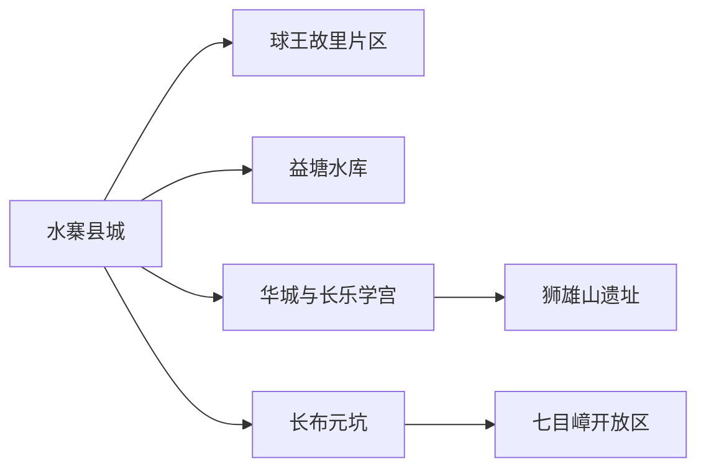
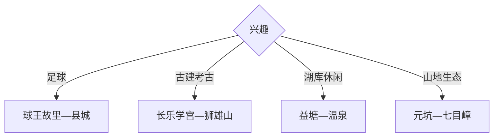

# 五华旅行指南

五华适合从水寨县城进入，把现代足球发源史、秦汉考古、客家古建与七目嶂生态拆成不同主题。球王故里与县城可做一日，华城古建或益塘水库各加半日，七目嶂自然保护地需在开放条件明确时单独成日。

## 城市速览

| 项目 | 信息 |
|---|---|
| 主线 | 水寨—球王故里—华城长乐学宫—益塘水库—七目嶂 |
| 停留 | 城区足球文化1天；古建或山地再加1–2天 |
| 住宿 | 水寨适合交通餐饮，华城适合北部古建，长布适合山地早出 |
| 交通 | 五华站或公路进入，县内远点用公交、预约车或自驾 |
| 风险 | 台风暴雨、山洪地灾、林火、赛事客流和乡村夜间返程 |
| 边界 | 自然保护区、考古遗址、球场赛事区、果园和工坊按开放范围进入 |

## 城市格局与游览区域

固定 `Shuizhai / GeoNames 1794371` 对应五华县城，本页以法定五华县 `Q1374525` 组织。水寨、华城和长布分处不同方向，七目嶂距离县城较远，适合按开放与天气独立安排。

## 主要景点

| 景点 | 区域 | 类型 | 核心体验 | 用时 | 环境 | 体力 | 预约风险 | 天气影响 | 优先级 |
|---|---|---|---|---:|---|---|---|---|---|
| 球王故里文化旅游区 | 水寨方向 | 体育文化 | 李惠堂、足球发展与奥体场馆 | 3–6小时 | 室内外 | 中 | 很高 | 中 | A |
| 五华县博物馆或地方展陈 | 水寨 | 地方文博 | 县史、客家文化与考古背景 | 1.5–3小时 | 室内 | 低 | 很高 | 低 | A |
| 长乐学宫 | 华城镇 | 古建筑 | 明清学宫、地方教育与古城文脉 | 1.5–3小时 | 室内外 | 低中 | 高 | 中 | A |
| 狮雄山秦汉遗址公开展示 | 华城镇 | 考古遗址 | 岭南秦汉城址与考古发现 | 2–4小时 | 室外为主 | 中 | 极高 | 高 | A |
| 元坑足球旧址景区 | 长布镇 | 体育遗产 | 现代足球传播史与乡村场景 | 2–4小时 | 室内外 | 低中 | 很高 | 高 | B |
| 益塘水库旅游公开区 | 转水方向 | 湖库景观 | 岛屿水面、库区地貌与休闲 | 半日 | 室外 | 低中 | 很高 | 极高 | B |
| 七目嶂自然保护区开放游线 | 长布镇 | 山地生态 | 南亚热带物种、森林与高峰视野 | 1天 | 室外 | 高 | 极高 | 极高 | B |
| 热矿泥温泉正规度假点 | 转水方向 | 温泉康养 | 温泉与矿泥体验 | 半日 | 室内外 | 低 | 极高 | 中 | C |

## 美食与餐饮

可尝客家酿豆腐、盐焗鸡、腌面、三及第汤、长乐烧和应季果品。共享菜份量通常较大，单人可选腌面配汤；饮酒与温泉、山路驾驶分开安排，购买农产品按正规经营点和明码计价选择。

## 经典行程

### 一日经典线
**路线**：县级展陈—球王故里文化旅游区—水寨晚餐。**逻辑**：先读县史，再进入最鲜明的足球主题。**预约锚点**：展馆、赛事与场馆。**休息**：水寨。**删除条件**：赛事管制时保留常设展陈。

### 两日人文线
**路线**：首日足球文化；次日长乐学宫—狮雄山公开区。**逻辑**：现代体育与秦汉古建分日。**预约锚点**：学宫、遗址和车辆。**休息**：华城。**删除条件**：遗址未开放时只留学宫。

### 三日生态线
**路线**：前两日基础线；第三日元坑—七目嶂开放游线。**逻辑**：长布方向独立成日。**预约锚点**：保护区开放、向导、天气与返程。**休息**：长布镇。**删除条件**：林火、雷雨或地灾预警时整段删除。

### 雨天文化线
**路线**：县级展陈—球王故里室内内容—长乐学宫可入内部分。**逻辑**：以场馆和古建遮蔽空间降低暴露。**预约锚点**：三处开放。**休息**：水寨。**删除条件**：暴雨预警时减少跨镇移动。

### 亲子足球线
**路线**：球王故里展陈—公开球场活动—县城公园。**逻辑**：故事、实物与运动相结合。**预约锚点**：活动年龄、场地和赛事。**休息**：奥体片区。**删除条件**：场地不开放时只留展陈。

### 湖库康养线
**路线**：益塘水库公开区—正规温泉度假点—返回水寨。**逻辑**：同一方向完成低强度休闲。**预约锚点**：库区开放、温泉与车辆。**休息**：度假点。**删除条件**：强降雨或水情异常时取消湖岸。

### 低体力线
**路线**：车辆到县级展陈—球王故里主要展馆—午休。**逻辑**：用室内场馆和短接驳控制步数。**预约锚点**：落客、座椅与无障碍。**休息**：水寨。**删除条件**：场馆活动客流过高时择一参观。

## 住宿区域

水寨县城适合五华站接驳、餐饮与多方向换线；华城适合学宫和狮雄山；长布只在山地接待和次日开放确认后住宿。温泉度假点适合休闲主题，预订时核对实际项目、消防和退改。

## 市内交通

五华站与水寨县城仍需接驳，华城、长布和益塘方向彼此分散。县城日可公交和出租车组合，远线更适合预约车或自驾。山地与库区日关注雨情、道路和夜间返程。

## 不同旅行者须知

体育爱好者优先球王故里和元坑；考古爱好者预约狮雄山；徒步者只走七目嶂正式开放线；低体力旅行者留在县城。自然保护区核心、考古工作区、比赛及训练区、果园生产区保留明确限制。

## 行前核对

- 核对球王故里、县级展陈、长乐学宫、狮雄山、益塘和七目嶂开放。
- 核对赛事、林火、台风暴雨、山洪地灾、乡镇公交和返程车辆。
- 保护地沿公布游线进入，体育场馆按赛事与训练安排参观。

## 来源与更新记录

| 来源 | 支持内容 | 核验日期 |
|---|---|---|
| [五华县政府：文旅资源推介](https://www.wuhua.gov.cn/xxgk/ztzl/rdzt/wwwh/content/post_2780652.html) | 足球、七目嶂、益塘、热矿泥、狮雄山与长乐学宫 | 2026-09-01 |
| [五华县政府：七目嶂](https://www.wuhua.gov.cn/zjwh/stly/jqjd/content/mpost_2544159.html) | 保护区位置、生态与山地属性 | 2026-09-01 |
| [GeoNames 1794371](https://www.geonames.org/1794371/) | Shuizhai 固定城市点 | 2026-09-01 |
| [Wikidata Q1374525](https://www.wikidata.org/wiki/Q1374525) | 五华县实体与跨库标识 | 2026-09-01 |

| 日期 | 更新 |
|---|---|
| 2026-09-01 | 首次完成五华旅行研究，按足球、古建考古、湖库与山地生态组织。 |
