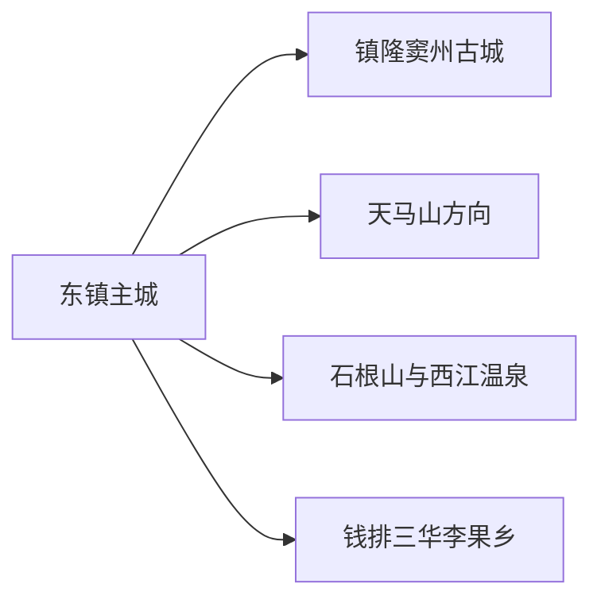
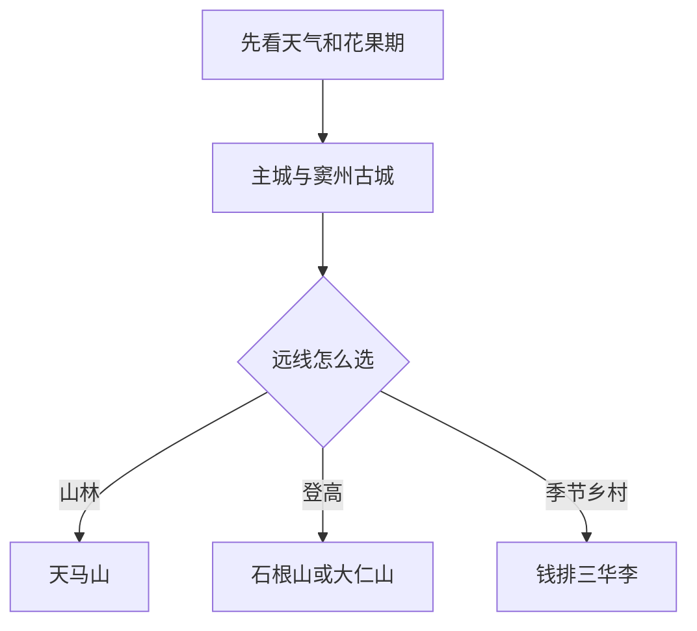

# 信宜旅行指南

信宜的旅行重点在山城、古城和季节果乡之间选择。主城适合用公共文化、玉器与日常餐饮建立背景；镇隆窦州古城是一条较轻松的人文线；天马山、石根山、大仁山和钱排李花果乡则分别占用半天到整日。山地多、方向分散，按一日一个远线安排最舒服。

> 建议停留：2–3 天 
> 旅行关键词：窦州古城、天马山、石根山、三华李、玉器、粤西山地 
> 主要体力：主城与古城低至中等；山地中至较高 
> 最近研究：2026-08-13

## 城市速览

| 项目 | 旅行信息 |
|---|---|
| 主要旅行价值 | 在窦州古城读粤西驿道与书院，再按季节选择山地、温泉或三华李果乡 |
| 建议停留 | 2 天覆盖主城古城和一条山线；3 天增加钱排或另一条山地远线 |
| 较舒适季节 | 春季花果、秋冬山地较舒适；夏季高温、暴雨和台风影响明显 |
| 预算特点 | 主城中等；山线门票、车辆、温泉和乡村住宿增加预算 |
| 步行强度 | 古城低至中等；天马山、石根山、大仁山为中至高 |
| 主要天气风险 | 台风、暴雨、山洪、雷电、团雾、高温与山地道路落石 |
| 独行旅行 | 主城和古城方便；远线先锁定正规车辆与返程 |
| 亲子旅行 | 古城、公共文化、果园正式体验较合适；登山和水上项目按年龄选择 |
| 长者与低体力旅行 | 以主城、古城短段、温泉和车辆观景为主 |
| 无障碍信息 | 新建场馆可咨询；古巷、山路和乡村设施连续性需向官方确认 |

## 城市格局与游览区域

信宜市是茂名市代管的县级市，法定代码 `440983`。GeoNames `1812057` 是旧称 `Dongzhen` 的主城点，Wikidata `Q1023896` 的 `P1566` 与之精确对应；点位核对主城位置，行政边界以代码和属地资料为准。

| 区域 | 主要内容 | 怎么安排 | 与其他区域的关系 |
|---|---|---|---|
| 东镇主城 | 车站、住宿、公共文化、玉器与餐饮 | 抵达日或半日 | 多日旅行基地 |
| 镇隆方向 | 窦州古城、古书院与南粤古驿道 | 半日至一日 | 可与主城同日组合 |
| 北部山地方向 | 天马山、大仁山等正式景区 | 一日一处 | 山路与天气决定游览深度 |
| 朱砂—岑溪边界方向 | 石根山、西江温泉 | 一日选择 | 石根山涉及粤桂边界，入口归属需核清 |
| 钱排—白石方向 | 三华李花果、乡村与季节活动 | 花果季一日 | 农田生产与节庆接待分开 |

## 主要景点

### 主城与窦州古城

| 景点 | 区域 | 类型 | 主要看点 | 建议用时 | 室内外 | 体力 | 预约风险 | 天气影响 | 优先级 |
|---|---|---|---|---:|---|---|---|---|---|
| 窦州古城景区 | 镇隆 | 古城与书院 | 八坊村、古书院、古驿道与城镇历史 | 3–5 小时 | 混合 | 低至中 | 中 | 中 | A |
| 信宜市公共文化场馆 | 主城 | 文博与文化 | 地方历史、玉文化与当期展览 | 1–2 小时 | 室内 | 低 | 中 | 低 | B |
| 玉都公园及主城公共空间 | 主城 | 城市公园 | 山城地形、玉文化地标与市民生活 | 1–2 小时 | 室外 | 低至中 | 低 | 高 | B |
| 莲花湖庄园正式开放项目 | 主城近郊 | 休闲度假 | 园林、水体与当期游乐项目 | 2–4 小时 | 混合 | 中 | 高 | 高 | B |

### 山地、温泉与果乡

| 景点 | 区域 | 类型 | 主要看点 | 建议用时 | 室内外 | 体力 | 预约风险 | 天气影响 | 优先级 |
|---|---|---|---|---:|---|---|---|---|---|
| 天马山生态旅游区 | 北部山地 | 山林与民俗 | 山林、溪谷与正式游览项目 | 半日至一日 | 室外 | 中至高 | 高 | 很高 | A |
| 石根山景区正式入口 | 朱砂方向 | 山地地貌 | 巨石山体、登山与粤桂边界视角 | 半日至一日 | 室外 | 高 | 高 | 很高 | A |
| 大仁山正式开放游线 | 主城近郊 | 山地人文 | 山峰、寺观与城郊登高 | 3–5 小时 | 室外 | 中至高 | 中 | 很高 | B |
| 西江温泉正式运营区 | 北界方向 | 温泉 | 泡池、休息和山地行程恢复 | 半日 | 混合 | 低 | 高 | 低 | B |
| 钱排三华李主题公园及花果季活动 | 钱排方向 | 农业与节庆 | 李花、果园、产品与乡村节庆 | 半日至一日 | 室外 | 中 | 很高 | 很高 | B |
| 黄华江虎跳峡等正式开放项目 | 市域山谷 | 峡谷与水域 | 河谷地貌和运营项目 | 半日至一日 | 室外 | 中至高 | 很高 | 很高 | C |

石根山跨近粤桂边界，按票务所列入口、运营方和属地道路出行。钱排果园首先是农业生产空间，采摘、停车和进入果园以经营者或节庆公告为准；大雾岭等保护地按保护管理，不把保护区核心区当作普通登山线路。

## 美食与餐饮

信宜饮食适合围绕怀乡鸡、山地食材、米粉和三华李加工品选择。主城用餐最稳定，远线午餐宜提前与正规接待点确认。

| 菜品或餐饮类型 | 常见区域 | 一个人用餐与常见份量 | 风味、过敏原与饮食限制 | 排队风险与替代方法 |
|---|---|---|---|---|
| 怀乡鸡 | 主城、怀乡及地方菜馆 | 半只常适合两人，一人问例份 | 含禽肉，白切蘸料常含大豆、葱姜 | 选明码标价的普通地方菜馆 |
| 信宜鲜凉粉、米粉 | 主城与乡镇 | 一份适合一人 | 调味可能含花生、芝麻、大豆和辣椒 | 早餐高峰换同类粉店 |
| 三华李鲜果与加工品 | 钱排、正规商店 | 小份试吃，按成熟度购买 | 果酸较高，加工品关注糖和添加剂 | 非产季选标识完整产品 |
| 山水豆腐与乡镇家常菜 | 镇隆、山线接待点 | 可小份组合 | 常含大豆、猪肉、鱼露或小麦酱油 | 远线提前订餐 |
| 竹笋、山野菜与汤品 | 正式餐饮点 | 多为合餐 | 野菜和菌菇来源、熟度需确认 | 选择可说明食材来源的餐馆 |

## 经典行程

### 一日经典路线

**路线**：主城公共文化场馆 → 午餐 → 窦州古城 → 古城公共街巷慢游

- **串联逻辑**：先建立信宜背景，再用镇隆古城完成最清楚的人文线。
- **预约锚点**：公共场馆和古城内计划进入的具体馆舍。
- **休息安排**：主城或镇隆午餐，古城内多次短休。
- **时间不足时**：保留窦州古城和一座场馆。

### 两日城市路线

**第 1 天**：主城—窦州古城。 
**第 2 天**：天马山或石根山整日。

- **串联逻辑**：人文与山地分日，第二天只走一个山线。
- **预约锚点**：山地景区票务、入口与车辆。
- **休息安排**：连续住主城，山线用游客服务点。
- **时间不足时**：第二天改为大仁山短线或删除。

### 三日深度路线

**第 1 天**：主城与窦州古城。 
**第 2 天**：天马山或石根山。 
**第 3 天**：钱排花果季或西江温泉。

- **串联逻辑**：第三天按季节在农业体验与恢复性温泉中选择。
- **预约锚点**：果园接待、节庆交通或温泉营业。
- **休息安排**：钱排镇区或温泉服务区午休。
- **时间不足时**：先删第三天。

### 雨天路线

**路线**：主城公共文化场馆 → 午餐 → 正式温泉或室内展览

- **适用条件**：普通降雨且道路正常；台风、暴雨或山洪预警时留在主城。
- **预约锚点**：场馆与温泉状态。
- **休息安排**：同一主城片区完成用餐和候车。
- **时间不足时**：只保留一项室内活动。

### 亲子或低体力路线

**亲子路线**：窦州古城短段 → 午餐 → 正式果园或莲花湖亲子项目。 
**低体力路线**：车辆到公共文化场馆 → 午休 → 古城平缓街巷短段。

- **减负方式**：亲子线用短街巷与正式体验替代长登山；低体力线减少坡道并增加车辆落客。
- **预约锚点**：项目年龄、卫生间、座椅与无障碍入口。
- **休息安排**：镇隆或主城餐饮区。
- **时间不足时**：都保留古城短段和午餐。

### 远郊一日路线

**路线**：主城 → 天马山／石根山／钱排三选一 → 正式服务点午餐 → 返回

- **适用条件**：天气、道路、开放与返程均明确。
- **预约锚点**：具体入口、活动、车辆与午餐。
- **休息安排**：游客中心或乡镇生活区。
- **时间不足时**：整段改为主城—窦州古城线。

## 住宿区域

| 区域 | 优点 | 缺点 | 适合人群 | 交通特点 |
|---|---|---|---|---|
| 东镇主城 | 餐饮、交通和住宿选择最多 | 到各远线仍需公路往返 | 首访、独行、多日旅行 | 适合作为共同基地 |
| 镇隆古城周边 | 便于早晚慢游和古城活动 | 住宿选择少于主城 | 人文摄影与古城慢游 | 可与主城短程接驳 |
| 钱排或山线正式住宿 | 靠近花果季、温泉或山地 | 营业、餐饮和返程需确认 | 已锁定单一远线者 | 自驾或正规车辆更合适 |

## 市内交通

| 场景 | 建议与取舍 | 行前需要重查的内容 |
|---|---|---|
| 铁路抵达 | 信宜站连接主城，先入住再分方向 | 车次、站前上客点和末班 |
| 主城—镇隆 | 公交、出租或网约车适合半日人文线 | 班次、古城落客与节庆管制 |
| 山地与钱排远线 | 自驾、客运加末端接驳或正规包车 | 山路、团雾、停车和返程 |
| 跨省石根山 | 按票务所列入口和道路进入 | 广东、广西入口差异及道路状态 |

## 不同旅行者须知

| 旅行维度 | 可行条件 | 主要取舍 | 需额外核对 |
|---|---|---|---|
| 独行旅行 | 主城与古城方便 | 远线车辆成本高 | 客运、返程和夜间上客点 |
| 亲子旅行 | 古城、果园和正规休闲项目 | 长山路与峡谷按年龄选择 | 儿童票、护栏、救援与卫生间 |
| 长者或低体力旅行 | 车辆串联主城与古城短段 | 山地台阶与高温负担 | 落客点、座椅和温泉健康提示 |
| 无障碍需求 | 新建场馆可咨询 | 古巷、果园和山路连续通行有限 | 设施连续性需向官方确认 |
| 山地旅行 | 正式景区、天气稳定 | 雷雨、团雾和高温增加风险 | 预警、闭园、装备与保险 |
| 摄影旅行 | 古城、花果季公共点位 | 农田、村居和保护地受管理 | 花期、肖像、无人机和停车规则 |

## 行前核对

| 核对事项 | 为什么需要重查 | 建议核对时间 | 官方入口 |
|---|---|---|---|
| 景区开放与入口 | 山地景区可能有多个入口或临时维护 | 订票前及到访前一日 | [信宜市人民政府](http://www.xinyi.gov.cn/) |
| 花果季 | 花期、成熟期、采摘和交通逐年变化 | 排入路线前一周 | [茂名市人民政府](https://www.maoming.gov.cn/) |
| 铁路 | 车次和停站按日期变化 | 出发前一周及当天 | [中国铁路 12306](https://www.12306.cn/) |
| 台风与山洪 | 强降雨影响山路、峡谷和果园 | 出发前三日及当天 | [广东省气象局](http://gd.cma.gov.cn/) |
| 森林与保护地 | 火险和保护管理可能限制户外活动 | 秋冬春季出发前 | [广东省林业局](https://lyj.gd.gov.cn/) |

## 来源与更新记录

### 主要来源

| 来源 | 类型 | 支持内容 | 核验日期 |
|---|---|---|---|
| [广东省政府：云茂高速沿线文旅](https://gzw.gd.gov.cn/zdxm/content/post_3326815.html) | 省级政府 | 窦州古城、石根山、钱排三华李与山地团雾 | 2026-08-13 |
| [南方号茂名史志：窦州古城](https://static.nfapp.southcn.com/content/202208/24/c6823375.html) | 属地史志资料 | 窦州古城、古书院、古驿道与开放式景区属性 | 2026-08-13 |
| [广东省林业局：大雾岭公益林](https://lyj.gd.gov.cn/news/forestry/content/post_4513962.html) | 省级林业主管部门 | 大雾岭林场、大田顶与森林生态背景；进入保护区域仍按现场开放范围 | 2026-08-13 |
| [信宜市人民政府](http://www.xinyi.gov.cn/) | 属地政府 | 景区、交通、节庆与临时公告入口 | 2026-08-13 |
| [GeoNames 1812057](https://www.geonames.org/1812057/) | 开放地名库 | 固定主城点与旧称 Dongzhen | 2026-08-13 |
| [Wikidata Q1023896](https://www.wikidata.org/wiki/Q1023896) | 开放知识库 | 法定信宜市与 GeoNames 精确映射 | 2026-08-13 |

### 更新记录

| 日期 | 更新内容 |
|---|---|
| 2026-08-13 | 首次建立信宜独立指南；按主城、窦州古城、山地、温泉与三华李果乡组织选择，并明确跨省入口、农业生产和保护地边界。 |
