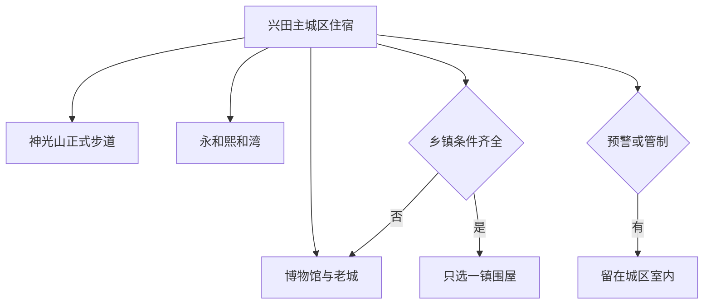
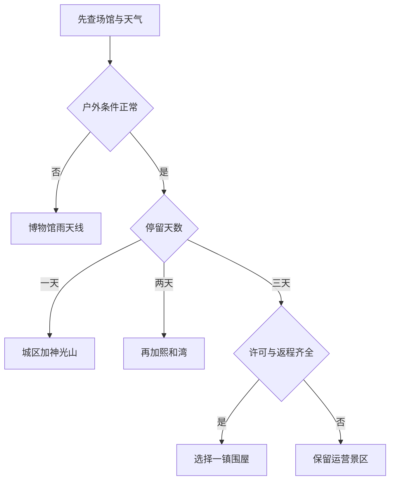

# 兴宁旅行指南

兴宁是由梅州市代管的独立县级市，不是梅江区或梅县区的一处郊区。第一次到访，可以先在兴宁博物馆建立城市历史与客家生活背景，再从兴田老城的文保节点和神光山国家森林公园中选择一条城区线；第二天再去永和方向的熙和湾，或在已经确认准入、预约和返程的前提下选择一处乡镇围屋。兴宁有自己的城区、住宿、铁路门户和 20 个镇街，不能把梅州主城、兴宁南站、合水水库和分散在各镇的古民居压成同一片步行区。

> 建议停留：2–3 天；只有 1 天时以博物馆、兴田老城公开范围和神光山组成首访线 
> 旅行关键词：兴宁古城、客家围龙屋、花灯、版画、神光山、兴宁鸽、单丛茶 
> 主要体力：主城区低至中等；森林公园和乡镇文保线路为中等以上 
> 最近研究：2026-08-12

## 城市速览

| 项目 | 旅行信息 |
|---|---|
| 主要旅行价值 | 在兴宁博物馆认识古邑历史、客家民俗和馆藏陶瓷；在兴田老城按公开范围观察兴宁古城墙、两海会馆等文保节点；以神光山和熙和湾分别补充森林公园与客家花灯主题；围屋只作预约成功后的乡镇专题 |
| 建议停留 | 1 天完成主城区与神光山；2 天增加熙和湾；3 天才从叶塘磐安围、罗岗善述围、刁坊棣华围、径南恒云楼等文保方向中选择一条，不安排“围屋扫点” |
| 较舒适季节 | 晚秋至春季通常更利于街区和森林公园步行；春夏湿热多雨，5—6 月前后持续强降水可引发山洪、泥石流、滑坡和积涝。上灯、花灯、赛事和茶事活动按当年公告，不是全年固定节目 |
| 预算特点 | 博物馆和公共街区可组成较低预算日；跨镇车辆、运营景区、乡村住宿和节庆旺季会增加支出。购买茶、娘酒和农产品不是完成旅行的必要条件 |
| 步行强度 | 老城公共街巷可分段步行，神光山有坡道和林地路面；围屋有门槛、院落高差和村道，熙和湾内部项目分散。兴宁南站到主城区仍需地面接驳 |
| 主要天气风险 | 高温、高湿、雷电、短时强降水、台风外围降水、城乡积涝、山洪、滑坡、泥石流、落石和森林火险；连续降雨后即使转晴，山地和乡村道路风险仍可能滞后 |
| 独行旅行 | 主城区住宿、用餐和叫车相对容易；乡镇围屋与远郊景区返程较脆弱，须在出发前落实合规车辆、预约联系人和最晚离场，不把临时揽客车辆当作补救 |
| 亲子旅行 | 博物馆基本陈列和运营景区内明确开放的亲子内容可择一组合；林地、水边、游乐设备、花灯活动人群和乡村生产道路需要持续看护，年龄、身高和陪同规则逐项确认 |
| 长者与低体力旅行 | 采用“一座博物馆加一段老城公共街巷”，或在熙和湾只走近入口正式短线；不把古建门槛、森林坡道和乡镇长途接驳叠在同一天 |
| 无障碍信息 | 12306 可提前申请重点旅客协助；本次未找到足以证明博物馆、老城文保、神光山、熙和湾和围屋从下客点到出口全程连续无障碍的官方资料，须向每处场所逐段确认 |

## 城市格局与游览区域

### 行政、城市点与法定边界

兴宁市法定县级行政代码为 **441481**，由梅州市代管。梅州市官方规划列明全市辖 2 个市辖区、5 个县，并代管兴宁 1 个县级市；兴宁市民政局 2026 年第一季度统计显示，全市现有 17 个镇、3 个街道。兴宁市政府区位资料把市委、市政府所在地写为兴田街道，市政府办公室当前办公地址为中山东路 1 号。兴宁与梅州主城有行政隶属和交通联系，但两者仍是需要分别安排住宿、交通和旅行内容的城市目的地。

兴宁市政府的区位资料显示，兴宁北接江西寻乌，东、东北及南面分别与平远、梅县和丰顺相邻，西侧连接河源龙川与梅州五华。两个官方概况页面分别写有 2104.85 平方公里和 2075.38 平方公里，口径并不一致，因此本页不采用一个面积数字来推定边界；实际旅行归属以法定代码、属地公告、规划和现场标识为准。

Wikidata **Q1023920** 是县级市“兴宁市”的知识库实体，并把 GeoNames **8594670** 写入 P1566。GeoNames 8594670 的特征代码却是 **P/PPLA3**，即“第三级行政区驻地的居民点”，本质上是兴宁城区的定位点，不是兴宁市完整行政区面。QID、P1566 和法定县级市在实体上可以对齐，空间粒度不能混用；人口、面积和边界也不能从这个城市点外推。

[梅州](./梅州市.md)页面保留兴宁的行政关系和跨城接驳说明，兴宁的具体景点、餐饮、住宿与市内路线均以本页为准。梅江区、梅县区、大埔、丰顺、五华、平远、蕉岭及河源龙川、江西寻乌的景点不纳入兴宁清单。

### 可执行的旅行分区

| 区域 | 主要内容 | 游览特点 | 与其他区域的关系 |
|---|---|---|---|
| 兴田—宁新—福兴主城区 | 兴宁博物馆、兴宁古城墙与两海会馆公开范围、宁江公共岸段、餐饮、住宿和城市服务 | 是首访基点；老城文保点不是一座统一售票古城，博物馆、学校、会馆和公共街巷各有独立开放边界 | 可用 1 天分段步行与短程乘车；兴宁南站在城区外，不能按站名推定步行到达 |
| 神光山管理区 | 神光山国家森林公园正式入口、开放步道和当日运营设施 | 当前官方资料仍将其列为国家 4A 级景区，2026 年有管理与公众活动；只走标识明确的管理路线 | 位于城区东郊方向，适合与主城区同日；雷电、暴雨、地灾或森林火险公告下整段取消 |
| 永和—径南东部走廊 | 熙和湾客乡文化旅游产业园、径南茶产业公开展示与其他运营景区 | 熙和湾是国家 4A 级景区；茶园、酒厂和农业基地首先是生产空间，只有运营方公布的游客入口与参观线可进入 | 适合独立半天至一天；不再横切北部围屋或合水方向 |
| 乡镇文保专题 | 叶塘磐安围、罗岗善述围、刁坊棣华围、合水玉成围、径南恒云楼、石马何天炯旧居等 | 名录证明文保身份与所在地，不证明室内开放；很多点仍与居民、宗族、学校或村庄日常生活重叠 | 每天只选一个镇或一条同向走廊，预约、许可和往返车辆缺一即取消 |
| 合水—龙田北部盆地 | 合水圩镇公开空间、饮用水源保护范围、农业与村落 | 合水水库承担饮用水源功能；2026 年官方明确宣传禁钓、禁捕、禁排污，旧旅游宣传不能作为水上活动许可 | 不作为首访自由探索区；只走当日明确开放的公共步道和服务点，不安排钓鱼、捕鱼或无许可水上项目 |
| 北部与东北部山地生产保护区 | 铁山—渡田河自然保护范围、林地、矿山、农业道路及其他受管制区域 | 自然保护、森林防火、露天矿边坡与汛期排水都有独立管理要求，地图上的道路不是公众游线 | 不纳入常规旅行；除非管理方另设正式公众设施，否则不进保护地管制区、矿区、取水设施和生产便道 |

以主城区为住宿基地时，各方向的关系如下；箭头表示重新乘车组织行程，不表示可以连续步行：

围屋、祖屋、学校、宗祠和传统村落首先是文物、产权空间与居民社区。兴宁学宫位于兴民中学校内，省级文保身份不意味着游客可以自行进入校园；其他围屋也不因上榜、出现在短视频或大门敞开就可以进入内院。拍摄居民、仪式、祖先牌位和家庭陈设应先取得明确同意，不攀爬、不触摸构件、不进入修缮区，不用无人机或商业拍摄干扰社区。

茶园、丝苗米田、肉鸽养殖场、油茶林、酒类生产线和果园首先是生产空间。只在经营者明确开放、说明保险与食品卫生条件后进入正式参观线；不踩田埂、不触碰设备、不喂食动物、不擅自采摘，也不在装卸、农机和矿区道路停留拍照。

## 主要景点

优先级用于安排时间：**A** 为首访核心，**B** 为按兴趣补充，**C** 为预约和交通条件较高的专题。景区等级只用于核对目的地身份，不保证门票、开放时间、内部项目或无障碍设施在到访日不变。

| 景点 | 区域 | 类型 | 主要看点 | 建议用时 | 室内外 | 体力 | 预约风险 | 天气影响 | 优先级 |
|---|---|---|---|---:|---|---|---|---|---|
| 兴宁市博物馆 | 主城区 | 地方综合博物馆 | 常年基本陈列包括《古邑芳华——兴宁历史文化概览》《客家民俗生活用具展》《历代馆藏陶瓷展》；闭馆日、地址入口、预约和临展须另查 | 1.5–3 小时 | 室内 | 低 | 高 | 低 | A |
| 兴田古城文保短线 | 兴田街道 | 老城公共街巷与省级文保 | 在公开范围观察兴宁古城墙、两海会馆及其城市关系；两处不是统一票制，兴宁学宫在校园内，不列为无预约步行节点 | 2–3 小时 | 室内外混合 | 低至中 | 高 | 中 | A |
| 神光山国家森林公园 | 主城区东郊方向 | 国家森林公园、国家 4A 级景区 | 林地景观、正式步道和当日开放的文化节点；夜游、节庆和活动线路只在官方公布时加入 | 2.5–5 小时 | 室外为主 | 中 | 中至高 | 极高 | A |
| 熙和湾客乡文化旅游产业园 | 永和镇方向 | 客家文化、花灯与休闲景区，国家 4A 级 | 客家花灯主题建筑与园区当日开放内容；2026 年仍有官方活动，但活动不等于全年固定节目 | 3–6 小时 | 室内外混合 | 中 | 高 | 中至高 | B |
| 兴宁省级文保围屋专题 | 叶塘、罗岗、刁坊、合水、径南等镇择一 | 围龙屋、近现代建筑与社区遗产 | 从磐安围、善述围、棣华围、玉成围、恒云楼等当前名录项目中只选一处或同镇一组，理解围屋格局与客家聚落；仅进入获准范围 | 半天至 1 天，另计往返 | 室内外混合 | 中 | 极高 | 高 | C |

兴田古城文保短线是路线组织方式，不是一座封闭“古城景区”；古城墙、两海会馆和其他文保点仍各自管理。围屋专题同样不是一张联票：磐安围在叶塘镇、善述围在罗岗镇、棣华围在刁坊镇、玉成围在合水镇、恒云楼在径南镇，不能因都属于兴宁就在一天内连续扫点。

截至 2025 年 11 月的官方名录共有 70 处各级文物保护单位，其中省级 11 处。当前名录可以确认磐安围和善述围等文保身份，但没有把旧资料中的“东升围”列为省级文保项目；本页不沿用“十大古民居”作为十个开放景点。任何文保身份都不替代产权人、社区、学校或主管部门的到访许可。

## 美食与餐饮

兴宁饮食适合用兴宁鸽、米制粄食、客家酿菜和茶组织，不需要追逐某一家网络热门店。官方资料能证明这些菜品与产品的地方关联，不能证明具体餐厅持续营业、同名菜配方一致或适合所有饮食限制。

| 菜品或餐饮类型 | 常见区域 | 一个人用餐与常见份量 | 风味、过敏原与饮食限制 | 排队风险与替代方法 |
|---|---|---|---|---|
| 兴宁鸽菜与鸽宴 | 主城区正规客家菜馆、宴席餐饮 | 鸽菜常按只、例或宴席组合供应；一人先问半只、小份或套餐，不为打卡勉强点整桌 | 含禽肉且细骨较多；卤汁、腌料和蘸料可能含大豆、小麦、芝麻、花生、酒和糖，严格素食者不适用 | 节庆宴席和周末可能订满；改选能说明来源、价格和份量的普通持证餐馆，不必锁定一家酒店 |
| 客家酿豆腐 | 主城区与各镇正规餐馆 | 通常可按小份或例牌点，与米饭组合适合独行 | 含大豆，馅料常见猪肉，汤汁或酱油可能含小麦、海产或猪油；纯素、清真和严重过敏者逐项确认 | 热门店排队时，同片区普通客家菜馆替代度高；先问是否现做和最小份量 |
| 黄粄、甜粄与其他米制粄食 | 主城区、市场和节庆公开摊点 | 多按块、片或小份购买，适合早餐、点心和多人分尝 | 米制不当然无麸质；碱水、糖、花生、芝麻、猪油、肉馅、虾米和共用器具均可能出现 | 节庆款与现做黄粄可能售罄；选配料能说明、制作环境清楚的同类店，不为一份粄食跨镇 |
| 煎堆等节庆点心 | 主城区和当期官方市集 | 常按个购买，适合少量品尝；刚炸出锅温度高 | 糯米、糖、芝麻、花生和共油交叉接触常见；控糖、吞咽或油脂限制者按自身专业建议取舍 | 上灯和春节市集不代表全年都有；平日改选正规糕点店的当日产品 |
| 兴宁单丛茶 | 径南及主城区正规茶店、获准开放的茶文化场所 | 先小杯试饮，购买前问净重、产地、年份和储存；茶园参观与买茶是两件事 | 含咖啡因，空腹、睡眠敏感、孕期或用药者按个人专业建议取舍；“养生”宣传不替代医疗判断 | 茶事活动、采制季和开放茶园逐年变化；无法说明产地、标签和价格时不购买，不进入生产茶园拍照 |
| 客家娘酒及正规酒类产品 | 主城区正规餐馆和持证商店 | 酒饮按小杯或小瓶，驾驶者和未成年人不饮酒；长途携带先查运输规则 | 含酒精，甜度和酒精度因产品而异；孕期、用药、肝病、酒精不耐受者遵医嘱避免，菜肴也需问是否加酒 | 节庆市集品牌多时先看生产信息、酒精度和净含量；不购买无标签散装酒，不把试饮当成必做体验 |

严格素食、清真、低盐或严重过敏旅行者，应把禁忌写给餐馆，逐项询问猪油、肉汤、酒、大豆、小麦、花生、芝麻、蚝油、虾米与共锅。兴宁上灯是有具体日期、社区与仪式边界的活态民俗，不把居民祖屋的家宴当作对游客每日开放的餐饮项目。

## 经典行程

先查天气和场所状态，再按停留天数增加方向；围屋只有在许可与往返同时落实后才进入路线：

### 一日首访路线

**路线**：兴宁市博物馆 → 主城区午餐与完整坐席休息 → 兴田古城墙、两海会馆公开范围 → 神光山国家森林公园一条正式短线 → 天黑前返回城区

- **串联逻辑**：先用三组基本陈列建立兴宁历史与客家生活背景，再把老城文保放回真实街区，最后以神光山补足城市东郊的森林景观；不把兴宁学宫校园或未开放围屋塞进步行线。
- **预约锚点**：最先确认博物馆闭馆日、入口、预约和最晚入馆，再查古城文保开放、神光山入口、步道、停车与最晚离场；任何夜游或节庆只按当日官方活动加入。
- **休息安排**：午间在主城区室内完整休息；神光山从正式服务点补水、如厕并评估体力，不在林地、古建台阶或道路边席地休息。
- **时间不足时**：保留博物馆与神光山短线，古城只走一个公开节点；若博物馆闭馆，则保留老城公共街巷与神光山，不用居民围屋补位。

### 两日城市与花灯路线

**第 1 天（主城区）**：兴宁市博物馆 → 城区午休 → 兴田古城文保短线 → 神光山正式短线 
**第 2 天（永和方向）**：主城区出发 → 熙和湾正式入口 → 园区当日开放的一条主题线 → 永和或园区正规餐饮休息 → 返回主城区

- **串联逻辑**：把城市历史与森林公园留在第一天，把运营景区留在第二天，减少跨方向折返；花灯楼、园内场馆和活动共同构成一个熙和湾目的地，不拆成多个景点计数。
- **预约锚点**：第 1 天锁定博物馆和神光山；第 2 天锁定熙和湾营业、票务、内部项目、停车或接驳、最晚离园。春节“上灯+”活动不能照搬到普通日期。
- **休息安排**：两天都保留完整午休；熙和湾按园区正式服务设施补水和如厕，不进入相邻农地、企业和村居寻找捷径。
- **时间不足时**：第二天只走熙和湾近入口正式短线并提前返城；如果只剩一天，整段删去永和方向，不把两日线路压缩成赶场。

### 围屋专题路线

**叶塘方案**：主城区 → 叶塘镇公开服务点 → 磐安围经许可开放范围 → 镇区正规午餐 → 原路返回 
**罗岗方案**：主城区 → 罗岗镇公开服务点 → 善述围经许可开放范围 → 镇区正规午餐 → 原路返回

- **串联逻辑**：两个方案互为替代，每天只选一镇；用一处省级文保围屋理解建筑与社区关系，而不是收集数量。刁坊棣华围、合水玉成围、径南恒云楼和石马何天炯旧居也按同样原则另择一线。
- **预约锚点**：在订车前取得产权人、社区、属地政府或管理方明确许可，确认入口、开放范围、修缮、摄影、讲解和停车；同时锁定往返车辆，不能只确认去程。
- **休息安排**：在镇区持证餐饮或明确公共服务点休息，不在祖堂、居民院落、农田、水源岸线和村道午休；尊重居民正常生活与仪式。
- **时间不足时**：预约未确认、连续降雨、道路受阻或返程不确定时整段取消，回到城区；不换成附近另一座“看起来开门”的围屋。

### 雨天路线

**路线**：兴宁市博物馆已确认开放的基本陈列 → 主城区室内午餐 → 当日明确开放的图书馆、文化馆活动或住宿休息

- **适用条件**：只适用于普通降雨且道路、场馆正常。暴雨、雷电、洪水、山洪或地灾预警生效时，不执行神光山、围屋、合水岸线、茶园和跨镇路线。
- **预约锚点**：博物馆与公共文化机构当日开放、预约、临时活动和最晚入场；公共文化服务页面有活动信息，不代表每个馆室随时可进入。
- **休息安排**：全天留在主城区室内，避开宁江低洼段、积水道路、树下和临时围挡；准备干衣并服从交通、停业和转移通知。
- **时间不足时**：只保留一座已确认开放的场馆；如官方要求停业、停运或转移避险，则回到安全住宿，不用商场以外的未核验地点补行程。

### 亲子与低体力路线

**亲子路线**：兴宁市博物馆 → 室内午餐 → 熙和湾当日开放的近入口亲子短线 
**低体力路线**：兴宁市博物馆 → 完整坐席午餐 → 两海会馆或古城墙公开外围择一 → 返回住宿

- **减负方式**：亲子线不默认每项游乐设备开放，低体力线不叠加神光山坡道和围屋门槛；两条路线都不以 4A 等级推定无障碍或适龄。
- **预约锚点**：确认场馆儿童活动、婴儿车、厕所和讲解；熙和湾另查项目年龄身高、陪同、设备资质、落客点和退出路线；低体力旅行逐处问坡道、座椅和无障碍厕位。
- **休息安排**：每 60–90 分钟坐席休息，正午留在室内；照护者先查看湿滑、台阶、水边与人群密度，出现疲劳立即原路退出。
- **时间不足时**：亲子线只留博物馆，低体力线只留一座场馆；任何一段接驳、无障碍连续性或返程不明确时提前结束。

### 合水与保护边界替代方案

**路线**：合水镇或管理方当天明确开放的公共入口 → 圩镇服务点和公开步道短段 → 镇区午餐 → 原路返回

- **串联逻辑**：合水水库首先是饮用水源，不把旧旅游介绍中的泛舟、垂钓或水上娱乐写进当前路线；只有具备明确开放公告、运营主体和安全条件的公众空间才能使用。
- **预约锚点**：水源保护、步道开放、道路、水情、天气、停车和返程车辆；“看得到水库”不等于能下水、靠岸、钓鱼、捕鱼或进入管理设施。
- **休息安排**：只在圩镇或正式服务点休息，不在大坝、取水设施、企业岸线、农地和临水边坡停留；垃圾全部带离并服从保护区现场标识。
- **时间不足时**：任何保护、天气或准入信息不清时整段取消，改做主城区博物馆；不沿库岸寻找非正式入口。

## 住宿区域

| 区域 | 优点 | 缺点 | 适合人群 | 交通特点 |
|---|---|---|---|---|
| 兴田—宁新—福兴主城区 | 餐饮、公共服务、叫车和雨天备选相对集中，便于组织博物馆、老城与神光山 | 老城住宿的电梯、隔音和停车差异大；前往熙和湾和乡镇围屋仍需车辆 | 首访、独行、公共交通、低体力和多方向行程 | 适合作为 2–3 天基地；订房时按实际地址核对到博物馆、神光山和车站的接驳 |
| 兴宁南站接驳区域 | 便于早晚高铁到发，站区已有公交站台与停车设施线索 | 车站不等于景点或餐饮集中区，不能假设夜间公交、叫车和住宿供给稳定 | 早班或晚班铁路转乘、短住 | 票面写“兴宁南”仍需地面交通到主城区；先确认末班、上客点和夜间车辆 |
| 永和—熙和湾方向的合法住宿 | 可减少运营景区日的城区往返，节庆期间有机会就近参加正式活动 | 节庆价格、噪声、客流、退改和园区项目变化更大；村居不等于持证住宿 | 已锁定熙和湾活动、车辆和退改条件者 | 订房前确认与景区真实关系、合法经营、夜间到达、消防疏散和次日返城 |
| 乡镇合法住宿 | 可减少单一围屋或茶产业专题的长距离往返 | 供应、餐饮、叫车、医疗、无障碍和极端天气延住条件较弱；产权住宅不默认接待 | 深度主题旅行且已有当地联系人、合规车辆者 | 必须确认登记、实际入口、停车、前台时段、次日返程和预警取消；首访不作为默认选择 |

不推荐未经核验的具体酒店。比较住宿时，优先看合法经营、实际地址、退改、电梯或无障碍房、消防疏散、夜间前台、备用电源和极端天气延住方案，不只看“古城旁”“景区内”或距车站的直线距离。

## 市内交通

| 场景 | 建议与取舍 | 行前需要重查的内容 |
|---|---|---|
| 铁路抵达 | 梅龙高铁兴宁南站已于 2024 年 9 月开通运营，是兴宁自己的高铁门户；它不在梅州主城，也不等于抵达兴田老城。车次和停站只按 12306 当日可售票核对 | 完整站名、车次、检票、晚点、站外公交与出租上客点、夜间叫车、重点旅客协助和到主城区接驳 |
| 既有铁路与公路抵达 | 兴宁另有既有铁路、公路客运和国省道网络，但不同车站、客运站与高速出口服务片区不同；不把规划文件中的站场和线路当作已运营事实 | 当前可售车次、客运站营业、班次、上下车点、行李、末班、道路施工和节假日管制 |
| 主城区移动 | 博物馆、兴田老城、住宿和神光山之间以公交、出租、网约车与分段步行组合；老城各文保点没有统一接驳 | 公交线路与首末班、准确入口、叫车范围、停车、街区施工、活动封路和最晚离场 |
| 镇通村农村客运 | 兴宁市交通运输局 2026 年公告显示，只有列明的 4 条镇通村班线继续固定运营，其余改为“区域运营＋预约响应”，预约电话在各村委会公示；远郊行程不能照旧时刻表等车 | 所在镇预约电话、至少提前多久预约、实际上车点、服务范围、回程时段、行李与无障碍协助；去回程一起确认 |
| 熙和湾与径南方向 | 自驾、合规预约车或确认过的公共交通比临时转车更可控；每次只安排一条东部走廊 | 景区入口、停车、公交或活动接驳、道路施工、节庆管制、茶园准入和回程叫车 |
| 围屋专题 | 先到镇区公共服务点，再按明确许可前往文保入口；司机等候与返程应在出发前书面确认，不沿村道寻找“后门” | 产权人或管理方许可、村道会车、停车、修缮、积水、农忙车辆、司机资质、等候费和返程 |
| 神光山步行 | 只走景区当日开放步道，把雷电、强降雨、森林火险公告和天黑前离场作为硬约束 | 入口、步道、照明、坡度、落石、最晚入园、最晚离园、厕所、饮水、应急出口和无障碍连续性 |
| 自驾 | 对熙和湾和乡镇专题较灵活，但驾驶者须保留返程体力；不在矿区、库岸、取水设施、农机道路和保护地入口违停 | 限行、停车、充电、道路积水、桥涵、滑坡落石、森林火险、景区车辆准入、酒后驾驶和返程天气 |

12306 的重点旅客预约服务要求通常在乘车前至少 6 小时在线提交；不足 6 小时时，应在开车前至少 60 分钟到车站现场提出。铁路可提供进出站引导、协助乘降、免费轮椅或担架等服务，但这不能证明景区和古建筑具有连续无障碍路线。

## 不同旅行者须知

| 旅行维度 | 可行条件 | 主要取舍 | 需额外核对 |
|---|---|---|---|
| 独行旅行 | 主城区有常规住宿、餐饮和叫车条件 | 乡镇预约响应客运、围屋准入和晚间返程不稳定，不搭乘身份与资质不明车辆 | 末班、合规车辆、住宿前台、预约联系人、共享行程和紧急联系人 |
| 亲子旅行 | 博物馆基本陈列和运营景区明确开放的亲子项目可分日组合 | 神光山坡道、水边、设备、花灯活动密集人群和生产道路会增加看护负担 | 儿童票、年龄身高、陪同、设备资质、婴儿车、护栏、厕所和紧急退出 |
| 长者或低体力旅行 | 一座博物馆加一个近入口文保外围即可构成完整半日 | 围屋门槛、神光山坡道、园区长距离和跨镇车辆不宜叠加 | 落客点、电梯、坡道、座椅、厕所、轮椅、返程车辆和休息间隔 |
| 无障碍需求 | 12306 重点旅客服务可提前申请，城区车辆接驳可减少步行 | 公开资料不足以证明博物馆、老城、森林公园、园区和围屋连续可达 | 无障碍停车、坡板、古建门槛、铺装、无障碍厕位、陪同、轮椅借用和疏散；逐处确认 |
| 文保与社区体验 | 获得管理方或产权人许可，并在公开时段和指定范围参观 | 文保身份不等于室内开放；学校、祖屋、宗祠和居民院落有教学、产权、隐私与礼仪边界 | 开放、修缮、仪式、讲解、摄影、着装、无人机、团体和商业拍摄许可 |
| 摄影旅行 | 老城公共街巷、景区指定点和获准文保外围可拍摄 | 不追拍居民，不闯茶园、酒厂、养殖场、矿区、取水区和保护地，不在道路架三脚架 | 日出日落出入口、禁拍、三脚架、商业拍摄、无人机、活动管制和返程照明 |
| 预算有限 | 博物馆、老城公共街巷、普通小吃与公交或短程车可组成低预算日 | 跨镇包车、园区二次项目、节庆住宿和乡村预约体验是主要增量 | 免费场馆是否预约、交通总价、门票、二次项目、等候费和退改 |
| 暴雨、地灾与森林火险 | 普通天气可用早出、午休和缩短户外线降低风险 | 预警或管制下，神光山、围屋、茶园、合水岸线、山地和跨镇路线应整段取消；解除预警后仍确认道路与设施恢复 | 兴宁气象、应急、林业、交通、属地镇政府、景区和道路运营方当期公告 |

## 行前核对

| 核对事项 | 为什么需要重查 | 建议核对时间 | 官方入口 |
|---|---|---|---|
| 兴宁市博物馆 | 当前官方资料证明三组基本陈列常年开放，但没有足以固化闭馆日、准确入口、预约、临展和无障碍路线的信息 | 排入路线前、到访前 1 天和当天 | [兴宁市公共文化服务机构信息](https://www.xingning.gov.cn/xxgk/zdlyxxgk/ggwhjg/)及场馆当日公告 |
| 兴田古城墙、两海会馆与其他文保 | 70 处名录只证明身份与所在地，开放、修缮、消防、产权、校园和摄影规则各自独立 | 排入路线前及抵达现场时 | [兴宁市各级文物保护单位名录](https://www.xingning.gov.cn/zfjg/xnswhw/xnwh/whyc/content/post_2875593.html)、文物主管部门和现场标识 |
| 神光山国家森林公园 | 步道、活动、照明、森林火险和最晚离场受天气与管理调整；历史节庆夜游不等于每天开放 | 到访前 3 天、1 天及入园当天 | [兴宁市人民政府旅游信息](https://www.xingning.gov.cn/ly/lyxx/)、[兴宁市林业局](https://www.xingning.gov.cn/zfxxgkml/xnslyj/)及景区公告 |
| 熙和湾 | 4A 身份和 2026 年活动不固化营业、票务、内部项目、节庆、停车、无障碍和最晚离园 | 订票订车前、到访前 1 天和当天 | [兴宁市人民政府旅游信息](https://www.xingning.gov.cn/ly/lyxx/)及运营方当日公告 |
| 围屋与乡镇文保 | 文保点分散且多与居民、宗族、学校、村路和修缮重叠；没有明确许可就不能进入 | 订车前、到访前 3 天再次确认 | 兴宁市文广旅体局、属地镇政府、村委会、管理方或产权人的正式答复 |
| 合水饮用水源 | 2026 年官方明确饮用水源保护区禁钓、禁捕、禁排污；旧旅游资料不能证明水上活动仍合法开放 | 计划靠近水库前、到访当天 | [合水镇饮用水源保护宣传](https://www.xingning.gov.cn/jrxn/xzfc/content/post_2917029.html)、生态环境部门和现场标识 |
| 暴雨、雷电、山洪与地灾 | 兴宁 2026 年实际出现持续强降水，气象部门明确提示山洪、泥石流、滑坡和城乡积涝，风险可在雨后滞后 | 出发前 3 天起每日查看，户外当天再查 | [兴宁市气象局](https://www.xingning.gov.cn/zfxxgkml/xnsqxj/)、[兴宁市综合应急信息](https://www.xingning.gov.cn/xxgk/zdlyxxgk/shgysyjs/zhsgjyxx/)及属地公告 |
| 森林防火 | 最近一轮官方禁火令的期限为 2025-09-05 至 2026-04-30，不能在期满后当作当前命令；新的禁火期、区域和措施须另查 | 进林区前 3 天和当天 | [兴宁市政府执行公开](https://www.xingning.gov.cn/xxgk/wxgk/zxgk/)、[兴宁市林业局](https://www.xingning.gov.cn/zfxxgkml/xnslyj/)及景区公告 |
| 矿山、茶园、酒厂与农业基地 | 2026 年官方仍对正常生产建设和停建非煤矿山开展安全监管；生产基地和运输道路不因地图可达而开放 | 决定产业参观或乡村自驾前 | [兴宁市应急管理局](https://www.xingning.gov.cn/zfxxgkml/xnsyjglj/)、农业农村、属地镇政府和经营者正式公告 |
| 兴宁南站与铁路班次 | 车次、停站、票价、站外接驳和晚点会变化；开通初期班次不能作为 2026 年固定时刻 | 购票前、出发前 1 天及当天 | [中国铁路 12306](https://www.12306.cn/)、[广东省交通运输厅](https://td.gd.gov.cn/) |
| 镇通村预约响应客运 | 2026 年运营方式已调整，多数线路取消固定线路，须通过村委会公示电话预约 | 排远郊路线前、出发前 1 天和当天 | [兴宁市交通运输局公告](https://www.xingning.gov.cn/mzxnjtj/gkmlpt/content/2/2916/post_2916072.html)及附件、村委会公示 |
| 无障碍与重点旅客服务 | 铁路协助须按时申请，景区、古建和围屋连续无障碍资料不足 | 购票订房后，至少提前 1 天逐点确认 | [12306 重点旅客预约](https://kyfw.12306.cn/otn/view/icentre_qxyyInfo.html)、场馆、景区、住宿和承运人客服 |
| 餐饮、茶与娘酒 | 餐厅营业、配方、过敏原、酒精度、食品来源、标签与价格变化快 | 选店、下单或购买前 | [兴宁市食品安全信息](https://www.xingning.gov.cn/xxgk/zdlyxxgk/spypaqxxgk/)、经营主体公示和现场明码标价 |

收到暴雨、雷电、山洪、地质灾害、森林火险或道路管制信息时，不以已经购票、订车或“城区还没下雨”为理由继续神光山、围屋、茶园、合水岸线和跨镇行程。等待主管部门解除管制，并由道路、景区或场所管理方确认恢复后再进入。

## 来源与更新记录

### 身份、行政边界与城市结构

| 来源 | 核验内容 | 使用边界 | 核验日期 |
|---|---|---|---|
| [Wikidata 官方 API：Q1023920](https://www.wikidata.org/w/api.php?action=wbgetentities&ids=Q1023920&props=labels%7Cdescriptions%7Cclaims&languages=zh%7Czh-cn%7Cen&format=json) | 实体标签与类型对应县级市兴宁市，P1566 为 8594670，并记录其与梅州市、兴田街道及行政代码的关系 | 用于知识库实体与标识符对齐，不替代法定边界、驻地公告和行政区划调整 | 2026-08-12 |
| [GeoNames 8594670 RDF](https://sws.geonames.org/8594670/about.rdf)及[特征代码说明](https://www.geonames.org/export/codes.html) | 8594670 是 Xingning 的 P/PPLA3 居民点，即第三级行政区驻地城市点 | 只定位兴宁城区，不代表兴宁市完整行政区面；不从点记录外推人口、面积和边界 | 2026-08-12 |
| [梅州市国土空间生态修复规划（2021—2035 年）](https://www.meizhou.gov.cn/attachment/0/213/213810/2771598.pdf) | 梅州辖 2 个市辖区、5 个县，并代管兴宁 1 个县级市 | 市级规划只用于核验市域组成与代管关系，不替代民政部门的后续调整公告；镇街数量另以属地统计为准 | 2026-08-12 |
| [兴宁民政事业统计季报（2026 年第一季度）](https://www.xingning.gov.cn/mzxnmzj/gkmlpt/content/2/2915/post_2915193.html)及[市政府办公室职能](https://www.xingning.gov.cn/gkmlpt/content/2/2911/post_2911901.html) | 当前 17 个镇、3 个街道；市政府办公室地址为兴宁市中山东路 1 号 | 民政统计不等于旅游开放清单，办公地址不作为景点 | 2026-08-12 |
| [兴宁市政府：区位交通](https://www.xingning.gov.cn/zjxn/xngk/qwjt/)及[兴宁概况](https://www.xingning.gov.cn/sq/index.html) | 政府驻地、相邻县市、道路与气候背景；两个页面面积数字存在差异 | 不选择任一冲突面积作为边界依据；概况页中规划交通不能覆盖后续已开通或调整的实时信息 | 2026-08-12 |

### 景区、场馆、文保与饮食

| 来源 | 核验内容 | 使用边界 | 核验日期 |
|---|---|---|---|
| [兴宁市博物馆 2026 年活动回顾](https://www.xingning.gov.cn/xxgk/zdlyxxgk/ggwhjg/content/post_2912837.html) | 博物馆常年开放三组基本陈列，2026 年仍有公众活动 | 页面未给出足以长期固化的闭馆日、入口、预约和无障碍路线，行前另查 | 2026-08-12 |
| [兴宁市政府关于文旅资源建设的答复](https://www.xingning.gov.cn/xxgk/fggw/sfbwj/content/post_2776124.html) | 神光山与熙和湾为国家 4A 级景区，珍珠红诚意酒城为 3A 级，并列明当地文旅服务建设 | 等级不保证到访日营业、票务、内部项目、交通或无障碍设施 | 2026-08-12 |
| [2026 年神光山环保活动](https://www.xingning.gov.cn/zfjg/xnshjbhj/xwgg/gzdt/content/post_2911577.html)及[2026 年熙和湾活动](https://www.xingning.gov.cn/jrxn/xnxw/content/post_2912821.html) | 两处在 2026 年仍承接管理或公众活动，可支持当前活跃状态 | 单次活动不等于全年固定开放项目、夜游或演出 | 2026-08-12 |
| [兴宁市各级文物保护单位名录](https://www.xingning.gov.cn/zfjg/xnswhw/xnwh/whyc/content/post_2875593.html) | 截至 2025 年 11 月有 70 处各级文保单位，列出兴宁学宫、两海会馆、古城墙及多座省级围屋的级别和所在地 | 名录只证明文保身份与位置，不证明室内开放、预约、产权许可或安全状态 | 2026-08-12 |
| [“上灯+”2026 年活动与农文旅市集](https://www.xingning.gov.cn/mzxnltzzf/gkmlpt/content/2/2878/post_2878211.html) | 2026 年上灯活动、熙和湾与神光山活动，以及兴宁鸽、酿豆腐、单丛茶、客家娘酒等地方饮食线索 | 节庆内容有具体日期和场地，不写成全年每日节目；产品线索不构成具体餐厅推荐 | 2026-08-12 |
| [“兴宁鸽”烹饪交流](https://www.xingning.gov.cn/mzxnrsj/gkmlpt/content/2/2871/post_2871386.html)及[兴宁黄粄资料](https://www.xingning.gov.cn/jrxn/ztzl/qylysfq/content/post_2345611.html) | 兴宁鸽的本地餐饮与产业关联、黄粄和酿粄等米食线索 | 菜名与产业活动不证明具体经营者、固定配方、份量、过敏原和营业 | 2026-08-12 |
| [径南茶产业调研](https://www.xingning.gov.cn/jrxn/shwx/content/post_2909116.html) | 兴宁单丛茶种植、加工、文化展示与径南镇的空间关系 | 茶产业主体、茶园和生产线不自动开放；参观、采制和购买须向经营者确认 | 2026-08-12 |

### 交通、天气、保护边界与无障碍

| 来源 | 核验内容 | 使用边界 | 核验日期 |
|---|---|---|---|
| [广东省交通运输厅：梅龙高铁开通](https://td.gd.gov.cn/gkmlpt/content/4/4495/post_4495378.html)、[省国资委：运营首月](https://gzw.gd.gov.cn/gkmlpt/content/4/4511/post_4511853.html?jump=true)及[兴宁 2024 年大事记](https://www.xingning.gov.cn/zfjg/xnsdfzbgs/szfzg/dsj/content/post_2915114.html) | 梅龙段于 2024 年 9 月开通，兴宁南站为新设并已运营的兴宁门户 | 开通初期班次与客流不作为 2026 年时刻；规划中的其他站场不写成已运营 | 2026-08-12 |
| [兴宁市交通运输局：镇通村客运调整](https://www.xingning.gov.cn/mzxnjtj/gkmlpt/content/2/2916/post_2916072.html) | 2026 年仅公告列明的 4 条线路固定运营，其余镇通村班线采用分镇区域预约响应 | 不据旧公交资料推定固定时刻；预约电话、车辆与回程在村委会和附件中重查 | 2026-08-12 |
| [兴宁市气象局：2026 年强降水提示](https://www.xingning.gov.cn/zfxxgkml/xnsqxj/gzdt/content/post_2914034.html)及[防汛避险提示](https://www.xingning.gov.cn/mzxnltzzf/gkmlpt/content/2/2915/post_2915540.html) | 持续降雨可引发山洪、泥石流、滑坡和城乡积涝，土壤饱和后风险会叠加 | 当次过程不代表到访日天气；用于确定风险类型和雨后仍需重查 | 2026-08-12 |
| [合水镇饮用水源保护宣传](https://www.xingning.gov.cn/jrxn/xzfc/content/post_2917029.html) | 合水水库承担饮用水源功能，保护区禁钓、禁捕、禁排污 | 不从旧旅游页面推定泛舟、垂钓、靠岸或水上项目开放 | 2026-08-12 |
| [兴宁市森林防火禁火令](https://www.xingning.gov.cn/xxgk/wxgk/zxgk/zxgcgk/content/post_2906524.html)及[2025 年森林火灾应急预案解读](https://www.xingning.gov.cn/xxgk/fggw/zcjd/content/post_2844286.html) | 最近一轮命令规定的禁火期、林地及边缘范围、火源管制与应急体系 | 该禁火令已于 2026-04-30 期满，不冒充当前命令；后续须查新公告 | 2026-08-12 |
| [兴宁市非煤矿山安全指导](https://www.xingning.gov.cn/jrxn/xnxw/content/post_2913997.html) | 2026 年有 7 家正常生产建设、1 家停建非煤矿山接受检查，露天边坡、排水、防汛与滑坡是现实风险 | 不公布或推测矿点作为旅行目的地；矿区、施工区和运输道均不进入 | 2026-08-12 |
| [广东省林业局 2025 年部门预算](https://lyj.gd.gov.cn/attachment/0/572/572793/4669265.pdf) | 省林业局当年预算列有“广东兴宁铁山渡田河省级自然保护区管理处”，证明该保护地有官方管理单位 | 预算不提供现行法定边界图、分区准入或公众入口；不据名称和地图推定可以进入 | 2026-08-12 |
| [兴宁 2026 年生态环境督察整改调研](https://www.xingning.gov.cn/xxgk/wxgk/zxgk/dcsjgk/content/post_2906530.html) | 当前属地监管明确关注水环境安全、林地保护、矿山修复、畜禽养殖污染和生态保护红线 | 调研信息只证明这些领域受到监管，不给出完整法定边界或游客准入；到访仍以主管部门公告和现场标识为准 | 2026-08-12 |
| [中国铁路 12306](https://www.12306.cn/)及[重点旅客预约说明](https://kyfw.12306.cn/otn/view/icentre_qxyyInfo.html) | 实时车次、重点旅客预约时限与铁路协助内容 | 铁路服务不证明车站外接驳或景区连续无障碍 | 2026-08-12 |

### 更新记录

- 2026-08-12：建立兴宁市独立指南，对齐 Wikidata Q1023920、GeoNames 8594670 和法定县级市代码 441481，明确其由梅州市代管但不属于梅州主城。
- 2026-08-12：按主城区、神光山、永和—径南、乡镇文保、合水水源和北部山地生产保护区组织空间；不采用冲突的官方面积数字外推边界。
- 2026-08-12：以兴宁博物馆、兴田古城文保公开范围、神光山和熙和湾组成首访与两日路线；围屋只在许可、预约和返程同时落实后择一镇安排。
- 2026-08-12：补充合水饮用水源、矿山与农业生产、森林防火期限、汛期地灾、农村预约响应客运和无障碍边界；所有动态项目均须行前重查。
