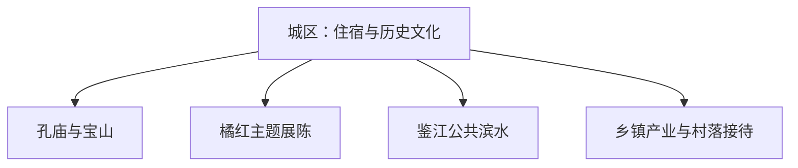

# 化州旅行指南

化州的辨识度来自化橘红产业、粤西古城人文和本地饮食。首访可用一天走孔庙—宝山—橘红主题展陈；第二天再从正式开放的产业体验、乡村或河谷方向中选一条，行程会比横跨多个镇更从容。

> 建议停留：1–2 天<br>
> 旅行关键词：化橘红、化州孔庙、宝山、粤西饮食、鉴江<br>
> 主要体力：城区低至中等；乡村和种植区为中等<br>
> 最近研究：2026-08-13

## 城市速览

| 项目 | 旅行信息 |
|---|---|
| 主要旅行价值 | 在城区认识孔庙与地方史，再用正规展馆或接待点理解化橘红从种植到加工的产业链 |
| 建议停留 | 1 天看城区；2 天增加一处产业或乡村方向 |
| 较舒适季节 | 秋冬较适合城区步行；春季可关注橘红花期，夏秋需留意高温、暴雨和台风 |
| 预算特点 | 城区中低预算，远镇车辆、产业体验和住宿是主要增量 |
| 步行强度 | 孔庙—宝山片区可分段步行，跨镇需车辆 |
| 主要天气风险 | 高温、雷暴、短时强降雨、台风及河流水位变化 |
| 独行旅行 | 城区餐饮方便，远线选有公开联系方式和返程方案的接待点 |
| 亲子旅行 | 文化展陈和合规产业体验较合适，生产车间与种植区按接待规则进入 |
| 长者与低体力旅行 | 以城区为基地，每天一个主要场馆或一条短远线 |
| 无障碍信息 | 新建展陈空间可提前询问；孔庙、山体公园和乡村资料有限，设施连续性需向官方确认 |

## 城市格局与游览区域

化州市是茂名市代管的县级市，法定代码 **440982**。固定 GeoNames `1806960` 是化州主城居民点；Wikidata `Q1374792` 同时记录该 GeoNames ID 与法定代码，另有薄同名点实体，不另建第二页。坐标用于定位城区，县级市边界以法定代码和属地资料为准。



| 区域 | 主要内容 | 游览特点 | 与其他区域的关系 |
|---|---|---|---|
| 城区历史片区 | 化州孔庙、宝山和地方文化空间 | 适合一日步行与短车程组合 | 住宿餐饮最集中 |
| 橘红文化片区 | 印象馆、博览或正式产业展示 | 展陈、销售和生产接待条件不同 | 先确认具体馆址和开放方式 |
| 鉴江公共滨水 | 城市河岸与日常休闲空间 | 适合傍晚短段，受天气与水位影响 | 与堤防作业、取水和非开放岸线分开 |
| 平定—合江—中垌等产业方向 | 化橘红种植、加工与乡村接待 | 镇际距离大，适合单独半日至一日 | 选择有资质、有接待公告的一处 |

## 主要景点

### 城区文化

| 景点 | 区域 | 类型 | 主要看点 | 建议用时 | 室内外 | 体力 | 预约风险 | 天气影响 | 优先级 |
|---|---|---|---|---:|---|---|---|---|---|
| 化州孔庙 | 城区 | 古建、文物 | 学宫格局、古建与当期开放展陈 | 1.5–3 小时 | 混合 | 低至中 | 中 | 中 | A |
| 化州市博物馆或地方展馆 | 城区 | 博物馆 | 地方历史、文物与城市发展 | 1.5–3 小时 | 室内 | 低 | 中 | 低 | A |
| 宝山公园公共区域 | 城区 | 城市公园 | 山体公园、城市视角和休闲步道 | 1–2 小时 | 室外 | 中 | 低 | 高 | B |
| 鉴江公共滨水短段 | 城区 | 滨水、公园 | 城市河岸、日常生活与傍晚步行 | 1–2 小时 | 室外 | 低 | 低 | 高 | B |

### 化橘红与乡村体验

| 景点 | 区域 | 类型 | 主要看点 | 建议用时 | 室内外 | 体力 | 预约风险 | 天气影响 | 优先级 |
|---|---|---|---|---:|---|---|---|---|---|
| 化橘红印象馆或官方确认的主题展馆 | 城区或宝山片区 | 产业展陈 | 历史、药食文化、加工与产品识别 | 1–2 小时 | 室内 | 低 | 高 | 低 | B |
| 化橘红国家现代农业产业园正式接待点 | 多镇分布 | 农业、产业 | 经预约开放的种植、加工或科普环节 | 半天 | 混合 | 低至中 | 高 | 高 | B |
| 倒流湾等当期开放乡村景区 | 市域乡镇 | 乡村、山水 | 正式景区范围内的山水与橘红主题 | 半天至 1 天 | 室外 | 中 | 高 | 高 | C |

化橘红产业园覆盖多个镇，属于生产与生活复合空间；参观选择公开展馆、预约接待基地和有明确游客动线的景区。种植田、加工车间、仓储和直播生产空间按经营者接待安排使用。

## 美食与餐饮

| 菜品或餐饮类型 | 常见区域 | 一个人用餐与常见份量 | 风味、过敏原与饮食限制 | 排队风险与替代方法 |
|---|---|---|---|---|
| 化州糖水 | 城区生活街区 | 一碗适合独食 | 可能含奶、椰浆、花生、芝麻或蛋 | 询问配料后选单一原料糖水 |
| 化州香油鸡等家常鸡菜 | 城区正规餐馆 | 半只多适合分享，一人问小份 | 含禽肉、芝麻油或花生油，蘸料可能含大豆 | 改点小份白切鸡或普通粤菜 |
| 簸箕炊、粉类早餐 | 城区 | 一份适合独食 | 酱汁常含大豆、花生、蒜和辣椒 | 早高峰换同类早餐店 |
| 化橘红制品 | 正规药店、特产店与有标签销售点 | 小包装试饮或作手信 | 化橘红具有药材与食品相关产品形态，不把宣传替代用药建议 | 看许可、配料、产地、日期与溯源信息 |

## 经典行程

```mermaid
flowchart TD
    S["先确定主线"] --> H["历史文化：孔庙与博物馆"]
    S --> O["橘红主题：展馆与接待基地"]
    H --> E["傍晚宝山或鉴江短段"]
    O --> E
    E --> D{ "是否增加一天" }
    D -->|是| V["选择一个正式乡村方向"]
    D -->|否| X["城区返程"]
```

### 一日经典路线

**路线**：化州孔庙 → 城区午餐 → 博物馆或橘红主题展馆 → 宝山公园短段

- **串联逻辑**：历史建筑、室内展陈和城市公园都在城区，移动成本较低。
- **预约锚点**：孔庙、博物馆、主题展馆开放及停车。
- **休息安排**：午间坐席用餐，下午场馆内休息。
- **时间不足时**：保留孔庙与一个室内展馆。

### 两日城市路线

**第 1 天**：孔庙—博物馆—城区；**第 2 天**：一个正式橘红产业接待点 → 城区。

- **串联逻辑**：先认识城市历史，再到单一产业点理解种植和加工。
- **预约锚点**：产业接待、车辆、花期或活动日期和返程。
- **休息安排**：第二天中午在镇区或接待点正式餐饮空间休息。
- **时间不足时**：取消第二天远线，用城区主题展馆替代。

### 三日深度路线

**第 1 天**：城区历史；**第 2 天**：橘红主题；**第 3 天**：一处正式乡村景区或鉴江城市休闲。

- **串联逻辑**：三天分别处理历史、产业和乡村，不横跨多个生产镇。
- **预约锚点**：各场馆、乡村接待、车辆与天气。
- **休息安排**：每晚回城区，避免夜间乡道移动。
- **时间不足时**：先删第 3 天，再把第 2 天改为城区展馆。

### 雨天路线

**路线**：博物馆 → 室内午餐 → 橘红主题展馆

- **适用条件**：普通降雨且城区交通正常；台风和暴雨预警时就近休整。
- **预约锚点**：闭馆、积水、公交和预警。
- **休息安排**：两馆之间用短程车辆，保留午间长休。
- **时间不足时**：只留已确认开放的一馆。

### 亲子或低体力路线

**亲子路线**：博物馆 → 午休 → 有讲解的橘红主题展馆<br>
**低体力路线**：孔庙可达部分 → 城区午餐 → 鉴江平缓公共短段

- **减负方式**：亲子线以展陈互动为主；低体力线缩短公园坡段和站立时间。
- **预约锚点**：讲解、儿童活动、孔庙台阶和滨水上下客点。
- **休息安排**：午间回住宿区，两条线均可提前结束。
- **时间不足时**：保留首个场馆。

### 远郊一日路线

**路线**：城区 → 一个已预约的产业接待点或正式乡村景区 → 城区

- **适用条件**：经营主体、游客入口、道路和返程已确认；一次只选一处。
- **预约锚点**：接待人、车辆、生产安排、天气和餐饮。
- **休息安排**：在正式接待空间或镇区完成午餐与卫生间停留。
- **时间不足时**：改为城区橘红主题展馆。

## 住宿区域

| 区域 | 优点 | 缺点 | 适合人群 | 交通特点 |
|---|---|---|---|---|
| 化州城区 | 餐饮、场馆和车辆最集中 | 到产业镇仍需公路接驳 | 首访、无车、亲子 | 适合作为连续住宿基地 |
| 茂名方向联程住宿 | 便于继续茂南或铁路长途 | 当日往返化州会增加通勤 | 只安排化州一日者 | 按实际铁路/公路到发选择 |
| 正式乡村或产业住宿 | 靠近预约体验 | 房量、餐饮和夜间交通有限 | 自驾、主题深度游 | 先确认消防、前台、停车和退改 |

## 市内交通

| 场景 | 建议与取舍 | 行前需要重查的内容 |
|---|---|---|
| 铁路抵达 | 以实际售票站名和停站为准，抵达后用公交或正规车辆进入城区 | 12306、站前公交、末班和夜间接驳 |
| 城区步行 | 孔庙、宝山与展馆可分段串联 | 高温、暴雨、施工和过街条件 |
| 前往产业镇 | 县域客运或正规预约车辆更适合 | 班次、返程、接待地址和司机资质 |
| 自驾 | 对乡镇主题最灵活 | 台风暴雨、乡道、停车和充电 |

## 不同旅行者须知

| 旅行维度 | 可行条件 | 主要取舍 | 需额外核对 |
|---|---|---|---|
| 独行旅行 | 城区路线可自行完成 | 远线提前锁定返程 | 运营方与车辆信息 |
| 亲子旅行 | 场馆和有讲解的产业体验较友好 | 生产空间需服从现场安排 | 年龄、卫生间和食品试用 |
| 长者或低体力旅行 | 城区住宿、短车接驳 | 宝山坡道和古建台阶 | 电梯、休息座椅和入口 |
| 无障碍需求 | 优先新建展馆和城区平缓空间 | 古建、山体公园和乡村连续动线资料不足 | 设施连续性需向官方确认 |
| 摄影旅行 | 古建、城市河岸和花期可各自成主题 | 商业拍摄和生产基地拍摄需许可 | 花期、开放与设备规则 |
| 特殊天气 | 室内场馆可形成替代 | 台风暴雨时乡镇道路和河岸受影响 | 气象、积水和场馆公告 |

## 行前核对

| 核对事项 | 为什么需要重查 | 建议核对时间 | 官方入口 |
|---|---|---|---|
| 孔庙与场馆开放 | 闭馆日、修缮和活动会调整 | 到访前一日 | [化州市人民政府](https://www.huazhou.gov.cn/) |
| 橘红体验 | 花期、生产流程和接待日并不固定 | 排入路线前 | [化橘红产业平台](https://hzhjh.com.cn/) |
| 县域交通 | 远镇班次和返程影响可执行性 | 出发前一周及当天 | [茂名市交通运输局](https://mmjt.maoming.gov.cn/) |
| 天气 | 台风、暴雨和高温影响户外与乡道 | 出发前三日及当天 | [广东省气象局](https://gd.cma.gov.cn/) |

## 来源与更新记录

### 主要来源

| 来源 | 类型 | 支持内容 | 核验日期 |
|---|---|---|---|
| [化州市人民政府](https://www.huazhou.gov.cn/) | 市政府 | 属地公告、公共文化、交通和动态核对入口 | 2026-08-13 |
| [广东省地方志：化州孔庙](https://www.gdwsw.gov.cn/wsbl/content/post_31689.html) | 省级地方志机构 | 孔庙历史、位置、文保和景区身份 | 2026-08-13 |
| [化橘红产业平台](https://hzhjh.com.cn/) | 产业公共平台 | 产业园范围、种植加工和主题旅游背景 | 2026-08-13 |
| [茂名市化橘红保护发展条例](https://www.rdmm.gov.cn/) | 地方立法机关 | 地理标志、文化传承与保护利用原则 | 2026-08-13 |
| [民政部行政区划查询](https://dmfw.mca.gov.cn/xzqh/getList?code=44&trimCode=true&maxLevel=3) | 政府开放接口 | 化州市代码 `440982` 与茂名代管关系 | 2026-08-13 |
| [GeoNames 1806960](https://www.geonames.org/1806960/huazhou.html) | 开放地理数据 | 固定主城点坐标与 PPL 分类 | 2026-08-13 |
| [Wikidata Q1374792](https://www.wikidata.org/wiki/Q1374792) | 开放知识图谱 | 化州市实体、P1566 与法定代码 | 2026-08-13 |
| [中国铁路 12306](https://www.12306.cn/) | 铁路运营方 | 当前车站、车次和售票核对入口 | 2026-08-13 |

### 更新记录

| 日期 | 更新内容 |
|---|---|
| 2026-08-13 | 首次完成化州独立旅行研究；将茂名父页收敛为法定关系与换城链接。 |
