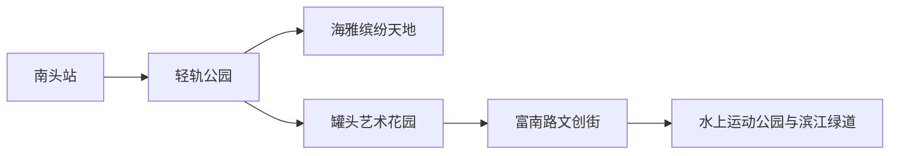
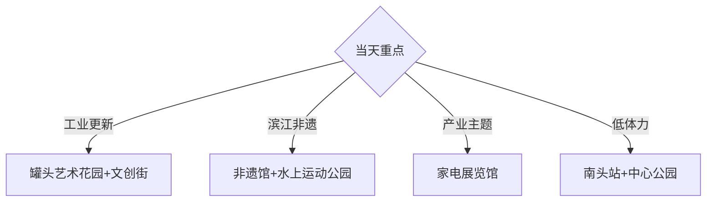

# 南头镇旅行指南

中山南头镇位于中山市北部、鸡鸦水道南岸，旅行重点是罐头厂工业更新、滨江公园、五人飞艇与黄鱼宴等地方非遗，以及家电产业展示。这里与深圳南山区的南头古城同名，订票、导航和住宿时写全“中山市南头镇”更稳妥。

## 城市速览

| 项目 | 信息 |
|---|---|
| 主线 | 南头站—轻轨公园—罐头艺术花园—富南路文创街—水上运动公园 |
| 停留 | 核心 1 天；非遗活动或产业参访另加半天 |
| 住宿 | 南头站—海雅方向方便抵离；镇中心适合滨江与日常餐饮 |
| 交通 | 广珠城际南头站接入，镇内用公交、步行和短途车辆串联 |
| 风险 | 台风暴雨、滨水湿滑、高温雷雨、大型活动客流与工业道路车辆 |
| 边界 | 在产工厂、仓储物流、河道水利设施和社区院落按公开接待范围进入 |

## 城市格局与游览区域

固定 **Nantou / GeoNames 1913126** 对应中山市南头镇，不是深圳南头。南头站和海雅构成东部抵离与商业片区，罐头艺术花园—富南路文创街位于沿江东路工业遗产更新带，水上运动公园、非遗展示馆和家风主题公园沿鸡鸦水道展开；家电展览馆属于产业主题点，先确认开放与团体接待。

## 主要景点

| 景点 | 区域 | 类型 | 核心体验 | 用时 | 环境 | 体力 | 研究价值 | 拥挤 | 优先级 |
|---|---|---|---|---:|---|---|---|---|---|
| 罐头艺术花园 | 沿江东路 | 工业更新 | 旧罐头厂建筑、工业记忆与文创业态 | 2–3小时 | 混合 | 低中 | 高 | 周末高 | A |
| 富南路供销社文创街 | 沿江东路 | 历史街巷更新 | 旧供销社建筑、短街商业与地方生活 | 1–2小时 | 混合 | 低 | 高 | 中 | B |
| 南头水上运动公园 | 鸡鸦水道 | 滨江公园 | 滨江廊道、湿地景观与飞艇赛场地 | 2–4小时 | 室外 | 中 | 高 | 活动时高 | A |
| 南头镇非物质文化遗产展示馆 | 文体广场旁 | 非遗场馆 | 五人飞艇、灯酒与黄鱼宴文化 | 1–2小时 | 室内 | 低 | 很高 | 活动时高 | A |
| 南头中心公园 | 镇中心 | 城市公园 | 草坪、步道、文化长廊与香山书房 | 1–2小时 | 室外 | 低 | 中 | 周末中 | B |
| 南头镇家风主题公园 | 滨江绿道 | 主题公园 | 家风文化、非遗元素与滨江慢行 | 1–2小时 | 室外 | 低 | 中 | 中 | C |
| 南头轻轨公园 | 南头站西侧 | 口袋公园 | 出站即达的绿地与抵离休息 | 0.5–1小时 | 室外 | 低 | 中 | 中 | C |
| 南头镇家电科技展览馆 | 南头大道 | 产业展陈 | 家电产业集群与制造业发展 | 1–1.5小时 | 室内 | 低 | 高 | 团体时高 | B |
| 海雅缤纷天地 | 南头站片区 | 商业综合体 | 室内运动、餐饮与雨天休整 | 2–4小时 | 室内 | 低 | 低 | 周末高 | C |

## 美食与餐饮

南头可从黄鱼宴、河鲜、本地粥品和广府家常菜中选择。黄鱼宴与五人飞艇等非遗活动有明确时段，普通日期以镇中心和南头站周边的正规餐饮为主。河鲜和水产先确认来源、称重、加工费与熟度；贝类、鱼类、大豆和花生过敏者逐项询问调料及共用厨具。

## 经典行程

### 一日基础线
**路线**：南头站—轻轨公园—罐头艺术花园—富南路文创街—水上运动公园。**逻辑**：从交通入口依次读工业更新和滨江文化。**预约锚点**：园区活动与非遗馆。**休息**：文创街或镇中心。**删除条件**：暴雨时删滨江段，转海雅室内。

### 工业更新线
**路线**：罐头艺术花园—供销社文创街—公开工业展陈。**逻辑**：用食品工业遗存理解制造业城镇转型。**预约锚点**：园区开放与当期展览。**休息**：园区正规商业。**删除条件**：施工或活动包场时只走公开街区。

### 滨江非遗线
**路线**：非遗展示馆—家风主题公园—水上运动公园。**逻辑**：把五人飞艇与鸡鸦水道空间联系起来。**预约锚点**：非遗馆和赛事公告。**休息**：中心公园或镇区。**删除条件**：台风、雷雨或岸线管制时改室内。

### 家电产业线
**路线**：家电科技展览馆—镇中心公共空间—海雅商业。**逻辑**：从产业展陈进入南头制造业主题。**预约锚点**：展览馆是否接待散客。**休息**：海雅。**删除条件**：展馆无接待时整段替换为非遗馆。

### 公园亲子线
**路线**：轻轨公园—中心公园—水上运动公园近入口段。**逻辑**：以草坪、步道和短接驳控制体力。**预约锚点**：亲子活动。**休息**：中心公园与商业区。**删除条件**：高温或雷雨时缩短室外段。

### 非遗活动线
**路线**：官方主会场—非遗展示馆—黄鱼宴或飞艇活动公开区域。**逻辑**：围绕一个真实活动组织，不用日常路线模拟节庆。**预约锚点**：日期、观众入口和交通管制。**休息**：主会场服务区。**删除条件**：活动取消时改一日基础线。

### 低体力线
**路线**：车辆到非遗馆—中心公园短段—海雅休整。**逻辑**：室内展陈与平缓公共空间组合。**预约锚点**：无障碍入口和下客点。**休息**：每站均安排坐休。**删除条件**：馆舍闭馆时只留商业与公园近入口。

## 住宿区域

南头站—海雅片区适合城际抵离、雨天与丰富餐饮；镇中心适合滨江、非遗活动和次日早出；罐头艺术花园周边的民宿与商业住宿以实际持证经营、隔音和夜间交通为筛选条件。前往中山主城区或佛山、广州联程时，先比较换宿与当天往返的总时间。

## 市内交通

广珠城际南头站是清晰铁路入口，出站后通过公交、出租车或网约车到镇内各点。罐头艺术花园、文创街和滨江公园适合在同一方向短接驳，产业展馆按预约地址导航。大型非遗活动可能调整道路和停车；滨江骑行遵循步骑分流，水闸、堤防和作业岸线按管理标识通行。

## 不同旅行者须知

工业遗产兴趣者优先罐头艺术花园；非遗旅行者围绕展示馆与官方活动；亲子家庭选择中心公园和水上运动公园；长者以非遗馆、短公园和商业休整为主。轮椅与婴儿车使用者逐站确认坡道、电梯、卫生间和滨江路面连续性。

## 行前核对

- 核对罐头艺术花园、非遗展示馆、家电科技展览馆与活动主会场开放。
- 核对南头站车次、镇内公交末班、台风暴雨与滨江赛事管制。
- 工业园和在产企业只进入明确开放的展厅、参观通道与活动场地。

## 来源与更新记录

| 来源 | 支持内容 | 核验日期 |
|---|---|---|
| [南头镇政府：特色旅游景点](https://www.zs.gov.cn/ntz/zjnt/lyjq/content/post_2596673.html) | 镇域格局、交通、罐头艺术花园、公园、非遗馆与产业展陈 | 2026-09-01 |
| [南头镇政府：供销社文创街](https://www.zs.gov.cn/zsntz/gkmlpt/content/2/2433/post_2433093.html) | 旧厂更新、文创街与水上运动公园关系 | 2026-09-01 |
| [GeoNames 1913126](https://www.geonames.org/1913126/) | Nantou 固定人口点与位置 | 2026-09-01 |

| 日期 | 更新 |
|---|---|
| 2026-09-01 | 首次完成南头镇旅行研究；明确与深圳南头消歧并建立工业更新、滨江非遗、住宿和交通结构。 |

