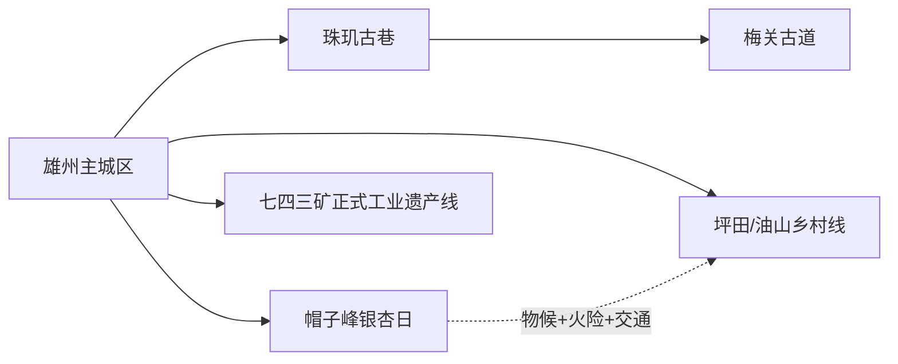
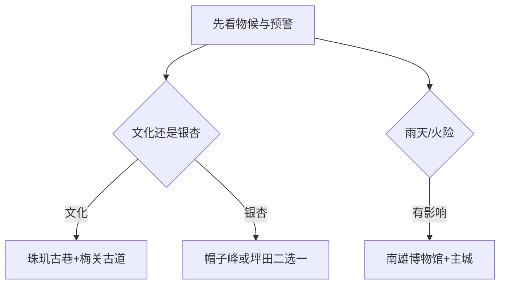

# 南雄旅行指南

南雄位于粤赣交界，主城区适合作为住宿底盘，珠玑古巷—梅关古道组成寻根与古道核心，帽子峰、坪田等银杏方向则具有很强季节性。最实用的安排是先选“古道文化日”或“银杏山地日”，再决定是否增加红色、工业遗产或乡村主题；高峰期交通和花叶期比景点数量更影响体验。

> 建议停留：主城半日至 1 天；珠玑—梅关另留 1 天；银杏或红色远线再留 1 天  
> 旅行关键词：珠玑古巷、梅关古道、广府原乡、帽子峰、坪田银杏、梅岭红色历史  
> 主要体力：主城低；古道、森林和山地为中高  
> 最近研究：2026-08-13

## 城市速览

| 项目 | 旅行信息 |
|---|---|
| 主要旅行价值 | 从珠玑古巷理解广府迁徙记忆，在梅关古道认识南北交通与红色历史，再以银杏乡村和森林补充粤北季节景观 |
| 建议停留 | 1 天只做珠玑—梅关；2 天加入主城；3 天再选帽子峰、坪田或红色远线 |
| 较舒适季节 | 春秋适合古道；银杏色期按当年物候；夏季高温、雷雨和山洪明显，冬季山路可能湿滑结冰 |
| 预算特点 | 主城成本较易控制；旺季车辆、停车、景区交通和银杏季住宿是主要变量 |
| 步行强度 | 古巷中等；梅关古道和帽子峰山地为中高 |
| 主要天气风险 | 高温、暴雨、雷电、山洪、滑坡、森林火险、寒潮和大雾 |
| 独行旅行 | 主城和珠玑较易安排；帽子峰、坪田和红色远线先锁返程 |
| 亲子旅行 | 博物馆、珠玑古巷短线和具名乡村活动可组合 |
| 长者与低体力旅行 | 选择主城场馆、珠玑短段和车辆接驳，梅关只走适合体力的一段 |
| 无障碍信息 | 新博物馆和游客中心可咨询；古道、古巷、森林和乡村的设施连续性需向官方确认 |

## 城市格局与游览区域

南雄市是韶关市代管的法定县级市，代码 `440282`。固定 GeoNames `1788402` 名为 `Xiongzhou`，对应雄州主城居民点；Wikidata `Q934465` 表达南雄市并关联另一行政记录 `1799646`。固定点用于定位主城，法定代码和县级市实体用于覆盖珠玑、梅岭、帽子峰、坪田等完整市域。

| 区域 | 主要内容 | 怎么安排 | 边界提示 |
|---|---|---|---|
| 雄州主城区 | 市博物馆、公共文化、住宿餐饮 | 抵离、雨天和补给 | 场馆开放按当期公告 |
| 珠玑镇—梅岭 | 珠玑古巷、梅关古道、迁徙与红色历史 | 一整日或分两天 | 古巷与古道是不同步行和运营单元 |
| 帽子峰镇 | 森林公园、银杏与林场景观 | 秋季完整一日 | 色期、火险、交通和林业边界 |
| 坪田—油山等乡村 | 古银杏群、红色遗址与乡村生活 | 具名线路一日 | 居民、农田和文保点分别守边界 |
| 澜河七四三矿方向 | 国家工业遗产及山地乡镇 | 只按正式开放接待 | 矿区设施、洞口和生产道路限制明确 |
| 孔江湿地及水库河流 | 湿地、水源与生态空间 | 使用公共观景和科普点 | 保护区、库区和水利设施按管理规定 |

珠玑古巷与梅关古道常作为同一 4A 品牌宣传，但两处拥有不同物理空间和步行强度，本页分别安排时间。帽子峰、坪田银杏和普通林地也不是同一景区；只进入正式开放的景区、古银杏公共点和具名接待空间。

## 主要景点

### 主城与古道文化

| 景点 | 区域 | 类型 | 主要看点 | 建议用时 | 室内外 | 体力 | 预约风险 | 天气影响 | 优先级 |
|---|---|---|---|---:|---|---|---|---|---|
| 珠玑古巷 | 珠玑镇 | 4A 品牌组成、历史街巷 | 广府迁徙记忆、古巷与姓氏文化 | 3–5 小时 | 混合 | 中 | 高 | 中 | A |
| 梅关古道 | 珠玑镇梅岭村 | 全国重点文保、古道 | 关楼、古驿道、诗碑与红色历史 | 4–7 小时 | 室外 | 中高 | 高 | 很高 | A |
| 南雄市博物馆 | 雄州主城区 | 公共博物馆 | 南雄历史、迁徙、红色与地方文物 | 2–3 小时 | 室内 | 低 | 中 | 低 | A |
| 雄州古城公共历史节点 | 主城区 | 城市历史 | 古城格局、公共街巷与当期展陈 | 1.5–3 小时 | 混合 | 低至中 | 中 | 中 | B |

### 银杏、森林与红色乡村

| 景点 | 区域 | 类型 | 主要看点 | 建议用时 | 室内外 | 体力 | 预约风险 | 天气影响 | 优先级 |
|---|---|---|---|---:|---|---|---|---|---|
| 帽子峰森林公园正式开放区 | 帽子峰镇 | 森林、银杏 | 林场景观、银杏与正式游览道路 | 5–8 小时 | 室外 | 中高 | 很高 | 很高 | A |
| 坪田古银杏具名开放点 | 坪田镇 | 古树、乡村 | 古银杏群、村落与季节景观 | 4–7 小时 | 室外 | 中 | 很高 | 很高 | B |
| 油山红色遗址正式开放线 | 油山镇 | 红色历史、山地 | 革命旧址与具名纪念空间 | 4–7 小时 | 混合 | 中高 | 很高 | 很高 | B |
| 七四三矿国家工业遗产正式接待区 | 澜河镇 | 工业遗产 | 矿业历史、社区和当期开放展陈 | 3–6 小时 | 混合 | 中 | 很高 | 高 | C |
| 孔江国家湿地公园正式开放点 | 市域水系 | 湿地、自然教育 | 湿地生态和正式科普空间 | 3–5 小时 | 室外 | 中 | 很高 | 很高 | C |

## 美食与餐饮

| 类型 | 适合区域 | 份量与选择 | 饮食提醒 | 怎么选 |
|---|---|---|---|---|
| 南雄板鸭 | 主城、正规商店和餐馆 | 小份品尝或真空包装 | 盐分高，含禽肉；礼盒看保质与储存 | 优先有标签、日期和来源的产品 |
| 梅岭鹅王、酸笋焖鸭 | 主城、珠玑镇区 | 适合 2–4 人分享 | 禽肉、酸笋、辣椒和油盐明显 | 按人数点半只或小份，配清淡蔬菜 |
| 铜勺饼等地方小吃 | 主城、古巷正规摊店 | 小份、单人友好 | 油炸、花生/豆类与麸质需询问 | 现炸现吃，留意油温与配料 |
| 银杏制品 | 坪田、帽子峰和正规商店 | 少量尝试 | 白果须熟制且不宜过量 | 选标示加工方式和净含量的产品 |
| 乡村桌餐 | 具名接待点 | 多人套餐常见 | 山野菜、菌类和酒水来源需问清 | 预约时确认价格、菜量和退改 |

## 经典行程

### 一日经典路线

**路线**：珠玑古巷 → 珠玑镇午餐 → 梅关古道适合体力的正式开放段 → 返回主城。

- **串联逻辑**：从迁徙记忆走到南北交通古道，主题连续。
- **适用条件**：天气、古道开放和返程稳定。
- **预约锚点**：两处景区、停车/接驳和最后入园。
- **休息安排**：珠玑镇完整午休，古道入口再补水。
- **时间不足时**：保留珠玑古巷，梅关只走短段或另日安排。

### 两日城市路线

**第 1 天**：南雄市博物馆 → 主城午餐 → 城市历史短线。  
**第 2 天**：珠玑古巷—梅关古道。

- **串联逻辑**：第一天建立全市背景，第二天进入核心现场。
- **适用条件**：住主城、有完整第二天。
- **预约锚点**：博物馆、珠玑和梅关。
- **休息安排**：主城和珠玑镇分别午休。
- **时间不足时**：第一天缩成博物馆，第二天不赶其他远点。

### 三日深度路线

**第 1 天**：主城。  
**第 2 天**：珠玑—梅关。  
**第 3 天**：帽子峰、坪田或油山三选一。

- **串联逻辑**：城市、古道和第三主题分日处理。
- **适用条件**：自驾、包车或已确认乡镇接驳。
- **预约锚点**：第三天物候、景区/接待点、道路和返程。
- **休息安排**：镇区或正式服务点。
- **时间不足时**：删除第三天。

### 雨天路线

**路线**：南雄市博物馆 → 午餐 → 主城区公共文化展览或珠玑古巷低强度室内点。

- **串联逻辑**：以室内展陈和短街巷替代山地远线。
- **适用条件**：普通降雨、城区交通正常；暴雨预警减少移动。
- **预约锚点**：场馆开放。
- **休息安排**：馆内和主城商业区。
- **时间不足时**：只保留博物馆。

### 亲子或低体力路线

**亲子方案**：博物馆精选展 → 午餐 → 珠玑古巷短线。  
**低体力方案**：车辆落客珠玑核心区 → 长休 → 主城返店。

- **串联逻辑**：保留迁徙与城市历史，减少古道爬升。
- **适用条件**：先核落客、座席、卫生间和儿童活动。
- **预约锚点**：博物馆与珠玑游客服务。
- **休息安排**：每 60–90 分钟休息。
- **时间不足时**：删除第二站。

### 远郊一日路线

**银杏线**：主城 → 帽子峰或坪田二选一 → 镇区/服务区午休 → 原路返回。  
**红色工业线**：主城 → 油山正式旧址或七四三矿正式接待区二选一 → 返回。

- **串联逻辑**：银杏、红色和工业各自成线，一天只选一种。
- **适用条件**：物候、天气、火险、开放和车辆均已确认。
- **预约锚点**：景区、接待单位、停车与返程。
- **休息安排**：镇区或正式游客服务点。
- **时间不足时**：只保留单一主点；矿区无正式接待则改主城。

## 住宿区域

| 区域 | 优点 | 取舍 | 适合人群 | 交通提示 |
|---|---|---|---|---|
| 雄州主城区 | 餐饮、交通、医疗和多方向服务集中 | 远线需早出 | 首访、独行、多日者 | 核对到客运点和珠玑方向接驳 |
| 珠玑镇正规住宿 | 方便古巷与梅关早入 | 夜间服务少于主城 | 古道摄影、慢旅行 | 先确认停车、晚餐和次日离开 |
| 帽子峰/坪田具名住宿 | 接近银杏季景点 | 高峰期价格、交通和退改压力大 | 已锁定物候和车辆者 | 书面确认地址、供暖、停车和取消 |

## 市内交通

| 场景 | 建议方式 | 怎么做 | 动态核对 |
|---|---|---|---|
| 跨城抵达 | 铁路、公路客运、自驾 | 以南雄站和实际客运点为准 | 车次、站址、末班 |
| 珠玑—梅关 | 公交、景区接驳、合规车辆或自驾 | 两处入口分别导航 | 停车、接驳、最后入园 |
| 帽子峰/坪田 | 旺季专线、合规包车或自驾 | 先订车再订住宿 | 物候、拥堵、预约和返程 |
| 油山/澜河 | 合规包车、自驾或接待车辆 | 一天一个方向 | 山路、火险、接待许可和通信 |

## 不同旅行者须知

| 旅行者 | 优先选择 | 需要确认 | 备选方案 |
|---|---|---|---|
| 独行者 | 主城与珠玑 | 远线末班和夜间叫车 | 两日主城+珠玑 |
| 亲子家庭 | 博物馆、古巷短线 | 古道体力、活动和看护 | 主城一馆一餐 |
| 长者与低体力者 | 车辆落客、短街巷 | 古道坡度、座席和卫生间 | 博物馆+珠玑短段 |
| 摄影旅行者 | 帽子峰/坪田正式点 | 物候、拥堵、停车、无人机规则 | 主城与古巷人文 |
| 工业遗产旅行者 | 七四三矿正式接待 | 许可、装备、摄影和生产边界 | 市博物馆相关展陈 |

安全、法律和保护边界保持明确：梅关按正式古道行走；森林火险、暴雨和山洪预警时暂停山地线；七四三矿只进入获准接待区域；孔江湿地、水库大坝、化工园、烟叶生产和林业作业道路不作为游览空间。

## 行前核对

- 在[南雄市人民政府](https://www.gdnx.gov.cn/)查看景区、道路、银杏季和活动公告。
- 珠玑古巷、梅关古道分别核票务、入口、停车和最后入园。
- 帽子峰、坪田按当年物候和预约安排，不沿用往年色期。
- 查看气象、森林火险、山洪、道路和客运公告。
- 工业遗产线提前联系接待单位并服从安全要求。
- 通过 12306 与正规客运渠道确认到发。
- 无障碍旅行逐段确认车站、场馆、古巷、景区车和住宿。

## 来源与更新记录

### 主要来源

| 来源 | 机构 | 支持内容 | 核验日期 |
|---|---|---|---|
| [梅关古道简介](https://www.gdnx.gov.cn/lynx/jqjd/content/post_2804393.html) | 南雄市文化广电旅游体育局 | 古道位置、文保、4A 品牌与红色历史 | 2026-08-13 |
| [南雄市 2026 年政府工作报告](https://www.gdnx.gov.cn/zwgk/zfxxgk/gzbg/content/post_2820414.html) | 南雄市人民政府 | 珠玑、梅关、帽子峰、工业遗产、博物馆与银杏季 | 2026-08-13 |
| [南雄市政务公开与规划入口](https://www.gdnx.gov.cn/zwgk/index.html) | 南雄市人民政府 | 近期规划、湿地保护、道路和乡镇入口 | 2026-08-13 |
| [GeoNames 1788402](https://sws.geonames.org/1788402/about.rdf) | GeoNames | Xiongzhou 固定主城点 | 2026-08-13 |
| [Wikidata Q934465](https://www.wikidata.org/wiki/Q934465) | Wikidata | 南雄市实体与行政记录 | 2026-08-13 |
| [民政部行政区划代码服务](https://dmfw.mca.gov.cn/xzqh/getList?code=440282&trimCode=false&maxLevel=3) | 民政部 | 南雄市法定代码和层级 | 2026-08-13 |
| [广东省文化和旅游厅](https://whly.gd.gov.cn/) | 省级文旅主管部门 | 景区、文保和活动复核入口 | 2026-08-13 |
| [广东省气象局](http://gd.cma.gov.cn/) | 气象主管部门 | 天气与灾害预警 | 2026-08-13 |
| [中国铁路 12306](https://www.12306.cn/) | 铁路运营方 | 南雄站到发动态核对 | 2026-08-13 |

### 更新记录

| 日期 | 更新内容 |
|---|---|
| 2026-08-13 | 建立研究版；解释 Xiongzhou 主城点与南雄县级市实体；按主城、珠玑—梅关、银杏山地、红色与工业遗产分线，并明确林业、湿地、矿区和产业边界。 |
