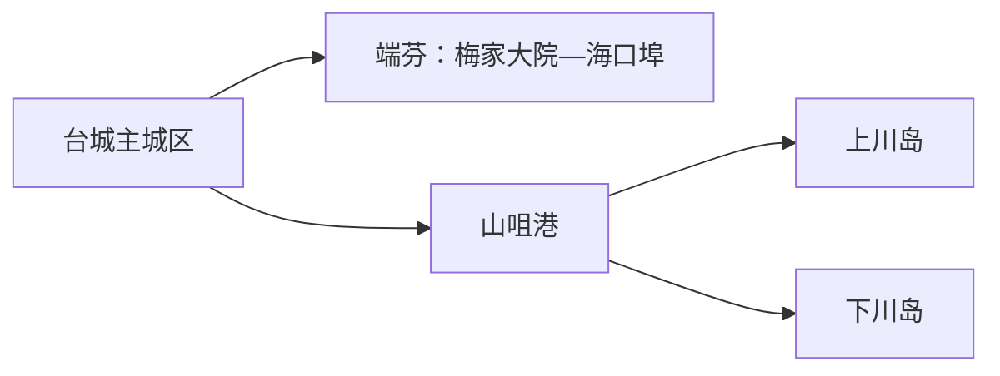
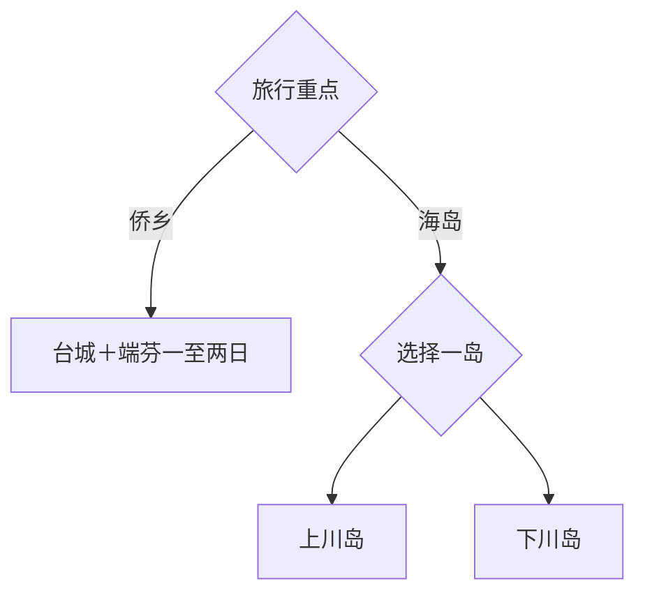

# 台山旅行指南

台山的旅行主线由台城侨乡文脉、端芬—海口埠历史街区、梅家大院与川岛海岸组成。城区和侨乡建筑适合一至两天，川岛要按船班、风浪和住宿另留完整日；上川岛、下川岛拥有不同码头与游览体系，选择其中一岛更从容。

> 建议停留：2–4 天 
> 旅行关键词：侨乡建筑、梅家大院、海口埠、上下川岛 
> 主要体力：城区低至中等；岛屿与海岸中等 
> 最近研究：2026-08-12

## 城市速览

| 项目 | 旅行信息 |
|---|---|
| 主要旅行价值 | 从侨乡建筑和银信故事走到南海岛屿，理解台山的跨洋迁徙、圩镇与海洋生活 |
| 建议停留 | 1 天台城与侨乡；2 天增加端芬方向；3–4 天选择一座川岛 |
| 较舒适季节 | 春秋适合城乡步行；海岛按台风、季风、风浪和防暑条件选择 |
| 预算特点 | 陆路文化线较平实，轮渡、岛内交通和海岛住宿是主要增量 |
| 步行强度 | 侨乡街区可分段，海岛沙滩和坡地会增加体力 |
| 主要天气风险 | 台风、强降雨、高温、海上大风、雷电和风浪 |
| 独行旅行 | 台城与端芬易安排，海岛提前锁定往返船班和住宿 |
| 亲子旅行 | 侨乡故事和沙滩适合分龄体验，水上活动按年龄与运营规则选择 |
| 长者与低体力旅行 | 台城、梅家大院和海口埠用车辆串联；岛上选靠码头或核心区住宿 |
| 无障碍信息 | 新建游客设施可先咨询，历史街区、码头和沙滩的设施连续性需向官方确认 |

## 城市格局与游览区域

台城是住宿和交通基地；端芬镇的梅家大院与海口埠可组成侨乡一日线。山咀港衔接上、下川岛，但两岛分别换乘轮渡与岛内交通，宜选一岛完成。广海、都斛等沿海农业和渔业空间按正式接待项目进入。

| 区域 | 主要内容 | 游览特点 | 与其他区域的关系 |
|---|---|---|---|
| 台城 | 城市文博、侨乡公共文化、餐饮住宿 | 适合抵达日和雨天 | 作为端芬与川岛前后基地 |
| 端芬—海口埠 | 梅家大院、海口埠银信与侨乡建筑 | 车辆串联，适合完整一日 | 与台城往返最顺 |
| 上川岛 | 飞沙滩等海岛度假空间 | 海岸、住宿和岛内交通成套安排 | 与下川岛二选一更从容 |
| 下川岛 | 王府洲等海岛度假空间 | 沙滩、海湾与岛内接驳 | 同样从山咀港换乘 |
| 沿海镇域 | 渔业、农业与季节活动 | 以公开景区或明确接待线路为入口 | 不占用首访核心时间 |

GeoNames `1793700` 与 Wikidata `Q164904` 的 `P1566` 精确对应台山城市记录；法定代码为 `440781`，属于江门代管的独立县级市。江门主城、开平、恩平等另按跨城尺度安排。

## 主要景点

### 侨乡文化

| 景点 | 区域 | 类型 | 主要看点 | 建议用时 | 室内外 | 体力 | 预约风险 | 天气影响 | 优先级 |
|---|---|---|---|---:|---|---|---|---|---|
| 梅家大院 | 端芬 | 侨乡建筑群 | 骑楼式院落、侨乡聚落与电影取景记忆 | 2–3 小时 | 室外为主 | 低至中 | 中；开放区与活动需核 | 中高 | A |
| 海口埠历史文化街区 | 端芬 | 历史街区、银信文化 | 商埠、银信、码头与侨乡迁徙线索 | 2–3 小时 | 混合 | 中 | 中；场馆开放需核 | 高 | A |
| 台城公共文化场馆 | 台城 | 博物馆／文化馆 | 台山历史、华侨文化与临时展览 | 1.5–2 小时 | 室内 | 低 | 中；具体馆舍与闭馆日需核 | 低 | B |

### 川岛海岸

| 景点 | 区域 | 类型 | 主要看点 | 建议用时 | 室内外 | 体力 | 预约风险 | 天气影响 | 优先级 |
|---|---|---|---|---:|---|---|---|---|---|
| 上川岛飞沙滩旅游区 | 上川岛 | 海岛、沙滩 | 海湾、沙滩与岛屿度假 | 1 天 | 室外 | 中 | 高；船票、住宿、岛内车需核 | 高 | A |
| 下川岛王府洲旅游区 | 下川岛 | 海岛、沙滩 | 海湾、沙滩与滨海步行 | 1 天 | 室外 | 中 | 高；船票、住宿、岛内车需核 | 高 | A |
| 山咀港 | 川岛镇 | 交通节点 | 上下川岛轮渡换乘 | 0.5–1 小时 | 混合 | 低至中 | 高；船班与安检需核 | 高 | 路线节点 |

梅家大院与海口埠是两个相邻但主题不同的目的地，可同日串联；上下川岛分别核船班和住宿，不把两岛写成一次连续步行景区。养殖塘、作业码头和渔业生产区以安全生产边界为先，海上体验选择持证运营项目。

## 美食与餐饮

| 菜品或餐饮类型 | 常见区域 | 一个人用餐与常见份量 | 风味、过敏原与饮食限制 | 排队风险与替代方法 |
|---|---|---|---|---|
| 台山黄鳝饭 | 台城、都斛等地 | 多人共享更合适，一人先问小煲 | 鳝鱼、米饭、酱油和油脂；鱼类过敏需避开 | 正餐高峰选同类家常店 |
| 海鲜与海鱼 | 台城、山咀港、海岛 | 按斤计价，先确认做法与总价 | 贝类、甲壳类过敏；注意禁渔和合法来源 | 明码标价，按人数控制品种 |
| 生蚝及沿海水产 | 沿海正规餐馆 | 小份或拼盘更适合尝试 | 贝类过敏与生食风险 | 选择充分加热的替代做法 |
| 粤式粥粉面与点心 | 台城、镇区 | 单人友好 | 小麦、蛋、花生、芝麻与肉类 | 早餐高峰换居民区同类店 |

## 经典行程

### 一日经典路线

**路线**：台城出发 → 梅家大院 → 午餐 → 海口埠历史文化街区 → 返回台城

- **串联逻辑**：同属端芬方向，建筑聚落与银信商埠形成完整侨乡叙事。
- **预约锚点**：场馆开放、讲解与往返车辆。
- **休息安排**：端芬镇午餐，海口埠安排一次室内坐休。
- **时间不足时**：保留梅家大院，海口埠只走核心短段。

### 两日城市路线

**第 1 天**：台城公共文化 → 城市餐饮与街区。 
**第 2 天**：梅家大院 → 海口埠。

- **串联逻辑**：先建立台山历史框架，再到侨乡现场。
- **预约锚点**：台城场馆、端芬讲解与车辆。
- **休息安排**：两晚住台城，减少换宿。
- **时间不足时**：第一天缩为半日抵达线。

### 三日深度路线

**第 1 天**：台城。 
**第 2 天**：端芬侨乡线。 
**第 3 天**：上川岛或下川岛整日。

- **串联逻辑**：陆路文化完成后再切换海岛，避免船班打断前两日。
- **预约锚点**：第三天往返船票、岛内接驳和天气。
- **休息安排**：海岛午间避晒，预留候船缓冲。
- **时间不足时**：删除海岛日，保留陆路两日。

### 雨天路线

**路线**：台城正式开放的文化场馆 → 午餐 → 梅家大院或海口埠的可开放短段

- **适用条件**：普通降雨；台风、暴雨或海上大风时留在陆地安全区域。
- **串联逻辑**：先室内，再按现场情况选择一个历史街区短段。
- **预约锚点**：场馆与景区临时开放。
- **休息安排**：台城餐饮区和馆内公共空间。
- **时间不足时**：只保留台城场馆。

### 亲子或低体力路线

**亲子路线**：台城文化场馆 → 午餐 → 梅家大院短线。 
**低体力路线**：车辆直达梅家大院 → 端芬午餐 → 海口埠平缓核心段。

- **减负方式**：亲子线减少跨点讲解时长；低体力线用车辆衔接并避开长时间沙滩步行。
- **预约锚点**：下客点、卫生间、儿童活动与场馆电梯。
- **休息安排**：午餐长休，下午只走一个核心区域。
- **时间不足时**：两类路线均保留一个侨乡点。

### 远郊一日路线

**路线**：台城 → 山咀港 → 上川岛或下川岛 → 按船班返程／岛上住宿

- **适用条件**：风浪、船班、住宿和返程余量稳定。
- **串联逻辑**：一次只选一岛，码头、岛内车和海滩形成一套闭环。
- **预约锚点**：实名船票、住宿、水上项目和岛内接驳。
- **休息安排**：候船区与岛上正规服务区，午间避晒。
- **时间不足时**：海岛整段改期，留在台城或端芬。

## 住宿区域

| 区域 | 优点 | 缺点 | 适合人群 | 交通特点 |
|---|---|---|---|---|
| 台城 | 餐饮、交通和城市服务集中 | 到川岛码头仍需长距离车辆 | 首访、侨乡线、公共交通 | 适合作为陆路两日基地 |
| 端芬方向 | 清晨和傍晚体验侨乡更从容 | 住宿和夜间服务较少 | 摄影、慢旅行、自驾 | 先确认正规住宿和返程 |
| 上川岛核心区 | 便于完整海岛日和看早晚海景 | 船班、天气和节假日价格影响大 | 海岛度假 | 与上川码头、景区接驳成套核对 |
| 下川岛核心区 | 靠近主要海湾与岛内服务 | 同样受船班和天气约束 | 海岛度假、亲子 | 与下川码头接驳分开核对 |

## 市内交通

| 场景 | 建议与取舍 | 行前需要重查的内容 |
|---|---|---|
| 铁路／跨城抵达 | 从台山站接驳台城，按完整站名购票 | 车次、公交、夜间叫车 |
| 台城—端芬 | 公交、客运或预约车辆；自驾更易控制停留 | 班次、返程和停车 |
| 台城—山咀港 | 为轮渡预留公路和安检缓冲 | 道路、停车、开船时间 |
| 川岛轮渡与岛内交通 | 上、下川岛分别购票和换乘 | 实名、风浪、停航、行李、末班 |

## 不同旅行者须知

| 旅行维度 | 可行条件 | 主要取舍 | 需额外核对 |
|---|---|---|---|
| 独行旅行 | 台城和侨乡线易组织 | 海岛先锁返程和住宿 | 船班、夜间接驳、单人活动 |
| 亲子旅行 | 侨乡故事与沙滩可组合 | 海上项目按年龄、身高和天气选择 | 救生、陪同、医疗点 |
| 长者或低体力旅行 | 车辆直达侨乡核心 | 码头、上下船和沙地是主要负担 | 无障碍登船、下客点、座椅 |
| 无障碍需求 | 台城现代设施优先 | 古街、码头和沙滩连续性有限 | 设施连续性需向官方确认 |
| 海岛旅行 | 船班和天气稳定时体验完整 | 行李、换乘和候船时间需预留 | 风浪、停航、住宿退改 |
| 摄影旅行 | 骑楼、侨乡院落和海湾题材丰富 | 人物、宗教、码头作业区遵守管理 | 无人机、三脚架、商业拍摄 |
| 特殊天气 | 台风季采用可退改方案 | 海岛日可整体后移 | 气象、海事、景区与船务公告 |

## 行前核对

| 核对事项 | 为什么需要重查 | 建议核对时间 | 官方入口 |
|---|---|---|---|
| 梅家大院与海口埠 | 场馆、讲解和活动会变化 | 排路线前及前一日 | [广东省侨办：梅家大院](https://www.qb.gd.gov.cn/jrqx/content/post_1258372.html) |
| 川岛船班 | 风浪、检修和客流会改变航班 | 订住宿前及当天 | [台山市人民政府](https://www.cnts.gov.cn/) |
| 川岛景区与住宿 | 开放、接驳和退改规则具有时效 | 订票前 | [台山市政府工作报告](https://www.cnts.gov.cn/zfgzbm/tssrmzfbgs/zfgzbg/content/post_3451561.html) |
| 铁路 | 车次与到站时刻变化 | 购票前及当天 | [中国铁路12306](https://www.12306.cn/) |
| 台风与海况 | 直接影响轮渡和海岸活动 | 出发前三日及当天 | [广东省气象局](https://gd.cma.gov.cn/) |

## 来源与更新记录

### 主要来源

| 来源 | 类型 | 支持内容 | 核验日期 |
|---|---|---|---|
| [台山市2026年政府工作报告](https://www.cnts.gov.cn/zfgzbm/tssrmzfbgs/zfgzbg/content/post_3451561.html) | 台山市政府 | 文旅项目、川岛与侨乡发展现状 | 2026-08-12 |
| [梅家大院资料](https://www.qb.gd.gov.cn/jrqx/content/post_1258372.html) | 广东省侨务主管部门 | 梅家大院位置、建筑与侨乡属性 | 2026-08-12 |
| [江门市文化旅游发展规划](https://www.cnts.gov.cn/jmtsswgj/attachment/0/203/203220/2441177.pdf) | 地方文旅规划 | 台城、端芬、海口埠与川岛线路关系 | 2026-08-12 |
| [台山历史文化资料](https://dfz.gd.gov.cn/zjgd/content/post_3458831.html) | 广东省地方志 | 台山侨乡和地方历史背景 | 2026-08-12 |
| [Wikidata Q164904](https://www.wikidata.org/wiki/Special:EntityData/Q164904.json) | 开放结构化数据 | 台山市与 GeoNames 精确交叉核验 | 2026-08-12 |
| [GeoNames 1793700](https://sws.geonames.org/1793700/about.rdf) | 开放地名数据 | 固定台山城市记录 | 2026-08-12 |
| [民政部行政区划代码查询](https://dmfw.mca.gov.cn/xzqh/getList?code=440781&trimCode=false&maxLevel=3) | 国家行政区划数据 | 法定代码 440781 | 2026-08-12 |

### 更新记录

| 日期 | 更新内容 |
|---|---|
| 2026-08-12 | 首次完成台山指南，核验侨乡、川岛、轮渡与县级市边界 |
