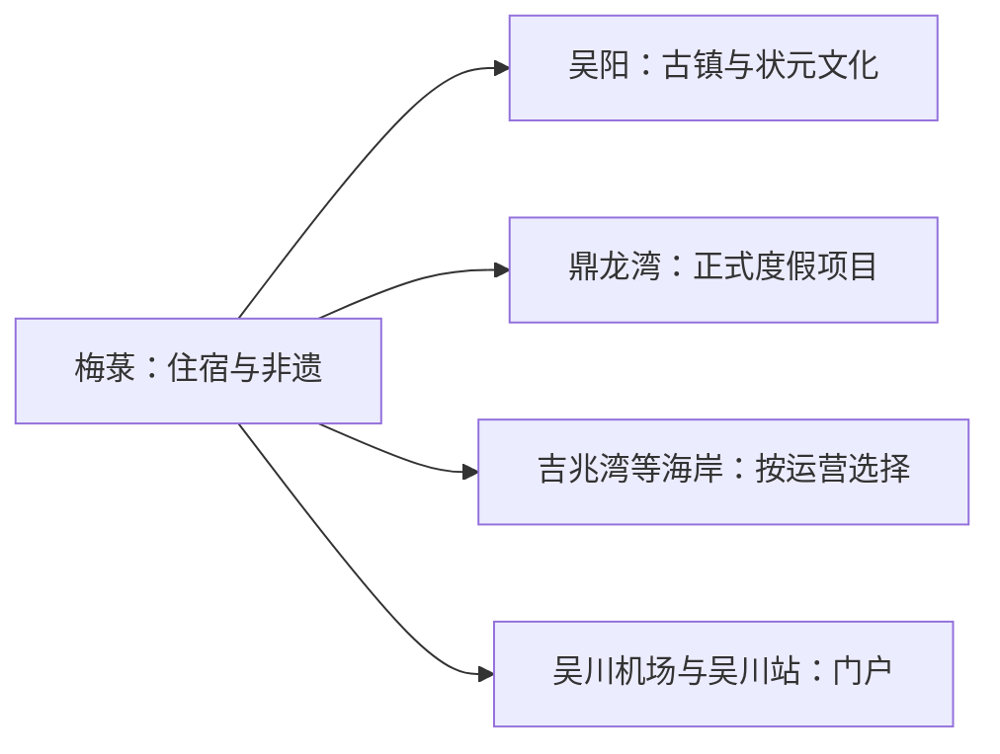
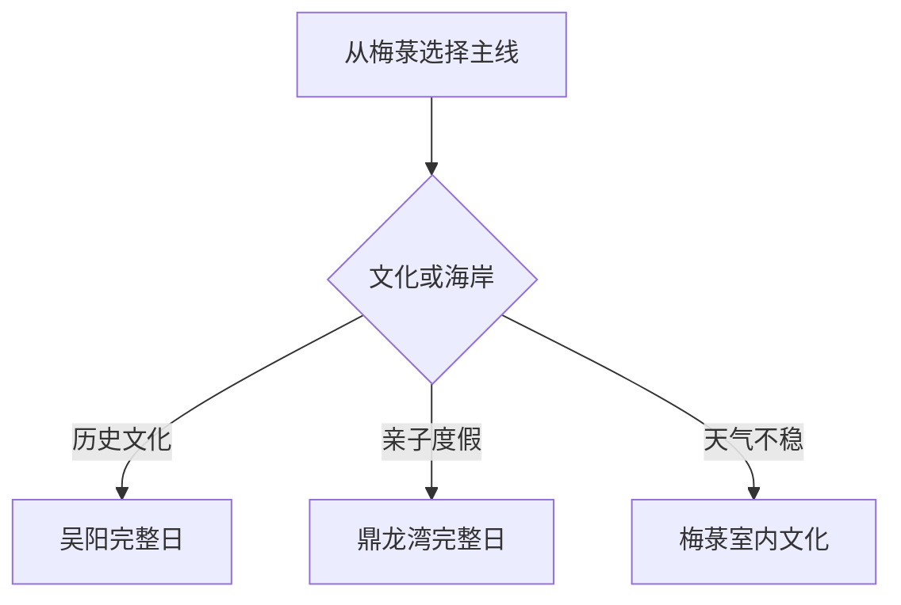

# 吴川旅行指南

吴川适合从梅菉主城出发，在吴阳历史文化和滨海度假之间做选择：吴阳看状元故里、古水道与传统街镇，鼎龙湾等正式运营海岸项目适合完整一天，梅菉则以飘色、月饼和粤西城市生活作串联。机场、高铁和海岸都提高了到达便利，但落地后仍要按具体片区安排车辆。

> 建议停留：2–3 天 
> 旅行关键词：吴阳古镇、状元文化、飘色、鼎龙湾、月饼、粤西海岸 
> 主要体力：低至中等 
> 最近研究：2026-08-13

## 城市速览

| 项目 | 旅行信息 |
|---|---|
| 主要旅行价值 | 以梅菉非遗、吴阳历史名镇和正式滨海度假构成三条不同体验线 |
| 建议停留 | 2 天覆盖吴阳与一处海岸；3 天增加梅菉文博和非遗 |
| 较舒适季节 | 秋冬春适合古镇海岸；夏秋重点关注台风和高温 |
| 预算特点 | 主城较低；度假区、车辆和海上项目增加预算 |
| 步行强度 | 古镇低至中，海岸按项目变化 |
| 主要天气风险 | 台风、暴雨、高温、雷暴、风浪和风暴潮 |
| 独行旅行 | 主城方便；海岸线先确认返程 |
| 亲子旅行 | 文化展陈和正式度假区适龄项目可选 |
| 长者与低体力旅行 | 吴阳文化点和海岸平缓短段可车辆连接 |
| 无障碍信息 | 机场和现代度假设施可咨询；古镇、村落与沙滩设施连续性需向官方确认 |

## 城市格局与游览区域

吴川市是湛江市代管的县级市，法定代码 `440883`。GeoNames `1800829` 与 Wikidata `Q690255` 精确对应。梅菉是行政、商业和住宿中心，吴阳位于鉴江出海口南侧，鼎龙湾等滨海项目沿南部海岸展开；湛江吴川机场位于市域内，但到梅菉、吴阳和各海岸入口仍需地面接驳。

| 区域 | 主要内容 | 怎么安排 | 与其他区域的关系 |
|---|---|---|---|
| 梅菉主城 | 住宿、餐饮、非遗与城市生活 | 半日至一天 | 全市交通基地 |
| 吴阳镇 | 历史名镇、状元故里、文化客厅与古水道 | 半日至一天 | 与滨海可同方向分段 |
| 鼎龙湾正式运营区 | 沙滩、度假与当期娱乐 | 完整一天 | 票务和项目独立 |
| 吉兆湾等海岸 | 海岸景观和季节项目 | 选一个开放入口 | 按风浪和运营决定 |
| 机场、铁路门户 | 吴川机场、吴川站及道路接驳 | 抵离日 | 站名不代表已到景点 |

## 主要景点

### 历史文化与非遗

| 景点 | 区域 | 类型 | 主要看点 | 建议用时 | 室内外 | 体力 | 预约风险 | 天气影响 | 优先级 |
|---|---|---|---|---:|---|---|---|---|---|
| 吴阳历史文化镇区 | 吴阳镇 | 古镇与文物 | 状元故里、古城门、古水道与历史街巷 | 3–5 小时 | 混合 | 中 | 高 | 高 | A |
| 吴阳镇文化客厅 | 吴阳镇 | 公共文化与地方史 | 古砖、碑刻、生活器物和当期展览 | 1–2 小时 | 室内 | 低 | 很高 | 低 | A |
| 吴川市公共文化与非遗展陈 | 梅菉 | 公共文化 | 飘色、泥塑、花桥和月饼文化 | 1–2 小时 | 室内 | 低 | 很高 | 低 | B |
| 名人故居正式开放点 | 市域镇村 | 名人文化 | 林召棠、陈兰彬等地方人物线索 | 1–2 小时 | 混合 | 低 | 很高 | 中 | B |

### 海岸与度假

| 景点 | 区域 | 类型 | 主要看点 | 建议用时 | 室内外 | 体力 | 预约风险 | 天气影响 | 优先级 |
|---|---|---|---|---:|---|---|---|---|---|
| 鼎龙湾国际海洋度假区 | 南部海岸 | 滨海度假 | 海岸、度假设施和当期主题项目 | 一天 | 混合 | 中 | 高 | 很高 | A |
| 吉兆湾正规开放区域 | 东部海岸 | 海岸与休闲 | 沙滩、海景和季节运营项目 | 半日至一天 | 室外 | 中 | 很高 | 很高 | B |
| 吴阳金海岸公开区域 | 吴阳镇 | 海岸与田园 | 鉴江入海口、沙滩与滨海田园 | 2–3 小时 | 室外 | 中 | 很高 | 很高 | B |

吴阳历史点分布在真实镇区和村落生活空间，宜按公开场馆与公共道路慢游。海岸以有救生、运营和公告的入口为主；渔港、养殖区、海堤工程、风电和施工岸线遵循生产及安全边界。

## 美食与餐饮

| 菜品或餐饮类型 | 常见区域 | 一个人用餐与常见份量 | 风味、过敏原与饮食限制 | 排队风险与替代方法 |
|---|---|---|---|---|
| 吴川月饼 | 梅菉及全市 | 个头常较大，适合分享 | 小麦、蛋、坚果、芝麻和猪肉常见 | 看配料与保质期，选正规产品 |
| 烂镬炒粉 | 梅菉、吴阳 | 一盘一人或两人分享 | 米制品，酱料可能含大豆、海鲜和猪油 | 正餐高峰找普通粉店 |
| 马鲛鱼丸与海鲜 | 主城、海岸 | 鱼丸可小份，整鱼适合多人 | 鱼、虾、贝类和蛋白过敏需确认 | 先问时价、重量和加工费 |
| 粤西糖水与小吃 | 梅菉 | 小份易尝试 | 糖、乳、花生、芝麻和椰制品常见 | 市场和居民区有同类替代 |

## 经典行程

### 一日经典路线

**路线**：梅菉出发 → 吴阳文化客厅 → 状元故里与历史镇区 → 午餐与休息 → 吴阳公开海岸短段 → 返回

- **串联逻辑**：吴阳的历史、村落和海岸在同一方向，适合分段慢游。
- **预约锚点**：文化客厅、故居和展陈开放。
- **休息安排**：午间在吴阳镇区室内餐饮长休。
- **时间不足时**：保留文化客厅和历史镇区。

### 两日城市路线

**第 1 天**：吴阳历史文化完整日 
**第 2 天**：鼎龙湾或一处正规海岸项目

- **串联逻辑**：文化与度假分日，避免把两个大尺度方向压缩。
- **预约锚点**：第二天门票、住宿或水上项目。
- **休息安排**：连续住梅菉或第二晚住度假区。
- **时间不足时**：第二天只保留海岸平缓短段。

### 三日深度路线

**第 1 天**：梅菉公共文化与非遗 
**第 2 天**：吴阳镇 
**第 3 天**：鼎龙湾或吉兆湾二选一

- **串联逻辑**：主城、历史镇和海岸分别成日。
- **预约锚点**：非遗活动、吴阳场馆和海岸运营逐日确认。
- **休息安排**：主城日低强度，海岸日留防晒和午休。
- **时间不足时**：删第一天补充，保留吴阳与海岸。

### 雨天路线

**路线**：梅菉公共文化场馆 → 午餐 → 吴阳文化客厅或主城室内休息

- **适用条件**：普通降雨可行；台风和暴雨预警时留在安全室内。
- **预约锚点**：场馆开放和道路积水。
- **休息安排**：两段之间安排完整午休。
- **时间不足时**：只保留一个确认开放的场馆。

### 亲子或低体力路线

**亲子路线**：吴阳文化客厅 → 午餐 → 正式度假区一个适龄板块 
**低体力路线**：车辆到吴阳核心文化点 → 长休 → 梅菉公共文化场馆

- **减负方式**：亲子线一次只选一个付费项目；低体力线减少沙滩、古巷和长距离步行。
- **预约锚点**：儿童身高、救生、电梯和停车。
- **休息安排**：午间安排空调空间。
- **时间不足时**：两类路线都保留吴阳文化客厅。

### 远郊一日路线

**路线**：梅菉 → 鼎龙湾正式运营区 → 午餐与休息 → 海岸短段 → 返回或住度假区

- **适用条件**：天气、票务、风浪和返程均已确认。
- **预约锚点**：度假区门票、适龄项目和退改。
- **休息安排**：中午回游客中心或室内餐饮。
- **时间不足时**：只保留一个核心板块，减少园内转场。

## 住宿区域

| 区域 | 优点 | 缺点 | 适合人群 | 交通特点 |
|---|---|---|---|---|
| 梅菉主城 | 餐饮、价格和跨区交通选择多 | 去海岸需车辆 | 首访、无车与多日旅行 | 便于连接吴川站和各镇 |
| 吴阳镇区 | 方便历史文化慢游 | 夜间住宿选择较少 | 摄影、古镇和在地文化旅行 | 先确认返程与正式住宿 |
| 鼎龙湾等度假区 | 海岸项目和亲子设施集中 | 价格、餐饮和运营波动大 | 度假、亲子与慢游 | 与主城、机场仍需接驳 |

## 市内交通

吴川站、湛江吴川机场和公路客运共同承担到发。机场位于吴川市域，前往梅菉、吴阳或海岸仍要按目的地选择机场巴士、出租车、网约车或预约车辆。主城公交适合日常移动，跨镇与海岸路线更适合当期专线或合规车辆。

| 场景 | 建议与取舍 | 行前需要重查的内容 |
|---|---|---|
| 机场抵达 | 直接按住宿或景区地址选接驳 | 航班、机场巴士、夜间上客点 |
| 铁路抵达 | 吴川站后转公交或短途车 | 车次、站前交通和末班 |
| 吴阳与海岸 | 每天只选一条主线 | 返程、停车、台风和活动管制 |
| 自驾 | 适合分散镇区 | 滨海道路、积水、停车和疲劳驾驶 |

## 不同旅行者须知

| 旅行维度 | 可行条件 | 主要取舍 | 需额外核对 |
|---|---|---|---|
| 独行旅行 | 住梅菉并白天往返 | 海岸选有明确返程的一处 | 夜间上客点与通信 |
| 亲子旅行 | 正式度假项目规则清楚 | 文化、沙滩和乐园一次选一类 | 身高、救生和退改 |
| 长者或低体力旅行 | 车辆连接吴阳文化点 | 沙滩和古巷只走短段 | 台阶、遮阴、座椅和卫生间 |
| 无障碍需求 | 机场和现代设施可咨询 | 古镇与沙滩连续动线有限 | 设施连续性需向官方确认 |
| 摄影旅行 | 飘色、古镇和海岸题材丰富 | 尊重仪式、居民与渔业作业 | 无人机、肖像与商业拍摄 |
| 台风季 | 主城室内路线可替换 | 海岸项目按预警和运营调整 | 风浪、闭园、航班和道路积水 |

## 行前核对

| 核对事项 | 为什么需要重查 | 建议核对时间 | 官方入口 |
|---|---|---|---|
| 吴阳场馆与故居 | 场馆、村落活动和修缮会变化 | 到访前一周 | [吴川市人民政府](https://www.gdwc.gov.cn/) |
| 鼎龙湾、吉兆湾等海岸 | 票务、项目和风浪条件变化快 | 购票前及当天 | [吴川旅游栏目](https://www.gdwc.gov.cn/bmzz/wcsrmzfw/zjwc/xxly/jply/mindex.html) |
| 航空、铁路与公交 | 航班、班次和接驳会调整 | 出发前一周及当天 | [湛江吴川机场](https://www.zhanjiang-airport.com/)；[中国铁路12306](https://www.12306.cn/) |
| 台风、海况与道路 | 风暴潮、暴雨和积水影响海岸 | 出发前三日及当天 | [广东省气象局](http://gd.cma.gov.cn/) |

## 来源与更新记录

### 主要来源

| 来源 | 类型 | 支持内容 | 核验日期 |
|---|---|---|---|
| [吴川市政府：吴阳高质量发展](https://www.gdwc.gov.cn/bmzz/wcsrmzfw/zwgk/wcdt/gab/zjdt/content/post_1862627.html) | 市政府 | 历史名镇、状元故里、古水道和文物点 | 2026-08-13 |
| [吴阳镇文化客厅](https://www.gdwc.gov.cn/downpc/bmdh/jd/wy/gzdt/content/post_2151706.html) | 镇政府 | 场馆、古砖、碑刻与地方展陈 | 2026-08-13 |
| [吴阳全域土地整治](https://www.gdwc.gov.cn/zjwczrzy/gkmlpt/content/2/2056/post_2056235.html) | 市自然资源局 | 历史名镇、农业与滨海文旅空间 | 2026-08-13 |
| [湛江市政府：2025吴川文旅](https://www.zhanjiang.gov.cn/qxdt/content/post_2134669.html) | 地级市政府 | 吴阳、鼎龙湾、吉兆湾、非遗与美食 | 2026-08-13 |
| [吴川市旅游栏目](https://www.gdwc.gov.cn/bmzz/wcsrmzfw/zjwc/xxly/jply/mindex.html) | 市政府 | 景区、活动与动态核对入口 | 2026-08-13 |
| [湛江市政府：吴阳历史文化名镇与精品游线](https://www.zhanjiang.gov.cn/zjsfw/bmdh/whgdj/zwgk/gzdt/content/post_1535078.html) | 市文化广电旅游体育局 | 吴阳状元文化、古驿道与精品游线 | 2026-08-13 |
| [GeoNames 1800829](https://www.geonames.org/1800829/wuchuan.html) | 开放地名数据 | 固定点标识 | 2026-08-13 |
| [Wikidata Q690255](https://www.wikidata.org/wiki/Q690255) | 开放结构化数据 | 法定吴川市与P1566精确映射 | 2026-08-13 |

### 更新记录

| 日期 | 更新内容 |
|---|---|
| 2026-08-13 | 首次完成吴川主城、吴阳、海岸、交通、非遗和保护生产边界研究 |
