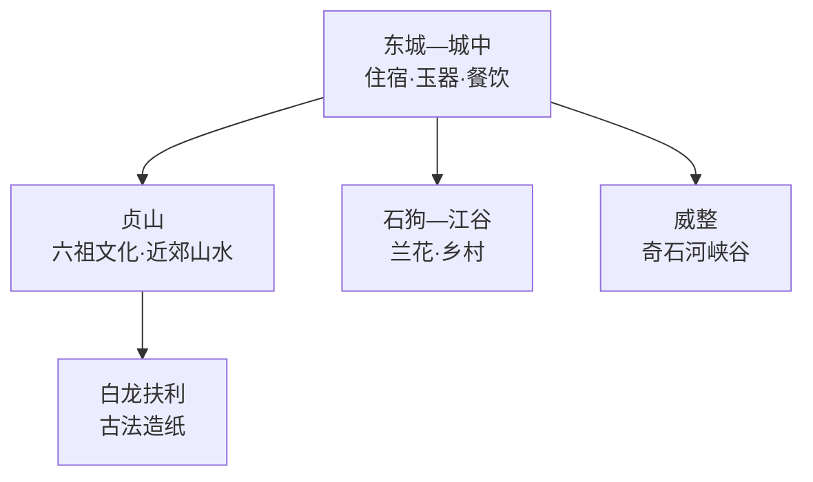
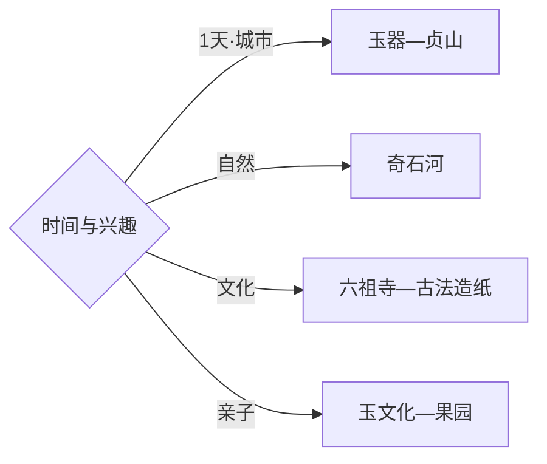

# 四会旅行指南

四会位于广佛肇都市圈西部，最适合按三条主题选线：东城—城中看玉器产业与城市生活，贞山走六祖文化和近郊山水，威整奇石河安排完整的瀑布峡谷日。固定快照中的 **Dongcheng / GeoNames 6970623** 对应现行市政府驻地东城街道，坐标与四会主城闭合；肇庆端州、广宁和三水均按跨县市行程计算。

> 建议停留：2–3 天\
> 旅行关键词：玉器、贞山、六祖文化、奇石河、古法造纸\
> 主要体力：主城低；贞山中等；奇石河中等至较高\
> 最近研究：2026-09-03

## 城市速览

| 项目 | 旅行信息 |
|---|---|
| 主要旅行价值 | 用玉器产业理解当代四会，再连接贞山宗教文化、绥江水系和北部峡谷 |
| 建议停留 | 2天覆盖主城—贞山与奇石河；增加古法造纸或乡村线可安排3天 |
| 较舒适季节 | 秋冬较清爽；春夏瀑布水量更有看点，同时需关注暴雨、雷电和高温 |
| 预算特点 | 主城消费温和，景区票务、跨镇车辆和周末住宿是主要变量 |
| 步行强度 | 玉器街区较低；贞山有坡路；奇石河按项目组合增加台阶和体力 |
| 主要天气风险 | 高温、雷暴、短时强降雨、山洪与台风外围影响 |
| 独行旅行 | 主城较方便，北部远线先落实返程 |
| 亲子旅行 | 玉文化场馆、桔园公开项目和奇石河成熟游线较易组合 |
| 长者与低体力旅行 | 选择东城—玉器场馆—贞山山脚短线 |
| 无障碍信息 | 新建商业场馆相对友好，寺院、乡村和峡谷连续性需逐点确认 |

## 城市格局与游览区域

| 区域 | 主要内容 | 游览特点 | 与其他区域的关系 |
|---|---|---|---|
| 东城—城中 | 玉博城、翡翠城、城市公共文化与餐饮 | 室内外可切换，适合抵达日 | 作为各方向住宿和车辆起点 |
| 贞山 | 六祖寺、贞山风景与山前休闲 | 宗教空间与山路并存 | 可与主城组成一日 |
| 白龙扶利 | 古法造纸及公开体验 | 以预约、传承展示和村落礼仪为先 | 适合作为贞山线的半日扩展 |
| 石狗—江谷 | 兰花、柑桔与乡村公开项目 | 花期、果期和活动季节性强 | 按当期接待点选一处即可 |
| 威整 | 奇石河瀑布峡谷景区 | 距主城较远，适合完整一天 | 自驾或正规车辆更易执行 |

## 主要景点

| 景点 | 区域 | 类型 | 主要看点 | 建议用时 | 室内外 | 体力 | 预约风险 | 天气影响 | 优先级 |
|---|---|---|---|---:|---|---|---|---|---|
| 四会玉博城 | 东城 | 产业与商业 | 玉器品类、加工贸易与当代城市产业 | 2–3小时 | 室内 | 低 | 低 | 低 | A |
| 万兴隆翡翠城等正规玉器场馆 | 主城 | 产业体验 | 翡翠展示、选购与工艺观察 | 2–3小时 | 室内 | 低 | 活动期中 | 低 | A |
| 贞山风景区正式开放区 | 贞山 | 山水与人文 | 岭南山水、贞仙祠与山前休闲 | 半天 | 混合 | 中 | 中 | 高 | A |
| 六祖寺公开区域 | 贞山 | 宗教建筑 | 六祖文化、寺院空间与礼仪 | 1–2小时 | 混合 | 低中 | 法会期中 | 中 | A |
| 奇石河景区 | 威整镇 | 峡谷与瀑布 | 瀑布、奇石、森林与运营体验项目 | 1天 | 室外 | 中高 | 节假日高 | 很高 | A |
| 白龙扶利古法造纸公开体验 | 贞山方向 | 非遗与村落 | 竹纸工艺与乡村文化 | 2–3小时 | 混合 | 低 | 高 | 中 | B |
| 桔子景区或当季柑桔项目 | 乡村方向 | 农业体验 | 四会柑桔、果园景观与亲子活动 | 半天 | 室外 | 低 | 季节高 | 高 | B |
| 石狗兰花公开展示点 | 石狗镇 | 花卉产业 | 兰花种植、展示与乡村产业 | 2–3小时 | 混合 | 低 | 活动期中 | 中 | C |

## 美食与餐饮

| 菜品或餐饮类型 | 常见区域 | 一个人用餐与常见份量 | 风味、过敏原与饮食限制 | 排队风险与替代方法 |
|---|---|---|---|---|
| 茶油鸡 | 主城、奇石河方向 | 多为共享菜，独行可问小份或套餐 | 鸡肉、茶油和酱料按口味选择 | 景区餐厅繁忙时回镇区用餐 |
| 四会濑粉 | 主城市场与早餐店 | 单碗友好 | 米浆制品，配料可能含肉、花生和葱 | 早餐选择多，热门老店可换同街区店 |
| 文庆鲤等西江水产 | 正规餐馆 | 多按条计价，适合多人 | 鱼刺、来源和称重方式先确认 | 选明码标价门店，也可改常见养殖鱼 |
| 柑桔与果品 | 市场、正规采摘点 | 单份易购 | 按个人血糖和酸度耐受选择 | 以当季成熟度为准，采摘先问计价 |
| 广府家常菜 | 东城、城中 | 独行可点烧味饭、汤粉或小炒 | 蚝油、花生、海鲜等过敏原先询问 | 商圈选择多，错峰用餐即可 |

## 经典行程

### 一日经典路线

**路线**：四会玉博城 → 主城午餐 → 贞山风景区 → 六祖寺公开区域

- **串联逻辑**：上午看当代玉器产业，下午进入贞山人文与山水。
- **预约锚点**：玉器场馆活动、贞山及寺院开放。
- **休息安排**：主城午餐，贞山游客服务区补给。
- **时间不足时**：保留玉器场馆和六祖寺，缩短登山段。

### 两日城市路线

**第 1 天**：东城—城中玉器场馆 → 贞山。\
**第 2 天**：奇石河景区完整游览日。

- **串联逻辑**：城市文化与北部峡谷分日，减少长距离折返。
- **预约锚点**：奇石河票务、运营项目与车辆。
- **休息安排**：两晚住主城；远线在景区正规服务点休息。
- **时间不足时**：第二日只走核心瀑布游线。

### 三日深度路线

**第 1 天**：玉器产业与主城。\
**第 2 天**：贞山—六祖寺—白龙扶利。\
**第 3 天**：奇石河，或按季节选择石狗—江谷乡村线。

- **串联逻辑**：产业、人文非遗与自然乡村各占一天。
- **预约锚点**：古法造纸接待、果园活动和奇石河运营。
- **休息安排**：主城连住，远线带足饮水并预留返程。
- **时间不足时**：先删第三日季节项目，再删白龙扶利。

### 雨天路线

**路线**：玉博城 → 翡翠城或正规玉文化展陈 → 主城餐饮与公共文化空间

- **适用条件**：普通降雨采用室内产业线；暴雨预警时取消峡谷和山地。
- **预约锚点**：场馆营业与活动。
- **休息安排**：商场、展馆和主城餐饮点。
- **时间不足时**：只选一处综合性玉器场馆深度参观。

### 亲子或低体力路线

**亲子路线**：玉文化场馆 → 主城午餐 → 当季正规果园或贞山山脚。\
**低体力路线**：东城玉器场馆 → 六祖寺平缓公开区 → 主城休息。

- **减负方式**：以车辆连接，山地只走游客服务完善的短段。
- **预约锚点**：亲子活动、采摘接待和停车。
- **休息安排**：主城、游客中心和正规乡村接待点。
- **时间不足时**：保留玉器场馆，户外点作为弹性项。

### 奇石河一日路线

**路线**：主城早出发 → 奇石河核心瀑布与峡谷游线 → 景区午餐 → 按体力选择运营项目 → 返回

- **适用条件**：适合天气、道路和景区开放稳定的日期。
- **预约锚点**：票务、玻璃桥或滑道等项目、返程车辆。
- **休息安排**：游客中心与正式休息区分段补给。
- **时间不足时**：保留自然景观主线，游乐项目按体力删减。

### 六祖文化与非遗路线

**路线**：贞山风景区 → 六祖寺公开区域 → 白龙扶利古法造纸预约体验

- **串联逻辑**：用同一方向串联宗教文化、山水与竹纸技艺。
- **预约锚点**：寺院活动、非遗传承点接待和车辆。
- **休息安排**：贞山游客区和村落正规接待点。
- **时间不足时**：保留六祖寺，非遗体验改为预约后另行安排。

## 住宿区域

| 区域 | 优点 | 缺点 | 适合人群 | 交通特点 |
|---|---|---|---|---|
| 东城主城 | 商业、玉器和道路交通集中 | 周末部分商圈较繁忙 | 首访、独行、购物主题旅行者 | 连接高速与贞山较方便 |
| 城中老城 | 地方餐饮和城市生活感较强 | 新式住宿选择少于东城 | 慢游与预算旅行者 | 适合步行和短程打车 |
| 贞山正规住宿 | 靠近寺院和山水 | 夜间餐饮选择较少 | 周末度假、低节奏旅行者 | 前往北部远线仍需车辆 |
| 奇石河周边正规住宿 | 便于峡谷早入园 | 与主城距离长 | 自驾、自然主题旅行者 | 订房前核对具体位置和返程 |

## 市内交通

| 场景 | 建议与取舍 | 行前需要重查的内容 |
|---|---|---|
| 从广州、佛山或肇庆抵达 | 公路交通为主，先确定到东城主城还是远线景区 | 客运站点、班次、高速施工与末班 |
| 主城—贞山 | 公交、出租或自驾均可，适合当日往返 | 景区停车、寺院活动与返程 |
| 主城—奇石河 | 距离较长，优先正规车辆并留完整白天 | 道路、票务、天气与最晚返程 |
| 乡村项目 | 每天选择同一方向一至两点 | 接待时间、采摘季、停车和补给 |

## 不同旅行者须知

| 旅行维度 | 可行条件 | 主要取舍 | 需额外核对 |
|---|---|---|---|
| 独行旅行 | 主城餐饮住宿完善 | 奇石河与乡村返程选择较少 | 末班、叫车覆盖与接驳 |
| 亲子旅行 | 玉文化、果园和成熟景区可组合 | 高温与峡谷台阶消耗体力 | 儿童规则、护栏与休息点 |
| 长者或低体力旅行 | 主城—寺院短线负担较低 | 登山和峡谷项目较重 | 坡度、接驳和卫生间 |
| 无障碍需求 | 新建商业场馆优先 | 寺院、村落与峡谷连续性有限 | 电梯、坡道和无障碍入口 |
| 摄影旅行 | 玉器工艺、寺院与瀑布题材丰富 | 商业及宗教场所拍摄规则不同 | 展柜反光、人物同意与航拍 |
| 预算有限 | 主城公交与街区成本较稳 | 远线车辆和景区票务增加支出 | 套票、退改与拼车 |
| 晚出发或紧凑行程 | 玉器场馆可做半日 | 奇石河适合完整白天 | 营业时间与最晚入园 |
| 特殊天气或自然条件 | 普通小雨适合主城室内线 | 暴雨、雷电和台风影响山地 | 气象、景区与道路公告 |

宗教场所按开放区域和礼仪参访，玉器加工、直播、仓储与交易后场以经营主体许可为准。奇石河、绥江支流和山林按景区游线、防汛与森林防火要求活动；村落、兰园、果园和古法造纸作坊同时承担生活生产功能，选择明确开放的接待区域。

## 行前核对

| 核对事项 | 为什么需要重查 | 建议核对时间 | 官方入口 |
|---|---|---|---|
| 玉器场馆营业与活动 | 商业展会、直播和加工参观安排会变化 | 到访前一日 | [四会市人民政府](https://www.sihui.gov.cn/) |
| 贞山与六祖寺开放 | 法会、维护和防火会调整游线 | 出发前一周及当天 | [四会市人民政府](https://www.sihui.gov.cn/) |
| 奇石河票务与项目 | 天气、设备维护和客流会影响运营 | 购票前及当天 | [奇石河景区](https://www.qishihe.cn/) |
| 暴雨、台风与山洪 | 峡谷和山地对强天气敏感 | 出发前三日及当天 | [广东省气象局](https://gd.cma.gov.cn/) |
| 公路客运与远线接驳 | 班次、站点和返程可能调整 | 购票前及当天 | [广东省交通运输厅](https://td.gd.gov.cn/) |

## 来源与更新记录

### 主要来源

| 来源 | 类型 | 支持内容 | 核验日期 |
|---|---|---|---|
| [四会市人民政府](https://www.sihui.gov.cn/) | 政府 | 市域管理、公共服务与动态公告入口 | 2026-09-03 |
| [增城区政府：2026增城—四会农文旅交流季](https://www.zc.gov.cn/zx/bmdt/qwhgdlytyj/content/post_10898233.html) | 政府 | 奇石河、桔子景区、贞山六祖寺与玉博城线路 | 2026-09-03 |
| [四会市政府来源：奇石河项目](https://gdxk.southcn.com/zq/shsk/zdgcxmzl/content/post_506164.html) | 政务资料 | 奇石河景区位置、建设与运营内容 | 2026-09-03 |
| [GeoNames 6970623](https://www.geonames.org/6970623/) | 开放数据 | Dongcheng 固定人口点、坐标与行政代码 | 2026-09-03 |

### 更新记录

| 日期 | 更新内容 |
|---|---|
| 2026-09-03 | 首次完成资料研究、空间拆分、七条路线与县级市映射 |
