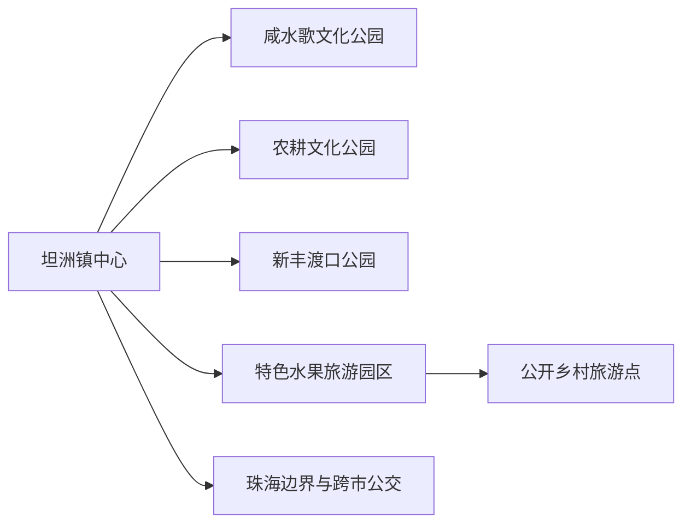
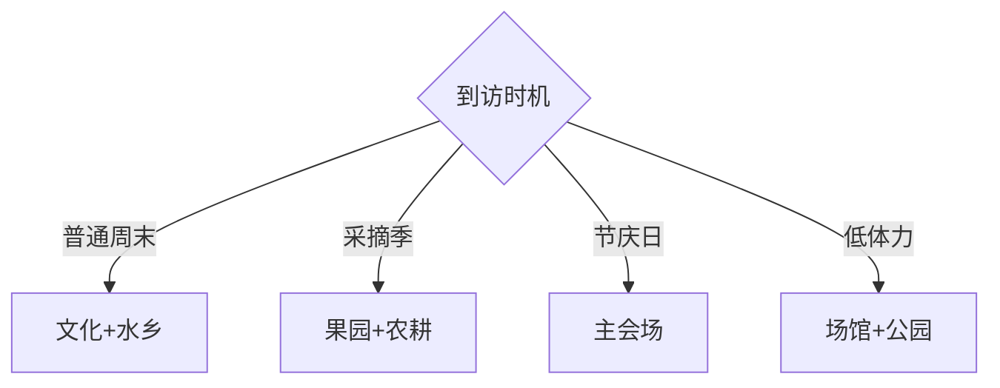

# 坦洲镇旅行指南

坦洲位于中山市最南端，与珠海连续相接，旅行重点是磨刀门水乡、咸水歌、特色水果与公开农业线路。这里适合按活动和季节安排一至两天：普通周末选择水乡公园、文旅场馆和果园，咸水歌、龙舟或非遗巡游期间则围绕官方主会场行动。

## 城市速览

| 项目 | 信息 |
|---|---|
| 主线 | 坦洲城区—咸水歌文化—金斗湾水乡—特色水果园—公开乡村线路 |
| 停留 | 常规1天；遇非遗节庆、采摘季或深度乡村可住1晚 |
| 住宿 | 镇中心便于餐饮公交；南坦路方向利于珠海联程；正规乡村住宿适合活动日 |
| 交通 | 中山与珠海公交、公路连接紧密，镇内用公交、出租车或骑行短段 |
| 风险 | 台风暴雨、低洼积水、高温雷雨、河涌岸线与农路交通 |
| 边界 | 河涌、水产养殖、果园、产业园、码头与跨市行政边界按公开接待和管理范围进入 |

## 城市格局与游览区域

固定 **Tanzhou / GeoNames 1913154** 对应现行坦洲镇，镇级实体为 `Q10928810`。中山市实行市直接管理镇街的结构，坦洲镇政府距石岐中心城区约38公里，并与珠海前山、南屏和斗门相邻；本页只覆盖坦洲行政范围和正式旅游点，珠海景点另行规划。制造业平台与水产农业规模大，公众旅游入口和生产空间需要明确区分。

## 主要景点

| 景点 | 区域 | 类型 | 核心体验 | 用时 | 环境 | 体力 | 研究价值 | 拥挤 | 优先级 |
|---|---|---|---|---:|---|---|---|---|---|
| 咸水歌文化公园与正式展演 | 坦洲镇 | 非遗公园 | 水乡歌谣、社区表演与地方身份 | 1.5–3小时 | 混合 | 低 | 很高 | 活动时高 | A |
| 创益文化园正式开放区 | 镇内 | 文化园区 | 本地展览、研学与文创活动 | 2–4小时 | 混合 | 低至中 | 高 | 活动时高 | A |
| 农耕文化公园 | 乡村片区 | 农业文化 | 沙田农业、水乡生产与公共景观 | 1.5–3小时 | 室外 | 低至中 | 高 | 中 | B |
| 新丰渡口公园 | 河涌沿线 | 滨水公园 | 渡口记忆、水网与岭南生活 | 1–2小时 | 室外 | 低 | 中 | 中 | B |
| 正式特色水果旅游园 | 镇内农业区 | 农业体验 | 番石榴、火龙果、柑橙等季节采摘 | 2–4小时 | 室外 | 中 | 高 | 旺季高 | A |
| 乡村旅游精品线路公开点 | 镇内村居 | 水乡乡村 | 河涌、村落、农田与地方餐饮 | 半日至1天 | 混合 | 中 | 高 | 活动时高 | B |
| 坦洲非遗大巡游或龙舟主会场 | 当期公告地点 | 节庆活动 | 醒狮、龙舟、咸水歌与社区节庆 | 半日至1天 | 室外 | 中高 | 很高 | 很高 | B |
| 铁炉山体育公园开放区域 | 南部组团 | 体育公园 | 城郊绿地与轻运动 | 1.5–3小时 | 室外 | 中 | 中 | 中 | C |

## 美食与餐饮

坦洲可从水乡鱼菜、海鲜、番石榴、火龙果和广府家常菜入手，镇中心更容易找到小份与稳定营业门店。水产按来源、重量和做法计价，关注鱼刺、甲壳类过敏与禁捕规定；采摘水果先问品种、单价、成熟度和能否现场食用，清洗后再吃。

## 经典行程

### 一日基础线
**路线**：创益文化园—咸水歌文化公园—农耕文化公园—镇中心餐饮。**逻辑**：从文化进入水乡生产。**预约锚点**：场馆和活动。**休息**：镇中心。**删除条件**：高温时缩短农耕公园。

### 咸水歌非遗线
**路线**：文化展陈—咸水歌正式演出—新丰渡口公园。**逻辑**：先了解音乐背景，再回到水网环境。**预约锚点**：演出日期与座席。**休息**：公园或场馆。**删除条件**：无演出时保留展陈与河涌短段。

### 水果采摘线
**路线**：镇中心—已预约果园—农耕文化公园—返程。**逻辑**：按成熟季节体验农业。**预约锚点**：品种、价格和采摘时段。**休息**：果园服务区。**删除条件**：暴雨、高温或园方休耕时取消。

### 水乡慢游线
**路线**：新丰渡口公园—公开村居—乡村旅游点。**逻辑**：沿公共空间认识河涌与沙田。**预约锚点**：导览、午餐和返程。**休息**：村级服务点。**删除条件**：水位或道路管控时留镇中心。

### 节庆现场线
**路线**：官方接驳点—主会场—固定观众区—镇中心。**逻辑**：围绕一个正式活动安排交通。**预约锚点**：报名、安检和管制。**休息**：主办方服务区。**删除条件**：赛事或演出取消时改文化园。

### 中珠联程线
**路线**：坦洲半日文化—跨市公交或车辆—珠海住宿。**逻辑**：以行政边界分开两地景点。**预约锚点**：跨市班次与住宿。**休息**：镇中心。**删除条件**：拥堵或台风时当天只留一城。

### 低体力线
**路线**：车辆到创益文化园—咸水歌公园短段—镇中心餐饮。**逻辑**：以室内、车辆和座席控制步行。**预约锚点**：无障碍与落客。**休息**：每站。**删除条件**：高温或拥挤时只留场馆。

## 住宿区域

坦洲镇中心适合公交、餐饮和节庆散场；南坦路、界狮路方向适合珠海联程；正规乡村住宿适合早晨采摘或连续活动。订房时核对行政地址是中山坦洲还是珠海、跨市公交、停车、防潮与台风退改，地图上的近距离可能对应不同城市交通体系。

## 市内交通

坦洲有镇内、跨镇和跨市公交，连接中山主城区、三乡、神湾及珠海部分片区；线路与响应式服务会调整。镇内水网与产业道路让直线距离不等于实际路程，果园和村居末段先向运营方确认。节庆、龙舟和暴雨水情会改变道路、桥梁与观众入口。

## 不同旅行者须知

非遗兴趣者按咸水歌和巡游日期到访；亲子家庭选择果园、农耕公园和场馆；骑行者使用公开道路并避开大型车辆高峰；长者以镇中心一馆一园为主。水产养殖塘、农田、河涌岸坡、产业园、仓储装卸和码头作业区保持明确边界。

## 行前核对

- 核对文化园、非遗演出、果园、乡村项目、龙舟和巡游的日期、预约与计价。
- 核对镇内及跨市公交、节庆管制、台风暴雨、高温和河涌水位。
- 农业与水产体验只进入经营者明确开放区域，儿童临水活动由成人近距离陪同。

## 来源与更新记录

| 来源 | 支持内容 | 核验日期 |
|---|---|---|
| [坦洲镇政府：旅游导览](https://www.zs.gov.cn/tzz/zjtz/tptz/content/post_2608453.html) | 镇域位置、水网、农业、咸水歌、活动与旅游点 | 2026-09-01 |
| [坦洲镇政府：坦洲概况](https://www.zs.gov.cn/tzz/zjtz/index.html) | 磨刀门、珠海边界、面积与水乡历史 | 2026-09-01 |
| [坦洲镇政府：建设与文旅](https://www.zs.gov.cn/tzz/zjtz/lsyg/content/post_1315053.html) | 创益文化园、公园、非遗与道路结构 | 2026-09-01 |
| [坦洲镇政府：公交体系答复](https://www.zs.gov.cn/tzz/wgk/jcgk/content/post_2551954.html) | 镇内、跨镇与跨市公交 | 2026-09-01 |
| [坦洲镇“十四五”规划](https://www.zs.gov.cn/zstzz/gkmlpt/content/2/2136/post_2136695.html) | 咸水歌、水乡文化、休闲农业与跨区域交通 | 2026-09-01 |
| [GeoNames 1913154](https://www.geonames.org/1913154/) | Tanzhou 固定人口点 | 2026-09-01 |
| [Wikidata Q10928810](https://www.wikidata.org/wiki/Q10928810) | 坦洲镇实体与跨库标识 | 2026-09-01 |

| 日期 | 更新 |
|---|---|
| 2026-09-01 | 首次完成坦洲镇旅行研究；按水乡、咸水歌、农业、节庆和中珠边界组织。 |
