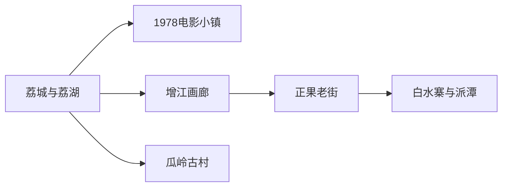
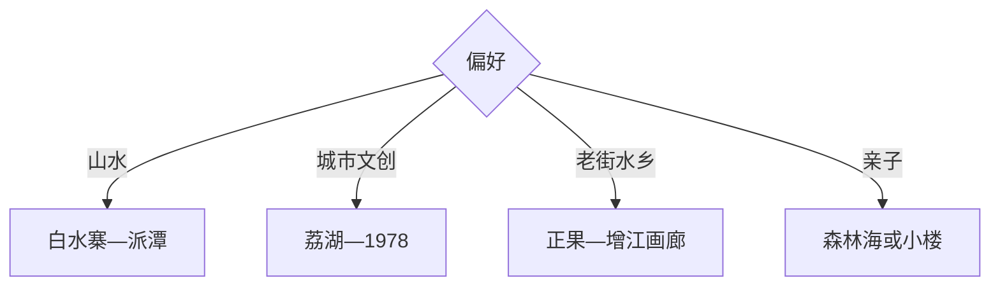

# 增城旅行指南

增城适合把广州东部的瀑布山地、增江水岸、岭南老街与温泉乡村组合起来：白水寨和派潭留完整一天，荔城—增江—1978电影小镇适合城市慢游，正果老街、瓜岭古村和荔枝季农旅可另成一线。

## 城市速览

| 项目 | 信息 |
|---|---|
| 主线 | 荔城—增江画廊—1978电影小镇—正果老街—白水寨—派潭温泉 |
| 停留 | 城区水岸1天；山地或乡村共2–3天 |
| 住宿 | 荔城交通餐饮方便，派潭适合白水寨温泉，正果适合乡村慢住 |
| 交通 | 从广州乘地铁、公路进入，区内远点用公交、旅游接驳、预约车或自驾 |
| 风险 | 夏季高温雷雨、瀑布水量、山地台阶、河岸水情与荔枝季拥堵 |
| 边界 | 水源保护区、林地封控段、温泉设备区、果园生产区和古村私宅按开放范围进入 |

## 城市格局与游览区域

固定 `Licheng / GeoNames 1803791` 对应增城荔城主城，本页以法定增城区 `Q189529` 组织。城区水岸与北部派潭距离较远，白水寨一天只搭配附近温泉或乡村点；正果与增江适合沿河串联。

## 主要景点

| 景点 | 区域 | 类型 | 核心体验 | 用时 | 环境 | 体力 | 预约风险 | 天气影响 | 优先级 |
|---|---|---|---|---:|---|---|---|---|---|
| 白水寨风景名胜区 | 派潭镇 | 瀑布山地 | 白水仙瀑、阶梯步道与森林 | 5–8小时 | 室外 | 高 | 极高 | 极高 | A |
| 1978电影小镇 | 增江街 | 工业更新与文创 | 老糖纸厂、影视文创与夜间休闲 | 2–5小时 | 室内外 | 低中 | 高 | 中 | A |
| 增江画廊公开段 | 增江沿线 | 滨水绿道 | 骑行、河景与岭南乡村 | 3–6小时 | 室外 | 中 | 高 | 很高 | A |
| 正果老街 | 正果镇 | 历史街区 | 岭南街巷、小吃与增江城镇 | 2–4小时 | 室外为主 | 低中 | 高 | 高 | A |
| 瓜岭古村公开区 | 新塘镇方向 | 水乡古村 | 清代民居、水道与侨乡建筑 | 2–4小时 | 室外 | 低中 | 中 | 高 | B |
| 荔湖与城区公共文化设施 | 荔城 | 城市湖区 | 湖岸、公园与区级展陈 | 3–5小时 | 室内外 | 低中 | 高 | 高 | B |
| 森林海旅游度假区 | 派潭镇 | 亲子度假 | 湖区、亲子项目与住宿 | 半日至1天 | 室内外 | 中 | 极高 | 很高 | B |
| 何仙姑景区或小楼人家公开点 | 小楼镇 | 民俗乡村 | 地方传说、祠庙与乡村农旅 | 3–5小时 | 室内外 | 低中 | 高 | 高 | B |

## 美食与餐饮

可按区域尝增城迟菜心、荔枝、正果云吞、濑粉、鱼面、艾糍和客家菜。荔枝与采摘跟随当年成熟期，果园先问品种、单价和可采范围；温泉酒店与老街餐饮提前比较套餐份量。

## 经典行程

### 一日经典线
**路线**：荔湖—区级展陈—1978电影小镇—增江夜景。**逻辑**：在主城范围完成水岸、文化与工业更新。**预约锚点**：展馆、活动与游船。**休息**：1978园区。**删除条件**：雷雨时缩短河岸段。

### 两日山水人文线
**路线**：首日荔城—1978；次日白水寨—派潭。**逻辑**：主城与北部高强度山地分日。**预约锚点**：白水寨、温泉和返程。**休息**：派潭。**删除条件**：暴雨或瀑布区关闭时改正果。

### 白水寨山地线
**路线**：游客中心—按体力选择瀑布步道—原路或规定线路返程。**逻辑**：用折返点控制台阶强度。**预约锚点**：开放、水量、接驳与装备。**休息**：步道服务点。**删除条件**：雷雨、山洪或高温预警时取消。

### 增江骑行线
**路线**：荔城—增江画廊公开绿道—正果老街。**逻辑**：沿水岸向北串联，自行车异地归还先确认。**预约锚点**：租车、绿道开放和返程。**休息**：正果。**删除条件**：高温大雨或水情异常时改公交。

### 古村老街线
**路线**：瓜岭古村—正果老街—地方小吃。**逻辑**：比较水乡民居与沿河市镇。**预约锚点**：古村展陈和停车。**休息**：正果。**删除条件**：节假日拥堵时只选一处。

### 亲子度假线
**路线**：森林海正规项目—午休—派潭住宿或返程。**逻辑**：围绕单一度假区减少转场。**预约锚点**：年龄、项目、住宿和天气。**休息**：度假区。**删除条件**：户外项目停运时改室内。

### 低体力线
**路线**：区级展陈—荔湖短段—1978电影小镇。**逻辑**：以平路、座椅和室内空间控制强度。**预约锚点**：无障碍、落客与展馆。**休息**：荔湖周边。**删除条件**：高温时只留室内。

## 住宿区域

荔城适合地铁、餐饮和城区水岸；派潭适合白水寨、温泉和度假；正果适合老街与增江乡村；新塘适合广州东部联程。温泉住宿确认泡池类型、卫生、儿童规则和退改，乡村民宿确认夜间交通。

## 市内交通

广州地铁可到增城南部与主城片区，再换公交或网约车。白水寨、正果、瓜岭分属不同方向，按一日一线减少折返；自驾荔枝季和节假日参考官方分流，骑行预留补水与返程方案。

## 不同旅行者须知

徒步者按台阶能力选择白水寨折返点；亲子家庭优先单一度假区；摄影者选清晨古村与傍晚增江；低体力者留在荔城。水源保护区、山洪沟、未开放林道、果园作业区和温泉设备后台保留明确限制。

## 行前核对

- 核对白水寨、1978、森林海、区级展陈、游船和温泉开放。
- 核对雷雨山洪、高温、水情、地铁公交末班、停车与骑行归还。
- 采摘走正规果园，河岸亲水按护栏与水域规则，山地设置折返点。

## 来源与更新记录

| 来源 | 支持内容 | 核验日期 |
|---|---|---|
| [增城区全域旅游](https://www.zc.gov.cn/zx/zcyw/content/post_7302446.html) | 白水寨、1978、温泉、乡村与荔枝农旅 | 2026-09-01 |
| [环两山增城旅游线路](https://www.zc.gov.cn/zx/zcyw/content/post_10479309.html) | 白水仙瀑、正果老街、森林海、畲族村与旅游公路 | 2026-09-01 |
| [GeoNames 1803791](https://www.geonames.org/1803791/) | Licheng 固定主城点 | 2026-09-01 |
| [Wikidata Q189529](https://www.wikidata.org/wiki/Q189529) | 增城区实体与跨库标识 | 2026-09-01 |

| 日期 | 更新 |
|---|---|
| 2026-09-01 | 首次完成增城旅行研究，按主城水岸、白水寨、老街古村与乡村度假组织。 |
