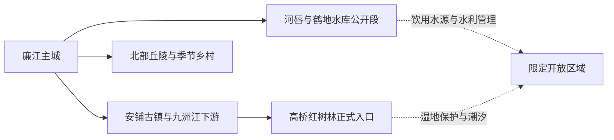
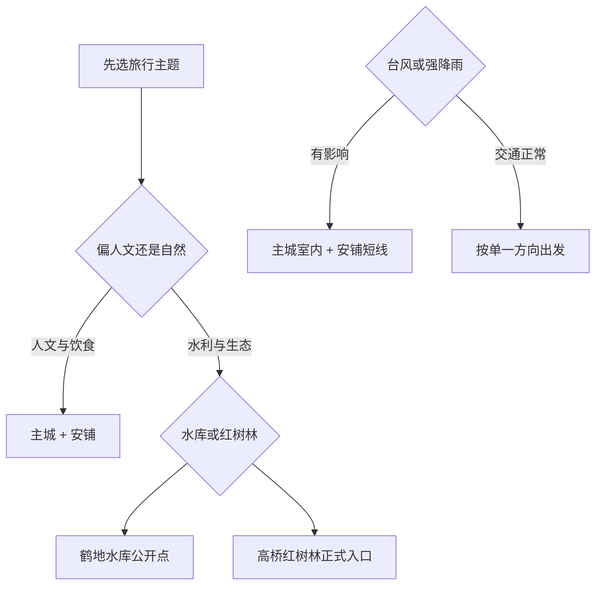

# 廉江旅行指南

廉江位于粤西北部，是一座以县级市主城为服务中心、向九洲江水系与丘陵乡镇展开的目的地。最清楚的旅行组合是：城区用地方文博、公园和日常餐饮建立背景；安铺用骑楼街巷、传统饮食和龙舟文化形成一条人文线；鹤地水库与高桥红树林则分别代表饮用水源保护和滨海湿地生态。三条线方向不同，按整日或半日分别选择，体验会比从湛江主城匆忙往返更完整。

> 建议停留：城区与安铺 1–2 天；鹤地水库公开段或高桥红树林各另留 1 天 
> 旅行关键词：安铺古镇、九洲江、鹤地水库、高桥红树林、荔枝与粤西家常味 
> 主要体力：城区与安铺低至中等；红树林栈道、乡村和水库方向为中等 
> 最近研究：2026-08-13

## 城市速览

| 项目 | 旅行信息 |
|---|---|
| 主要旅行价值 | 在安铺和城区看粤西商贸、饮食与水乡生活，再用鹤地水库或高桥红树林理解九洲江流域和滨海生态 |
| 建议停留 | 1 天以城区—安铺为主；2 天增加鹤地水库公开区域；3 天再选高桥红树林或丘陵乡村 |
| 最佳节奏 | 上午走街巷或场馆，正午休息，下午安排水岸或公园；远线每次只选一个方向 |
| 主要交通 | 廉江南站、廉江站及公路客运承担抵离；城区、安铺、河唇和高桥之间以公交、出租车、网约车或正规包车衔接 |
| 气候与季节 | 夏长湿热，台风和强降雨会影响沿河、滨海与乡村道路；冬春更适合街巷和户外慢游 |
| 预算特征 | 城区餐饮住宿平实；远线车辆、生态活动和节庆期间住宿是主要变量 |
| 步行强度 | 安铺街巷与城区公园较平缓；红树林栈道、水库岸线和丘陵村路受日晒、潮湿与坡度影响 |
| 无障碍 | 城区公共空间较易安排，古镇街巷、栈道和乡村接待点差异大；设施连续性需向官方确认 |
| 亲子旅行 | 城区公园、安铺饮食文化和正式自然教育点更适合；水域活动先核救生与年龄规则 |
| 行前核心 | 按目标乡镇核对入口、营业、潮汐或水位、返程与天气，不以“廉江景区”泛称代替具体地点 |

## 城市格局与游览区域

廉江市法定代码为 `440881`，是由湛江市代管的县级市。GeoNames `1804120` 是廉江城市点，Wikidata `Q1374728` 的 `P1566` 与之精确对应；点位用于核对主城位置，法定市域仍以行政代码和边界资料为准。

| 区域 | 旅行重点 | 安排方式 | 关键条件 |
|---|---|---|---|
| 廉江主城 | 地方文博、城市公园、荔枝文化和日常餐饮 | 抵达日或半日至 1 天 | 场馆开放、活动日期与公园照明 |
| 安铺镇 | 骑楼街巷、古商埠、龙舟与地方小吃 | 与城区组成一日或单独住一晚 | 节庆交通、老街营业与滨水安全 |
| 河唇—鹤地水库 | 水利文化、库区环境和九洲江源流关系 | 独立半日至 1 天 | 只使用明确开放场馆、道路和观景点 |
| 高桥镇 | 红树林、滨海湿地与自然教育 | 独立整日，结合潮汐和开放时段 | 保护区范围、栈道、潮汐、防晒和返程 |
| 北部丘陵乡镇 | 茶园、荔枝、乡村和季节花果 | 选择正式接待点，不追求多镇连跑 | 花果季、采摘许可、村路和餐饮预约 |

鹤地水库是重要饮用水源地，九洲江沿线也承担供水与生态治理功能。适合旅行的内容是官方开放的纪念、展陈、碧道或观景区域；取水设施、坝体管理区、消落带和未开放库岸按水利与水源保护要求管理。高桥红树林按保护区和潮汐环境游览，栈道外滩涂、养殖塘、航道及作业堤岸保留生态和生产边界。

## 主要景点

### 主城与安铺

| 名称 | 区域 | 类型 | 旅行价值 | 建议时长 | 室内外 | 体力 | 无障碍 | 预约 | 优先级 |
|---|---|---|---|---:|---|---|---|---|---|
| 廉江市博物馆或当期地方展馆 | 主城 | 地方文博 | 快速建立廉江历史、九洲江与地方文化背景 | 1–2 小时 | 室内 | 低 | 中至高 | 建议核对 | A |
| 樱花公园及城市公共空间 | 主城 | 城市公园 | 适合抵达日、亲子和低体力缓冲，花期以当年物候为准 | 1–2 小时 | 室外 | 低 | 中 | 通常无需 | B |
| 谢鞋山及公开游览区 | 主城近郊 | 丘陵、地方文化 | 用短山地路线补充城区之外的自然与历史线索 | 2–4 小时 | 室外 | 中 | 低至中 | 先核开放 | B |
| 安铺老街公共街巷 | 安铺镇 | 古镇、商贸街区 | 看粤西商埠格局、骑楼与生活性街巷 | 2–3 小时 | 混合 | 低至中 | 中 | 通常无需 | A |
| 安铺滨水公共空间与龙舟文化节点 | 安铺镇 | 水乡、非遗 | 在活动期理解九洲江下游的龙舟与社区生活 | 1–3 小时 | 室外 | 低至中 | 中 | 活动另核 | B |

### 水库、湿地与乡村

| 名称 | 区域 | 类型 | 旅行价值 | 建议时长 | 室内外 | 体力 | 无障碍 | 预约 | 优先级 |
|---|---|---|---|---:|---|---|---|---|---|
| 鹤地水库明确开放参观点 | 河唇镇方向 | 水利、生态 | 理解九洲江治理、供水与大型水库景观 | 3–5 小时 | 混合 | 中 | 逐项确认 | 建议 | A |
| 高桥红树林正式游览或科普入口 | 高桥镇 | 红树林、湿地 | 观察潮间带生态、红树林与沿海社区关系 | 4–6 小时 | 室外 | 中 | 低至中 | 建议 | A |
| 良垌或石城季节荔枝接待点 | 乡村方向 | 农业、季节体验 | 在明确接待与采摘规则下理解荔枝产业 | 半日至 1 天 | 室外 | 中 | 低 | 需要确认 | C |
| 长山茶园或丘陵乡村正式接待点 | 北部丘陵 | 茶园、乡村 | 适合茶季、活动期或已有预约的慢游 | 半日至 1 天 | 混合 | 中 | 低 | 需要确认 | C |

安铺老街是一组生活街巷，不按单一封闭景区理解；龙舟、展演和夜间活动以当期公告为准。鹤地水库与红树林分别以“开放点”为旅行单位，保护或生产空间本身不拆成多个景点计数。

## 美食与餐饮

安铺是廉江饮食最鲜明的落点，籺、簸箕炊、白切鸡、米粉和海河鲜做法都适合从小份开始。主城选择更多，适合作为过敏原确认和补给基地；远线日午餐宜提前落实，不把果园、保护区入口或水库岸线当作必然有餐饮的地方。

| 类型 | 适合区域 | 份量与点法 | 过敏原与替代 |
|---|---|---|---|
| 安铺鸡与白切类 | 安铺、主城 | 半只或拼盘更适合 2–4 人，一人可选饭套餐 | 蘸料可能含大豆、花生、芝麻；禽类过敏可换素菜与米粉 |
| 簸箕炊、籺与米制小吃 | 安铺老街 | 少量多样，先询问当天口味 | 馅料可能含花生、芝麻、虾米、猪油；米制品也可能与小麦共用器具 |
| 廉江红橙、荔枝等季节水果 | 主城市场、正式果园 | 先买小份，采摘按称重规则 | 控制糖分，确认清洗条件；果园采摘先问价格与可进入区域 |
| 河鲜、海鲜和鱼生类 | 安铺及正规餐馆 | 先确认品种、来源、计价和熟制方式 | 水产过敏风险高；肠胃敏感者选择充分加热菜品 |
| 粤西汤粉与家常小炒 | 主城、安铺 | 一人一份，适合早餐和远线前补给 | 汤底可能含骨汤、虾皮、大豆；素食需单独确认 |

## 经典行程

### 一日经典：主城与安铺

**路线**：主城地方展馆 → 城区午餐 → 安铺老街 → 安铺小吃与滨水公共空间 → 返回或安铺住宿

- **串联逻辑**：上午建立地方背景，下午沿九洲江下游进入商埠街巷与饮食场景，全天保持同一人文主题。
- **预约锚点**：先确认地方展馆开放；节庆、龙舟或演出按活动公告安排交通与入场。
- **休息安排**：正午在主城或安铺室内用餐，老街分两段走，夏季增加饮水和遮阴。
- **时间不足时**：直接前往安铺，保留老街和一顿小吃；抵达较晚则只走主城公园与餐饮。

### 两日：增加鹤地水库

**第 1 天**：主城 → 安铺 
**第 2 天**：主城或河唇出发 → 鹤地水库明确开放参观点 → 午餐与休息 → 九洲江沿线公共空间 → 返回

- **串联逻辑**：第一天看商贸与饮食，第二天集中理解水库、供水与流域生态，减少在安铺和北部水库之间折返。
- **预约锚点**：确认可进入的场馆、观景点、道路和讲解；团队或研学按管理方预约。
- **休息安排**：午餐放在河唇或已确认的服务点，避免正午长时间暴露在坝区和岸线。
- **时间不足时**：第二天只保留一处正式参观点，不沿库岸寻找临时入口。

### 三日：增加高桥红树林

**第 3 天路线**：安铺或主城早出 → 高桥红树林正式入口 → 栈道或科普活动 → 高桥午餐与长休 → 原路返回

- **适用条件**：保护地入口、潮汐、天气和返程车辆清楚，鞋履适合湿滑环境。
- **串联逻辑**：把滨海湿地留成完整生态日，与内陆水库和古镇分开理解。
- **预约锚点**：向管理方确认开放栈道、讲解、团队规则、停车和无人机要求。
- **休息安排**：午间进入镇区休息，携带防晒、防蚊和饮水。
- **时间不足时**：缩短为正式科普入口附近短线；入口或返程不明时改走安铺。

### 雨天：主城与安铺室内优先

**路线**：地方展馆 → 主城午餐 → 安铺骑楼街巷短线 → 茶饮或小吃休息

- **适用条件**：普通降雨且道路正常；台风、暴雨或积水预警时按属地安排减少跨镇移动。
- **串联逻辑**：用室内展陈和有遮蔽街巷保持地方文化主题，暂缓湿地和水库远线。
- **预约锚点**：核对展馆、古镇活动与公共交通是否调整。
- **休息安排**：每段步行后进入室内，鞋袜湿透及时更换。
- **时间不足时**：保留展馆和一顿安铺饮食体验。

### 亲子：公园、古镇与自然教育二选一

**路线 A**：城区公园 → 午餐 → 安铺老街短线 
**路线 B**：高桥正式自然教育入口 → 栈道短线 → 镇区午餐 → 提前返程

- **适用条件**：路线 A 适合多数家庭；路线 B 需天气、潮汐、开放和儿童步行能力均合适。
- **串联逻辑**：人文日用短步行和饮食互动，自然日只做一个湿地入口，避免同日跨向水库。
- **预约锚点**：自然教育活动、讲解、采摘或节庆项目提前确认年龄和陪同规则。
- **休息安排**：午间长休，夏季准备遮阳、防蚊和替换衣物。
- **时间不足时**：选路线 A，只保留公园和安铺老街。

### 长者与低体力：安铺慢游

**路线**：车辆抵达安铺老街一处 → 平缓街巷短段 → 午餐长休 → 滨水公共空间一处 → 返回

- **适用条件**：能落实近距离上下车、座椅和卫生间，避开节庆高峰与高温。
- **串联逻辑**：把古镇拆成两个短段，以车辆和午休降低连续步行。
- **预约锚点**：向餐馆和住宿确认台阶、电梯、无障碍卫生间与车辆停靠。
- **休息安排**：午间至少休息 1 小时，下午只加一处平缓公共空间。
- **时间不足时**：保留老街一段和午餐。

## 住宿区域

| 区域 | 优势 | 取舍 | 适合人群 | 交通提示 |
|---|---|---|---|---|
| 廉江主城 | 铁路、公路、餐饮与叫车最稳定 | 去安铺、高桥和河唇都需车辆 | 首访、铁路抵达、连续多日 | 按廉江南站或廉江站实际车次选住宿 |
| 安铺镇 | 便于早晚走老街、品尝小吃和参加节庆 | 房源、电梯、隔音和停车差异较大 | 古镇、饮食、摄影 | 节庆期间提前订房并确认道路管制 |
| 河唇镇方向 | 便于鹤地水库早出和减少回程 | 夜间活动与房源选择少 | 水利专题、自驾 | 先确认住宿资质、餐饮和次日车辆 |
| 高桥镇或正式乡村接待点 | 靠近红树林自然日 | 潮汐、天气与服务季节性明显 | 生态观察、摄影 | 先落实返程、早餐和通信，不依赖临时叫车 |

## 市内交通

廉江南站和廉江站服务范围、停靠车次与城区距离不同，购票后再决定住宿。前往安铺、河唇、高桥和北部丘陵时，先按单一方向规划车辆；廉江与湛江主城之间是跨城移动，不把湛江机场或湛江西站的到达时间直接算作已经进入廉江景区。

| 场景 | 推荐做法 | 出发前核对 |
|---|---|---|
| 铁路抵达 | 按实际到达站选公交、出租车或网约车 | 站名、车次、末班与上客区 |
| 湛江主城—廉江 | 铁路或正规公路客运均可，比较总耗时 | 到发站、班次、道路和夜间接驳 |
| 主城—安铺 | 公交、出租车、网约车或正规包车 | 末班、节庆管制、返程和停车 |
| 主城—河唇/鹤地 | 自驾或预约车辆更利于控制开放时段 | 正式入口、道路、水源保护与返程 |
| 安铺—高桥 | 以合规车辆直达正式入口 | 潮汐、保护区开放、栈道和返程 |
| 乡村与果园 | 只前往已确认接待的地点 | 采摘规则、村路、停车、价格和餐饮 |

## 不同旅行者须知

| 旅行者 | 更合适的选择 | 重点准备 |
|---|---|---|
| 独行旅行 | 主城住宿、安铺一日和有正式入口的生态点 | 末班、返程叫车与夜间照明 |
| 亲子家庭 | 城区公园、安铺饮食文化、自然教育短线 | 防晒、防蚊、潮汐和水域陪同 |
| 长者或低体力 | 安铺分段慢游、主城公园与车辆单点接驳 | 台阶、卫生间、座椅和高温休息 |
| 摄影旅行 | 安铺公共街巷、红树林正式栈道和水库公开观景点 | 潮汐、光线、三脚架、无人机与居民肖像 |
| 自驾旅行 | 水库、红树林和丘陵分别安排 | 台风积水、村路、停车、充电和司机休息 |
| 预算有限 | 主城住宿、公共公园与安铺街巷 | 远线车辆总价、拼车资质和返程 |

## 行前核对

| 项目 | 为什么会变 | 何时核对 | 官方入口 |
|---|---|---|---|
| 安铺活动与交通 | 龙舟、节庆和夜间活动会改变道路与营业 | 确定日期后、到访前一日 | [廉江市政府](https://www.lianjiang.gov.cn/) |
| 鹤地水库开放范围 | 水源保护、水利运行和维修会调整入口 | 出发前一周及当天 | [湛江市水务局](https://swj.zhanjiang.gov.cn/) |
| 高桥红树林 | 保护管理、潮汐、栈道维护和天气影响游览 | 出发前三日、当天 | [广东省林业局](https://lyj.gd.gov.cn/) |
| 台风与强降雨 | 沿河、沿海和乡村道路可能受影响 | 出发前三日及每天早晨 | [广东气象](https://gd.cma.gov.cn/) |
| 铁路与公路班次 | 到站、停靠和末班会调整 | 购票时、出发前一日 | [中国铁路 12306](https://www.12306.cn/)；[湛江市交通运输局](https://jtj.zhanjiang.gov.cn/) |
| 行政归属 | 廉江是县级市，不是湛江主城街区 | 安排跨城住宿时 | [民政部行政区划查询](https://dmfw.mca.gov.cn/xzqh/getList?code=440800&trimCode=false&maxLevel=3) |

## 来源与更新记录

### 主要来源

| 来源 | 机构 | 支持内容 | 核验日期 |
|---|---|---|---|
| [湛江乡村旅游资料](https://nyncj.zhanjiang.gov.cn/xwzx/content/post_1159287.html) | 湛江市农业农村局 | 安铺、鹤地水库、高桥红树林、茶园与乡村线路 | 2026-08-13 |
| [湛江研学旅游线路](https://www.zhanjiang.gov.cn/zjsfw/bmdh/whgdj/zwgk/gzdt/content/post_1647009.html) | 湛江市文化广电旅游体育局 | 廉江代表性文旅节点与路线组合 | 2026-08-13 |
| [安铺镇文旅与龙舟资料](https://www.zhanjiang.gov.cn/zwgk/zwzt/cw/gj/content/post_2198105.html) | 湛江市政府 | 安铺古商埠、龙舟、地方饮食与活动背景 | 2026-08-13 |
| [鹤地水库饮用水源生态保护](https://www.zhanjiang.gov.cn/zjsfw/bmdh/yhj/zwgk/gzdt/content/post_2157333.html) | 湛江市政府 | 鹤地水库、九洲江水源保护与生态治理边界 | 2026-08-13 |
| [湛江市国土空间规划](https://www.zhanjiang.gov.cn/szfwj/content/post_2028883.html) | 湛江市政府 | 安铺文化旅游、生态农业与保护空间关系 | 2026-08-13 |
| [兴廉江旅游线路资料](https://www.zhanjiang.gov.cn/whgdlytyj/gkmlpt/content/1/1521/post_1521426.html) | 湛江市文化广电旅游体育局 | 安铺、谢鞋山、鹤地水库与城区公园线索 | 2026-08-13 |
| [GeoNames 1804120](https://www.geonames.org/1804120/) | GeoNames | 廉江城市点标识与坐标 | 2026-08-13 |
| [Wikidata Q1374728](https://www.wikidata.org/wiki/Q1374728) | Wikidata | 廉江市实体及 `P1566` 精确对应 | 2026-08-13 |
| [民政部行政区划查询：440800](https://dmfw.mca.gov.cn/xzqh/getList?code=440800&trimCode=false&maxLevel=3) | 民政部 | 廉江市 `440881` 与湛江市代管关系 | 2026-08-13 |

### 更新记录

| 日期 | 更新 |
|---|---|
| 2026-08-13 | 首次完成廉江市公众旅行研究；建立主城、安铺、鹤地水库和高桥红树林分线，明确县级市粒度，并补充水源地、湿地、台风、交通和无障碍核对 |
