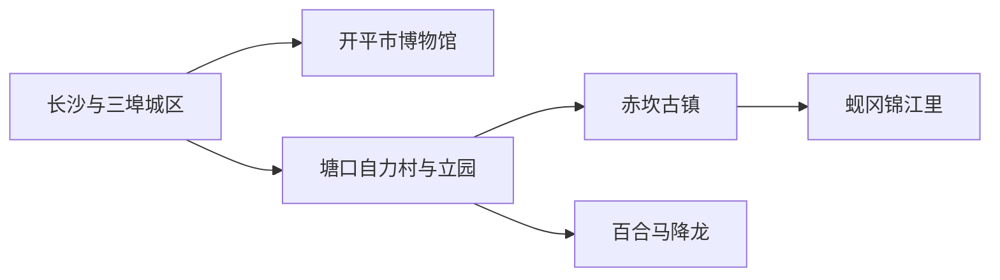
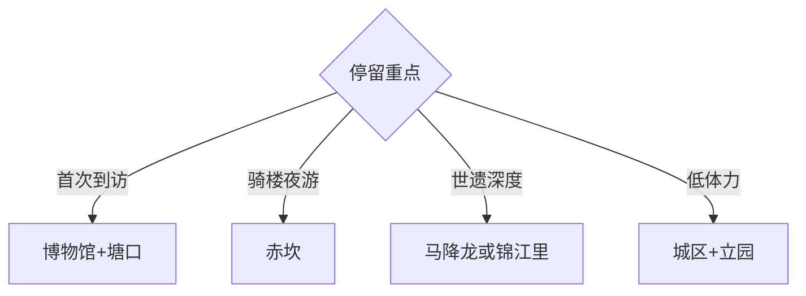

# 开平旅行指南

开平的核心是碉楼与侨乡村落：先在长沙—三埠城区和博物馆建立华侨史框架，再把自力村—立园、赤坎古镇或锦江里各安排成半日至一天。世界遗产点分散在乡村，按片区选择比追求碉楼数量更能看清建筑与田园关系。

## 城市速览

| 项目 | 信息 |
|---|---|
| 主线 | 长沙三埠城区—自力村与立园—赤坎—马降龙或锦江里 |
| 停留 | 城区半日至1天；世遗与古镇2天；深度村落3–4天 |
| 住宿 | 长沙—三埠便于交通；赤坎适合夜游；塘口适合世遗村落与民宿 |
| 交通 | 开平南站接驳城区，乡村景点用公交、出租车、合规包车或自驾 |
| 风险 | 台风暴雨、高温、乡村道路、古建消防与稻田水网 |
| 边界 | 碉楼内部、居民村落、耕地水塘、修缮工地和工业园按票务、产权与生产边界进入 |

## 城市格局与游览区域

固定 **Changsha / GeoNames 1796989** 对应开平市政府驻地长沙街道，本页以它定位城区，并以开平市实体 `Q599514`、代码 `440783` 覆盖现行县级市。长沙与三埠构成三江六岸城区；自力村、立园、马降龙、锦江里等世界遗产组成部分分布在塘口、百合、蚬冈等乡镇。江门、台山和恩平是其他城市，景点分别计算。

## 主要景点

| 景点 | 区域 | 类型 | 核心体验 | 用时 | 环境 | 体力 | 研究价值 | 拥挤 | 优先级 |
|---|---|---|---|---:|---|---|---|---|---|
| 开平市博物馆—梁金山公园 | 长沙街道 | 文博公园 | 开平史、华侨文化、碉楼展陈与城市山水 | 2–4小时 | 混合 | 中 | 很高 | 中 | A |
| 自力村碉楼群 | 塘口镇 | 世界遗产村落 | 稻田村落与多座近代碉楼、居庐 | 3–5小时 | 混合 | 中 | 很高 | 高 | A |
| 立园 | 塘口镇 | 华侨园林 | 中西合璧建筑、园林与侨乡家族史 | 2–4小时 | 混合 | 中 | 很高 | 高 | A |
| 赤坎华侨古镇正式运营区 | 赤坎镇 | 骑楼古镇 | 潭江两岸骑楼、侨乡商业与夜间演艺 | 半日至1天 | 混合 | 中高 | 高 | 高 | A |
| 马降龙村落群 | 百合镇 | 世界遗产村落 | 竹林、水田与多村碉楼聚落 | 3–5小时 | 室外为主 | 中 | 很高 | 中 | B |
| 锦江里碉楼群 | 蚬冈镇 | 世界遗产村落 | 瑞石楼等碉楼与华侨村落 | 半日至1天 | 混合 | 中 | 很高 | 中 | B |
| 开平南楼与公开纪念空间 | 赤坎方向 | 抗战史迹 | 司徒氏抗敌事迹与潭江沿线历史 | 1.5–3小时 | 混合 | 低至中 | 高 | 低 | B |
| 开元塔公园 | 长沙街道 | 古塔公园 | 城区近郊登高、地方文脉与公共绿地 | 1.5–3小时 | 室外 | 中 | 中 | 低 | C |

## 美食与餐饮

开平饮食可从赤坎豆腐角、马冈鹅、黄鳝饭、五邑烧味和广式早茶选择；城区最容易找到小份和稳定营业的餐馆。点鹅肉、河鲜或煲仔饭时确认份量、价格、骨刺、花生芝麻和海鲜过敏；乡村路线提前确认午餐与饮水。

## 经典行程

### 两日基础线
**路线**：博物馆—自力村—立园—赤坎古镇。**逻辑**：先理解华侨史，再看村落与商埠。**预约锚点**：世遗景区和赤坎票务。**休息**：塘口或赤坎。**删除条件**：时间不足时删城区公园。

### 塘口世遗线
**路线**：自力村—塘口午餐—立园。**逻辑**：同方向对照村落与私家园林。**预约锚点**：门票、接驳和讲解。**休息**：塘口镇。**删除条件**：高温时缩短村外田野步行。

### 赤坎商埠线
**路线**：赤坎正式入口—骑楼核心—当日演艺或夜景。**逻辑**：把古镇运营区作为完整单元。**预约锚点**：门票、演出和返程。**休息**：古镇服务区。**删除条件**：大型活动拥挤时改为日间。

### 马降龙村落线
**路线**：正式开放村落—竹林与稻田公共游线—返塘口。**逻辑**：观察碉楼与生态环境。**预约锚点**：开放与车辆。**休息**：游客服务点。**删除条件**：暴雨、积水或修缮时改立园。

### 锦江里建筑线
**路线**：蚬冈镇—锦江里完整村落—中坚楼侨心广场。**逻辑**：以代表性高层碉楼连接侨乡史。**预约锚点**：内部开放、讲解和返程。**休息**：蚬冈镇。**删除条件**：内楼关闭时只看公开村落空间。

### 城区华侨线
**路线**：开平市博物馆—梁金山公园—长沙三埠三江六岸短段。**逻辑**：用展览连接城市与乡村。**预约锚点**：博物馆。**休息**：长沙商圈。**删除条件**：高温时只留馆内。

### 低体力线
**路线**：车辆到博物馆—立园核心区—赤坎平缓街段。**逻辑**：用车辆和单点精游控制步行。**预约锚点**：无障碍、落客与电瓶接驳。**休息**：每站服务区。**删除条件**：雨天石板湿滑时保留博物馆与立园。

## 住宿区域

长沙—三埠城区适合铁路接驳、餐饮和多方向出发；塘口民宿适合连续看自力村、立园和乡村；赤坎适合夜游与次日南楼方向。订房时核对房源合法经营、消防、隔音、停车和真实景区入口，节假日先锁定返程交通。

## 市内交通

开平南站到城区、塘口和赤坎均有继续接驳，车次与线路以当期公告为准。世界遗产点分散，公交可完成部分主线，深度串联更适合合规包车或自驾；导航到具体游客中心，不以村名中心点替代入口。台风或强降雨时乡村道路与积水路段需要重查。

## 不同旅行者须知

建筑爱好者优先自力村、立园、马降龙与锦江里；华侨史兴趣者先看博物馆；亲子家庭选择讲解、研学和一个完整村落；长者采用城区或赤坎住宿与车辆串联。世遗村落仍有居民、农田和生产活动，拍摄、入宅与田埂通行遵循现场标识和居民意愿。

## 行前核对

- 核对自力村、立园、赤坎、马降龙、锦江里和博物馆的票务、开放与修缮。
- 核对开平南站接驳、乡村公交末班、包车、台风暴雨和演出散场交通。
- 世界遗产地按核心区、缓冲区、居民空间和正式游线管理，航拍按现行规定执行。

## 来源与更新记录

| 来源 | 支持内容 | 核验日期 |
|---|---|---|
| [开平市政府：开平概览](https://www.kaiping.gov.cn/kpszfw/kpfc/kpgl/content/post_3466132.html) | 长沙街道驻地、三江六岸、行政与旅游格局 | 2026-09-01 |
| [开平市文旅局：华侨文化路线](https://www.kaiping.gov.cn/kpswhgdlytyj/zwgk/zwgk/content/post_2948435.html) | 博物馆、自力村、立园、赤坎与锦江里路线 | 2026-09-01 |
| [开平市政府：碉楼文化旅游区名录](https://www.kaiping.gov.cn/kpszfw/zwgk/zdlyxxgkzl/lyscjgzfxx/lyml/content/post_2867978.html) | 自力村、马降龙和立园组成 | 2026-09-01 |
| [开平市政府：长沙街道简介](https://www.kaiping.gov.cn/csjdbsc/csgk/content/post_3062748.html) | 固定记录所在街道、城区与公共文化 | 2026-09-01 |
| [UNESCO：开平碉楼与村落](https://whc.unesco.org/en/list/1112/) | 世界遗产价值与组成 | 2026-09-01 |
| [GeoNames 1796989](https://www.geonames.org/1796989/) | Changsha 固定人口点 | 2026-09-01 |
| [Wikidata Q599514](https://www.wikidata.org/wiki/Q599514) | 开平市实体与跨库标识 | 2026-09-01 |

| 日期 | 更新 |
|---|---|
| 2026-09-01 | 首次完成开平旅行研究；以长沙街道承接固定记录，并按城区、世遗村落和赤坎古镇组织路线。 |
