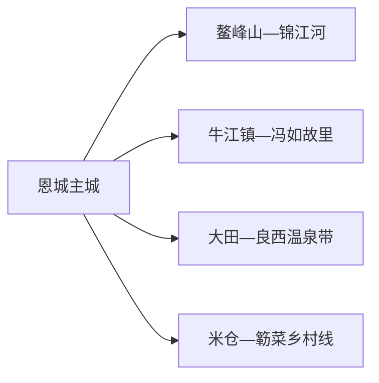
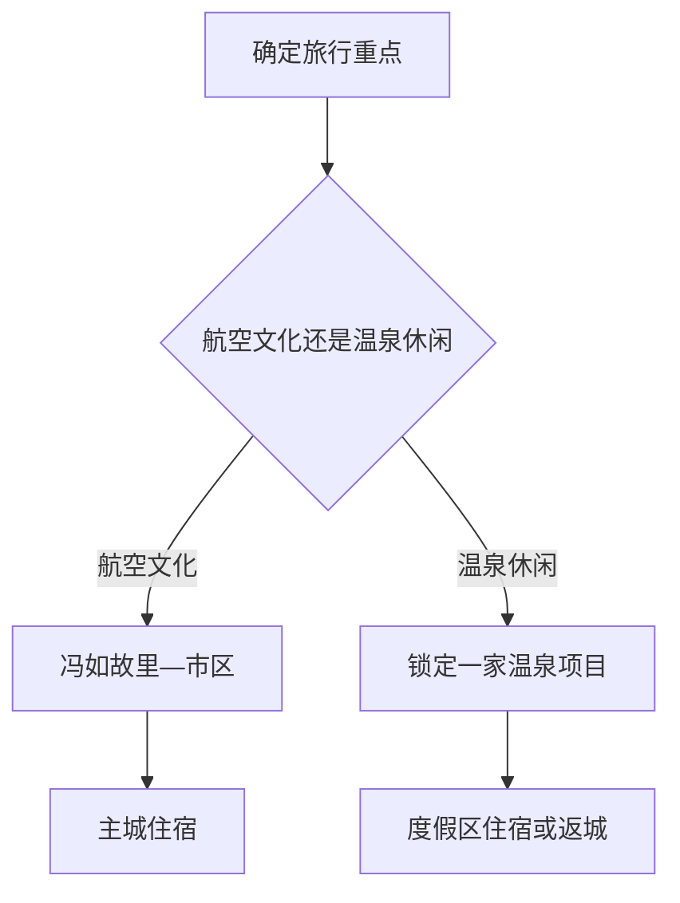

# 恩平旅行指南

恩平最适合按“航空侨乡—温泉度假—锦江山水”来选：冯如故里提供明确的人文主线，大田和良西一带的温泉适合住一晚，市区鳌峰山与锦江河则承担轻松散步。温泉、花海和乡村项目运营变化较快，先锁定一家正式接待点，再围绕它安排车辆和住宿。

> 建议停留：1–2 天 
> 旅行关键词：冯如故里、航空史、温泉、鳌峰山、锦江、簕菜 
> 主要体力：低至中等 
> 最近研究：2026-08-13

## 城市速览

| 项目 | 旅行信息 |
|---|---|
| 主要旅行价值 | 认识冯如航空文化与五邑侨乡，再以温泉和山水公园放慢节奏 |
| 建议停留 | 1 天可选冯如故里加市区；2 天增加一处温泉度假区 |
| 较舒适季节 | 秋冬春适合温泉和户外；夏季注意高温、暴雨与台风 |
| 预算特点 | 市区中低；温泉门票、度假住宿和车辆是主要成本 |
| 步行强度 | 市区低至中等；鳌峰山和乡村点位有坡道 |
| 主要天气风险 | 台风、暴雨、雷电、高温、山洪和河流水位变化 |
| 独行旅行 | 市区与铁路抵达方便；温泉和乡村日先确认返程 |
| 亲子旅行 | 冯如故里、文化场馆和正式温泉亲子设施较适合 |
| 长者与低体力旅行 | 以车辆连接冯如故里、锦江河岸和温泉服务区 |
| 无障碍信息 | 现代景区可逐处咨询，历史建筑与山地设施连续性需向官方确认 |

## 城市格局与游览区域

恩平市是江门市代管的县级市，法定代码 `440785`。固定 GeoNames `1811729` 对应恩城主城居民点；Wikidata `Q1343673` 是法定恩平市，当前连接另一条行政记录 `1811721`。两者用于核对城市名称与主城位置，旅行边界按法定市域划分。

| 区域 | 主要内容 | 怎么安排 | 与其他区域的关系 |
|---|---|---|---|
| 恩城主城 | 铁路接驳、住宿、餐饮与公共文化 | 半日至一日 | 多日行程基地 |
| 鳌峰山—锦江河 | 城市公园、河岸与日常生活 | 半日慢走 | 可放在抵达或返程日 |
| 牛江镇 | 冯如故里文化旅游区 | 半日 | 与温泉方向分开安排更轻松 |
| 大田—良西 | 温泉、花海和乡村度假 | 半日至一日并可住宿 | 先锁定运营项目再规划车辆 |
| 米仓等农业片区 | 簕菜文化与乡村活动 | 只在明确开放活动中进入 | 农田、加工区和水源地保留生产生态功能 |

## 主要景点

### 人文与城市休闲

| 景点 | 区域 | 类型 | 主要看点 | 建议用时 | 室内外 | 体力 | 预约风险 | 天气影响 | 优先级 |
|---|---|---|---|---:|---|---|---|---|---|
| 冯如故里文化旅游区 | 牛江镇 | 名人故里与侨乡文化 | 冯如故居、文史展示和华侨文化 | 2–3 小时 | 混合 | 低 | 高 | 中 | A |
| 鳌峰山森林公园 | 恩城 | 城市山地公园 | 城市绿地、山景与休闲步道 | 2–3 小时 | 室外 | 中 | 低 | 高 | A |
| 锦江河城市滨水段 | 恩城 | 滨水公共空间 | 河岸散步、城市生活与夜景 | 1–2 小时 | 室外 | 低 | 低 | 高 | B |
| 恩平市公共文化场馆 | 恩城 | 博物馆与文化馆 | 地方史、冯如文化和当期非遗展陈 | 1–2 小时 | 室内 | 低 | 高 | 低 | B |

### 温泉与乡村

| 景点 | 区域 | 类型 | 主要看点 | 建议用时 | 室内外 | 体力 | 预约风险 | 天气影响 | 优先级 |
|---|---|---|---|---:|---|---|---|---|---|
| 大田镇正式温泉景区 | 大田镇 | 温泉度假 | 温泉、住宿和康养设施，按一家运营项目完整体验 | 半日至一日 | 混合 | 低 | 很高 | 中 | A |
| 良西镇温泉—花海项目 | 良西镇 | 度假与花卉 | 当期开放温泉、花海和乡村活动 | 半日至一日 | 混合 | 中 | 很高 | 高 | B |
| 米仓村·簕菜文化创意园 | 恩城街道 | 农业与地方饮食 | 簕菜种植文化、展示和正式体验 | 2–3 小时 | 混合 | 低 | 高 | 高 | B |
| 锦江沿线正式驿站与乡村项目 | 良西等方向 | 乡村休闲 | 骑行、村落公共空间与季节活动 | 半日 | 室外 | 中 | 很高 | 很高 | C |

温泉酒店、泉池和花海按不同运营主体分别核对；冯如故居、文史馆等在同一文化旅游区内统一安排。七星坑、红树林等保护地及水库、取水和地热生产设施按法定边界管理。

## 美食与餐饮

恩平可围绕濑粉、簕菜、烧饼和五邑家常菜选择。温泉区适合把正餐与住宿一起锁定，市区更方便独行和临时调整。

| 菜品或餐饮类型 | 常见区域 | 一个人用餐与常见份量 | 风味、过敏原与饮食限制 | 排队风险与替代方法 |
|---|---|---|---|---|
| 恩平濑粉 | 市区、镇区早餐店 | 一碗适合一人 | 汤底可能含猪骨、海味、花生或大豆 | 在生活街区选择同类粉店 |
| 簕菜汤或簕菜菜肴 | 市区、米仓和乡村餐饮 | 汤或一盘菜适合分享 | 可能搭配肉汤、蛋和海鲜；逐店确认 | 非产季改选普通时蔬 |
| 恩平烧饼 | 市区与文旅市集 | 单个或小份 | 含小麦，馅料可能含芝麻、花生和糖 | 选择配料标识完整的产品 |
| 牛脚皮与裹粽 | 市区地方餐馆、节庆市集 | 多为小吃或分享份 | 牛制品、糯米和调味酱需按饮食限制确认 | 在正规餐饮点小份尝试 |
| 五邑家常菜 | 市区和温泉住宿区 | 常为合菜 | 海鲜、猪肉、花生油和酱油常见 | 独行选择汤粉、煲仔饭或套餐 |

## 经典行程

### 一日经典路线

**路线**：恩平站或主城 → 冯如故里文化旅游区 → 市区午餐 → 鳌峰山短线 → 锦江河岸

- **串联逻辑**：上午处理核心人文，下午回主城走轻松户外线。
- **预约锚点**：冯如故里场馆和当期活动。
- **休息安排**：午餐、下午茶和晚餐均放在主城。
- **时间不足时**：保留冯如故里与锦江河岸，删鳌峰山长线。

### 两日城市路线

**第 1 天**：冯如故里 → 主城公共文化 → 锦江河岸。  
**第 2 天**：主城 → 一处正式温泉景区 → 度假区休息 → 返回或住宿。

- **串联逻辑**：文化日与度假日分开，温泉日不再跨多个乡镇。
- **预约锚点**：温泉门票、房型、儿童规则和往返车辆。
- **休息安排**：第一天主城；第二天使用度假区正式服务设施。
- **时间不足时**：第二天整体删除，保留主城一日。

### 三日深度路线

**第 1 天**：航空侨乡线。  
**第 2 天**：温泉完整一日。  
**第 3 天**：米仓簕菜文化或锦江正式乡村活动。

- **串联逻辑**：第三天按季节选一项农业或乡村体验。
- **预约锚点**：乡村接待、活动日期和餐饮。
- **休息安排**：主城两晚最灵活；已锁定度假住宿时第二晚换宿。
- **时间不足时**：先删第三天。

### 雨天路线

**路线**：公共文化场馆 → 市区午餐 → 正式温泉室内区域或住宿休息

- **适用条件**：普通降雨且道路正常；台风和暴雨预警时留在安全住宿。
- **预约锚点**：场馆、温泉和道路公告。
- **休息安排**：缩短跨镇移动，选择同一住宿片区。
- **时间不足时**：只保留一座场馆和市区用餐。

### 亲子与低体力路线

**亲子路线**：冯如故里 → 市区午餐 → 正式亲子温泉或公共文化活动。  
**低体力路线**：车辆到冯如故里 → 锦江河岸短段 → 温泉服务区休息。

- **减负方式**：亲子路线取消长山路；低体力路线以车辆连接并安排午休。
- **预约锚点**：儿童水上设施、温泉禁忌和场馆无障碍。
- **休息安排**：市区与温泉服务大厅。
- **时间不足时**：保留冯如故里，温泉改为住宿内休息。

### 远郊一日路线

**路线**：主城 → 大田或良西的一处正式温泉项目 → 午餐与休息 → 返回/度假住宿

- **适用条件**：项目正常营业且正规车辆已确认。
- **预约锚点**：门票、房型、餐饮、末班接驳。
- **休息安排**：在同一度假区完成泡汤和用餐。
- **时间不足时**：整段改为市区鳌峰山—锦江线。

## 住宿区域

| 区域 | 优点 | 缺点 | 适合人群 | 交通特点 |
|---|---|---|---|---|
| 恩平站—主城 | 到达、餐饮和跨方向接驳方便 | 温泉体验需往返 | 首访、独行与公共交通旅行者 | 适合连续住两晚 |
| 鳌峰山—锦江附近 | 城市散步和生活便利 | 到铁路站和远郊需车辆 | 喜欢城市慢游者 | 市内移动较短 |
| 大田/良西温泉区 | 泡汤后直接休息 | 餐饮和外出选择依赖运营方 | 度假、亲子和低体力旅行者 | 先锁定返程或次日车辆 |

## 市内交通

| 场景 | 建议与取舍 | 行前需要重查的内容 |
|---|---|---|
| 铁路抵达 | 恩平站是主要铁路门户，到主城仍需接驳 | 12306 车次、公交、出租上客点 |
| 主城—牛江 | 公交、出租或正规包车连接 | 班次、返程和景区入口 |
| 主城—温泉区 | 自驾或正规车辆更灵活 | 道路、停车、充电和夜间返程 |
| 骑行与乡村线 | 只使用公开道路和正式驿站 | 高温、雷雨、车辆混行和活动保障 |

## 不同旅行者须知

| 旅行维度 | 可行条件 | 主要取舍 | 需额外核对 |
|---|---|---|---|
| 独行旅行 | 主城和冯如故里较方便 | 温泉日先锁定返程 | 夜间上客点和住宿前台 |
| 亲子旅行 | 航空文化、公共场馆和亲子泉池 | 减少高温山地活动 | 儿童水深、身高和救生规则 |
| 长者或低体力旅行 | 车辆连接与温泉休息 | 鳌峰山只走低处短线 | 温泉健康禁忌、电梯和座椅 |
| 无障碍需求 | 现代度假设施可咨询 | 历史建筑与山地连续通行资料有限 | 设施连续性需向官方确认 |
| 温泉旅行 | 正式运营、标识清楚的泉池 | 控制时长并补水 | 水温、消毒、健康提示和医疗距离 |
| 台风暴雨 | 市区室内或安全住宿可替换 | 乡村、河岸和山地整体顺延 | 预警、停运、积水和退改 |

## 行前核对

| 核对事项 | 为什么需要重查 | 建议核对时间 | 官方入口 |
|---|---|---|---|
| 温泉与乡村项目 | 营业、票制、设施和活动变化快 | 订房前及到访前一日 | [恩平市人民政府](https://www.enping.gov.cn/) |
| 冯如故里 | 场馆和活动可能分时开放 | 到访前一日 | [江门市政府属地资料](https://www.jiangmen.gov.cn/home/sqdt/epzx/content/post_3234138.html) |
| 铁路 | 车次和停站按日期调整 | 出发前一周及当天 | [中国铁路 12306](https://www.12306.cn/) |
| 天气与防汛 | 台风、强降雨和河流水位影响户外 | 出发前三日及当天 | [广东省气象局](https://gd.cma.gov.cn/) |

## 来源与更新记录

### 主要来源

| 来源 | 类型 | 支持内容 | 核验日期 |
|---|---|---|---|
| [广东省民政厅：江门市区划](https://smzt.gd.gov.cn/qhgk/gsqh/2023nd/jms/content/post_4388334.html) | 省级民政部门 | 恩平县级市层级与江门代管关系 | 2026-08-13 |
| [恩平市 2026 年政府工作报告](https://www.enping.gov.cn/gkmlpt/content/3/3446/post_3446975.html) | 属地政府 | 冯如故里、簕菜文化、温泉和当期文旅方向 | 2026-08-13 |
| [恩平市统计公报](https://www.enping.gov.cn/attachment/0/356/356507/3388282.pdf) | 属地统计部门 | 两处 3A 景区、气候与旅游概况 | 2026-08-13 |
| [恩平市政府：鳌峰山](https://www.enping.gov.cn/hdjl/ywzsk/lw/content/post_2947065.html) | 属地政府 | 鳌峰山位置与城市公园属性 | 2026-08-13 |
| [江门市政府：冯如故里](https://www.jiangmen.gov.cn/home/sqdt/epzx/content/post_3234138.html) | 地级市政府 | 故居、文史馆与华侨文化展陈组成 | 2026-08-13 |
| [GeoNames 1811729](https://www.geonames.org/1811729/) | 开放地名库 | 恩城主城居民点 | 2026-08-13 |
| [Wikidata Q1343673](https://www.wikidata.org/wiki/Q1343673) | 开放知识库 | 法定恩平市与另一行政记录 | 2026-08-13 |

### 更新记录

| 日期 | 更新内容 |
|---|---|
| 2026-08-13 | 首次建立恩平独立指南；把冯如故里、市区公园和温泉度假分层，明确居民点与法定市域粒度以及温泉、地热、水源和农业空间边界。 |
