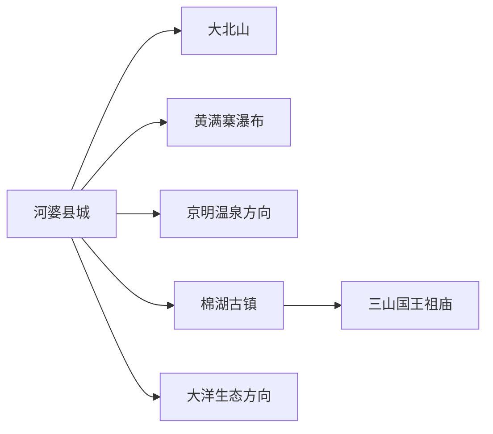
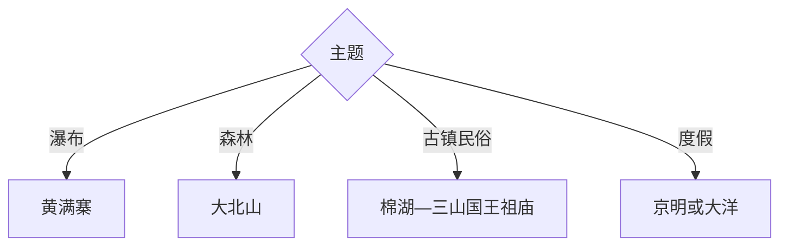

# 揭西旅行指南

揭西位于榕江南河上游，河婆县城是山地交通基地，黄满寨瀑布与大北山承担自然主线，棉湖古镇和三山国王祖庙呈现潮客交汇的人文层次。三天可分别安排瀑布、森林和古镇民俗。

## 城市速览

| 项目 | 信息 |
|---|---|
| 主线 | 河婆—黄满寨—大北山—棉湖古镇—三山国王祖庙 |
| 停留 | 山水与古镇2天；完整三线3天 |
| 住宿 | 河婆适合山地换线，棉湖适合古镇，景区住宿按正规接待选择 |
| 交通 | 从揭阳、普宁或梅州方向经公路进入，县内用客运、预约车或自驾 |
| 风险 | 台风暴雨、瀑布水量、山洪地灾、森林防火和乡村夜间返程 |
| 边界 | 森林公园、瀑布峡谷、宗教仪式区、古镇民宅、茶园农田按开放范围进入 |

## 城市格局与游览区域

固定 `Hepo / GeoNames 1808336` 对应河婆街道，本页以法定揭西县 `Q1342024` 组织。河婆在中西部，棉湖位于东部平原入口，黄满寨、大北山和大洋方向分散，适合一天只选一条山地线。

## 主要景点

| 景点 | 区域 | 类型 | 核心体验 | 用时 | 环境 | 体力 | 预约风险 | 天气影响 | 优先级 |
|---|---|---|---|---:|---|---|---|---|---|
| 黄满寨瀑布旅游区 | 京溪园镇 | 瀑布峡谷 | 多级瀑布、山谷植被与长距离登降 | 5–8小时 | 室外 | 高 | 很高 | 极高 | A |
| 大北山国家森林公园开放区 | 南山镇方向 | 森林山地 | 山林、红色文化与生态步道 | 半日至1天 | 室外 | 中高 | 很高 | 极高 | A |
| 棉湖古镇公开街区 | 棉湖镇 | 历史古镇 | 打铁街、兴道书院、郭氏大楼与潮客文化 | 3–6小时 | 室内外 | 中 | 很高 | 高 | A |
| 三山国王祖庙 | 河婆或霖田方向 | 民间信仰 | 三山国王信俗、庙宇与侨乡联系 | 1.5–3小时 | 室内外 | 低中 | 很高 | 中 | A |
| 揭西县博物馆或地方展陈 | 河婆 | 地方文博 | 县史、潮客文化、红色与民俗 | 1.5–3小时 | 室内 | 低 | 极高 | 低 | B |
| 京明温泉度假区 | 京溪园镇 | 温泉度假 | 温泉、园林与休闲住宿 | 半日至1天 | 室内外 | 低 | 极高 | 中 | B |
| 大洋国际生态旅游度假区当期开放区 | 五经富方向 | 高山度假 | 山地气候、草地与度假活动 | 1天 | 室外为主 | 中 | 极高 | 极高 | B |
| 山湖村或樱山花谷正规乡村点 | 金和等方向 | 乡村农旅 | 榕江乡村、花谷与季节活动 | 半日 | 室外 | 低中 | 很高 | 很高 | C |

## 美食与餐饮

揭西兼有客家与潮汕风味，可尝擂茶、酿豆腐、粄类、牛肉丸、河婆菜粄和山地家常菜。山地餐饮提前预约，温泉与饮酒分开；点河鲜确认来源和计价，购买农产品按正规经营点选择。

## 经典行程

### 一日经典线
**路线**：揭西地方展陈—河婆午餐—三山国王祖庙。**逻辑**：从县史进入最具辨识度的民间信仰。**预约锚点**：展陈与庙宇开放。**休息**：河婆。**删除条件**：宗教活动调整时保留地方展陈。

### 两日山水线
**路线**：首日黄满寨；次日棉湖古镇—三山国王祖庙。**逻辑**：高强度瀑布与人文线分日。**预约锚点**：景区、古建、车辆和住宿。**休息**：棉湖。**删除条件**：雨量过大时首日改文博。

### 三日森林线
**路线**：前两日基础线；第三日大北山公开游线。**逻辑**：森林山地再独占一天。**预约锚点**：开放、林火、天气与返程。**休息**：正式服务点。**删除条件**：台风、雷雨或地灾预警时取消。

### 雨天人文线
**路线**：地方展陈—棉湖可入内古建—正规温泉。**逻辑**：场馆、古建和度假空间降低户外强度。**预约锚点**：三处开放。**休息**：棉湖。**删除条件**：暴雨预警时减少跨镇移动。

### 亲子乡村线
**路线**：地方展陈—山湖村或樱山花谷正规项目—河婆返程。**逻辑**：用自然观察和农旅活动替代长瀑布线。**预约锚点**：花期、年龄、供餐和道路。**休息**：接待点。**删除条件**：季节不匹配时改棉湖短线。

### 棉湖古镇线
**路线**：打铁街—兴道书院—郭氏大楼当期开放点—榕江南河岸。**逻辑**：在镇区内连接工艺、近代史与侨乡建筑。**预约锚点**：古建开放和讲解。**休息**：棉湖。**删除条件**：古建关闭时保留公共街区。

### 低体力线
**路线**：车辆到地方展陈—三山国王祖庙主要开放区—午休。**逻辑**：用室内场馆和短接驳控制步数。**预约锚点**：落客、座椅与无障碍。**休息**：河婆。**删除条件**：节庆客流高时只留展陈。

## 住宿区域

河婆县城适合山地换线、餐饮与车辆；棉湖适合古镇和东部抵离；京明、大洋等度假区适合单主题住宿。山地住宿核对消防、通信、供餐和暴雨退改。

## 市内交通

揭西县内山地与河谷跨度大，从揭阳站、普宁站或梅州方向进入的接驳不同。公共客运适合县城和镇区，黄满寨、大北山、大洋更适合预约车或自驾。雨季预留山路和返程缓冲。

## 不同旅行者须知

瀑布旅行者给黄满寨完整一天；森林旅行者单列大北山；古建爱好者走棉湖；亲子与低体力者选择展陈和正规乡村点。森林、峡谷、宗教仪式区、古镇民宅、茶园农田保留明确限制。

## 行前核对

- 核对黄满寨、大北山、棉湖、三山国王祖庙、京明和大洋开放。
- 核对台风暴雨、瀑布水量、山洪地灾、林火、道路与返程车辆。
- 瀑布和森林沿正式步道游览，宗教活动遵守现场礼仪与摄影规则。

## 来源与更新记录

| 来源 | 支持内容 | 核验日期 |
|---|---|---|
| [揭阳市人才综合服务平台：揭阳概览](https://rc.jieyang.gov.cn/front/zjjy1.jsp) | 黄满寨、三山国王祖庙、温泉与全域旅行资源 | 2026-09-01 |
| [广东省情网：棉湖古镇](https://dfz.gd.gov.cn/zjgd/content/mpost_4082429.html) | 棉湖街区、兴道书院、郭氏大楼与历史 | 2026-09-01 |
| [GeoNames 1808336](https://www.geonames.org/1808336/) | Hepo 固定城市点 | 2026-09-01 |
| [Wikidata Q1342024](https://www.wikidata.org/wiki/Q1342024) | 揭西县实体与跨库标识 | 2026-09-01 |

| 日期 | 更新 |
|---|---|
| 2026-09-01 | 首次完成揭西旅行研究，按河婆、瀑布、森林与棉湖民俗组织。 |
