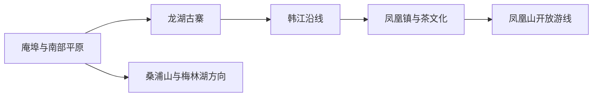
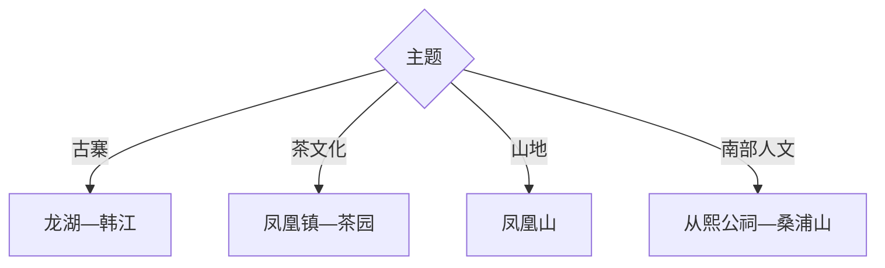

# 潮安旅行指南

潮安适合把潮州古城之外的古寨、单丛茶山、韩江村落与桑浦山片区独立展开：龙湖古寨是人文核心，凤凰镇承担茶文化与高山生态，庵埠和彩塘可观察潮汕工商业与饮食，南部桑浦山适合半日自然人文线。

## 城市速览

| 项目 | 信息 |
|---|---|
| 主线 | 庵埠—龙湖古寨—韩江沿线—凤凰镇—凤凰山—桑浦山 |
| 停留 | 古寨与韩江1天；凤凰茶山另加1天 |
| 住宿 | 庵埠适合交通，潮州古城适合联程，凤凰镇适合茶山早出 |
| 交通 | 从潮州、汕头或潮汕站进入，区内用公交、预约车或自驾 |
| 风险 | 凤凰山天气、茶园坡地、韩江水情、古寨消防与节假日拥堵 |
| 边界 | 凤凰山保护区、茶园生产线、古寨民宅、宗祠仪式区和陶瓷工厂按开放范围进入 |

## 城市格局与游览区域

固定 `Anbu / GeoNames 1818116` 对应潮安南部重要城镇，本页以法定潮安区 `Q1062490` 组织。龙湖古寨处在韩江中游，凤凰山在北部高地，桑浦山在南部；三片区适合分线而行。

## 主要景点

| 景点 | 区域 | 类型 | 核心体验 | 用时 | 环境 | 体力 | 预约风险 | 天气影响 | 优先级 |
|---|---|---|---|---:|---|---|---|---|---|
| 龙湖古寨 | 龙湖镇 | 传统村落 | 三街六巷、祠第民居与侨乡商贸史 | 3–6小时 | 室外为主 | 中 | 高 | 高 | A |
| 凤凰山生态旅游公开区 | 凤凰镇 | 山地生态 | 天池、杜鹃、山地景观与物种观察 | 1天 | 室外 | 高 | 极高 | 极高 | A |
| 凤凰单丛茶博物馆或正规茶文化点 | 凤凰镇 | 茶文化 | 单丛品种、制茶与工夫茶 | 2–4小时 | 室内外 | 低中 | 很高 | 中 | A |
| 凤凰镇公开茶园游线 | 凤凰镇 | 农业景观 | 茶园、村落与季节生产 | 3–6小时 | 室外 | 中高 | 很高 | 很高 | A |
| 从熙公祠 | 彩塘镇 | 古建筑 | 潮汕石雕与侨乡建筑 | 1–2小时 | 室内外 | 低 | 高 | 低 | B |
| 韩江潮安段公开碧道与古码头 | 龙湖等 | 河岸遗产 | 韩江、古驿道与聚落关系 | 2–4小时 | 室外 | 低中 | 中 | 很高 | B |
| 桑浦山公开人文生态点 | 南部 | 山地人文 | 山体、古寺书院与潮汕平原视野 | 半日 | 室外 | 中高 | 高 | 极高 | B |
| 潮安区博物馆或非遗展陈 | 区内 | 地方文博 | 潮安历史、陶瓷、茶与民俗 | 1.5–3小时 | 室内 | 低 | 很高 | 低 | B |

## 美食与餐饮

可按片区尝凤凰浮豆腐、工夫茶、牛肉火锅、粿品、蚝烙、卤味与庵埠凉果。茶叶选购先喝样、确认产区年份等级与净重，保留凭证；古寨小吃少量多样，山地日提前约午餐。

## 经典行程

### 一日经典线
**路线**：龙湖古寨—韩江公开碧道—潮州或庵埠晚餐。**逻辑**：以古寨为核心理解水运聚落。**预约锚点**：展陈、讲解和古建筑开放。**休息**：龙湖镇。**删除条件**：暴雨水情异常时只留古寨核心。

### 两日古寨茶山线
**路线**：首日龙湖与韩江；次日凤凰镇茶文化—公开茶园。**逻辑**：平原商贸与北部茶山分日。**预约锚点**：茶馆、茶园、车辆和住宿。**休息**：凤凰镇。**删除条件**：茶园生产繁忙时只看博物馆。

### 凤凰山线
**路线**：凤凰镇—景区公开入口—天池或规定步道—返程。**逻辑**：把高差和天气敏感段留完整一天。**预约锚点**：开放、交通、天气与林火。**休息**：游客中心。**删除条件**：雷雨、大雾或封山时取消。

### 单丛茶文化线
**路线**：茶文化展陈—正规茶园—工夫茶体验。**逻辑**：从知识到生产再到品饮。**预约锚点**：制茶季、接待、费用与交通。**休息**：凤凰镇。**删除条件**：采制繁忙时不进入生产区。

### 南部古建线
**路线**：区级展陈—从熙公祠—桑浦山公开点。**逻辑**：用室内背景连接石雕古建与山地文化。**预约锚点**：公祠、展馆和山路。**休息**：彩塘或庵埠。**删除条件**：高温雷雨时取消桑浦山。

### 亲子非遗线
**路线**：区级展陈—龙湖古寨短段—正规工夫茶或手作体验。**逻辑**：以可理解的建筑与技艺降低山地强度。**预约锚点**：年龄、材料与时长。**休息**：古寨公共服务点。**删除条件**：活动不适龄时只走古寨。

### 低体力线
**路线**：车辆到龙湖古寨核心—午休—从熙公祠。**逻辑**：两处平地古建减少爬升。**预约锚点**：落客、座椅和无障碍。**休息**：龙湖。**删除条件**：古寨客流高峰时只留展陈。

## 住宿区域

庵埠适合汕头方向交通与餐饮；潮州古城适合把潮安作为外围分线；凤凰镇适合茶山、日出和山地；龙湖周边适合古寨慢游。茶山民宿确认消防、山路、供餐和天气退改。

## 市内交通

潮汕站、潮州城区和汕头到潮安各片区的路径不同，先按当日主题选择入口。凤凰镇远于龙湖和庵埠，适合预约车或自驾；山区道路弯多，夜间和雨雾天气放慢速度。韩江沿线按水情选择公开碧道。

## 不同旅行者须知

古建爱好者优先龙湖和从熙公祠；茶客先学后买；徒步者把凤凰山作为独立日；低体力者走古寨平路。自然保护地核心区、茶园生产线、陶瓷车间、古寨私宅和宗祠非开放空间保留明确限制。

## 行前核对

- 核对龙湖古寨、凤凰山、茶文化点、公祠与区级展陈开放。
- 核对山区雷雨大雾、林火、韩江水情、公交和返程车辆。
- 茶园按经营者指定路线参观，古建遵守消防与摄影规则，购买茶叶保留凭证。

## 来源与更新记录

| 来源 | 支持内容 | 核验日期 |
|---|---|---|
| [潮安农文旅空间格局](https://www.chaoan.gov.cn/ywdt/zfdt/content/post_3927346.html) | 凤凰山、桑浦山、韩江与龙湖古寨 | 2026-09-01 |
| [GeoNames 1818116](https://www.geonames.org/1818116/) | Anbu 固定城镇点 | 2026-09-01 |
| [Wikidata Q1062490](https://www.wikidata.org/wiki/Q1062490) | 潮安区实体与跨库标识 | 2026-09-01 |

| 日期 | 更新 |
|---|---|
| 2026-09-01 | 首次完成潮安旅行研究，按古寨韩江、凤凰茶山与南部山地古建组织。 |
