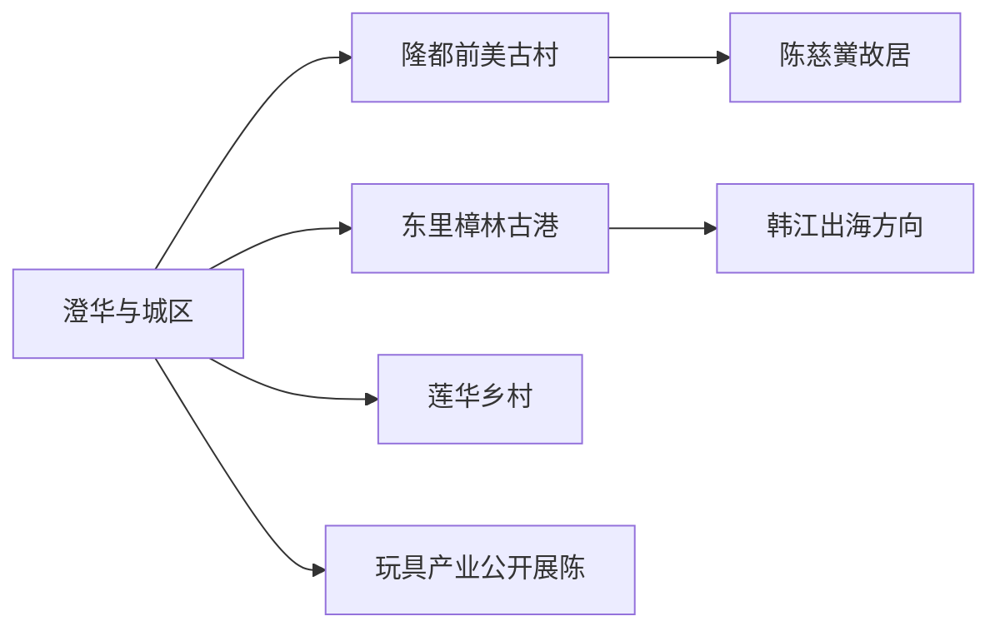
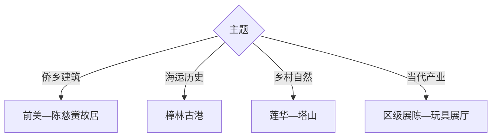

# 澄海旅行指南

澄海最清晰的旅行主线是“侨乡古村—红头船古港—莲华乡村”，再以玩具产业和澄海灯谜补足当代地方文化。前美古村与陈慈黉故居适合半日至一天，樟林古港和莲华各自另留半日。

## 城市速览

| 项目 | 信息 |
|---|---|
| 主线 | 澄华城区—前美古村—樟林古港—莲华乡村 |
| 停留 | 侨乡古港1天；增加莲华与产业文化共2天 |
| 住宿 | 澄华城区便于餐饮交通，汕头主城适合跨区联程 |
| 交通 | 从汕头站、潮汕机场或潮汕站转公路进入，区内以公交和预约车为主 |
| 风险 | 台风暴雨、高温、韩江水情、古建消防和乡村夜间返程 |
| 边界 | 古村民宅、宗祠仪式区、玩具工厂、仓储物流与河港作业区按开放范围进入 |

## 城市格局与游览区域

固定 `Chenghua / GeoNames 1815302` 对应澄海中心城区，本页以法定澄海区 `Q1028088` 组织。前美在隆都镇，樟林古港在东里镇，莲华位于北部丘陵，三个方向适合分线移动。

## 主要景点

| 景点 | 区域 | 类型 | 核心体验 | 用时 | 环境 | 体力 | 预约风险 | 天气影响 | 优先级 |
|---|---|---|---|---:|---|---|---|---|---|
| 前美古村侨文化旅游区 | 隆都镇 | 历史村落 | 潮汕民居、侨乡格局与村落空间 | 3–6小时 | 室内外 | 中 | 高 | 高 | A |
| 陈慈黉故居 | 前美村 | 侨乡建筑 | 中西合璧宅院、潮汕装饰与华侨史 | 2–4小时 | 室内外 | 中 | 很高 | 中 | A |
| 樟林古港公开区 | 东里镇 | 港口遗产 | 红头船、古港河与海上交通史 | 3–5小时 | 室外为主 | 低中 | 高 | 高 | A |
| 澄海区博物馆或区级展陈 | 城区 | 地方文博 | 澄海历史、民俗、侨乡与灯谜 | 1.5–3小时 | 室内 | 低 | 很高 | 低 | A |
| 莲华乡村旅游公开点 | 莲华镇 | 乡村生态 | 古村、农事、山水与季节活动 | 半日至1天 | 室外 | 中 | 很高 | 很高 | B |
| 塔山风景区当期开放区 | 莲上方向 | 山地人文 | 丘陵步道、宗教建筑与区内视野 | 3–5小时 | 室外 | 中高 | 很高 | 极高 | B |
| 玩具产业正规展厅或展会 | 城区 | 产业文化 | 创意设计、制造链与品牌展示 | 2–4小时 | 室内 | 低 | 极高 | 低 | B |
| 冠山书院等公开古建 | 澄华方向 | 古建文教 | 书院、宗族文教与地方建筑 | 1–2小时 | 室内外 | 低 | 极高 | 中 | C |

## 美食与餐饮

澄海可尝狮头鹅卤味、牛肉丸、粿品、鱼饭、蚝烙和潮汕砂锅粥。多人共享更容易覆盖卤鹅和海鲜；点单先确认部位、重量、时价、花生芝麻与海鲜过敏原。工夫茶体验重在冲泡与交流，购买茶叶按清晰产地和净重选择。

## 经典行程

### 一日经典线
**路线**：区级展陈—前美古村—陈慈黉故居。**逻辑**：先读地方史，再进入保存最集中的侨乡建筑群。**预约锚点**：故居与讲解。**休息**：隆都镇。**删除条件**：时间不足时合并古村与故居为一个核心单元。

### 两日侨港线
**路线**：首日前美；次日樟林古港—东里镇。**逻辑**：把侨乡家宅与出海港口放在连续历史链上。**预约锚点**：古港展陈、讲解和车辆。**休息**：东里镇。**删除条件**：水情或暴雨时缩短古港户外段。

### 三日乡村线
**路线**：前两日侨港线；第三日莲华正规乡村点—塔山当期开放线。**逻辑**：北部丘陵独占一日。**预约锚点**：乡村接待、塔山开放与天气。**休息**：莲华镇。**删除条件**：台风雷雨时整段删除。

### 雨天文化线
**路线**：区级展陈—玩具产业正规展厅—陈慈黉故居重点室内空间。**逻辑**：以地方史、产业与建筑细节降低户外暴露。**预约锚点**：展厅和故居。**休息**：城区。**删除条件**：极端天气按预警停止跨镇移动。

### 亲子创意线
**路线**：区级展陈—正规玩具展厅或公开活动—城区公园。**逻辑**：把制造业转化为设计与科普体验。**预约锚点**：年龄、活动和参观许可。**休息**：城区。**删除条件**：无公开接待时保留文博。

### 莲华乡村线
**路线**：莲华镇—正规农旅点—公开古村或步道—返程。**逻辑**：围绕已确认接待项目慢游。**预约锚点**：活动、供餐、道路和返程。**休息**：接待点。**删除条件**：季节不匹配时改樟林古港。

### 低体力线
**路线**：车辆到陈慈黉故居主要院落—午休—樟林古港平缓段。**逻辑**：车辆连接两处核心，控制古村长走。**预约锚点**：落客、台阶和座椅。**休息**：隆都或东里。**删除条件**：古建台阶负担较大时只留区级展陈。

## 住宿区域

澄华城区适合区内换线和地方餐饮；汕头中心城区适合把澄海作为一至两日外出；隆都和莲华仅在正规住宿及夜间交通确认后选择。看古港日住城区通常比跨镇晚归更稳妥。

## 市内交通

澄海与汕头中心区连续建成，但前美、樟林和莲华彼此距离明显。公交适合时间宽松的单线，自驾或预约车更利于两点组合。台风和强降雨期间关注桥梁、河道及乡村道路公告。

## 不同旅行者须知

建筑爱好者优先前美与陈慈黉故居；海洋史爱好者单列樟林古港；亲子家庭选择公开玩具展陈；乡村旅行者提前预约莲华。古村私宅、宗祠仪式区、工厂生产线、仓储物流与港口作业区保留明确限制。

## 行前核对

- 核对前美、陈慈黉故居、樟林古港、区级展陈、塔山与产业展厅开放。
- 核对台风暴雨、韩江水情、跨镇公交和夜间返程。
- 产业参访以正式展厅、展会或接待路线为准；古建和民宅按公布入口进入。

## 来源与更新记录

| 来源 | 支持内容 | 核验日期 |
|---|---|---|
| [汕头市政府：旅游景点](https://www.shantou.gov.cn/cnst/yxst/cszn/content/post_2546255.html) | 莲华乡村、前美古村、陈慈黉故居与红头船主题 | 2026-09-01 |
| [汕头人大：樟林古港与前美侨乡](https://rd.shantou.gov.cn/rd/zjshmst/201908/fc6ae069ca5044b9afe256bea56c9d0f.shtml) | 红头船、古港和侨乡历史关系 | 2026-09-01 |
| [GeoNames 1815302](https://www.geonames.org/1815302/) | Chenghua 固定城市点 | 2026-09-01 |
| [Wikidata Q1028088](https://www.wikidata.org/wiki/Q1028088) | 澄海区实体与跨库标识 | 2026-09-01 |

| 日期 | 更新 |
|---|---|
| 2026-09-01 | 首次完成澄海旅行研究，按前美侨乡、樟林古港、莲华与玩具产业组织。 |
