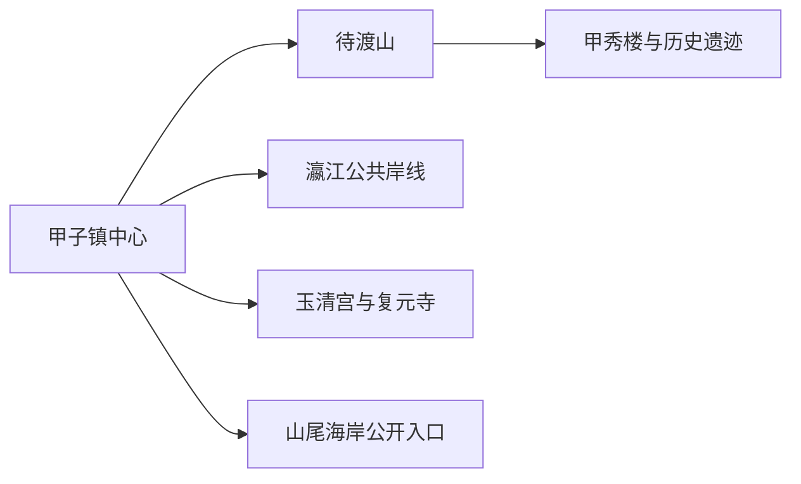
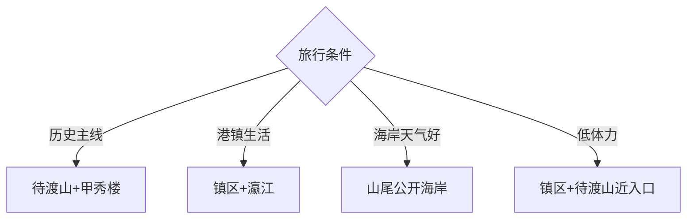

# 甲子镇旅行指南

甲子镇位于陆丰东南海岸和瀛江入海口，适合用一至两天看待渡山甲秀楼、港镇历史、地方庙宇、海岸公共空间与甲子鱼丸。它与陆丰东海主城、碣石玄武山分处不同方向，安排甲子时以镇内住宿和返程交通为先。

## 城市速览

| 项目 | 信息 |
|---|---|
| 主线 | 甲子镇区—待渡山—甲秀楼—瀛江公共岸线—甲子港生活 |
| 停留 | 核心 1 天；增加海岸与宗教文化共 2 天 |
| 住宿 | 镇中心便于餐饮与接驳；正规滨海住宿适合早晚海岸但先核对交通 |
| 交通 | 从陆丰东站、陆丰主城或汕尾方向经公路进入，镇内公交与短途车辆为主 |
| 风险 | 台风风暴潮、高温雷雨、海岸湿滑、港区车辆与渔业生产 |
| 边界 | 码头、避风锚地、海塘、水闸、学校、宗教场所和在产工场按公开范围进入 |

## 城市格局与游览区域

固定 **Jiazi / GeoNames 1805935** 对应陆丰市甲子镇。待渡山在甲子港岸边，是历史与观景主线；镇区集中住宿、餐饮和公共服务；瀛江、甲子门和山尾海岸分别涉及河口、港湾与外海环境。甲东、甲西虽与甲子相邻，仍按各自道路和开放点核对，不把生产岸线串成连续海滨步道。

## 主要景点

| 景点 | 区域 | 类型 | 核心体验 | 用时 | 环境 | 体力 | 研究价值 | 拥挤 | 优先级 |
|---|---|---|---|---:|---|---|---|---|---|
| 待渡山 | 东宫社区 | 历史山地 | 宋末海防记忆、山石与港湾视野 | 2–3小时 | 室外 | 中 | 很高 | 节庆高 | A |
| 甲秀楼—进食亭—复翁亭公开遗迹 | 待渡山 | 历史遗迹 | 地方记忆、古塔与摩崖线索 | 1–2小时 | 室外 | 中 | 很高 | 中 | A |
| 甲子港与瀛江公共观景点 | 镇东南 | 港镇景观 | 河口、渔港生活与潮汐地理 | 1–2小时 | 室外 | 低中 | 高 | 开渔时高 | B |
| 玉清宫开放区 | 甲子镇 | 宗教建筑 | 地方信俗与建筑空间 | 1–1.5小时 | 混合 | 低 | 高 | 节庆高 | B |
| 复元寺开放区 | 甲子镇 | 宗教场所 | 寺院建筑与地方宗教生活 | 1–1.5小时 | 混合 | 低 | 中 | 节庆高 | C |
| 山尾海岸正式开放点 | 镇南海岸 | 海岸 | 海景、风浪与滨海地貌 | 1–3小时 | 室外 | 中 | 中 | 节假日高 | B |
| 甲秀书院历史线索 | 甲子镇区 | 教育史 | 书院传统与地方碑刻背景 | 0.5–1小时 | 外观为主 | 低 | 高 | 低 | C |
| 镇区非遗与饮食生活 | 镇中心 | 生活文化 | 甲子鱼丸、英歌及港镇日常 | 1–2小时 | 混合 | 低 | 高 | 活动时高 | B |

## 美食与餐饮

甲子鱼丸是最明确的地方饮食线索，也可选择咸茶、菜茶、粿品、海鲜和港镇家常菜。鱼丸配方可能含鱼、淀粉、蛋或调味料，过敏者逐店确认；海鲜按重量点单时先看活鲜、单价、加工费和熟度，开渔活动与节假日以明码标价的正规经营者为先。

## 经典行程

### 一日基础线
**路线**：镇中心—待渡山—甲秀楼遗迹—瀛江公共观景点—甲子鱼丸。**逻辑**：先读历史，再看港镇地理与生活。**预约锚点**：待渡山、宗教点和返程车。**休息**：镇中心。**删除条件**：大风暴雨时删山顶和岸线。

### 待渡山历史线
**路线**：正式入口—进食亭—复翁亭—甲秀楼—原路返回。**逻辑**：按公开步道集中理解宋末地方记忆。**预约锚点**：入口开放与现场维护。**休息**：山下服务点。**删除条件**：湿滑、雷雨或封闭时只看镇区史料。

### 港镇生活线
**路线**：甲子镇街—正规餐饮—瀛江公共岸线—甲子港观景点。**逻辑**：把饮食与港口城市地理结合。**预约锚点**：潮汐和交通。**休息**：镇区。**删除条件**：港区作业或管制时止于公共街区。

### 宗教文化线
**路线**：玉清宫开放区—复元寺开放区—镇区生活。**逻辑**：选择两个明确开放点理解地方信俗。**预约锚点**：宗教活动和开放时段。**休息**：镇中心。**删除条件**：法会或内部管理调整时尊重现场安排。

### 海岸半日线
**路线**：镇中心—山尾海岸正式入口—安全观景段—原路返回。**逻辑**：用单一海岸点控制潮汐与返程。**预约锚点**：气象、潮汐和开放公告。**休息**：入口服务区。**删除条件**：台风、风暴潮、雷暴或无救生管理时取消。

### 非遗饮食线
**路线**：官方活动主会场—英歌或民俗展演—甲子鱼丸与粿品。**逻辑**：围绕真实活动组织体验。**预约锚点**：日期、观众区和交通管制。**休息**：镇区餐饮。**删除条件**：活动停办时改港镇生活线。

### 低体力线
**路线**：车辆到待渡山近入口—镇中心午休—瀛江平缓公开段。**逻辑**：以短步行和多次坐休保留代表体验。**预约锚点**：下客点、坡度和卫生间。**休息**：每站安排。**删除条件**：湿热或大风时只留镇区饮食。

## 住宿区域

甲子镇中心适合餐饮、日常补给和公路接驳；待渡山—瀛江方向方便早晚历史与港湾短线；滨海住宿以正式登记、台风退改、电梯、热水和夜间交通为筛选条件。陆丰主城住宿选择更多，但往返甲子会增加公路时间，早出或活动晚归时更适合在镇内住一晚。

## 市内交通

甲子与陆丰主城、陆丰东站之间主要依靠公路交通，历史公交线路只作为网络线索，出发前核对当日站位、班次和最晚返程。镇内多数点可用公交、短途车辆加分段步行串联；待渡山、海岸和宗教点按正式入口下客。渔港作业路、码头和防波设施服务生产与防灾，旅行路线保留在公共道路和开放观景区。

## 不同旅行者须知

历史兴趣者优先待渡山；饮食旅行者安排甲子鱼丸与港镇市场；海岸旅行者把气象和潮汐放在首位；亲子和长者选择镇区、待渡山近入口与公共岸线短段。宗教场所保持安静，摄影、服装和内部区域遵循现场规则。

## 行前核对

- 核对待渡山、宗教点、山尾海岸及官方非遗活动开放。
- 核对陆丰东站或主城到甲子的公路交通、末班和台风暴雨预警。
- 港区、避风锚地、船舶、海塘工程与学校院落按管理边界进入。

## 来源与更新记录

| 来源 | 支持内容 | 核验日期 |
|---|---|---|
| [甲子镇政府：乡镇概况](https://www.lufengshi.gov.cn/lfsjzz/jdgk/content/post_868666.html) | 镇域位置、待渡山、玉清宫、复元寺、山尾海岸、住宿与餐饮结构 | 2026-09-01 |
| [甲子镇政府：待渡山](https://www.lufengshi.gov.cn/lfsjzz/jdgk/lyjd/content/post_866314.html) | 待渡山、甲秀楼、进食亭、复翁亭和甲子吞潮历史线索 | 2026-09-01 |
| [陆丰城市指南](./陆丰市.md) | 甲子与陆丰主城边界、饮食及公路接驳关系 | 2026-09-01 |
| [GeoNames 1805935](https://www.geonames.org/1805935/) | Jiazi 固定人口点与位置 | 2026-09-01 |

| 日期 | 更新 |
|---|---|
| 2026-09-01 | 首次完成甲子镇旅行研究；建立待渡山、港镇、海岸、住宿与交通的独立旅行结构。 |

