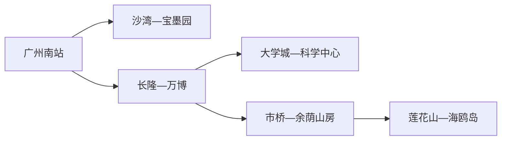
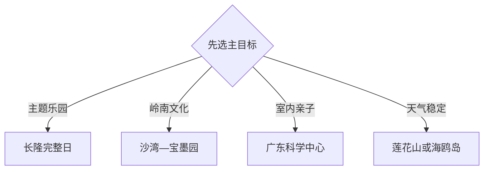

# 番禺旅行指南

番禺位于广州主城南侧，广州南站、长隆、万博—汉溪、市桥—沙湾、大学城和莲花山—海鸥岛分成数个旅行片区。第一次来，最实用的做法是先选一个主目标：主题乐园用完整一天，沙湾与宝墨园组成岭南文化日，大学城与广东科学中心组成场馆日，莲花山与海鸥岛则留给天气稳定的东部远线。

> 建议停留：2–4 天；长隆通常单列 1–2 天 
> 旅行关键词：长隆、沙湾古镇、宝墨园、余荫山房、广东科学中心、莲花山、海鸥岛、广州南站 
> 主要体力：中等；大型园区、古村石路和东部远线步行较多 
> 最近研究：2026-08-13

## 城市速览

| 项目 | 旅行信息 |
|---|---|
| 主要旅行价值 | 在广州南部用几天分别体验大型主题度假、岭南古镇园林、科普场馆与珠江口岸线，而不是把番禺当作广州南站周边的短暂停留地 |
| 建议停留 | 2 天可选长隆加沙湾；3 天加入大学城或余荫山房；4 天再安排莲花山—海鸥岛 |
| 较舒适季节 | 秋冬与春季通常更适合户外；盛夏优先室内场馆和有遮阴的园区，台风与强对流期间按公告调整 |
| 预算特点 | 公共街区与部分场馆便于控费；主题乐园、度假酒店、演艺和跨片区用车是主要增量 |
| 步行强度 | 长隆、科学中心、古镇园林和莲花山各自都有完整园区尺度；一天集中一个片区更省体力 |
| 主要天气风险 | 高温高湿、雷暴、短时强降雨与台风；海鸥岛和江岸还受大风、水位与道路条件影响 |
| 独行旅行 | 市桥、万博和大学城餐饮交通便利；东部远线先锁返程，主题园区提前确认单人项目与寄存 |
| 亲子旅行 | 长隆与科学中心主题清楚；按年龄、身高、午休和推车规则择一，避免同日跨到古镇或东部岸线 |
| 长者与低体力旅行 | 可选余荫山房或沙湾核心短线，以车辆连接片区；大型乐园、莲花山坡道和古村石路按体力减量 |
| 无障碍信息 | 广州南站与现代场馆可先查官方服务；古镇、园林和景区内部连续性资料有限，设施连续性需向官方确认 |

## 城市格局与游览区域

番禺区法定行政代码为 `440113`，是广州市辖区。固定 GeoNames `1795055` 是市桥一带的 `P/PPLA3` 城市点，Wikidata `Q948245` 表达番禺区并以同一 ID 作位置交叉核对；坐标用于识别主城锚点，旅行范围仍以番禺区行政边界为准。

| 区域 | 主要内容 | 游览特点 | 与其他区域的关系 |
|---|---|---|---|
| 长隆—汉溪—万博 | 长隆旅游度假区、商业与住宿 | 主题园区早进晚出，适合连续住宿 | 与广州南站联系方便；一次只选一个主要园区 |
| 市桥—沙湾 | 市桥生活区、沙湾古镇、番禺博物馆 | 餐饮与城市服务集中，古镇适合半日至一日 | 可与宝墨园同日，用车辆连接 |
| 番禺西部 | 宝墨园、岭南园林与乡村 | 园林和古建主题明确 | 从沙湾继续向西最顺路 |
| 大学城—小谷围 | 广东科学中心、大学校园公共空间 | 室内科普加开阔户外 | 可从万博或广州主城轨道抵达 |
| 南村—余荫山房 | 余荫山房、岭南古典园林 | 适合半日慢游 | 可与市桥生活区组合，不与东部远线硬拼 |
| 莲花山—石楼 | 莲花山旅游区、珠江口岸线 | 山坡、古迹与江景并重 | 作为东部整日主目标 |
| 海鸥岛 | 岛上村落、绿道和农业景观 | 骑行与自驾受天气、路况和返程影响 | 与莲花山同方向，按体力二选一或缩短 |

长隆各主题园区共同组成一个度假区，行程按所购园区和当日开放安排，不把内部展区重复计作多个城市景点。海鸥岛仍有居民生活、农业、水利和岸线管理空间，路线应沿公开道路与正式经营点组织；莲花山文保范围、码头和临水区域按现场开放边界游览。

## 主要景点

优先级用于安排时间：**A** 为首访核心，**B** 为兴趣补充，**C** 为远郊、季节性或通常占用半日以上的目的地。

### 主题度假与现代场馆

| 景点 | 区域 | 类型 | 主要看点 | 建议用时 | 室内外 | 体力 | 预约风险 | 天气影响 | 优先级 |
|---|---|---|---|---:|---|---|---|---|---|
| 广州长隆旅游度假区 | 汉溪长隆 | 综合主题度假区 | 按兴趣选择野生动物、游乐、演艺或水上主题中的一个主要园区 | 1–2 天 | 混合 | 高 | 很高 | 中高 | A |
| 广东科学中心 | 大学城 | 科普场馆 | 大型互动展览、科学教育与亲子体验 | 3–5 小时 | 室内为主 | 中 | 中高 | 低 | A |
| 番禺博物馆 | 市桥方向 | 地方博物馆 | 番禺历史、考古与地方文化，适合作为古镇日前导 | 2–3 小时 | 室内 | 低 | 中 | 低 | B |

### 岭南古镇、园林与东部岸线

| 景点 | 区域 | 类型 | 主要看点 | 建议用时 | 室内外 | 体力 | 预约风险 | 天气影响 | 优先级 |
|---|---|---|---|---:|---|---|---|---|---|
| 沙湾古镇 | 沙湾 | 历史街区 | 岭南村落格局、宗祠建筑、音乐与饮食传统 | 3–5 小时 | 混合 | 中 | 中 | 中高 | A |
| 宝墨园 | 西部 | 岭南园林 | 园林、水系、建筑装饰与地方文化展示 | 3–4 小时 | 室外为主 | 中 | 中高 | 高 | A |
| 余荫山房 | 南村 | 古典园林 | 紧凑岭南园林空间、古建与水院 | 2–3 小时 | 混合 | 中 | 中高 | 中 | A |
| 莲花山旅游区 | 石楼 | 山地、古迹与江景 | 山体、历史遗存与珠江口景观 | 4–6 小时 | 室外为主 | 中高 | 中高 | 高 | B |
| 海鸥岛公开游览带 | 东部岛区 | 岛屿乡村与绿道 | 珠江口农业村落、骑行与岸线风景 | 3–6 小时 | 室外 | 中至高 | 中 | 很高 | C |

## 美食与餐饮

市桥、万博和广州南站周边适合解决稳定正餐；沙湾可围绕传统小吃安排，海鸥岛与东部乡村则优先选择证照、菜单和返程都清楚的经营点。

| 菜品或餐饮类型 | 常见区域 | 一个人用餐与常见份量 | 风味、过敏原与饮食限制 | 排队风险与替代方法 |
|---|---|---|---|---|
| 沙湾姜埋奶、双皮奶等奶品 | 沙湾、市桥 | 适合单份尝试 | 含乳制品和糖，蛋奶过敏或乳糖不耐先问配方 | 热门时段换同类正规甜品店 |
| 番禺河鲜与粤式蒸鱼 | 市桥、沙湾、石楼 | 多为称重或整条共享 | 鱼刺、贝类、甲壳类及酱油小麦风险 | 先问时价、重量和加工费；单人改点例份菜 |
| 粥、肠粉、云吞面 | 市桥与成熟社区 | 便于一人点单 | 米浆、蛋、虾米、小麦和芝麻按店确认 | 早餐高峰换邻近社区店 |
| 莲藕、菱角与时令农产 | 沙湾、海鸥岛方向 | 小份菜或正规包装更易控制 | 关注糖油和储存条件 | 选明码标价、可追溯产品，不为采购进入生产田地 |

## 经典行程

### 一日经典路线

**路线**：沙湾古镇 → 沙湾午餐 → 宝墨园 → 市桥晚餐

- **串联逻辑**：两处同在番禺西部，用一次车辆转场连接古镇与园林，主题完整且不跨到大学城或东部。
- **预约锚点**：先查宝墨园与沙湾收费展陈的开放、门票和停车。
- **休息安排**：午餐放在沙湾；下午在宝墨园游客服务区休息。
- **时间不足时**：保留沙湾核心街区，删除宝墨园，不压缩成傍晚赶场。

### 两日城市路线

**第 1 天**：长隆所选一个主要园区完整游览 
**第 2 天**：广东科学中心 → 大学城午餐与公共空间 → 市桥或万博

- **串联逻辑**：第一天专注大型园区，第二天用室内科普和交通较清楚的大学城降低强度。
- **预约锚点**：长隆票种与园区、科学中心入馆名额。
- **休息安排**：两天均在园区或大学城成熟商业区安排午休。
- **时间不足时**：第二天只保留科学中心；不把两个长隆园区塞进同一天。

### 三日深度路线

**第 1 天**：长隆完整日 
**第 2 天**：沙湾古镇 → 宝墨园 
**第 3 天**：余荫山房 → 市桥生活区或番禺博物馆

- **串联逻辑**：三天分别承担主题度假、岭南古镇园林和主城文化，减少来回换区。
- **预约锚点**：长隆、余荫山房及博物馆当期规则。
- **休息安排**：每天中午回到同片区餐饮区，不跨区找单店。
- **时间不足时**：第三天删除市桥附加项，只留余荫山房；两天时直接删第三天。

### 雨天路线

**路线**：广东科学中心 → 大学城室内午餐 → 番禺博物馆或万博商业区

- **适用条件**：普通降雨可执行；台风、雷暴红色预警或大面积积水时按官方指引调整出行。
- **预约锚点**：先确认两馆开放和交通运行。
- **休息安排**：以科学中心和万博室内空间为主。
- **时间不足时**：只留科学中心，博物馆改至其他天。

### 亲子或低体力路线

**亲子路线**：广东科学中心 → 大学城午休 → 同馆或附近一段公共空间 
**低体力路线**：余荫山房核心开放区 → 车辆前往市桥午餐 → 番禺博物馆

- **减负方式**：亲子线减少跨区与排队项目；低体力线用车辆连接园林与场馆，并提前确认台阶、电梯和最近下客点。
- **预约锚点**：科学中心、余荫山房、博物馆及儿童票规则。
- **休息安排**：分别使用场馆服务区和市桥成熟餐饮区。
- **时间不足时**：两条路线都只保留第一处主目标。

### 远郊一日路线

**路线**：市桥或万博出发 → 莲花山旅游区 → 石楼午餐 → 海鸥岛公开道路短段 → 返回

- **适用条件**：天气稳定、返程车辆明确；骑行者另查租还点、头盔与道路条件。
- **预约锚点**：莲花山开放、海鸥岛当日交通和活动入口。
- **休息安排**：莲花山游客区与石楼城区分别承担上午、午间休息。
- **时间不足时**：删除海鸥岛，只完成莲花山；大风或强降雨时整段改为室内日。

## 住宿区域

| 区域 | 优点 | 缺点 | 适合人群 | 交通特点 |
|---|---|---|---|---|
| 汉溪长隆—万博 | 主题园区、商业和餐饮集中 | 度假酒店价格波动，离老城较远 | 长隆、亲子、连续两晚 | 地铁连接广州南站与主城，园区末端按运营安排 |
| 广州南站周边 | 高铁抵离和早晚班方便 | 站区不等于市桥或景区中心 | 中转、早车、短住 | 先确认酒店实际出入口与站内步行距离 |
| 市桥 | 本地餐饮、住宿和跨片区叫车较均衡 | 到长隆、大学城、莲花山仍需换乘 | 多主题、独行、预算弹性 | 适合作为番禺综合基地 |
| 大学城 | 场馆与校园环境相对安静 | 夜间与假期餐饮选择随校历变化 | 科普、校园、安静住宿 | 轨道进出，前往西部与东部需换乘 |
| 沙湾或莲花山周边 | 便于清晨慢游或专题拍摄 | 住宿密度与夜间交通较有限 | 古镇、园林、东部专题 | 订房前落实返程、停车和正规经营资质 |

## 市内交通

| 场景 | 建议与取舍 | 行前需要重查的内容 |
|---|---|---|
| 从广州南站抵达 | 先按住宿片区选择轨道、公交或正规叫车；站内换乘距离较长 | 到发口、末班、行李通道、无障碍服务与施工 |
| 前往长隆与万博 | 轨道适合到主要片区，园区内部按官方接驳和入口走 | 所购园区入口、接驳、寄存、闭园与散场交通 |
| 市桥—沙湾—宝墨园 | 公交或车辆串联，先锁最远端返程 | 末班、停车、节假日管制与下客点 |
| 大学城与东部远线 | 大学城可用轨道；莲花山、海鸥岛需叠加公交或车辆 | 渡口或道路状态、骑行规则、水情、大风与夜间返程 |
| 自驾 | 对西部园林和东部岸线更灵活；热门园区停车压力大 | 预约停车、限行、台风封闭和景区导航入口 |

## 不同旅行者须知

| 旅行维度 | 可行条件 | 主要取舍 | 需额外核对 |
|---|---|---|---|
| 独行旅行 | 市桥、万博、大学城交通餐饮成熟 | 东部远线先锁返程，称重河鲜改选例份菜 | 末班、夜间上客点、单人项目资格 |
| 亲子旅行 | 科学中心或一个长隆园区可形成完整日 | 按儿童年龄、午休与推车条件择一 | 身高规则、儿童预约、寄存与医务点 |
| 长者或低体力旅行 | 园林、博物馆可用车辆组成减量日 | 古村石路、山坡与大型园区步行明显 | 最近下客点、台阶、电梯、休息座椅 |
| 无障碍需求 | 现代交通枢纽与场馆信息相对集中 | 历史建筑与岛区道路连续性差异大 | 设施连续性需向官方确认 |
| 摄影旅行 | 古镇、园林与东部岸线题材多样 | 热门时段拥挤，商业拍摄另有规则 | 三脚架、无人机、演出和文保拍摄规定 |
| 预算有限 | 市桥生活区、公共街区和场馆组合较好控费 | 长隆与度假酒店是最大增量 | 免费日、票种、寄存、接驳和退改 |
| 特殊天气 | 室内场馆可替代普通雨天户外 | 台风、雷暴与积水时以减少移动为先 | 广州气象预警、景区停运与轨道公告 |

## 行前核对

| 核对事项 | 为什么需要重查 | 建议核对时间 | 官方入口 |
|---|---|---|---|
| 长隆园区、票种与演艺 | 各园区互不替代，项目与散场安排会变 | 订票前及当天 | [广州长隆](https://www.chimelong.com/gz/) |
| 沙湾、余荫山房、宝墨园 | 开放、收费展陈与活动按运营调整 | 排入路线前一周 | [番禺区政府文旅入口](https://www.panyu.gov.cn/zcfc/lygk/fzxbj/) |
| 科学中心与博物馆 | 预约、闭馆日和展厅维护会变化 | 出发前一周及当天 | [广东科学中心](https://www.gdsc.cn/)；[番禺区政府](https://www.panyu.gov.cn/) |
| 莲花山与海鸥岛 | 天气、水位、道路和活动入口影响较大 | 出发前三日及当天 | [番禺区政府](https://www.panyu.gov.cn/) |
| 铁路与城市交通 | 班次、末班、施工和临时管制会变化 | 订票时及当天 | [中国铁路 12306](https://www.12306.cn/)；[广州交通](https://jtj.gz.gov.cn/) |
| 台风、雷暴与高温 | 户外园区和岸线安排对预警敏感 | 出发前三日及当天 | [广州市气象局](https://tqyb.com.cn/) |

## 来源与更新记录

### 主要来源

| 来源 | 类型 | 支持内容 | 核验日期 |
|---|---|---|---|
| [番禺新八景](https://www.panyu.gov.cn/zcfc/lygk/fzxbj/) | 区政府 | 长隆、莲花山、海鸥岛、宝墨园、大学城、余荫山房、沙湾与博物馆的市域结构 | 2026-08-13 |
| [番禺区旅游分区与线路答复](https://www.panyu.gov.cn/zwgk/yajytacl/2023/ya/content/post_9348594.html) | 区政府 | 西部、中央、东部与北部旅游片区及交通组合 | 2026-08-13 |
| [余荫山房](https://www.panyu.gov.cn/jgzy/qzfbm/fzqwhgdlytyj/lyj/zzjg/whjgxx/content/post_8880636.html) | 区文旅部门 | 园林身份、位置与管理入口 | 2026-08-13 |
| [沙湾镇概况](https://www.panyu.gov.cn/jgzy/zzfjdbsc/fzqswzrmzf/zjgk/) | 镇政府 | 沙湾与宝墨园的属地和旅游背景 | 2026-08-13 |
| [广州市政府定价景区目录通知](https://fgw.gz.gov.cn/gkmlpt/content/6/6478/post_6478596.html) | 市发展改革部门 | 沙湾、莲花山、余荫山房等景区票务管理背景及目录附件入口 | 2026-08-13 |
| [番禺区国土空间规划](https://cms.gz.gov.cn/gzzcwjk/storage/material/2025/03/28/21c08cb237e4935ca3e0324b8c35bfd5.pdf) | 市、区政府规划 | 行政空间、生态与生产边界 | 2026-08-13 |
| [GeoNames 1795055](https://www.geonames.org/1795055/) | 开放地理数据 | 市桥城市点名称、分类与坐标 | 2026-08-13 |
| [Wikidata Q948245](https://www.wikidata.org/wiki/Q948245) | 开放结构化数据 | 番禺区实体、行政层级与 GeoNames 交叉标识 | 2026-08-13 |

固定清单中的 GeoNames `1795055` 是市桥主城点；本页以法定番禺区 `440113` 为旅行范围。番禺是广州市辖区，因此本页计入 GeoNames 指南覆盖，不计入全国 695 个法定城市账本。

### 更新记录

| 日期 | 更新内容 |
|---|---|
| 2026-08-13 | 首次完成番禺区独立旅行研究；拆分长隆、市桥—沙湾、大学城、余荫山房、莲花山—海鸥岛尺度，补充路线、住宿、交通、天气、岸线与生产空间边界 |
