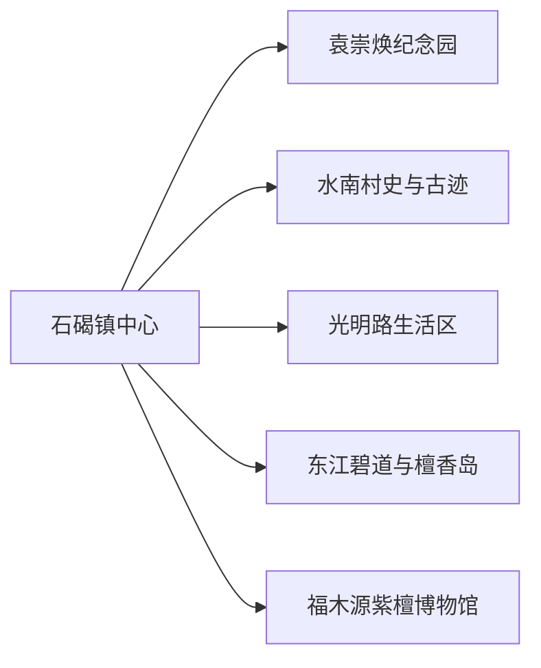
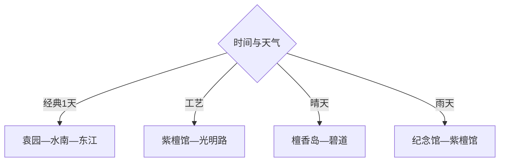

# 石碣旅行指南

石碣适合用一天理解东江水乡、袁崇焕纪念文化、旧村史与红木工艺。镇域尺度紧凑，但水南、袁园、檀香岛和东江沿线仍需短途接驳；它可作为东莞城市旅行中的独立一日，也适合广州方向短途到访。

## 城市速览

| 项目 | 信息 |
|---|---|
| 主线 | 袁崇焕纪念园—水南村—光明路—紫檀博物馆—东江碧道 |
| 停留 | 核心1天；增加檀香岛或非遗活动共1.5天 |
| 住宿 | 镇中心方便餐饮，东莞主城适合更丰富的夜间选择 |
| 交通 | 从东莞站、东莞主城或广州方向轨道与公路衔接，镇内公交、网约车和步行为主 |
| 风险 | 岭南高温暴雨、东江水情、滨水骑行交叉与节庆客流 |
| 边界 | 堤防、水利设施、工业生产区、村落院落与文保建筑按开放范围进入 |

## 城市格局与游览区域

固定 `Shijie / GeoNames 1916862` 对应东莞市石碣镇，本页以 `Q7496512` 确定镇级实体。它由东莞市直辖镇级行政体系管理，旅行上有独立的文化、餐饮和滨水动线，仍可与东莞主城共享住宿与区域交通。

## 主要景点

| 景点 | 区域 | 类型 | 核心体验 | 用时 | 环境 | 体力 | 预约风险 | 天气影响 | 优先级 |
|---|---|---|---|---:|---|---|---|---|---|
| 袁崇焕纪念园 | 水南方向 | 纪念园 | 袁崇焕生平、岭南园林与纪念空间 | 2–4小时 | 混合 | 低中 | 中 | 中 | A |
| 水南村史馆及公开古迹 | 水南村 | 村史与建筑 | 村落史、碉楼和水乡聚落线索 | 2–3小时 | 混合 | 中 | 高 | 中 | A |
| 文阁塔与码头公开空间 | 水南 | 历史节点 | 东江交通、古塔与滨水关系 | 1–2小时 | 室外 | 低中 | 中 | 高 | B |
| 福木源紫檀博物馆 | 镇内 | 工艺博物馆 | 红木、紫檀工艺与收藏展陈 | 1.5–3小时 | 室内 | 低 | 高 | 低 | A |
| 檀香岛公开体验区 | 东江沿线 | 乡村休闲 | 岛屿、林木与水乡慢游 | 2–4小时 | 室外 | 中 | 高 | 很高 | B |
| 东江碧道石碣公开段 | 东江沿线 | 滨水慢行 | 江景、骑行与堤岸公共空间 | 2–4小时 | 室外 | 中 | 中 | 很高 | A |
| 刘屋抗日战斗遗址纪念公园 | 刘屋方向 | 纪念地 | 地方抗战史与纪念空间 | 1–2小时 | 室外为主 | 低 | 中 | 中 | B |
| 光明路与非遗生活空间 | 镇中心 | 街区 | 餐饮、传统技艺与镇区日常 | 1–3小时 | 混合 | 低 | 低 | 中 | B |

## 美食与餐饮

镇中心和光明路一带适合东莞烧鹅、濑粉、腊味、糖水与水乡家常菜，节庆时可关注官方发布的非遗小吃。共享菜先问份量，海鲜与坚果过敏原主动确认；农产与工艺品选择正规门店。

## 经典行程

### 一日经典线
**路线**：袁崇焕纪念园—水南村史—光明路午餐—东江碧道。**逻辑**：人物、村史与水乡地理逐层展开。**预约锚点**：纪念园和村史馆。**休息**：光明路。**删除条件**：暴雨时取消碧道。

### 英雄文化线
**路线**：袁崇焕纪念园—水南碉楼—文阁塔—刘屋纪念公园。**逻辑**：从明代人物到近现代地方史。**预约锚点**：场馆与讲解。**休息**：水南。**删除条件**：点位未开放时保留袁园。

### 水乡慢游线
**路线**：东江碧道—码头公共空间—檀香岛公开区。**逻辑**：围绕东江岸线展开。**预约锚点**：岛上接待、水情与骑行规则。**休息**：正式驿站。**删除条件**：台风、暴雨或水利管控时取消。

### 工艺与街区线
**路线**：福木源紫檀博物馆—光明路—镇中心餐饮。**逻辑**：把工艺展陈和现实生活相连。**预约锚点**：博物馆。**休息**：光明路。**删除条件**：闭馆时只留街区。

### 非遗活动线
**路线**：官方活动场地—传统技艺展演—水乡餐饮。**逻辑**：按当期节目选择一项深看。**预约锚点**：日期、名额与场地。**休息**：镇中心。**删除条件**：活动日期不匹配时改经典线。

### 雨天线
**路线**：袁崇焕纪念园室内展陈—紫檀博物馆—光明路。**逻辑**：减少滨水与岛屿暴露。**预约锚点**：两馆开放。**休息**：室内商业空间。**删除条件**：强对流时缩成单馆。

### 低体力线
**路线**：车辆到袁园—紫檀博物馆—光明路短段。**逻辑**：减少碧道长走和村巷高差。**预约锚点**：落客与无障碍。**休息**：两馆。**删除条件**：高温时保留室内。

## 住宿区域

石碣镇中心适合完成一日线并就近用餐；东莞站周边便于跨镇和广深联程；东莞主城区适合更丰富的住宿、夜间活动和次日换线。订房时按轨道站、公交与打车时间选择，而不是只看行政距离。

## 市内交通

石碣可从东莞站、主城区及广州方向进入，镇内公交和网约车连接各片区。水南村与碧道适合分段步行或骑行，先确认共享交通停放范围；东江水情或赛事会影响岸线，使用当日开放入口。

## 不同旅行者须知

历史兴趣者走袁园与水南；工艺兴趣者选紫檀馆；亲子适合纪念园和短段碧道；低体力者用车辆串两馆。堤防和水利设施、工业厂区、私人院落、农作区域及未开放文保建筑保留明确限制。

## 行前核对

- 核对袁崇焕纪念园、村史馆、紫檀博物馆、檀香岛及非遗活动开放。
- 核对轨道公交、碧道水情、台风暴雨、骑行规则与夜间返程。
- 村落拍摄先沟通，东江岸线走公开步道，工厂与水利设施按管理边界通行。

## 来源与更新记录

| 来源 | 支持内容 | 核验日期 |
|---|---|---|
| [石碣春季文旅路线](https://www.dg.gov.cn/shijie/yw/content/post_4356371.html) | 袁崇焕纪念园、紫檀博物馆、檀香岛与镇区路线 | 2026-09-01 |
| [石碣英雄文化路线](https://www.dg.gov.cn/shijie/yw/tpxw/content/mpost_4215623.html) | 水南村史、碉楼、文阁塔与檀香岛 | 2026-09-01 |
| [东莞市文化广电旅游体育局](https://wglt.dg.gov.cn/gkmlpt/content/3/3605/post_3605935.html) | 袁崇焕纪念园机构信息 | 2026-09-01 |
| [GeoNames 1916862](https://www.geonames.org/1916862/) | Shijie 固定镇级点 | 2026-09-01 |
| [Wikidata Q7496512](https://www.wikidata.org/wiki/Q7496512) | 石碣镇实体与跨库标识 | 2026-09-01 |

| 日期 | 更新 |
|---|---|
| 2026-09-01 | 首次完成石碣旅行研究，按袁园、水南、工艺与东江水乡组织。 |
