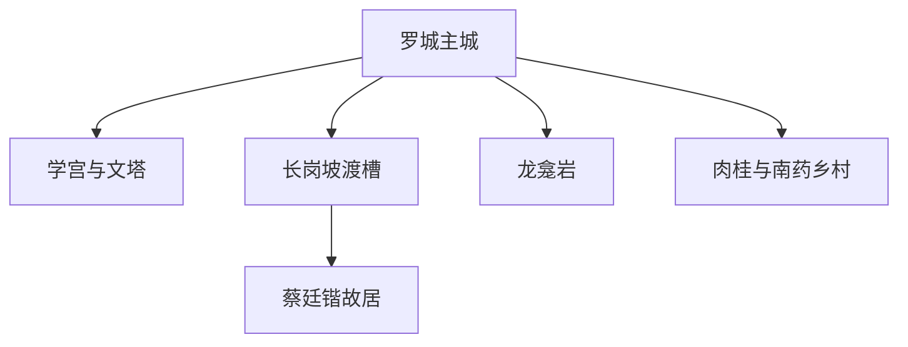
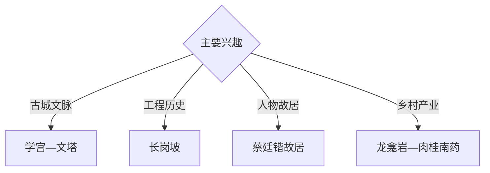

# 罗定旅行指南

罗定位于粤西罗定盆地，以罗城历史文化、长岗坡渡槽、罗定学宫与文塔、蔡廷锴故居、龙龛岩摩崖石刻和肉桂南药产业形成工程、人文与乡村旅行体系。固定快照中的 **Luocheng / GeoNames 1801967** 锚定罗城主城；罗平、榃滨、龙湾等方向适合分日安排。

## 城市速览

| 项目 | 信息 |
|---|---|
| 主线 | 罗城—学宫—文塔—长岗坡—蔡廷锴故居—龙龛岩 |
| 停留 | 罗城1天；长岗坡或乡村南药方向各另留1天 |
| 住宿 | 罗城综合便利；远郊选择正规接待点 |
| 交通 | 公路为主，远郊宜约车或自驾 |
| 季节 | 春秋适合古建乡村；夏季关注暴雨、山洪和高温 |
| 预算 | 主城灵活，包车、讲解和乡村接待增加预算 |

## 城市格局与游览区域

罗城集中住宿、学宫、文塔和公共文化；罗平方向串联长岗坡与红色人物故居，榃滨、龙湾等地适合农业与山地专题。文物本体、渡槽水利设施、湿地核心区、矿区、风电场和农业生产空间按开放与接待范围进入。

## 主要景点

| 景点 | 区域 | 类型 | 核心体验 | 用时 | 环境 | 体力 | 研究价值 | 拥挤 | 优先级 |
|---|---|---|---|---:|---|---|---|---|---|
| 长岗坡文化休闲旅游区 | 罗平 | 水利工程与红色 | 长岗坡渡槽、工程史和乡村景观 | 半天 | 室外 | 低中 | 很高 | 节假日中 | A |
| 罗定学宫公开区 | 罗城 | 古建与教育史 | 学宫格局、地方教育和古城文脉 | 1–2小时 | 混合 | 低 | 很高 | 中 | A |
| 罗定文塔公开区 | 罗城 | 古塔与城市景观 | 古塔、泷江与城市历史 | 1–2小时 | 室外 | 低中 | 高 | 中 | A |
| 蔡廷锴将军故居 | 罗平方向 | 故居与近代史 | 人物生平、抗战史和乡村聚落 | 2小时 | 混合 | 低 | 很高 | 节假日中 | A |
| 龙龛岩摩崖石刻公开区 | 榃滨方向 | 石刻与洞穴 | 摩崖文字、岩洞和地方历史 | 半天 | 混合 | 中 | 很高 | 中 | B |
| 金银湖国家湿地公园开放区 | 罗定方向 | 湿地与生态 | 河流库塘湿地和自然观察 | 半天 | 室外 | 低 | 高 | 鸟季中 | B |
| 正规肉桂与南药体验点 | 榃滨—龙湾 | 农业与产业 | 肉桂、南药种植加工和乡村文化 | 半天至1天 | 混合 | 低中 | 高 | 预约制 | B |

## 美食与餐饮

罗定皱纱鱼腐、豆豉鸡、稻米制品、肉桂风味产品和粤西家常菜适合在正规餐馆体验。南药和肉桂产品按合规食品用途选择；农业体验遵循接待方采摘和生产要求。

## 经典行程

### 罗城文化线
**路线**：罗定学宫—文塔公开区—城市公共文化空间—泷江岸线。**逻辑**：用一天建立历史名城框架。**预约锚点**：古建和场馆开放。**休息**：罗城。**删除条件**：高温时缩短岸线段。

### 长岗坡工程线
**路线**：罗城—长岗坡旅游区—渡槽公开观景段—纪念展陈。**逻辑**：从实物工程理解地方水利史。**预约锚点**：景区与展馆开放。**休息**：罗平镇。**删除条件**：水利检修或现场管制时只看展陈。

### 红色人物线
**路线**：长岗坡—蔡廷锴故居—区寿年故居公开区—返城。**逻辑**：把工程建设和近代人物史置于同一方向。**预约锚点**：故居开放。**休息**：罗平镇。**删除条件**：场馆维护时保留长岗坡。

### 龙龛岩石刻线
**路线**：主城—龙龛岩正式入口—摩崖公开区—返程。**逻辑**：用半天聚焦洞穴与书法史。**预约锚点**：开放和讲解。**休息**：榃滨正规接待点。**删除条件**：暴雨、洞内积水或维护时顺延。

### 南药乡村线
**路线**：主城—正规肉桂园—南药展示点—龙湾乡村接待区。**逻辑**：从种植到加工理解特色产业。**预约锚点**：农场和企业接待。**休息**：正规农庄。**删除条件**：生产忙季无接待时改主城。

### 亲子低体力线
**路线**：学宫—午餐—长岗坡游客区短线。**逻辑**：古建与工程科普结合，步行可控。**预约锚点**：场馆活动。**休息**：罗城或罗平。**删除条件**：暴雨时选择室内展陈。

### 三日组合线
**路线**：首日罗城；次日长岗坡与故居；第三日龙龛岩与南药。**逻辑**：古城、工程和乡村产业分日。**预约锚点**：远郊接待与天气。**休息**：罗城连续住宿。**删除条件**：两天时删第三日。

## 住宿区域

罗城适合餐饮、公路接驳和多方向出发；罗平、龙湾等地的正规住宿适合乡村慢游。订房核对夜间交通、停车、消防、早餐和极端天气退改。

## 市内交通

罗定以公路交通为主，可从云浮、肇庆、梧州等方向转入，实时线路以官方交通信息为准。长岗坡、龙龛岩、金银湖和龙湾分方向组织车辆；山区按积水、落石和临时管制行驶。

## 不同旅行者须知

工程旅行者优先长岗坡；古建与书法旅行者组合学宫、文塔和龙龛岩；亲子与长者选择主城及渡槽平缓公开区；产业研究者提前联系接待点。文物本体、渡槽输水作业区、湿地核心范围、矿区、风电设施和农业生产线保留明确限制。

## 行前核对

- 核对学宫、文塔、长岗坡、故居与龙龛岩开放。
- 核对金银湖湿地、肉桂南药体验和乡村接待。
- 核对公路班次、返程车辆、包车与住宿位置。
- 核对暴雨、山洪、地质灾害、水利检修和高温预警。

## 来源与更新记录

| 来源 | 支持内容 | 核验日期 |
|---|---|---|
| [罗定市政府：长岗坡文化休闲旅游区](https://www.luoding.gov.cn/ldsrmzf/sy/ldxw/zwyw/content/post_1899792.html) | 长岗坡渡槽、工程历史、乡村旅游与研学 | 2026-09-03 |
| [罗定市政府：罗定风光](https://www.luoding.gov.cn/ldsrmzf/sy/ldxw/tsld/content/post_1812489.html) | 长岗坡、金银湖、石牛山与自然地貌 | 2026-09-03 |
| [GeoNames 1801967](https://www.geonames.org/1801967/) | Luocheng 固定人口点与罗定主城位置 | 2026-09-03 |
