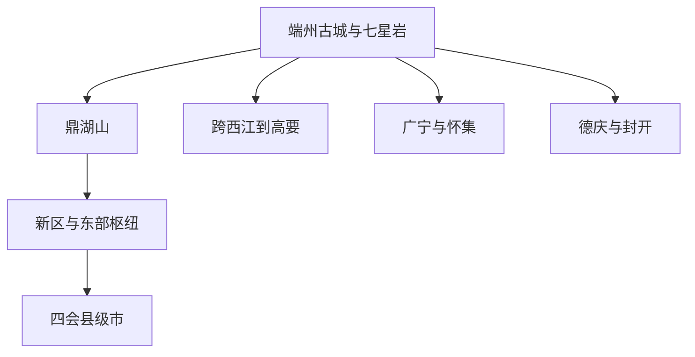

# 肇庆旅行指南

肇庆位于广东中西部、西江中游，最容易进入的旅行主线从端州古城与七星岩开始，向东延伸到鼎湖山、肇庆新区和东部铁路枢纽，向南跨过西江到高要。广宁、德庆、封开、怀集和县级四会市各自拥有竹林、古建、河谷、岩溶或产业文化，但与主城相距明显；把端州—鼎湖作为一段，把县域目的地按整日或住宿增加，行程会比沿着一张全市地图连续打卡更可靠。

> 建议停留：主城 2–3 天；加入高要或一个县域目的地 3–5 天 
> 旅行关键词：七星岩、鼎湖山、宋城墙、西江、端砚、岭南古建、县域山水 
> 主要体力：端州城区中等步行；鼎湖山、岩溶洞穴和县域山地为中高体力 
> 最近研究：2026-07-30

## 城市速览

| 项目 | 旅行信息 |
|---|---|
| 主要旅行价值 | 在城中湖山与宋城遗存之间认识端州，再用独立一天进入鼎湖山的南亚热带森林；端砚、龙母文化、西江水运和各县山水构成更长线的补充 |
| 建议停留 | 1 天只能在七星岩与古城中取舍；2 天可完成端州加鼎湖山；3 天增加高要或主城文化场馆；广宁、德庆、封开、怀集和四会通常各需完整一天或住宿 |
| 较舒适季节 | 晚秋至早春通常更适合古城、湖岸和登山；春夏植被丰盛，但湿热、强降雨、雷电和西江汛情会明显增加；具体花期、水位和可见度不能预先保证 |
| 预算特点 | 端州公共街区、湖岸和公交可控制在中低预算；星湖景区门票、内部车船、县域包车、多地住宿和节庆期间房价是主要增量 |
| 步行强度 | 古城街区可分段步行；七星岩包含长距离湖堤、洞口和可选登高，鼎湖山包含持续坡道、台阶与湿滑林道，古城墙登临也不是平地路线 |
| 主要天气风险 | 高温高湿、短时强降雨、雷电和台风；西江上游来水可抬高主城及沿江县域水位，山地还需防山洪、滑坡、落石和雨后道路中断 |
| 独行旅行 | 端州—鼎湖铁路、公路和城市出行较易组织；县域末端接驳与夜间返程较弱，进入山谷、洞穴、河岸或村镇前须锁定正规返程 |
| 亲子旅行 | 博物馆、七星岩短线和城市公园较易调整；登岩、洞穴船、景区观光车、玻璃设施、漂流和山地项目须逐项核对年龄、身高与陪同规则 |
| 长者与低体力旅行 | 采用“一座场馆加一段湖岸”或“观光车加一处已确认景点”，不把七星岩登高、古城墙、鼎湖山完整环线和县域往返叠在同一天 |
| 无障碍信息 | 铁路可预约重点旅客协助，但公开资料不足以证明古城街巷、城墙、山地、洞穴、船舶和县域景区连续无障碍；须向各运营方逐段确认 |

## 城市格局与游览区域

### 行政边界与标识符

法定地级市肇庆市代码为 **441200**，辖端州区、鼎湖区、高要区 3 个市辖区，广宁县、怀集县、封开县、德庆县 4 个县，并代管县级四会市。肇庆新区属于功能性发展平台，不是与这些县级行政单元并列的法定城市。

Wikidata 的肇庆市实体为 **Q59164**，其 GeoNames 对应值为 **1784853**。项目固定快照将该 GeoNames 记录标为 `PPLA2`，坐标约 `23.04893, 112.46091`，用于表示城市或二级行政区驻地点。城市点可以对齐页面和地图，却不能代替肇庆市的行政面，也不能把四会、广宁、德庆、封开或怀集视为端州街区。

| 县级行政单元 | 法定代码 | 旅行角色 | 边界与安排 |
|---|---:|---|---|
| 端州区 | 441202 | 古城、七星岩、主城商业与多数文化场馆 | 主城旅行核心；七星岩在城中但面积大，古城与湖区仍需分段游览 |
| 鼎湖区 | 441203 | 鼎湖山、肇庆新区和东部铁路枢纽 | 与端州构成东西向城市轴，但鼎湖山不是从端州古城连续步行可达的公园 |
| 高要区 | 441204 | 西江南岸城区、黎槎古村等乡镇目的地 | 南岸与端州隔江相望，跨桥后仍需道路接驳；高要县域远大于南岸城区 |
| 广宁县 | 441223 | 竹林、绥江和山地县域 | 有铁路进入县城，但竹海和乡镇目的地仍需末端交通，通常按整日或住宿安排 |
| 怀集县 | 441224 | 桥头岩溶、燕岩及北部山地 | 距主城远，强降雨后道路、洞穴和景区状态必须独立核验 |
| 封开县 | 441225 | 贺江—西江交汇、碧道画廊、地质与古城遗存 | 地处粤桂交界，景点分散；不能把贺江碧道、地质景区和古城墙当作一个入口内的景区 |
| 德庆县 | 441226 | 悦城龙母祖庙、德庆学宫与西江沿线文化 | 悦城与德城不是同一镇区，节庆客流和西江水情会改变交通安排 |
| 四会市 | 441284 | 玉器产业、县城与奇石河等乡镇目的地 | 为肇庆代管的法定县级市；本页提及代表节点，不代表四会独立城市页已经完成 |

### 主城与县域关系

这张关系图只表达旅行方向，不表示距离和班次；端州—鼎湖是主轴，高要需跨西江，四个县与四会应另计交通时间。

县域路线没有一条适用于所有目的地的“环线”。广宁、怀集偏北，德庆、封开沿西江向西，四会在东部，单靠地图相邻不能证明当天有可用的公共交通。

| 区域 | 主要内容 | 游览特点 | 与其他区域的关系 |
|---|---|---|---|
| 端州星湖片区 | 七星岩、星湖湖岸、牌坊广场及主城餐饮 | 湖岸可短走，景区内部则包含长堤、洞穴、船和可选登高；同一日不必扫遍所有入口 | 与府城可用城市交通连接；住宿选择最多，适合作为主城基地 |
| 端州府城与西江 | 古城墙—披云楼、宋城骑楼街、肇庆市博物馆、阅江楼及江滨公共空间 | 古迹、生活街区与现代场馆交错；开放的城墙段、文保建筑和商户营业各自独立 | 可与七星岩组成长日，但高温或博物馆深度参观时宜拆成两段 |
| 鼎湖山片区 | 鼎湖山旅游开放区、保护区科普和鼎湖城区 | 山地坡道、台阶、内部观光车与步行结合；自然保护边界高于拍照捷径 | 从端州需铁路、公交或道路车辆转场，至少预留独立半天，通常用完整一天 |
| 肇庆新区与东部枢纽 | 砚阳湖等新区公共空间、鼎湖东站与肇庆东站方向 | 城市尺度大、建筑和公园分散，适合铁路到发日前后短停 | 位于端州与四会之间的东部轴线上，但国铁、城际和道路换乘并非同一站台 |
| 高要南岸与乡镇 | 南岸生活区、黎槎古村及高要乡镇 | 南岸可与端州隔江组合，乡镇景点必须再接道路交通 | 黎槎等地不属于主城步行圈；返程和村内开放范围需提前确认 |
| 北线县域 | 广宁竹林、怀集桥头岩溶 | 竹林、河谷、洞穴和山路受降雨影响大，景点之间分散 | 可分别用铁路到广宁或怀集附近，再接县域交通；不建议从端州当日连续扫两县 |
| 西线县域 | 德庆悦城与德城、封开江口与贺江沿线 | 西江文化、古建、河谷和地质景观并存，单点之间常有明显车程 | 适合道路长线或分县住宿；洪水、节庆和夜间返程是主要约束 |
| 四会市 | 四会城区玉器产业区、奇石河等乡镇景区 | 城区商贸与北部山地是两种行程，不能用一个市场短停代替全市 | 法定县级市，适合作为独立一至两日目的地；仍须另建完整城市页 |

## 主要景点

优先级用于安排时间：**A** 为首访核心，**B** 为按兴趣补充，**C** 为远郊、季节性或通常需要独立半天以上的目的地。车站、牌坊广场和普通观景平台只作路线节点。同一景区的内部山峰、洞穴、寺观、瀑布、船段、观光车和表演不拆成多个项目计数。

### 星湖与端州古城

| 景点 | 区域 | 类型 | 主要看点 | 建议用时 | 室内外 | 体力 | 预约风险 | 天气影响 | 优先级 |
|---|---|---|---|---:|---|---|---|---|---|
| 肇庆星湖旅游景区（七星岩、鼎湖山） | 端州区、鼎湖区 | 湖山风景名胜区与自然保护地 | 七星岩的湖泊、石灰岩峰林、洞穴与摩崖石刻；鼎湖山的南亚热带森林、溪瀑和开放文化空间 | 1.5–2 天 | 室外为主 | 中高 | 高 | 极高 | A |
| 肇庆古城墙—披云楼 | 端州府城 | 古城防御遗存 | 宋代以来城墙本体、城门遗迹与披云楼；全部按一个全国重点文物保护单位处理 | 1.5–3 小时 | 室外 | 中 | 中 | 高 | A |
| 宋城骑楼街与府城公共街区 | 端州府城 | 历史街区与城市生活 | 骑楼、传统街巷、公共商业和古城周边城市肌理 | 1.5–3 小时 | 室外为主 | 低至中 | 低 | 高 | B |
| 肇庆市博物馆 | 端州区十字路 | 综合博物馆 | 肇庆历史、文物与地方文化展览，可补足市域和古城背景 | 1.5–3 小时 | 室内 | 低 | 中至高 | 低 | B |
| 阅江楼（叶挺独立团团部旧址纪念馆） | 端州西江北岸 | 历史建筑与纪念馆 | 西江城市关系、阅江楼建筑和叶挺独立团相关陈列 | 1.5–2.5 小时 | 室内外混合 | 中 | 中至高 | 中 | B |
| 端砚文化村代表场馆 | 端州区黄岗方向 | 非遗与工艺展示 | 端砚制作、工艺展示与正规博物馆；同一园区内商铺和工作室不逐家计景点 | 2–4 小时 | 室内外混合 | 低至中 | 中至高 | 低至中 | B |

“肇庆星湖旅游景区”是由七星岩和鼎湖山共同组成的运营品牌，本页只计一个组合景区；旅行时仍要把两个相距明显的物理单元拆开。七星岩通常用半天至一整天，按一个入口、一条湖堤和一项登高或船行组合，不把七座岩峰、石室洞、摩崖石刻、仙女湖和每个码头重复计数。鼎湖山通常用完整一天，飞水潭、庆云寺、宝鼎园和内部观光车均属同一景区行程，不另计项目。

古城墙本体、城门、披云楼及修复段依法一体保护；能看见整圈城墙，不等于每一段都可登临。宋城骑楼街是相邻的生活与商业街区，可与城墙连续步行，但不是城墙内部子景点。市博物馆与阅江楼纪念馆也是两个场馆，地址、预约和展陈应分别核对。

### 高要与县域代表目的地

| 景点 | 区域 | 类型 | 主要看点 | 建议用时 | 室内外 | 体力 | 预约风险 | 天气影响 | 优先级 |
|---|---|---|---|---:|---|---|---|---|---|
| 黎槎古村 | 高要区回龙镇 | 传统村落与社区 | 环状村落格局、祖堂和公开街巷；居民生活空间不等于景区开放空间 | 3–5 小时 | 室外为主 | 中 | 中至高 | 高 | C |
| 广宁竹海大观代表片区 | 广宁县 | 竹林与产业文化 | 青皮竹林、竹文化展示和正规开放步道 | 0.5–1 天 | 室外为主 | 中 | 高 | 极高 | C |
| 悦城龙母祖庙 | 德庆县悦城镇 | 古建筑与民俗空间 | 西江沿线龙母文化、岭南建筑与当前允许参观的庙宇空间 | 2–4 小时 | 室内外混合 | 低至中 | 高 | 中至高 | C |
| 德庆学宫 | 德庆县德城街道 | 古建筑 | 孔庙建筑和地方教育史；与悦城龙母祖庙相距一段道路车程 | 1.5–3 小时 | 室内外混合 | 低至中 | 中至高 | 中 | C |
| 贺江碧道画廊代表段 | 封开县江口及贺江沿线 | 河谷、碧道与乡村景观 | 贺江弯道、沿岸村落、古道与当期开放的公共段 | 0.5–1 天 | 室外 | 中 | 中至高 | 极高 | C |
| 怀集燕岩风景区 | 怀集县桥头镇 | 岩溶洞穴与鸟类栖息地 | 石灰岩洞穴、地下水体和雨燕栖息环境 | 3–5 小时 | 室内外混合 | 中高 | 高 | 极高 | C |
| 四会奇石河景区 | 四会市威整镇 | 山谷、瀑布与综合景区 | 瀑布、山谷步道及景区内玻璃或水上子项目，全部按一个运营单元处理 | 0.5–1 天 | 室外为主 | 中高 | 高 | 极高 | C |

县域山水必须按实体边界去重。广宁的竹林是广泛分布的产业与生态景观，竹海大观、竹文化博物馆和其他商业园区各有运营边界，选一个正式开放片区即可。封开的贺江碧道、封川古城墙、大斑石及其他地质景区不是同一扇门内的子景点；本页只把贺江代表段列入主表。怀集燕岩周边还有其他峰林与洞穴，但不能因同属桥头岩溶便推定全部开放或共用一张票。

进入传统村落、庙宇和仍有居民生活的街区时，只走公开路线；拍摄居民、住宅内部、宗教仪式和手工作业前征得同意。自然保护地、洞穴、河滩和竹林中不离开开放步道，不采集石头、植物、鸟巢或其他自然物。

## 美食与餐饮

肇庆饮食属于粤菜体系，端州与各县的代表食材差异明显。用菜品和产地寻找有证照、明码标价的同类餐馆，比把某一家热门店设为唯一答案更稳妥；西江水产、整鸡、裹蒸和菌菇菜常以多人份出现，独行者应在点单前确认重量和小份可能性。

| 菜品或饮食类型 | 常见区域 | 一个人用餐与常见份量 | 风味、过敏原与饮食限制 | 排队风险与替代方法 |
|---|---|---|---|---|
| 肇庆裹蒸 | 端州、鼎湖及全市点心店、特产店 | 个头通常比普通粽子大，一个可作一餐主食；购买礼盒前看单只净重 | 常见糯米、绿豆和猪肉，调味可能含大豆、小麦或酒；不是素食，糯米消化负担因人而异 | 节庆和热门老字号风险高；选标签完整、生产日期与储存方式清楚的同类产品 |
| 鼎湖上素 | 鼎湖、端州粤菜馆及素食餐厅 | 多为共享菜，一人询问小份或与饭、青菜组合 | 常见菌菇、木耳和蔬菜；菜名含“素”不保证使用纯素高汤，蚝油、奶、蛋、大豆和坚果须询问 | 鼎湖山周边用餐时段集中；可回城区选菜单和配料更清楚的同类菌菇菜 |
| 西江河鲜与黄沙蚬 | 端州、高要、德庆、封开沿江正规餐馆 | 多按条、份或重量售卖，一人先问时价、重量和加工费 | 鱼类、贝类过敏风险高，鱼刺较多；只选合法来源、彻底加热且明码标价的水产 | 汛期、禁捕管理和节假日会改变供应；改点来源明确的养殖鱼或普通粤菜 |
| 高要麦溪鲩、麦溪鲤类菜式 | 高要及主城部分粤菜馆 | 常整条或大份上桌，适合多人分享 | 含鱼类，细刺风险高；烹调可能含大豆、小麦、花生油或蚝油 | 产地鱼并非每天有货；不接受来源不明的替代冒名，改选当日合法供应的鱼类 |
| 封开杏花鸡 | 封开及主城部分粤菜馆 | 常按半只、一只或例牌售卖，一人询问斩件小份 | 含禽肉，骨头多；蘸料和腌料可能含大豆、小麦、芝麻或花生 | 热门时段可能售罄；选同区域正规粤菜馆的其他当日禽类，不追逐单店 |
| 广宁竹笋与笋干菜 | 广宁及全市粤菜馆 | 常作煲、炆菜或配菜，多人分享；一人先问例份 | 竹笋本身为植物，但常与猪肉、鸡汤、蚝油同煮；严格素食须确认汤底 | 受产季和储存方式影响；用当季蔬菜替代，不要求以外地笋冒充本地食材 |
| 德庆粉葛、巴戟与贡柑类产品 | 德庆及全市特产、汤品和水果渠道 | 汤煲多为多人份，贡柑按季购买；药食同源产品不宜按保健剂量自行食用 | 汤底常含肉类、海味或花生；有慢性病、孕期或正在用药者不要把巴戟等食材当治疗 | 非产季改选普通水果或清楚标注原料的汤品，不购买夸大疗效的产品 |
| 四会沙糖桔与玉器市场周边简餐 | 四会城区 | 水果适合小量购买，市场周边粉面饭便于一人用餐 | 果糖摄入按个人情况控制；粉面汤底可能含猪骨、虾米、大豆和小麦 | 节庆和交易旺季人流大；离开核心市场到普通生活街区找同类持证餐馆 |

严重过敏、严格素食、清真、低盐或吞咽困难旅行者，应把禁忌写给餐馆，确认汤底、蚝油、猪油、虾米、花生、大豆、小麦、酒和共锅情况，并随身携带个人急救用品。河鲜和禽肉不要只问菜名，还要确认原料来源、重量、时价和烹调方式。

## 经典行程

### 一日经典路线

**路线**：七星岩选定入口 → 景区内一条湖堤与一项石刻、洞穴或登高主题 → 午间完整休息 → 肇庆古城墙—披云楼开放段 → 宋城骑楼街

- **串联逻辑**：七星岩位于端州主城北侧，下午转入府城后可连续步行城墙与街区；不把七星岩所有湖、岩和船段都塞入半天。
- **预约锚点**：七星岩票务、实际开放入口、船或洞穴子项目，以及古城墙可登临段。
- **休息安排**：七星岩内安排一次坐席休息，离园后再吃午餐；古城段在骑楼街或公共商业区补水避暑。
- **时间不足时**：取消七星岩登高或船行，保留湖岸代表段；再不足则删宋城街夜游，不压缩景区闭园前的安全余量。

### 两日城市路线

**第 1 天（端州）**：七星岩 → 主城午餐 → 肇庆古城墙—披云楼 → 宋城骑楼街 
**第 2 天（鼎湖）**：鼎湖山正式入口 → 按体力选择观光车与开放步道 → 飞水潭、庆云寺或宝鼎园中选核心组合 → 原路返回

- **串联逻辑**：星湖旅游景区虽然是一个运营品牌，七星岩与鼎湖山却是两个相距明显的物理单元；各用一天可避免跨区赶路和重复进出。
- **预约锚点**：两地票务、实名或优惠证件、鼎湖山观光车、开放线路和最晚下山时间。
- **休息安排**：鼎湖山日把观光车视为减负工具，不视为全程免步行；在正式服务区补水、用餐和处理雨具。
- **时间不足时**：第 1 天删府城夜间段；第 2 天删远端支线，只走一条官方开放路线，不用未开放林道抄近路。

### 三日深度路线

**第 1 天**：肇庆市博物馆 → 府城午餐 → 古城墙—披云楼 → 宋城骑楼街 
**第 2 天**：七星岩完整半日至一日 → 星湖周边休息 
**第 3 天**：鼎湖山完整一日 → 鼎湖或端州住宿

- **串联逻辑**：历史场馆、城中湖山和森林保护地分别占一天，信息密度和体力负荷都更均衡。
- **预约锚点**：博物馆个人参观、七星岩和鼎湖山票务、开放入口、内部车船与返程交通。
- **休息安排**：场馆日保留午间坐席；七星岩不同时安排多次登岩；鼎湖山使用观光车后仍预留坡道和下山余量。
- **时间不足时**：删端砚购物和非核心夜游；三项核心中不以压缩鼎湖山下山时间换取多一个点。

### 雨天路线

**路线**：肇庆市博物馆 → 室内午餐 → 阅江楼或端砚文化村中已确认开放的一处 → 宋城骑楼街短段

- **适用条件**：只适用于普通降雨且未发布暴雨、雷电、洪水、地质灾害或停运响应；骑楼街和场馆之间仍有露天路段。
- **预约锚点**：两座场馆的地址、闭馆日、预约、最晚入场和临展；端砚场馆是否对个人开放。
- **休息安排**：减少场馆间步行，使用正规车辆转场；不在西江堤岸、星湖低洼段、城墙或山脚避雨。
- **时间不足时**：只保留肇庆市博物馆；出现高级别预警时取消全部旅游移动，按政府和场馆通知避险。

### 亲子或低体力路线

**亲子路线**：肇庆市博物馆 → 午餐 → 七星岩已确认的平缓湖岸短线 → 牌坊广场周边休息 
**低体力路线**：肇庆市博物馆 → 车辆转场 → 星湖外围已确认连续可达的一小段 → 宋城骑楼街平缓段

- **减负方式**：儿童路线不默认加入登岩、洞穴船和夜间长走；低体力路线不登古城墙、不走鼎湖山完整环线，并把每段入口与返程位置提前确认。
- **预约锚点**：场馆儿童预约、婴儿车与无障碍入口；七星岩轮椅、婴儿车、船舶和内部车辆规则。
- **休息安排**：每 60–90 分钟安排空调、饮水和卫生间；高温时把户外移至早晚并缩短湖岸段。
- **时间不足时**：取消湖区，只保留一座场馆和一顿坐席餐；不以现场搬抬替代未确认的连续无障碍路线。

### 高要半日或一日路线

**路线**：端州住宿地 → 跨西江到高要南岸 → 黎槎古村公开路线 → 高要或端州晚餐 → 返回

- **串联逻辑**：南岸是跨江转场节点，黎槎位于回龙镇，仍需道路车辆；把两段区分可避免误把古村当成桥头步行点。
- **预约锚点**：古村开放、导览、活动日期、停车或落客点、返程车辆。
- **休息安排**：村内只走公开街巷，午后在有卫生间和座席的正式服务点休息；不进入居民院落。
- **时间不足时**：整段删除黎槎，只在端州完成古城线路；不压缩返程去赶末班铁路。

### 县域一日或住宿路线

**路线选择**：广宁竹林一日、德庆悦城—德城文化一日、封开贺江一日、怀集桥头岩溶一日，或四会城区与奇石河一至两日；每次只选一个县域方向。

- **串联逻辑**：各县的自然与文化单元分散，铁路或高速只解决干线，末端还要公交、景区接驳或正规包车；四会是法定县级市，应单独看待。
- **预约锚点**：目标景区、场馆或村镇的开放公告，县域到发站、返程班次、住宿和天气停复开。
- **休息安排**：山地、洞穴或河谷日住目标县城或正规景区周边，避免天黑后再长途返回端州。
- **时间不足时**：删除整个县域段，不把两个县各留一小时；开放证据不足时改为县城博物馆或取消。

## 住宿区域

| 区域 | 优点 | 缺点 | 适合人群 | 交通特点 |
|---|---|---|---|---|
| 七星岩牌坊—星湖东南侧 | 接近湖区、餐饮和主城生活，早晚湖岸较方便 | 节庆、夜间活动和临街房可能嘈杂；不同入口之间仍有距离 | 首访、摄影、希望以七星岩为核心的旅行 | 去府城可用公交或车辆；到鼎湖山和肇庆东站仍需跨区 |
| 端州府城—西江北岸 | 方便古城墙、骑楼街、博物馆和西江城市观察 | 老建筑、窄街、停车和电梯条件差异大；汛期低洼滨水段需回避 | 历史文化、饮食、预算有限和晚到主城 | 与肇庆站方向联系较直接，但具体线路和施工须重查 |
| 肇庆站周边 | 国铁与城际到发较方便，适合早晚换乘 | 与七星岩核心入口、古城和优质餐饮并非全部可步行 | 铁路往返、短停和跨城行程 | 票面“肇庆站”与“肇庆东站”不可互换；站城交通留余量 |
| 鼎湖山—坑口片区 | 适合较早进入鼎湖山，山地日前后减少跨区往返 | 离端州古城和多数夜间餐饮较远；景区周边住宿条件差异大 | 登山、自然观察、两日慢游 | 鼎湖山站、公交、景区入口和酒店之间须核对实际接驳 |
| 肇庆新区—鼎湖东、肇庆东方向 | 适合东部铁路枢纽、活动或新区短停，现代道路和新住宿较多 | 与端州经典景点距离明显，步行尺度大 | 高铁到发、商务活动、继续前往四会 | 肇庆东站与鼎湖东站相邻关系不等于同站台换乘，需预留出站和安检时间 |
| 高要南岸 | 可体验西江南岸生活，到高要乡镇更顺路 | 过江交通会受拥堵、施工和天气影响，晚间回端州需留余量 | 高要县域、自驾或较慢节奏 | 依靠桥梁和道路交通；不能按直线距离估算到古城或车站时间 |
| 德庆、封开、广宁、怀集或四会当地 | 减少县域清晨和夜间长途折返，便于锁定早班或山地天气窗口 | 住宿、餐饮和无障碍选择通常少于端州 | 县域深度、摄影、自然与文化专题 | 订房前同时确认到发站、末端接驳和次日返程；不推荐未经核验的具体酒店 |

## 市内交通

肇庆没有一座车站能够同时服务所有景点。端州古城和七星岩以肇庆站、端州城区道路为主要入口；鼎湖山可结合鼎湖山站和道路交通；肇庆东站、鼎湖东站位于东部枢纽方向，更适合国铁长途或城际换乘。票面站名、住宿地和首个景点必须同时核对。

| 场景 | 建议与取舍 | 行前需要重查的内容 |
|---|---|---|
| 国铁抵达 | 肇庆站较接近端州主城；肇庆东站服务贵广、南广等方向的长途列车，但离端州古城更远 | 实际到发站、列车停站、进出站口、夜间接驳、行李和重点旅客服务 |
| 广肇城际 | 肇庆站、端州、鼎湖山、鼎湖东等站可服务不同片区，适合从广州、佛山方向进入 | 当日站站停或大站快车、票制、首末班、故障、安检与换乘规则 |
| 端州—鼎湖移动 | 公交、出租或网约车比全程步行现实；七星岩、府城、鼎湖山应按三个落客点组织 | 公交线路、景区交通管制、活动封路、合法上下客点和夜间返程 |
| 星湖景区内部 | 七星岩可能涉及步行、船和不同入口；鼎湖山可能涉及观光车与步行 | 票种、入口、内部车船、最晚乘坐、维修、雷雨大风停运和中途退出 |
| 跨西江到高要 | 端州与南岸通过桥梁和道路车辆连接，适合与高要住宿或古村日组合 | 桥梁施工、拥堵、公交改线、洪水与强风管制、返程时间 |
| 广宁、怀集、德庆、封开与四会 | 铁路或长途客运只解决部分干线，乡镇景区仍需县域公交、景区接驳或正规包车 | 班次、客运站、包车资质与报价、山路、夜间返程和住宿取消政策 |
| 水上游览 | 七星岩、贺江或其他景区船段只使用持证、当日获准运营的船舶和码头，不把游船当固定城市通勤 | 航线、实名票、救生衣、上下船台阶、儿童与行动障碍规则、水位和停航 |
| 自驾 | 对高要乡镇和远县很有帮助，但端州停车、节庆管制、连续山路和暴雨驾驶负担高 | 限行、停车、充电、景区预约、道路塌方、司机休息和保险范围 |

广肇城际已经与湾区多条城际线路贯通运营，但开通结构不是永久时刻表。肇庆站的国铁与城际换乘、肇庆东站与鼎湖东站的东部枢纽关系，也不能用“同一片区”推断为无需出站、无需安检或零距离换乘。所有班次和站内路线以出发日官方系统为准。

## 不同旅行者须知

| 旅行维度 | 可行条件 | 主要取舍 | 需额外核对 |
|---|---|---|---|
| 独行旅行 | 端州场馆、七星岩和城际铁路较容易组织 | 县域末端接驳、夜间山路和洞穴河谷风险较高 | 最后班次、正规包车、住宿前台、离线地图和景区紧急电话 |
| 亲子旅行 | 博物馆、湖岸短线和新区公园可按半日组合 | 登岩、洞穴船、山谷、玻璃项目和长时间观光车可能超过儿童耐受 | 年龄身高、救生衣、婴儿车、母婴室、陪同和退改规则 |
| 长者或低体力旅行 | 端州可用车辆连接场馆与湖岸，鼎湖山可在确认后使用观光车减负 | 观光车不能消除坡道、排队和上下车；古城墙与山地不宜作为必做 | 落客点、电梯、轮椅、卫生间、内部摆渡和中途退出 |
| 轮椅或行动辅助器具使用者 | 国铁可预约站车重点旅客服务，部分现代场馆可能有单点设施 | 单点坡道或电梯不能证明车站到展线、湖堤、古城墙、山路或船舶全程连续可达 | 站台协助、车辆装载、入口门槛、无障碍厕位、坡度、船舶舷梯和返程 |
| 视听障碍旅行者 | 可提前询问博物馆文字展签、人工讲解和景区协助 | 山地广播、游船集合、夜游灯光和临时疏散信息未必有同步无障碍版本 | 字幕、手语、语音或触摸导览、可视化集合通知与紧急联络 |
| 摄影旅行 | 七星岩、古城、西江、鼎湖山和县域主题差异清楚 | 日出、雾、花期和水位不可保证；文保、寺庙、居民、无人机与商业拍摄有边界 | 三脚架、闪光灯、无人机、人物同意、夜间返程和景区最晚离场 |
| 预算有限 | 端州公共街区、博物馆和公交可降低成本 | 星湖票务、内部车船、县域包车和多地住宿是主要支出 | 免费场馆预约、联票范围、交通是否另付、餐厅时价和退改政策 |
| 晚出发或紧凑行程 | 下午抵达可选博物馆或府城短段 | 不应临时进鼎湖山、远县或需要船舶的景区 | 最晚入场、闭馆日、照明、末班交通和酒店入住 |
| 高温与雷雨季 | 普通高温可把户外移至早晚，普通小雨可改场馆 | 暴雨、雷电和台风时不能用雨具硬走山路、城墙、洞穴、河岸和湖面 | 气象预警、景区闭园、停航、道路管制、积水和延住条件 |
| 西江汛期 | 水位正常且公共滨水段开放时可短走 | 上游来水会在本地降雨减弱后继续影响水位，沿江县域与桥路可能不同步恢复 | 水文信息、三防响应、堤岸封闭、船舶停航和桥梁交通 |
| 自然与社区旅行 | 只走开放步道、公共街巷和已公告展线 | 保护区、鸟巢、田地、宗教仪式和居民住宅不属于自由进入或拍摄空间 | 保护区规则、社区同意、导览资质、垃圾回收和无人机禁限飞 |
| 食物过敏或特殊饮食 | 主城粤菜、粉面饭和现代餐饮选择相对多 | 裹蒸、河鲜、汤底、蚝油、共锅和大份菜有隐藏风险 | 完整配料、交叉接触、重量、个人药物和最近医疗点 |

公开证据只支持铁路重点旅客服务和少数场馆的单点条件，不能推导出肇庆全域连续无障碍。需要无障碍路线时，应按“到发站—车辆—入口—卫生间—核心展线或湖岸—返程”逐段向官方确认；任一环节无法衔接，就缩为一座已确认的现代场馆，不依赖现场临时搬抬。

## 行前核对

| 核对事项 | 建议时间 | 官方锚点 | 核对结果不理想时 |
|---|---|---|---|
| 七星岩与鼎湖山票务、入口和开放线 | 确定日期后、出发前 1 天和当天 | [肇庆星湖旅游景区官网](https://zw.xhglj.com.cn/index.shtml)及[公告通知](https://zw.xhglj.com.cn/xwdt/ggtz/index.shtml) | 只保留明确开放的一个物理单元；不从封闭门区、林道或水岸进入 |
| 星湖内部船舶、洞穴和观光车 | 购票前及入园当天 | 星湖景区售票与现场公告 | 删去停运子项目，保留陆上短线；不找私人船或未公告接驳替代 |
| 古城墙、博物馆与阅江楼 | 排入路线前及到访前 1 天 | [广东省博物馆年度报告](https://whly.gd.gov.cn/open_newgwgk/content/post_4710890.html)、场馆和端州文旅当日公告 | 只走公共街区，未确认可登临的城墙段不攀爬、不进入围挡 |
| 宋城骑楼街商户与活动 | 到访前 1 天及当天 | 端州区政府、文旅与街区运营主体公告 | 把街区当公共步行段，不为单一商户或临时演出等待 |
| 高要和远县景区、村镇、洞穴 | 订住宿前、出发前 1 天和当天 | 对应区县政府、景区、博物馆或村镇公告 | 缩为县城已确认场馆，取消未公告洞穴、河谷、竹林和夜间山路 |
| 国铁与广肇城际 | 购票时、出发前 1 天和当天 | [中国铁路 12306](https://www.12306.cn/)、[广东省交通运输厅城际说明](https://td.gd.gov.cn/gkmlpt/content/4/4429/post_4429286.html?jump=true) | 更换到发站或删跨县段，不用历史时刻和规划站名推断当前停靠 |
| 暴雨、雷电、台风与高温 | 出发前 3 天起每日查看，户外日再查 | [中国天气网肇庆](https://www.weather.com.cn/weather/101280901.shtml)、广东气象、肇庆应急与当前区县预警 | 取消登山、洞穴、船舶、城墙、竹林和沿江低洼段，转入安全室内或延后 |
| 西江与贺江水情 | 汛期每日、沿江日前和乘船前 | 广东水文、水利、海事及当地三防公告 | 远离封闭堤岸、滩地、桥洞和码头；停航或道路受阻时取消整段 |
| 无障碍与重点旅客服务 | 购票后、到访前至少 1 天 | [铁路 12306 重点旅客预约](https://kyfw.12306.cn/otn/view/icentre_qxyyInfo.html)、场馆和景区客服 | 缩为入口到展线均已确认的单一场馆，预订可装载辅助器具的车辆 |
| 节庆与宗教活动 | 确定德庆、古城或庙宇日期后 | 当地区县政府、公安、交通和场所公告 | 避开高峰或取消；不把历史节期推定为当年必然举办 |
| 餐厅、河鲜与特产 | 选店前、点菜和购买时 | 经营主体资质、现场菜单、明码标价和食品标签 | 用配料清楚的小份菜替代时价水产、来源不明禽肉或夸大疗效产品 |

## 来源与更新记录

### 身份、边界与城市结构

| 来源 | 核验内容 | 使用边界 | 核验日期 |
|---|---|---|---|
| [Wikidata 实体 Q59164](https://www.wikidata.org/wiki/Q59164)及[官方 API 查询](https://www.wikidata.org/w/api.php?action=wbgetentities&ids=Q59164&props=labels%7Cdescriptions%7Cclaims&languages=zh%7Cen&format=json) | 实体标签为肇庆市，描述为广东省地级市；P1566 为 1784853，P13971 为 441200，并关联端州、鼎湖、高要、广宁、怀集、封开、德庆和四会 | 用于知识库实体与层级对齐，不替代法定边界和旅游公告 | 2026-07-30 |
| [GeoNames 1784853](https://www.geonames.org/1784853/zhaoqing.html)及[特征代码说明](https://www.geonames.org/export/codes.html) | 项目固定快照记录名称 Zhaoqing、特征代码 PPLA2、坐标约 23.04893 和 112.46091、admin1=30、admin2=4412 | 城市或行政驻地点不是地级市面边界 | 2026-07-30 |
| [广东省民政厅肇庆市区划资料](https://smzt.gd.gov.cn/qhgk/gsqh/2021n/zqs/index.html) | 支持端州、鼎湖、高要、广宁、怀集、封开、德庆和四会的行政组成 | 页面年度较早，代码与现状还用民政部查询交叉核验 | 2026-07-30 |
| [肇庆市中级人民法院城市简介](https://gdzqfy.gov.cn/fyjj/) | 官方机构列出 3 区、4 县、1 县级市，并区分肇庆新区和高新区等功能区 | 概况文字不替代行政区划代码库，也不证明功能区景点开放 | 2026-07-30 |
| [粤港澳合作发展平台：肇庆新区](https://www.cnbayarea.org.cn/service/ygahzfzptsc/zq/) | 肇庆新区位于鼎湖区中部，连接端州、四会和高要方向，是东部城市轴的一部分 | 发展规划不等于景点建成、车站开通或法定县级区划变更 | 2026-07-30 |

### 核心景区、古城与场馆

| 来源 | 核验内容 | 使用边界 | 核验日期 |
|---|---|---|---|
| [肇庆星湖旅游景区官网](https://zw.xhglj.com.cn/index.shtml)及[景区介绍](https://zw.xhglj.com.cn/xhyxw/index.shtml) | 星湖旅游景区由七星岩与鼎湖山两大景区组成，二者属于同一组合品牌 | 组合品牌不代表同一入口或可在短时间连续步行；票务和开放动态重查 | 2026-07-30 |
| [七星岩景区介绍](https://zw.xhglj.com.cn/lyzx/yjgl/298_2.shtml)及[摩崖石刻说明](https://zw.xhglj.com.cn/lyzn/xysk/526.shtml) | 支持七星岩的五湖、峰林、洞穴、湖堤与摩崖石刻结构 | 旧页面中的票价、船价、项目数量和推荐时长不作为当前事实 | 2026-07-30 |
| [鼎湖山开放游览线路](https://zw.xhglj.com.cn/lyzx/lxtj/36.shtml)及[景点目录](https://zw.xhglj.com.cn/zmxh/dhs/index.shtml) | 支持景区入口、观光车、飞水潭、庆云寺和宝鼎园属于同一山地游览单元 | 历史推荐线路不证明当前全线开放，也不支持健康疗效宣传 | 2026-07-30 |
| [中国科学院华南植物园：鼎湖山保护区](https://scib.cas.cn/banner/201604/t20160429_6841192.html)及[UNESCO 生物圈保护地说明](https://www.unesco.org/mab/50anniversary/en/dinghushan) | 支持南亚热带常绿阔叶林、生物多样性保护、1956 年保护区建立及 1979 年进入生物圈保护区网络 | 科研与保护身份不授权进入核心区、采集、无人机或离开旅游开放线 | 2026-07-30 |
| [肇庆古城墙保护条例](https://policy.mofcom.gov.cn/claw/clawContent.shtml?id=62993)及[广东省人大审查资料](https://www.gdpc.gov.cn/gdrdw/attachment/0/16/16882/167216.pdf) | 古城墙位于端州，为全国重点文物保护单位，墙体、城门、附属建筑及遗址遗迹一体保护 | 法规不等于所有城墙段可登临，具体开放与修缮须看当日公告 | 2026-07-30 |
| [广东省城乡历史文化保护传承体系规划](https://zfcxjst.gd.gov.cn/attachment/0/585/585468/4744930.pdf?cid=39)及[广东省情网肇庆八景](https://dfz.gd.gov.cn/zjgd/content/mpost_4189761.html) | 支持古城墙等历史遗存的系统保护，以及披云楼、阅江楼、七星岩和鼎湖山的城市历史关系 | 规划和景观称号只作文化线索，不转化为开放、票务或优先级事实 | 2026-07-30 |
| [广东省 2024 年度博物馆高质量发展报告](https://whly.gd.gov.cn/open_newgwgk/content/post_4710890.html) | 报告所附名录列出肇庆市博物馆位于端州区十字路 5 号、叶挺独立团团部旧址纪念馆位于阅江楼，二者为不同场馆 | 年度报告不替代当前预约、闭馆日、入口和展览公告 | 2026-07-30 |
| [全国标准信息公共服务平台：地理标志产品 端砚](https://std.samr.gov.cn/db/search/stdDBDetailed?id=D7B67EF31DD6A26AE05397BE0A0AAD1A)及[广东政协网端砚文化资料](https://www.gdszx.gov.cn/zxkw/tzgj/2022/11/content/post_31678.html) | 支持端砚的地理标志、制作技艺及白石村端砚文化村的产业文化关系 | 不为具体工作室品质、营业、购物价格或个人参观背书 | 2026-07-30 |

### 县域目的地与饮食

| 来源 | 核验内容 | 使用边界 | 核验日期 |
|---|---|---|---|
| [广东省乡村旅游开发资源目录](https://whly.gd.gov.cn/attachment/0/366/366697/2799374.pdf) | 黎槎村位于高要区回龙镇，并记录其村落与非遗资源 | 目录不证明全村开放、导览常态或居民住宅可进入 | 2026-07-30 |
| [国家林草局：广宁竹产业](https://www.forestry.gov.cn/c/www/dfdt/580412.jhtml) | 广宁竹林分布广，竹海大观、竹文化博物馆等为不同旅游与产业节点 | 县域竹林不等于全部可游览；各园区票务、道路和开放独立核对 | 2026-07-30 |
| [文化和旅游部乡村线路：德庆](https://zhuanti.mct.gov.cn/xcss2024_nlhwzzxc/guangdong/detail/8195.html)及[广东省情网德庆概况](https://dfz.gd.gov.cn/index/qwfz/content/post_4678455.html) | 支持悦城龙母祖庙、德庆学宫等文化节点，并说明二者分处悦城与德城方向 | 节庆、仪式、票务和场所准入均属动态事项 | 2026-07-30 |
| [广东省国资委：封开贺江碧道画廊](https://gzw.gd.gov.cn/gkmlpt/content/4/4067/post_4067536.html)及[封川古城墙资料](https://www.gdwsw.gov.cn/wsxsj/content/post_39629.html) | 支持贺江碧道的沿岸村落、古道和乡村发展，以及封川古城墙为另一处独立遗存 | 不把整条碧道、古城和地质公园包装成一个连续景区 | 2026-07-30 |
| [广东省情网：怀集燕岩](https://dfz.gd.gov.cn/index/yxgd/gdyj/xl/content/post_4418503.html) | 燕岩位于怀集县桥头镇，属于岩溶洞穴与雨燕栖息环境 | 地貌介绍不证明景区当前营业、洞穴船可用或全部洞穴开放 | 2026-07-30 |
| [四会市政府资料：奇石河景区](https://gdxk.southcn.com/zq/shsk/zdgcxmzl/content/post_506164.html) | 奇石河位于四会威整镇，瀑布、步道、玻璃和水上内容属于同一运营景区 | 项目建设资料不证明所有子项目当前开放；四会仍需独立城市研究 | 2026-07-30 |
| [国家标准信息公共服务平台：地理标志产品 四会沙糖桔](https://std.samr.gov.cn/db/search/stdDBDetailed?id=91D99E4DA0802E24E05397BE0A0A3A10) | 支持“四会沙糖桔”的规范产品名称与地理标志属性 | 上市季节、产地授权、品质、价格和具体销售点均须当期核对 | 2026-07-30 |
| [广东省文旅厅非遗线路](https://whly.gd.gov.cn/attachment/0/522/522813/4195511.pdf)及[肇庆裹蒸产业资料](http://www.qb.gd.gov.cn/jrqx/content/post_1329884.html) | 支持肇庆裹蒸制作技艺的非遗与地方饮食身份，以及常见糯米、绿豆、猪肉结构 | 产业报道不为具体品牌、价格、储存或个人健康效果背书 | 2026-07-30 |
| [广东省侨务办公室“肇庆一桌菜”](http://www.qb.gd.gov.cn/ztzl/2021ycsf/xwdt/content/post_1017622.html)及[第二期菜品](http://www.qb.gd.gov.cn/ztzl/2021ycsf/xwdt/content/post_1127072.html) | 支持鼎湖粉葛、高要麦溪鲩、封开杏花鸡、广宁竹笋、德庆食材和西江水产等地方线索 | 菜单评选不固定餐馆、份量、配方、合法供应或过敏安全 | 2026-07-30 |

### 交通、安全与无障碍

| 来源 | 核验内容 | 使用边界 | 核验日期 |
|---|---|---|---|
| [广东省交通运输厅：湾区城际四线贯通](https://td.gd.gov.cn/gkmlpt/content/4/4429/post_4429286.html?jump=true)及[铁路换乘说明](https://td.gd.gov.cn/dtxw_n/gdjrxw/content/post_4457139.html) | 广肇城际服务肇庆站、鼎湖东等站，并与湾区城际贯通；肇庆站开展国铁与城际换乘协同 | 开通资料不替代出发日班次、票制、停站、故障和安检规则 | 2026-07-30 |
| [中国铁路 12306](https://www.12306.cn/)及[重点旅客预约](https://kyfw.12306.cn/otn/view/icentre_qxyyInfo.html) | 核对肇庆站、肇庆东站等实际到发，并可预约进出站、乘降和轮椅等协助 | 铁路服务不证明城市道路、场馆、古城墙、山地和船舶连续无障碍 | 2026-07-30 |
| [广东省政府：西江流域防汛](https://www.gd.gov.cn/xxts/content/post_4443206.html)及[省交通运输厅公路防汛案例](https://td.gd.gov.cn/gkmlpt/content/4/4754/post_4754955.html?jump=true) | 上游来水可造成西江洪水，强降雨曾导致肇庆山区公路塌方和中断 | 历史灾情用于识别风险，不代表研究日或出发日正在受灾 | 2026-07-30 |
| [广东省防汛防旱防风防冻应急预案](https://www.gd.gov.cn/zwgk/gongbao/2024/9/content/mpost_4420380.html?version=slh)及[中国天气网肇庆](https://www.weather.com.cn/weather/101280901.shtml) | 支持暴雨、洪水、台风、强对流、高温及区县预警的行前核对 | 省级预案和城市预报不能替代具体山谷、河段、洞穴与道路的现场命令 | 2026-07-30 |

### 更新记录

- 2026-07-30：完成肇庆市首版公众旅行研究；核对 Wikidata Q59164、GeoNames 1784853、PPLA2 城市点属性与法定地级市代码 441200。
- 2026-07-30：按端州—鼎湖主轴、肇庆新区与东部枢纽、高要跨江段及广宁、怀集、德庆、封开、四会独立县域重建空间结构；明确四会仍须独立城市页。
- 2026-07-30：将星湖旅游景区按一个组合品牌计数，同时把七星岩和鼎湖山作为两个旅行日单元；古城墙与披云楼、景区内部峰洞车船、县域各运营景区均按物理或运营边界去重。
- 2026-07-30：动态维护范围包括场馆开放、星湖票务与车船、古城墙修缮、铁路与城际、县域客运、节庆、暴雨台风、西江与贺江水情、道路管制和无障碍服务；均须在出发前通过官方入口重查。

正文为基于上述资料独立整理的旅行信息，不复制网页长段文字。开放、预约、票价、班次、船舶、活动、道路、水情、气象、展览和经营状态均以实际出发前的官方公告为准。
