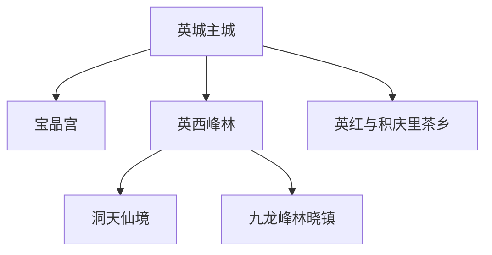
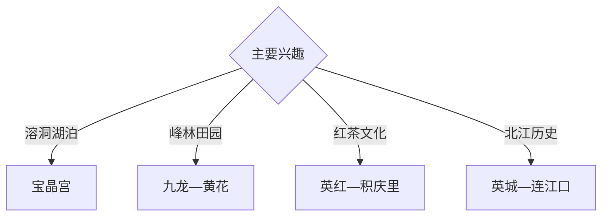

# 英德旅行指南

英德位于粤北北江流域，以英城、宝晶宫、英西峰林、洞天仙境、九龙峰林晓镇和英红茶园形成喀斯特与茶乡旅行体系。固定快照中的 **Yingcheng / GeoNames 1786634** 锚定英城主城；英西峰林、石门台和英红方向跨度大，适合分日安排。

## 城市速览

| 项目 | 信息 |
|---|---|
| 主线 | 英城—宝晶宫—英西峰林—洞天仙境—九龙—英红茶乡 |
| 停留 | 英城与宝晶宫1天；峰林、茶乡各另留1天 |
| 住宿 | 英城接驳便利；九龙、黄花正规民宿适合慢游 |
| 交通 | 高铁、铁路、公路抵达，远郊宜约车或自驾 |
| 季节 | 春秋舒适；雨季峰林有云雾，也需关注山洪 |
| 预算 | 包车、景区票、洞穴项目与乡村住宿增加预算 |

## 城市格局与游览区域

英城承担铁路接驳、住宿和北江城市生活；宝晶宫位于近郊，英西峰林集中在九龙、黄花一带，茶园与温泉分布在英红、横石塘等方向。溶洞、地下河、北江航道、自然保护地、茶叶生产线和矿山工业区按运营与接待边界进入。

## 主要景点

| 景点 | 区域 | 类型 | 核心体验 | 用时 | 环境 | 体力 | 研究价值 | 拥挤 | 优先级 |
|---|---|---|---|---:|---|---|---|---|---|
| 宝晶宫生态旅游度假区 | 英城近郊 | 溶洞与湖泊 | 喀斯特洞穴、湖泊和综合项目 | 半天至1天 | 混合 | 中 | 高 | 节假日高 | A |
| 洞天仙境生态旅游度假区 | 九龙方向 | 天坑与溶洞 | 天坑、暗河和峰林地貌 | 半天 | 混合 | 中 | 很高 | 旺季中高 | A |
| 九龙峰林晓镇 | 九龙 | 峰林与乡村 | 喀斯特田园、花田和乡村住宿 | 半天 | 室外 | 低中 | 高 | 花期高 | A |
| 英西峰林公开游线 | 九龙—黄花 | 地貌与骑行 | 峰丛、田园、公路和村落景观 | 1天 | 室外 | 中 | 很高 | 节假日高 | A |
| 积庆里仙湖旅游区 | 横石塘 | 茶园与温泉 | 湖泊、茶园、温泉和度假 | 半天至1天 | 混合 | 低 | 中高 | 周末中 | B |
| 英红茶文化正规体验点 | 英红方向 | 茶文化与产业 | 英德红茶、茶园和加工展示 | 半天 | 混合 | 低中 | 高 | 预约制 | B |
| 北江公开滨水与浈阳坊方向 | 英城—连江口 | 河流与历史 | 北江水运、码头记忆和沿江聚落 | 半天 | 室外 | 低 | 高 | 节假日中 | B |

## 美食与餐饮

英德红茶、九龙豆腐、清远鸡、河鲜和客家菜适合按峰林与北江线路体验。茶园品鉴按正规接待安排；河鲜核对合法来源，洞穴和山地日准备饮水。

## 经典行程

### 英城宝晶宫线
**路线**：英城—宝晶宫正式入口—溶洞与湖区公开项目—返城。**逻辑**：用一天完成城市接驳和近郊地貌。**预约锚点**：景区票与项目开放。**休息**：游客中心。**删除条件**：洞穴维护时保留湖区公开项目。

### 英西峰林一日线
**路线**：英城—九龙峰林晓镇—黄花公开观景点—正规民宿。**逻辑**：按连续地貌走廊组织峰林田园。**预约锚点**：车辆与住宿。**休息**：九龙或黄花。**删除条件**：暴雨或山洪预警时改英城。

### 洞天仙境线
**路线**：九龙—洞天仙境—周边峰林公开段—返程。**逻辑**：用半天至一天聚焦天坑与地下河。**预约锚点**：景区时段和水位。**休息**：景区服务区。**删除条件**：强降雨或洞内关闭时顺延。

### 红茶文化线
**路线**：英城—英红正规茶园—加工展厅—积庆里仙湖。**逻辑**：从种植、加工到品饮理解英德红茶。**预约锚点**：茶园和工厂接待。**休息**：正规茶庄。**删除条件**：生产线无接待时保留茶园展厅。

### 北江人文线
**路线**：英城公共文化空间—北江开放岸段—浈阳坊或连江口公开区。**逻辑**：沿水运轴线理解城市历史。**预约锚点**：场馆和水上项目。**休息**：英城或连江口。**删除条件**：高水位时只走陆上公共空间。

### 亲子低体力线
**路线**：宝晶宫短线—午餐—英红茶文化展厅。**逻辑**：自然科普与产业体验结合。**预约锚点**：亲子项目。**休息**：景区服务区。**删除条件**：幼童不适洞穴时改湖区与茶园。

### 三日组合线
**路线**：首日英城与宝晶宫；次日英西峰林；第三日红茶或北江。**逻辑**：洞穴、峰林和文化产业分日。**预约锚点**：第二日天气。**休息**：英城与峰林民宿灵活组合。**删除条件**：两天时删第三日。

## 住宿区域

英城适合铁路接驳和多方向出发；九龙、黄花正规民宿适合峰林晨昏；横石塘等度假住宿适合温泉茶园慢游。订房核对景区距离、停车、消防、早餐和暴雨退改。

## 市内交通

英德西站与英德站位置和车次不同，购票后核对。宝晶宫、英西峰林、英红和连江口分方向安排；乡村道路按限速、会车、积水与临时管制行驶。

## 不同旅行者须知

地貌旅行者优先洞天仙境与英西峰林；茶文化旅行者提前联系正规接待点；亲子和长者选择峰林平缓段；户外者关注雨季水文。溶洞非开放支洞、北江航道、自然保护区核心范围、茶厂生产线、矿山和工业作业区保留明确限制。

## 行前核对

- 核对宝晶宫、洞天仙境、九龙峰林晓镇开放。
- 核对英西峰林道路、茶园接待与水上项目。
- 核对高铁站点、城乡班次、包车与民宿位置。
- 核对暴雨、山洪、地质灾害、北江水位和高温预警。

## 来源与更新记录

| 来源 | 支持内容 | 核验日期 |
|---|---|---|
| [英德市政府：旅游文化](https://www.yingde.gov.cn/ydgk/lywh/content/post_207903.html) | 宝晶宫、洞天仙境、九龙峰林晓镇、积庆里与茶园 | 2026-09-03 |
| [英德市政府：十五五规划纲要](https://www.yingde.gov.cn/zwgk/ghjh/fzgh/content/post_2174875.html) | 北江、峰林、茶乡与城市文旅空间 | 2026-09-03 |
| [GeoNames 1786634](https://www.geonames.org/1786634/) | Yingcheng 固定人口点与英德主城位置 | 2026-09-03 |

