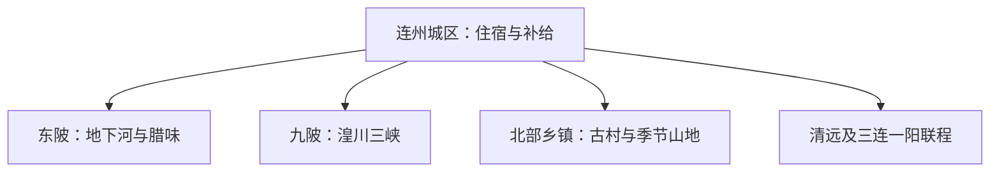

# 连州旅行指南

连州适合把岩溶洞穴、连江峡谷和古城人文拆成两到三天：城区负责住宿与补给，东陂的地下河、九陂的湟川三峡各占一个主要时段；古道、古村和季节乡村体验再按道路与开放情况择一。

> 建议停留：2–3 天；只看一处大型景区可安排 1 天<br>
> 旅行关键词：连州地下河、湟川三峡、燕喜文化、古道、菜心、东陂腊味<br>
> 主要体力：城区低至中等；洞穴湿滑路面和乡村山路为中等<br>
> 最近研究：2026-08-13

## 城市速览

| 项目 | 旅行信息 |
|---|---|
| 主要旅行价值 | 在同一座县级市里组合地下洞河、地上峡谷、古城人文与粤北饮食 |
| 建议停留 | 2 天覆盖地下河和湟川三峡；第 3 天用于城区文化或一条乡村线 |
| 较舒适季节 | 秋末至春季更适合步行；春夏水景充沛，同时要为强降雨和山路变化留余量 |
| 预算特点 | 城区住宿餐饮为中等预算，洞穴船段、峡谷船班和县域用车是主要增量 |
| 步行强度 | 城区可分段步行；洞穴台阶、湿滑地面和古道坡段增加体力需求 |
| 主要天气风险 | 暴雨、雷电、山洪、地质灾害、冬季山区低温或结冰 |
| 独行旅行 | 城区用餐和住宿方便；远点优先使用景区接驳、正规客运或预约车辆 |
| 亲子旅行 | 地下河和乡村项目先核年龄、船舶、护栏与推车寄存条件 |
| 长者与低体力旅行 | 每天选一处大型景区，住宿放在城区，减少连续山路与上下船次数 |
| 无障碍信息 | 城区公共空间较易调整；洞穴、古建和船段资料有限，设施连续性需向官方确认 |

## 城市格局与游览区域

连州市是清远市代管的县级市，法定代码 **441882**。GeoNames `1803841` 是连州城市点，Wikidata `Q1023910` 的 GeoNames 属性与法定代码均与之精确交叉；点坐标用于定位主城，不代替覆盖 12 个乡镇的市域边界。



| 区域 | 主要内容 | 游览特点 | 与其他区域的关系 |
|---|---|---|---|
| 连州城区 | 燕喜文化园、慧光塔周边、连江城市段 | 适合抵达日、雨天和晚间用餐 | 是去各乡镇的住宿基地 |
| 东陂方向 | 连州地下河、东陂镇与腊味产业 | 洞穴步行和船段组成完整景区 | 与湟川三峡分属不同道路方向 |
| 九陂—龙潭方向 | 湟川三峡—龙潭文化生态旅游区 | 水上游览受水位和天气影响 | 可与城区组合，不与地下河压成半日扫点 |
| 北部乡村与山地方向 | 丰阳古村、古道、潭岭和季节乡村项目 | 交通分散，适合自驾或预约正规车辆 | 每次选择一个明确开放目的地 |

## 主要景点

### 城区与两处核心景区

| 景点 | 区域 | 类型 | 主要看点 | 建议用时 | 室内外 | 体力 | 预约风险 | 天气影响 | 优先级 |
|---|---|---|---|---:|---|---|---|---|---|
| 连州地下河旅游景区 | 东陂镇大洞村 | 洞穴、地下河 | 溶洞步行层与运营船段，作为一个完整景区 | 3–5 小时 | 室内外混合 | 中 | 高 | 中 | A |
| 湟川三峡—龙潭文化生态旅游区 | 九陂镇龙潭村 | 峡谷、水上游览 | 连江峡谷、正式码头和当日船段 | 3–5 小时 | 室外 | 中 | 高 | 高 | A |
| 燕喜文化园 | 连州城区 | 园林、历史文化 | 刘禹锡文化、燕喜山与当期开放展陈 | 1.5–3 小时 | 混合 | 低至中 | 中 | 中 | B |
| 慧光塔周边 | 连州城区 | 古建、城市步行 | 古塔外观、老城街巷和连江城市段 | 1–2 小时 | 室外为主 | 低 | 中 | 中 | B |

### 古村、古道与季节方向

| 景点 | 区域 | 类型 | 主要看点 | 建议用时 | 室内外 | 体力 | 预约风险 | 天气影响 | 优先级 |
|---|---|---|---|---:|---|---|---|---|---|
| 丰阳古村及古道公开段 | 丰阳镇 | 古村、古道 | 古街、传统建筑和有明确入口的古道短段 | 3–5 小时 | 室外为主 | 中 | 中至高 | 高 | B |
| 洛神谷旅游景区 | 瑶安方向 | 山谷、乡村体验 | 正式景区范围内的山谷景观和当期活动 | 半天 | 室外 | 中 | 高 | 高 | C |
| 西岸·禾悦生态旅游景区 | 西岸镇 | 亲子、乡村休闲 | 运营范围内的农业与亲子项目 | 3–5 小时 | 混合 | 低至中 | 高 | 高 | C |
| 潭岭天湖观景方向 | 北部山地 | 湖库、高山景观 | 经官方确认可达的公共观景点与季节景观 | 1 天 | 室外 | 中 | 高 | 极高 | C |

地下河的洞内步行和船段合并为一个景区；湟川三峡是另一套码头与船班。潭岭水库、自然保护地、矿区和林业生产道路按管理边界使用，旅行路线选择公开道路与正式接待点。

## 美食与餐饮

| 菜品或餐饮类型 | 常见区域 | 一个人用餐与常见份量 | 风味、过敏原与饮食限制 | 排队风险与替代方法 |
|---|---|---|---|---|
| 连州菜心 | 城区及当季餐馆 | 一盘多适合两人，一人可问小份 | 蒜蓉、上汤或蚝油做法可能含动物汤、大豆或贝类 | 非产季改选当季叶菜 |
| 东陂腊味 | 东陂镇、城区 | 拼盘适合分享，包装品适合作手信 | 盐、糖和脂肪较高，配方可能含酒或大豆 | 选择有标签与生产信息的产品 |
| 沙坊粉、东陂水角 | 城区早餐与小吃店 | 一碗或一份适合独食 | 米制品配料、汤底和蘸料可能含肉、花生或大豆 | 早餐高峰可换同类本地小吃 |
| 连江河鲜 | 城区正规餐馆 | 多按条或重量，先问时价与加工费 | 鱼刺与水产过敏风险；选择合法来源并彻底加热 | 改点明码标价的养殖鱼或家常粤菜 |

## 经典行程

```mermaid
flowchart TD
    S["先确定可用天数"] --> O{ "是否只有一天" }
    O -->|是| A["地下河或湟川三峡二选一"]
    O -->|否| T["两处核心景区分日"]
    T --> E{ "再有一天" }
    E -->|是| V["城区文化或一条乡村线"]
    E -->|否| R["城区休息后返程"]
```

### 一日经典路线

**路线**：连州城区 → 连州地下河 → 东陂镇午餐 → 城区燕喜文化园或连江短步行

- **串联逻辑**：把唯一的大型景区放在白天，城区承担前后补给，减少跨方向移动。
- **预约锚点**：地下河入园、船段、东陂往返交通和最后返程。
- **休息安排**：出洞后在东陂或城区坐席午餐，下午只留低强度短段。
- **时间不足时**：取消城区加点，完整保留地下河游线。

### 两日城市路线

**第 1 天**：城区 → 地下河 → 城区住宿<br>
**第 2 天**：湟川三峡—龙潭 → 城区用餐 → 返程

- **串联逻辑**：地下洞河和地上峡谷分日，避免两套船段、道路接驳与排队相互挤压。
- **预约锚点**：两景区门票、船班、道路接驳、住宿和返程客运。
- **休息安排**：两天午餐均放在有固定座席和卫生间的镇区或城区。
- **时间不足时**：第二天取消附加节目和乡村停靠，保留峡谷主体。

### 三日深度路线

**第 1 天**：城区人文；**第 2 天**：地下河；**第 3 天**：湟川三峡或丰阳古村公开段。

- **串联逻辑**：先用城区建立历史背景，再把两个远点各自做成完整日。
- **预约锚点**：核心景区、古村接待、住宿、县域车辆与返程。
- **休息安排**：首日低强度，远点日均在城区结束，减少夜间山路。
- **时间不足时**：优先删第 3 天乡村线，再压缩城区人文。

### 雨天路线

**路线**：城区有明确开放的文化场馆 → 室内午餐 → 雨势允许时的短距离老城步行

- **适用条件**：普通降雨且道路、河流水位和场馆正常；强降雨预警时在城区休整。
- **预约锚点**：场馆公告、城市积水、客运和景区停航信息。
- **休息安排**：选择靠近住宿的室内空间，每 60–90 分钟休息。
- **时间不足时**：只留一处场馆和一顿正餐。

### 亲子或低体力路线

**亲子路线**：城区 → 西岸·禾悦当日开放亲子项目 → 城区休息<br>
**低体力路线**：城区文化空间 → 连江公共滨水短段 → 坐席午餐

- **减负方式**：亲子线减少山路并核年龄规则；低体力线减少台阶、上下船和远距换乘。
- **预约锚点**：亲子项目营业、推车与儿童规则；城区场馆电梯和入口。
- **休息安排**：午间回到城区，保留可提前结束的车辆方案。
- **时间不足时**：两条路线都只保留首个已确认开放项目。

### 远郊一日路线

**路线**：连州城区 → 丰阳古村及古道公开段或潭岭公共观景方向 → 城区

- **适用条件**：道路、天气、接待入口和返程车辆均已确认；两方向择一。
- **预约锚点**：属地接待、道路管制、森林防火、水库管理和正规车辆。
- **休息安排**：在镇区用餐，山路段预留固定停车与卫生间。
- **时间不足时**：整段取消，改为城区文化与餐饮。

## 住宿区域

| 区域 | 优点 | 缺点 | 适合人群 | 交通特点 |
|---|---|---|---|---|
| 连州城区 | 餐饮、补给和跨方向用车最方便 | 到两大景区仍需道路接驳 | 首访、无车、亲子与低体力旅行者 | 适合作为连续两晚基地 |
| 东陂镇或地下河周边正规住宿 | 便于早入地下河并体验镇区饮食 | 晚间选择较少，到三峡仍需换方向 | 地下河优先、自驾者 | 先确认停车、早餐和夜间到达 |
| 龙潭或九陂方向正式住宿 | 可减少峡谷日早晚往返 | 运营季节与餐饮选择变化较大 | 峡谷深度游、摄影者 | 需核码头、返程与行李接驳 |

## 市内交通

| 场景 | 建议与取舍 | 行前需要重查的内容 |
|---|---|---|
| 从铁路或长途客运抵达 | 连州没有主干高铁门户，通常经清远、广州或周边铁路站转公路进入 | 到发站、客运班次、末班与行李接驳 |
| 城区到地下河 | 优先景区接驳、县域客运或正规预约车辆 | 上下客点、返程时刻、施工和节假日拥堵 |
| 城区到湟川三峡 | 把道路接驳与船班分开确认 | 码头位置、水位、停航和最后返程 |
| 自驾 | 对分散乡镇最灵活，住宿放城区可降低连续山路负担 | 山洪地灾、冬季结冰、停车和充电 |

## 不同旅行者须知

| 旅行维度 | 可行条件 | 主要取舍 | 需额外核对 |
|---|---|---|---|
| 独行旅行 | 城区住宿、用餐与正规车辆可闭环 | 远点当天返程余量要充足 | 末班客运和司机资质 |
| 亲子旅行 | 每天一处大型项目并安排午休 | 洞穴湿滑、船舶和山路增加照看负担 | 年龄、救生衣、推车寄存 |
| 长者或低体力旅行 | 城区连续住宿，景区入口就近上下车 | 洞穴台阶和船段仍可能形成连续负担 | 电梯、台阶、接驳和休息座椅 |
| 无障碍需求 | 优先城区公共空间和有客服的正式景区 | 历史建筑、洞穴和码头连续通行资料不足 | 设施连续性需向官方确认 |
| 摄影旅行 | 峡谷、古村和季节农业各有明确时段 | 商业拍摄、无人机和三脚架规则分场所 | 日出日落开放、设备许可 |
| 特殊天气 | 城区提供缩短方案 | 山洪、地灾、结冰和停航影响远线 | 气象预警、道路与景区公告 |

## 行前核对

| 核对事项 | 为什么需要重查 | 建议核对时间 | 官方入口 |
|---|---|---|---|
| 地下河与湟川三峡开放 | 船班、维修、水位和节假日限流会改变路线 | 购票前及到访前一日 | [连州市文旅产业概况](https://www.lianzhou.gov.cn/qylzwgdlt/gkmlpt/content/2/2166/post_2166464.html) |
| 县域交通 | 班次与末班会影响当天返程 | 出发前一周及当天 | [连州市人民政府](https://www.lianzhou.gov.cn/) |
| 山区天气与道路 | 强降雨、地灾和结冰影响乡村线 | 出发前三日及当天 | [广东省气象局](https://gd.cma.gov.cn/) |
| 古村与乡村项目 | 接待日、活动和停车条件会调整 | 排入路线前 | [连州旅游服务](https://www.lianzhou.gov.cn/zjlz/jjfz/lyfw/) |

## 来源与更新记录

### 主要来源

| 来源 | 类型 | 支持内容 | 核验日期 |
|---|---|---|---|
| [连州市文旅产业概况](https://www.lianzhou.gov.cn/qylzwgdlt/gkmlpt/content/2/2166/post_2166464.html) | 市文旅部门 | 2026 年景区、古迹、乡村与水域资源概况 | 2026-08-13 |
| [连州市 A 级景区简介](https://www.lianzhou.gov.cn/zjlz/jjfz/lyfw/content/post_1601820.html) | 市文旅部门 | 地下河、湟川三峡等景区名称与地址 | 2026-08-13 |
| [连州市自然与旅游资源](https://www.lianzhou.gov.cn/zjlz/zrdl/zrzy/index.html) | 市政府 | 连江水系、古村、古道、农食与自然资源 | 2026-08-13 |
| [连州市 2025 年政府工作报告](https://www.lianzhou.gov.cn/xxgk/fggw/zfwj/zfgzbg/content/post_1990961.html) | 市政府 | 文旅项目、道路与住宿建设的动态背景 | 2026-08-13 |
| [连州市生态建设实施方案](https://www.lianzhou.gov.cn/xxgk/fggw/zfwj/szfbgswj/content/post_2047466.html) | 市政府 | 河流、国家公园、乡村与保护利用边界 | 2026-08-13 |
| [民政部行政区划查询](https://dmfw.mca.gov.cn/xzqh/getList?code=44&trimCode=true&maxLevel=3) | 政府开放接口 | 连州市代码 `441882` 及清远代管关系 | 2026-08-13 |
| [GeoNames 1803841](https://www.geonames.org/1803841/lianzhou.html) | 开放地理数据 | 固定城市点名称、坐标和 PPLA3 分类 | 2026-08-13 |
| [Wikidata Q1023910](https://www.wikidata.org/wiki/Q1023910) | 开放知识图谱 | 连州市实体、P1566 与法定代码交叉核验 | 2026-08-13 |

### 更新记录

| 日期 | 更新内容 |
|---|---|
| 2026-08-13 | 首次完成连州独立旅行研究；从清远父页迁入地下河、湟川三峡、餐饮、住宿与路线所有权。 |
