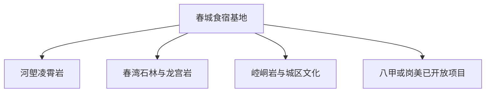
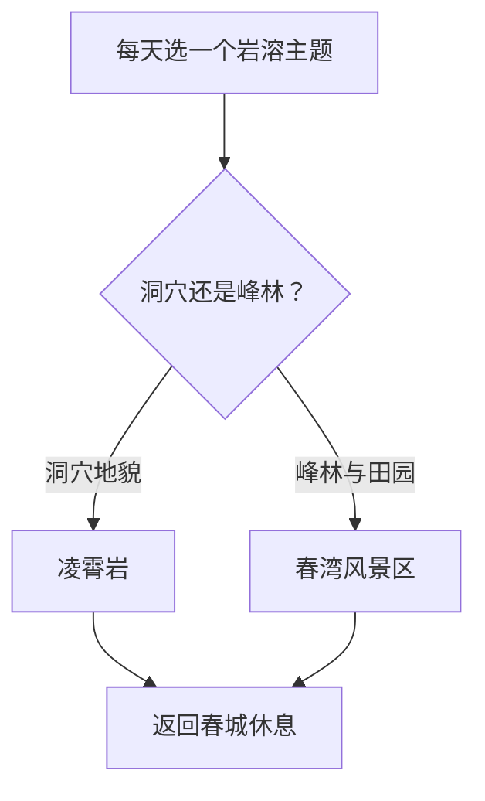

# 阳春市旅行指南

阳春的核心是岭南嗀斯特地貌，旅行时可把凌霄岩、春湾石林和春城文化拆成三个尺度。先选一个溶洞或峰林父景区用整日，再按天气和交通增加崆峒岩、漠阳江或乡村线，比一天追逐多个洞穴更容易看清地貌差异。

> 建议停留：2–3 天\
> 旅行关键词：凌霄岩、春湾石林、岩溶地貌、春砂仁\
> 主要体力：中等，山地线较高\
> 最近研究：2026-08-12

## 城市速览

| 项目 | 旅行信息 |
|---|---|
| 主要旅行价值 | 集中观察热带亚热带岩溶洞穴、峰林、河谷与岭南乡镇生活 |
| 建议停留 | 2 天可做凌霄岩与春湾；3 天再加春城文化、崆峒岩或一处已开放乡村项目 |
| 较舒适季节 | 冬春温度较温和；夏秋植被丰盛，同时需应对高温、台风与强降雨 |
| 预算特点 | 景区门票、景交与跨镇车辆是主要支出；城区食宿选择较多 |
| 步行强度 | 洞穴、石阶、湿滑地面和峰林步道使体力达中高 |
| 主要天气风险 | 台风、暴雨、山洪、雷电、高温和滑坡落石 |
| 独行旅行 | 住春城并每天选一个方向；远郊先确认返程班次或车辆 |
| 亲子旅行 | 地质科普题材强；洞穴灯光、湿滑台阶、游船和水边需持续看护 |
| 长者与低体力旅行 | 选一处洞穴的短线或游客中心周边，用车辆减少跨镇换乘 |
| 无障碍信息 | 游客中心、洞内台阶、栈道、景交和卫生间需分段核对；设施连续性需向官方确认 |

## 城市格局与游览区域

| 区域 | 主要内容 | 游览特点 | 与其他区域的关系 |
|---|---|---|---|
| 春城主城 | 住宿、餐饮、非遗展示和漠阳江城市段 | 适合到达日、雨天与休息 | 作为凌霄岩、春湾和南部山地的交通基地 |
| 河塱镇 | 凌霄岩、玉溪三洞等岩溶景观 | 洞穴与水系项目需查当日开放 | 一天宜选一个主洞穴父景区 |
| 春湾镇 | 春湾石林、龙宫岩与峰林田园 | 石林与洞穴为一个度假片区 | 可住春湾或从春城整日往返 |
| 春城—崆峒岩 | 城市文化、岩洞史迹与短线休闲 | 可做半日 | 适合与城区场馆同日 |
| 八甲、双滘与岗美方向 | 瀑布、山地、温泉与红色乡村 | 道路、天气和运营决定可达性 | 每次只选一个已开放目的地 |

## 主要景点

### 岩溶与峰林

| 景点 | 区域 | 类型 | 主要看点 | 建议用时 | 室内外 | 体力 | 预约风险 | 天气影响 | 优先级 |
|---|---|---|---|---:|---|---|---|---|---|
| 凌霄岩风景区 | 河塱镇 | 溶洞、国家地质公园 | 大型洞厅、洞穴沉积物与地质科普 | 3–5 小时 | 混合 | 中高 | 高 | 高 | A |
| 春湾风景区 | 春湾镇 | 石林、溶洞、度假区 | 石林峰丛、龙宫岩与田园景观，内部项目统一计一个父景区 | 4–6 小时 | 混合 | 中高 | 高 | 高 | A |
| 玉溪三洞 | 河塱镇 | 溶洞、水系 | 地下河与岩溶洞穴，只在正式开放与运营明确时安排 | 2–4 小时 | 混合 | 中高 | 很高 | 很高 | B |
| 崆峒岩景区 | 春城街道方向 | 岩洞、历史文化 | 岩洞、摩崖与宗教文化，开放状态行前核对 | 2–3 小时 | 混合 | 中 | 高 | 中 | B |

### 城市与远郊选择

| 景点 | 区域 | 类型 | 主要看点 | 建议用时 | 室内外 | 体力 | 预约风险 | 天气影响 | 优先级 |
|---|---|---|---|---:|---|---|---|---|---|
| 阳春市博物馆或非遗展示馆 | 春城 | 地方文化场馆 | 史前遗址、根雕、粤剧与当期展览，馆址和开馆重查 | 1.5–2.5 小时 | 室内 | 低 | 高 | 低 | B |
| 漠阳江城区公开慢行段 | 春城 | 河岸、城市公共空间 | 城市与漠阳江关系 | 1–2 小时 | 室外 | 低 | 低 | 高 | B |
| 岗美潭簕红色展馆旅游区 | 岗美镇 | 红色文化、乡村 | 当期开放展陈与乡村空间 | 半日 | 混合 | 中 | 高 | 中 | C |
| 八甲或双滘已公告开放的山地项目 | 市域南部 | 山地、瀑布或生态 | 高山、森林与水系，以当期正式入口为准 | 1 天 | 室外 | 高 | 很高 | 很高 | C |

鸡笼顶、鹅凰嶂、百涌等山地或保护地名称经常出现在资源介绍中，旅行时以已公告的景区入口、步道和管理要求为路线边界。地质遗迹、自然保护区、林场和水库管理区优先保护与安全。

## 美食与餐饮

| 菜品或餐饮类型 | 常见区域 | 一个人用餐与常见份量 | 风味、过敏原与饮食限制 | 排队风险与替代方法 |
|---|---|---|---|---|
| 春砂仁炖汤或蒸菜 | 春城与正规粤菜馆 | 汤和大菜多适合分享，独行问例汤 | 药食同源香料、肉类、高钠；孕期或用药者先核对食用条件 | 选能说明原料和份量的普通粤菜馆 |
| 阳春猪杂与粉面 | 城区早餐店 | 单人容易点单 | 内脏、高嘰呤、汤底、花生和小麦需询问 | 早餐时段就近换同类店 |
| 凌霄白籺鸭与家常粤菜 | 河塱、春城 | 整只或大盘适合多人，一人先问例份 | 鸭肉、皮下脂肪、酱油与骨刺 | 景区周边高峰时回镇区选菜单透明餐厅 |
| 马水桔等时令水果 | 市场与正规果园 | 按重量购买，采摘前确认计价 | 柑橘类过敏、药物互作用与清洗 | 非果期改买有产地标识的包装果品 |

## 经典行程

### 一日经典路线

**路线**：春城早出发 → 凌霄岩 → 河塱镇午餐 → 已开放的短段地质科普线 → 春城

- **串联逻辑**：全天围绕同一地质片区，减少跨镇转场。
- **预约锚点**：凌霄岩门票、入园时段、洞内设备与返程车辆。
- **休息安排**：河塱镇午餐，洞穴游览前后在游客中心休息。
- **时间不足时**：只保留凌霄岩主游线，删科普支线。

### 两日城市路线

**第 1 天**：凌霄岩整日。\
**第 2 天**：春湾风景区 → 春湾镇休息 → 春城。

- **串联逻辑**：洞穴和峰林分日，保留两处父景区的完整时间。
- **预约锚点**：两处景区开放、内部项目、停车、景交和返程。
- **休息安排**：每日在景区外的镇区完成午餐和长休息。
- **时间不足时**：按兴趣在凌霄岩与春湾中选一天。

### 三日深度路线

**第 1 天**：凌霄岩。\
**第 2 天**：春湾风景区。\
**第 3 天**：城区场馆 → 午餐 → 崆峒岩或岗美潭簕二选一。

- **串联逻辑**：第三天收回城区与近郊，在地貌之外补地方历史。
- **预约锚点**：第三天场馆与乡村项目开放。
- **休息安排**：城区午餐，下午只做一处。
- **时间不足时**：删第三天；两天不压缩两个父景区。

### 雨天路线

**路线**：已确认开馆的市博物馆或非遗展馆 → 城区午餐 → 成熟商业区休息

- **适用条件**：适用普通降雨；台风、暴雨、山洪或地质灾害预警期间以安全休息为主。
- **预约锚点**：场馆开馆、入场与城区道路状况。
- **休息安排**：在同一商业区完成用餐、补给与等车。
- **时间不足时**：只保留一座室内场馆。

### 亲子或低体力路线

**亲子路线**：市博物馆或非遗展馆 → 午餐 → 凌霄岩当期适龄短线。\
**低体力路线**：车辆抵达凌霄岩游客中心 → 已确认低强度段 → 镇区午餐 → 春城。

- **减负方式**：亲子线按年龄选洞穴段并全程看护；低体力线提前确认台阶、落客和返回路径。
- **预约锚点**：灯光、湿滑地面、儿童规则、轮椅、卫生间和景交。
- **休息安排**：游客中心前后各休息一次，正午留在镇区用餐。
- **时间不足时**：保留场馆，山洞线改到天气与体力更合适时。

### 远郊一日路线

**路线**：春城 → 春湾风景区 → 春湾镇午餐 → 景区剩余开放段 → 春城或春湾住宿

- **适用条件**：景区开放、公路、气象与返程都已确认。
- **预约锚点**：入园时段、内部项目、景交、洞内设备和返程。
- **休息安排**：在春湾镇完成午餐与长休息，洞内外温差大时增加适应时间。
- **时间不足时**：按官方推荐主线游览，删内部付费支线与返程前追加点。

## 住宿区域

| 区域 | 优点 | 缺点 | 适合人群 | 交通特点 |
|---|---|---|---|---|
| 春城主城 | 餐饮、商超、正规酒店与出租车最集中 | 去凌霄岩、春湾和南部山地都需跨镇 | 首访、无车、多方向日游 | 适合每日原路返回 |
| 春湾镇 | 紧邻春湾风景区，便于早入园 | 夜间餐饮、酒店与叫车选择少于主城 | 春湾深度或次日继续向北 | 订房时确认车站、景区入口和住宿间实际车程 |
| 河塱镇 | 便于凌霄岩早出 | 选择较少，洞穴之外的夜间活动有限 | 专门地质行程与自驾 | 确认停车、热水、电梯、早餐和次日返程 |

## 市内交通

- **铁路**：阳春站与阳春东站是不同站点；按 12306 票面站名、住宿位置和景区方向选择。
- **城区与乡镇**：城乡公交、客运、正规包车或自驾承担跨镇移动；同时确认返程和末班。
- **山区道路**：台风、暴雨、山洪或地质灾害预警时，选城区室内行程；道路与景区确认恢复后再出发。

## 不同旅行者须知

| 旅行维度 | 可行条件 | 主要取舍 | 需额外核对 |
|---|---|---|---|
| 独行 | 住春城、每天一个父景区 | 跨镇车辆成本与返程 | 末班、司机信息、信号和夜间到店 |
| 亲子 | 地质科普与短段洞穴 | 湿滑、黑暗、水边、护栏和儿童情绪 | 年龄、灯光、游船、推车、卫生间与看护 |
| 长者或低体力 | 车辆到游客中心、单一低强度段 | 台阶、坡道、温差和跨镇换乘 | 落客、轮椅、座椅、卫生间、医疗点和返回路径 |
| 户外摄影 | 洞穴、石林、河谷和田园题材丰富 | 早晚光线增加山路与雷雨风险 | 三脚架、无人机、灯具、景区拍摄和保护地规则 |

## 行前核对

| 核对事项 | 为什么需要重查 | 建议核对时间 | 官方入口 |
|---|---|---|---|
| 凌霄岩与春湾 | 开放、入园、内部项目、步道、景交和容量会变 | 预订前、前一日和当天 | [阳春市政府旅游入口](https://www.yangchun.gov.cn/mlyc/index.html)、景区官方公告 |
| 城市场馆和乡村项目 | 馆址、开馆、展陈、接待与体验随日期变 | 排路线时及前一日 | [阳春市文化广电旅游体育局答复](https://www.yangchun.gov.cn/xxgk/jytabljg/content/post_834265.html) |
| 铁路与跨镇交通 | 站名、停靠、客运、末班和山路施工会变 | 开售时及出发当天 | [12306](https://www.12306.cn/)、[广东省交通运输厅](https://td.gd.gov.cn/) |
| 台风、暴雨与地质灾害 | 洞穴、河谷、瀑布和山区道路可快速调整 | 前三日起连续查 | [广东省气象局](https://gd.cma.gov.cn/)、[广东省应急管理厅](https://yjgl.gd.gov.cn/) |

## 来源与更新记录

### 主要来源

| 来源 | 类型 | 支持内容 | 核验日期 |
|---|---|---|---|
| [广东省民政厅](https://smzt.gd.gov.cn/) | 省民政部门 | 阳春市县级市层级与行政代码 `441781` 核对入口 | 2026-08-12 |
| [Wikidata：Yangchun（Q1023923）](https://www.wikidata.org/wiki/Q1023923) | CC0 开放数据 | 法定实体与 GeoNames `1814786` 精确交叉核对 | 2026-08-12 |
| [GeoNames：Yangchun（1814786）](https://www.geonames.org/1814786/yangchun.html) | CC BY 4.0 开放数据 | PPL 主城点、坐标和名称；点位不代替市域边界 | 2026-08-12 |
| [阳春市政府：城市概况](https://www.yangchun.gov.cn/xxgk/ghjh/content/post_864658.html) | 市政府 | 市域景观、四大旅游片区、凌霄岩、春湾和远郊资源 | 2026-08-12 |
| [阳春市政府：阳春国家地质公园](https://www.yangchun.gov.cn/zlyc/csmp/content/post_244120.html) | 市政府 | 岩溶地貌、洞穴、地热、白水瀑布与历史遗迹 | 2026-08-12 |
| [阳春市政府：凌霄岩与春湾石林](https://www.yangchun.gov.cn/zlyc/fjms/content/post_496985.html) | 市政府 | 两处核心景区的位置、洞厅与石林景观 | 2026-08-12 |
| [阳春市文广旅体局提案答复](https://www.yangchun.gov.cn/xxgk/jytabljg/content/post_834265.html) | 市文旅部门 | “一核一带两心六组团”格局、非遗展示与乡村旅游方向 | 2026-08-12 |

### 更新记录

- 2026-08-12：建立首个完整版本；以 GeoNames `1814786`、Wikidata `Q1023923` 和法定代码 `441781` 核对阳春市；按春城、凌霄岩、春湾与南部远线组织，补齐父景区去重、岩溶安全、保护地、台风暴雨、交通和无障碍决策。
