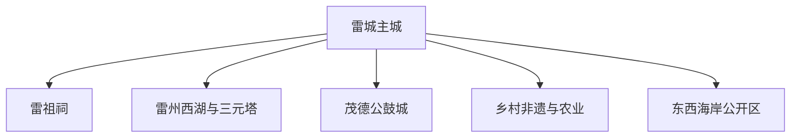
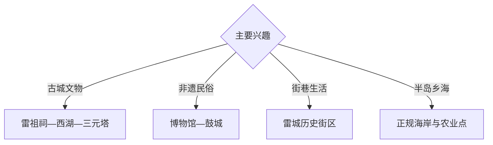

# 雷州旅行指南

雷州位于雷州半岛中部，以雷城历史文化、雷祖祠、三元塔、雷州西湖、雷剧与石狗文化、茂德公鼓城和东西海岸形成鲜明的半岛旅行结构。固定快照中的 **Leizhou / GeoNames 1804243** 锚定雷城主城；海岸、火山地貌和农业生产区需分方向安排。

## 城市速览

| 项目 | 信息 |
|---|---|
| 主线 | 雷城—雷祖祠—西湖—三元塔—茂德公鼓城—半岛乡海 |
| 停留 | 雷城 1天；乡村非遗或海岸方向另留1天 |
| 住宿 | 雷城适合交通与餐饮；远郊选择正规接待点 |
| 交通 | 铁路、公路抵达，远郊宜约车或自驾 |
| 季节 | 秋冬较舒适；夏秋关注台风、暴雨和高温 |
| 预算 | 主城灵活，包车、讲解与活动票务增加预算 |

## 城市格局与游览区域

雷城集中文物、博物馆和城市服务；茂德公鼓城承接非遗与度假，海岸和乡村点分散于半岛。文物本体、宗教空间、海上养殖区、港口码头、风电及工业生产区按开放与作业边界进入。

## 主要景点

| 景点 | 区域 | 类型 | 核心体验 | 用时 | 环境 | 体力 | 研究价值 | 拥挤 | 优先级 |
|---|---|---|---|---:|---|---|---|---|---|
| 雷祖祠 | 雷城近郊 | 文物与信俗 | 雷祖文化、古建和地方信仰 | 2–3小时 | 混合 | 低 | 很高 | 节庆中高 | A |
| 雷州西湖公园公开区 | 雷城 | 园林与历史 | 苏轼相关记忆、湖园和城市休闲 | 2–3小时 | 室外 | 低 | 高 | 晚间中 | A |
| 三元塔公园与公开古塔区 | 雷城 | 古塔与城市景观 | 明代古塔、城市视野和历史轴线 | 1–2小时 | 室外 | 低中 | 高 | 中 | A |
| 雷州市博物馆 | 雷城 | 文博 | 雷州历史、石狗、陶瓷与民俗 | 2小时 | 室内 | 低 | 很高 | 中 | A |
| 茂德公鼓城度假区 | 近郊 | 非遗与度假 | 雷剧、鼓乐、建筑和地方饮食 | 半天 | 混合 | 低 | 高 | 节假日中高 | B |
| 雷州历史文化街区公开段 | 雷城 | 街巷与非遗 | 骑楼街巷、雷剧和城市生活 | 2–3小时 | 混合 | 低 | 高 | 活动时中 | B |
| 正规海岸与乡村体验点 | 半岛乡镇 | 海岸与农业 | 滨海景观、菠萝田和乡村文化 | 半天至1天 | 室外 | 低中 | 中高 | 季节性 | B |

## 美食与餐饮

雷州白切狗以外，更广泛可选雷州羊肉、海鲜、叶搭饼、甜糟和半岛水果；根据个人饮食偏好在正规餐馆选择。海鲜核对明码标价和合法来源，台风季优先主城稳定营业场所。

## 经典行程

### 雷城经典线
**路线**：博物馆—西湖—三元塔—历史街区。**逻辑**：用一天建立雷州历史与城市空间框架。**预约锚点**：博物馆开放。**休息**：西湖周边。**删除条件**：高温时把街区移至傍晚。

### 雷祖文化线
**路线**：雷城—雷祖祠公开区—相关民俗展陈—返城。**逻辑**：从古建和信俗理解地方文化。**预约锚点**：祠宇开放和节庆安排。**休息**：景区服务点。**删除条件**：大型活动限流时服从预约时段。

### 非遗鼓城线
**路线**：博物馆—雷剧或石狗展陈—茂德公鼓城。**逻辑**：将馆藏知识与活态演出连接。**预约锚点**：演出和活动日程。**休息**：鼓城正规餐饮。**删除条件**：无演出时缩短为半天。

### 半岛海岸线
**路线**：主城—依法开放海岸点—滨海乡镇—返程。**逻辑**：独立一天承接半岛尺度。**预约锚点**：天气、潮汐与车辆。**休息**：乡镇正规服务点。**删除条件**：台风、大风浪或海岸管制时取消。

### 农业乡村线
**路线**：主城—正规菠萝或果园体验—村落公共空间—返程。**逻辑**：按接待安排理解热带农业。**预约锚点**：农场接待和采收季。**休息**：正规农庄。**删除条件**：生产忙季无接待时改主城。

### 亲子低体力线
**路线**：博物馆—西湖—鼓城公开活动。**逻辑**：室内外切换且步行可控。**预约锚点**：亲子活动。**休息**：西湖或鼓城。**删除条件**：暴雨时保留室内展陈。

### 三日组合线
**路线**：首日雷城；次日雷祖祠与鼓城；第三日海岸或农业。**逻辑**：城市、非遗和半岛远线分日。**预约锚点**：第三日天气。**休息**：雷城连续住宿。**删除条件**：两天时删远郊日。

## 住宿区域

雷城适合铁路、公路接驳和文化线路；正规度假区适合慢游。订房核对夜间交通、停车、消防、空调、台风退改和远郊返程。

## 市内交通

雷州站与公路客运连接主城，具体班次出发前核对。雷祖祠、鼓城、海岸和农业点分方向安排车辆；沿海道路按台风、积水与临时管制行驶。

## 不同旅行者须知

历史旅行者优先博物馆与雷祖祠；亲子和长者选择西湖及室内展陈；非遗旅行者按官方演出日程到访；海岸旅行者核对潮汐和天气。文物本体、宗教礼仪空间、军事管理区、港口航道、养殖作业区、风电与工业生产区保留明确限制。

## 行前核对

- 核对雷祖祠、博物馆、三元塔和街区开放。
- 核对鼓城演出、非遗活动与乡村接待。
- 核对台风、暴雨、潮汐、风浪和沿海交通公告。
- 核对铁路、公路班次、返程车辆与住宿退改。

## 来源与更新记录

| 来源 | 支持内容 | 核验日期 |
|---|---|---|
| [雷州市政府：2026年政府工作报告](https://www.leizhou.gov.cn/xxgk/zfgzbg/content/post_2160609.html) | 非遗活动、茂德公鼓城、历史街区与文化建设 | 2026-09-03 |
| [湛江市政府：雷州文旅资源资料](https://www.zhanjiang.gov.cn/attachment/0/236/236446/1981183.pdf) | 雷祖祠、西湖、三元塔与文物资源 | 2026-09-03 |
| [GeoNames 1804243](https://www.geonames.org/1804243/) | Leizhou 固定人口点与雷城位置 | 2026-09-03 |

