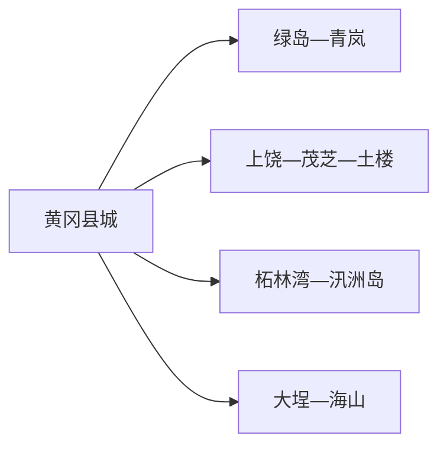
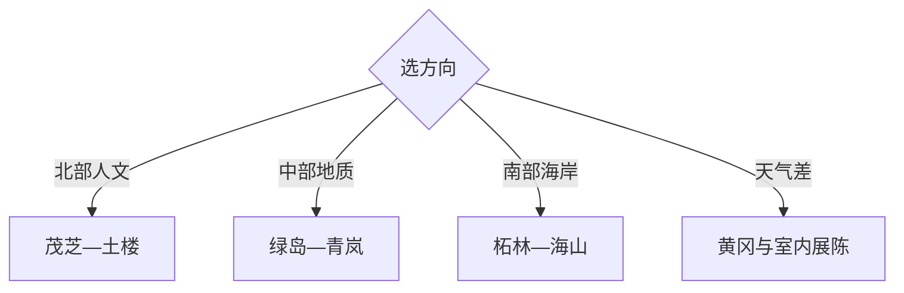

# 饶平旅行指南

饶平把闽粤交界的土楼古村、凤凰山麓茶乡、黄冈县城和柘林湾海岸放在同一县域。距离决定选法：两天安排北部山村与南部海岸中的一条，三天才适合兼顾红色人文、地质与海湾。

## 城市速览

| 项目 | 信息 |
|---|---|
| 主线 | 黄冈—绿岛—青岚地质—茂芝—土楼古村—柘林湾与海山 |
| 停留 | 核心2天；南北兼顾3天以上 |
| 住宿 | 黄冈换线方便，柘林或海山适合海岸主题，北部乡镇需预订 |
| 交通 | 从饶平站、公路客运进入，县内南北跨度大，远线用正规包车或自驾 |
| 风险 | 台风暴雨、海况与潮汐、山路、地质坡面、海岛船班 |
| 边界 | 海岸保护带、养殖生产区、地质遗迹、土楼民居与革命旧址按开放范围进入 |

## 城市格局与游览区域

固定 `Huanggang / GeoNames 1807508` 是饶平县治黄冈镇的人口点，本页以县域 `Q1209160` 承接。黄冈只是交通与服务中心，北部上饶、浮滨和南部柘林、大埕、海山之间需要分日。

## 主要景点

| 景点 | 区域 | 类型 | 核心体验 | 用时 | 环境 | 体力 | 预约风险 | 天气影响 | 优先级 |
|---|---|---|---|---:|---|---|---|---|---|
| 绿岛旅游山庄 | 钱东周边 | 综合景区 | 山林、乡村休闲与县域中转 | 半日 | 混合 | 中 | 中 | 高 | A |
| 青岚地质公园公开区 | 樟溪方向 | 地质景观 | 花岗岩洞穴与地貌科普 | 半日 | 室外 | 中高 | 高 | 很高 | A |
| 茂芝会议旧址及苏区文化区 | 上饶镇 | 红色文化 | 革命史、村落与纪念空间 | 半日 | 混合 | 中 | 高 | 中 | A |
| 饶平土楼与传统村落公开点 | 北部乡镇 | 建筑与村落 | 闽粤土楼、聚落与客家文化 | 半日至1天 | 混合 | 中 | 高 | 高 | A |
| 大埕所城公开遗存 | 大埕镇 | 海防遗址 | 明代海防与滨海聚落线索 | 2–4小时 | 室外为主 | 中 | 高 | 高 | B |
| 柘林湾与镇区 | 柘林镇 | 海湾与渔港 | 海湾、渔业文化与海鲜餐饮 | 半日 | 室外 | 中 | 中 | 很高 | A |
| 汛洲岛正规游览区 | 柘林湾 | 海岛 | 岛屿、海湾景观与村落 | 半日至1天 | 室外 | 中高 | 很高 | 很高 | B |
| 海山海岸与海滩岩田公开点 | 海山镇 | 海岸地质 | 海蚀、岩田与滨海景观 | 半日 | 室外 | 中 | 高 | 很高 | B |

## 美食与餐饮

黄冈、钱东与沿海镇可找蚝烙、粿品、鱼丸、海鲜和潮州家常菜，北部乡镇可选茶与客家菜。海鲜先确认时价、重量和烹饪费，过敏原主动说明；茶园、渔港和养殖区从正规经营点体验。

## 经典行程

### 两日基础线
**路线**：黄冈—绿岛—青岚—次日茂芝与一座公开土楼。**逻辑**：中北部连续，减少海岸折返。**预约锚点**：地质公园、旧址、土楼。**休息**：钱东或上饶。**删除条件**：雨天取消青岚。

### 北部红色与土楼线
**路线**：上饶镇—茂芝会议旧址—公开土楼—村镇返程。**逻辑**：革命史与传统聚落同方向。**预约锚点**：讲解、民居开放与车辆。**休息**：上饶镇。**删除条件**：民居不接待时保留公共旧址。

### 地质山水线
**路线**：绿岛—午餐—青岚地质公园。**逻辑**：成熟接待与地貌观察组合。**预约锚点**：两景区开放。**休息**：绿岛。**删除条件**：暴雨或落石风险时只留室内服务区。

### 柘林湾海岸线
**路线**：黄冈—柘林镇—海湾公开岸线—海鲜餐饮。**逻辑**：完整半日理解渔港与海湾。**预约锚点**：海况、道路和餐饮。**休息**：柘林镇。**删除条件**：台风或风浪预警时取消。

### 海岛线
**路线**：正规码头—汛洲岛公开区—原船返程。**逻辑**：以船班倒推整日。**预约锚点**：运营资质、船票、海况与末班。**休息**：岛上正规服务点。**删除条件**：停航或返程余量不足时整段取消。

### 海防与地质线
**路线**：大埕所城—镇区午餐—海山海岸公开点。**逻辑**：海防史与海岸地质同属南部。**预约锚点**：遗址和海岸开放。**休息**：大埕或海山。**删除条件**：高潮、强风或遗址维护时缩短。

### 低体力线
**路线**：黄冈县城—车辆游绿岛核心区—钱东餐饮。**逻辑**：用成熟服务和车辆替代山路、海岛。**预约锚点**：落客与无障碍。**休息**：绿岛。**删除条件**：高温时只留室内与短段园林。

## 住宿区域

黄冈镇适合铁路接驳、餐饮和南北换线；钱东靠近中部景点；柘林、海山适合海岸主题并需核对台风退改；上饶等北部乡镇适合早出发，重点确认供餐、热水、消防和夜间交通。

## 市内交通

饶平站位于县域中南部，黄冈是主要服务中心。北部山地与南部海岸相距较远，班车和网约车覆盖有限，正规包车或自驾更灵活。海岛行程仅使用公开客运或合规旅游船，并按海况倒推返程。

## 不同旅行者须知

历史兴趣者选茂芝与土楼；地质兴趣者选青岚和海山；亲子更适合绿岛与成熟海岸点；低体力者以黄冈、钱东为主。养殖塘、渔港作业区、海岸保护带、土楼私人生活区和地质未开放段保留明确限制。

## 行前核对

- 核对绿岛、青岚、茂芝、土楼、所城、海岛和海岸点开放。
- 核对高铁公路、乡道、台风海况、潮汐、船班和远线返程。
- 海鲜消费先确认计价，海岛走正规船班，土楼与渔村拍摄先沟通。

## 来源与更新记录

| 来源 | 支持内容 | 核验日期 |
|---|---|---|
| [饶平县2025年政府工作报告](https://www.raoping.gov.cn/attachment/0/556/556336/3946295.pdf) | 县域文旅路线、浮滨文化、海洋资源与大埕所城 | 2026-09-01 |
| [饶平苏区文化旅游区](https://www.raoping.gov.cn/xqqk/lyzy/content/post_3885526.html) | 茂芝会议与北部红色文化 | 2026-09-01 |
| [饶平县“十四五”规划](https://www.raoping.gov.cn/attachment/0/513/513760/3730498.pdf) | 红色、生态、土楼、地质与海岸旅游布局 | 2026-09-01 |
| [GeoNames 1807508](https://www.geonames.org/1807508/) | Huanggang 固定县治人口点 | 2026-09-01 |
| [Wikidata Q1209160](https://www.wikidata.org/wiki/Q1209160) | 饶平县实体与跨库标识 | 2026-09-01 |

| 日期 | 更新 |
|---|---|
| 2026-09-01 | 首次完成饶平旅行研究，按北部人文、中部地质与南部海岸组织。 |
