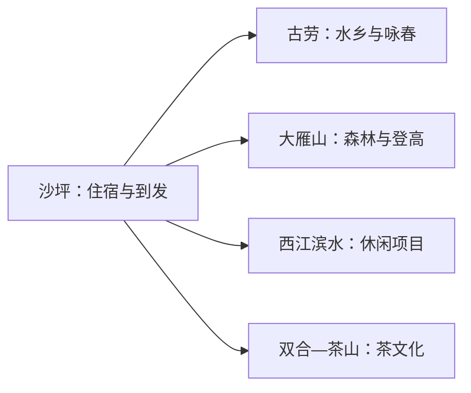
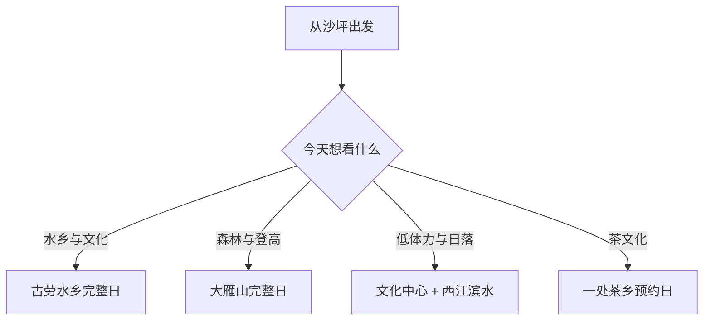

# 鹤山旅行指南

鹤山的旅行主线很清楚：住在沙坪，向北选择大雁山或古劳水乡，再把茶山、双合茶园和西江滨水项目作为季节补充。这里适合以“山、水、茶”做取舍，一天只走一条完整主线，两天再组合另一种景观。

> 建议停留：1–2 天 
> 旅行关键词：古劳水乡、大雁山、西江、茶山、咏春、侨乡饮食 
> 主要体力：低至中等；山地路线较高 
> 最近研究：2026-08-13

## 城市速览

| 项目 | 旅行信息 |
|---|---|
| 主要旅行价值 | 从沙坪出发，在古劳水乡、大雁山和茶文化中选择一条完整体验 |
| 建议停留 | 1 天选水乡或山地；2 天组合另一方向 |
| 较舒适季节 | 秋冬春适合山水；夏季偏热并受台风暴雨影响 |
| 预算特点 | 城区较低；景区套票、游船和车辆抬高成本 |
| 步行强度 | 水乡低至中，大雁山中至高 |
| 主要天气风险 | 高温、雷暴、台风、山火与西江水位 |
| 独行旅行 | 沙坪落脚方便；远线先确认返程 |
| 亲子旅行 | 水乡正式项目和文化场馆较合适 |
| 长者与低体力旅行 | 选水乡平缓入口或西江滨水短段 |
| 无障碍信息 | 商业景区可逐处咨询；山地、古村与茶园设施连续性需向官方确认 |

## 城市格局与游览区域

鹤山市是江门市代管的县级市，法定代码 `440784`。固定 GeoNames `1795842` 对应沙坪街道城市点，Wikidata `Q1023921` 代表法定鹤山市且 `P1566` 连接另一条较广地点记录 `1808306`；本页以法定市域组织内容，并明确点记录不等于行政边界。沙坪承担住宿与交通，古劳在西江水乡，大雁山位于沙坪北侧，双合和茶山方向需要公路接驳。

| 区域 | 主要内容 | 怎么安排 | 与其他区域的关系 |
|---|---|---|---|
| 沙坪主城 | 住宿、餐饮、文化中心 | 抵离日或半日 | 四条远线的共同基地 |
| 古劳水乡 | 水网、村落、咏春文化与正式运营项目 | 半日至一天 | 可与西江滨水同方向 |
| 大雁山 | 森林公园、登高和城市远眺 | 半日至一天 | 与水乡二选一更舒适 |
| 西江滨水 | 文创、休闲与当期商业项目 | 2–3 小时 | 适合日落或低体力补充 |
| 双合—茶山 | 茶园、茶文化和乡村体验 | 独立半日至一天 | 先确认采茶与接待 |

## 主要景点

### 沙坪、古劳与西江

| 景点 | 区域 | 类型 | 主要看点 | 建议用时 | 室内外 | 体力 | 预约风险 | 天气影响 | 优先级 |
|---|---|---|---|---:|---|---|---|---|---|
| 江门古劳水乡旅游区 | 古劳镇 | 水乡景区 | 桑基鱼塘、水网、村落及当期游船演艺 | 4–6 小时 | 室外为主 | 中 | 高 | 高 | A |
| 鹤山市文化中心与当期展览 | 沙坪 | 公共文化 | 地方文化、艺术与城市公共活动 | 1–2 小时 | 室内 | 低 | 高 | 低 | B |
| 西江美岸正式运营区 | 古劳—西江 | 滨水休闲 | 西江景观、文创与当期休闲设施 | 2–3 小时 | 混合 | 低 | 高 | 高 | B |
| 梁赞文化与咏春公开点 | 古劳 | 非遗与人物文化 | 咏春历史、公共展陈或当期活动 | 1–2 小时 | 混合 | 低 | 很高 | 中 | B |

### 山地与茶乡

| 景点 | 区域 | 类型 | 主要看点 | 建议用时 | 室内外 | 体力 | 预约风险 | 天气影响 | 优先级 |
|---|---|---|---|---:|---|---|---|---|---|
| 大雁山风景游览区 | 沙坪北部 | 森林与山地 | 森林步道、湖泊与登高视野 | 4–6 小时 | 室外 | 中至高 | 中 | 很高 | A |
| 古劳茶山正式接待项目 | 古劳茶山 | 茶文化与乡村 | 茶园、制茶和山野景观 | 半日至一天 | 混合 | 中 | 很高 | 高 | B |
| 双合十里茶香正式项目 | 双合镇 | 茶乡与农业 | 茶园、采制体验和乡村餐饮 | 半日至一天 | 混合 | 中 | 很高 | 高 | B |

古劳水乡的游船、演艺、游乐设施和村落节点按一个景区理解，选最合适的体验即可。大雁山遇到山火管控、台风或强降雨时按管理公告调整；西江堤防、鱼塘、茶园和农业作业道以开放入口及接待路线为准。

## 美食与餐饮

| 菜品或餐饮类型 | 常见区域 | 一个人用餐与常见份量 | 风味、过敏原与饮食限制 | 排队风险与替代方法 |
|---|---|---|---|---|
| 鹤山鱼皮角 | 沙坪、古劳 | 小食或汤粉配料，一人易尝 | 常含鱼、猪肉、小麦和大豆 | 景区拥挤时回沙坪找同类店 |
| 西江河鲜 | 古劳及沿江镇区 | 整鱼和锅类适合共享 | 鱼、虾、贝类及酱油交叉接触 | 先问时价、重量和做法 |
| 茶香菜与茶点 | 古劳茶山、双合 | 套餐多适合多人 | 茶、蛋、奶、坚果和酒需确认 | 预约乡村餐或选普通镇区餐馆 |
| 侨乡烧味与家常粤菜 | 沙坪 | 一人可用例汤加单拼 | 常含猪禽、花生、芝麻和麸质 | 正餐高峰换居民区同类店 |

## 经典行程

### 一日经典路线

**路线**：沙坪出发 → 古劳水乡 → 景区午餐与休息 → 西江滨水短段 → 返回沙坪

- **串联逻辑**：水乡与西江处于同一方向，减少跨城折返。
- **预约锚点**：古劳门票、游船、演艺和儿童规则。
- **休息安排**：在游客中心或室内餐饮安排长休。
- **时间不足时**：保留古劳水乡，删西江补充段。

### 两日城市路线

**第 1 天**：古劳水乡与西江 
**第 2 天**：大雁山或一处茶乡二选一

- **串联逻辑**：水乡、山地分日，第二天按体力和天气选择。
- **预约锚点**：茶乡接待或大雁山开放状态。
- **休息安排**：连续住沙坪，远线午休放在正式服务点。
- **时间不足时**：第二天改为沙坪文化中心加短段公园。

### 三日深度路线

**第 1 天**：沙坪文化与城市生活 
**第 2 天**：古劳水乡完整日 
**第 3 天**：大雁山或双合茶乡

- **串联逻辑**：先建立城市方向，再分别体验水乡和山茶。
- **预约锚点**：第二、三天各自运营与接待。
- **休息安排**：都以沙坪住宿，避免频繁换宿。
- **时间不足时**：删第一天补充，直接做两条完整主线。

### 雨天路线

**路线**：鹤山市文化中心当期展览 → 沙坪午餐 → 视天气选择西江室内项目或短段街区

- **适用条件**：普通阵雨可行；台风、暴雨和山火高风险期按公告调整户外。
- **预约锚点**：文化场馆与商业项目营业状态。
- **休息安排**：全程以沙坪室内空间衔接。
- **时间不足时**：只保留一个确认开放的场馆。

### 亲子或低体力路线

**亲子路线**：古劳水乡亲子适龄项目 → 午餐 → 水乡短段 
**低体力路线**：沙坪文化中心 → 午休 → 西江滨水平缓入口

- **减负方式**：亲子线只选一个大型项目；低体力线以车辆到入口并减少山地台阶。
- **预约锚点**：儿童身高、游船、场馆电梯和停车。
- **休息安排**：午间安排至少一小时室内休息。
- **时间不足时**：亲子保留水乡核心，低体力保留文化中心。

### 远郊一日路线

**路线**：沙坪 → 双合十里茶香或古劳茶山二选一 → 茶乡午餐与休息 → 返回

- **适用条件**：采制体验、餐饮和返程车辆已确认。
- **预约锚点**：茶园接待、活动日期和天气。
- **休息安排**：在正式接待点安排，不依赖田间临时设施。
- **时间不足时**：整段顺延，改走沙坪—西江短线。

## 住宿区域

| 区域 | 优点 | 缺点 | 适合人群 | 交通特点 |
|---|---|---|---|---|
| 沙坪主城 | 餐饮、住宿与跨区交通最方便 | 与茶乡仍有距离 | 首访、无车与多日旅行 | 便于连接江门、佛山和各景区 |
| 古劳水乡周边 | 方便夜游或清晨水乡 | 运营状态和价格波动较大 | 水乡主题与亲子旅行 | 先确认景区入口、停车和返程 |
| 茶乡民宿 | 接近乡村体验 | 供应和交通选择较少 | 自驾与已预约活动者 | 只选持证、可确认接待的住宿 |

## 市内交通

鹤山的景点分在沙坪、古劳、双合等不同方向。沙坪适合公交、出租车或网约车；古劳和大雁山可优先使用当期公交、景区接驳或短途车辆；茶乡路线更适合自驾或合规预约车。

| 场景 | 建议与取舍 | 行前需要重查的内容 |
|---|---|---|
| 从江门或佛山抵达 | 先确认到沙坪还是景区入口 | 客运站、上下车点和末班 |
| 沙坪至古劳 | 公交或短途车辆 | 景区接驳、返程和活动管制 |
| 大雁山与茶乡 | 按一条完整日路线用车 | 停车、山路、台风和山火 |
| 自驾 | 适合分散景区 | 停车预约、充电和西江水位 |

## 不同旅行者须知

| 旅行维度 | 可行条件 | 主要取舍 | 需额外核对 |
|---|---|---|---|
| 独行旅行 | 住沙坪、白天往返 | 每天只走一条远线 | 末班与夜间上客点 |
| 亲子旅行 | 水乡适龄项目与室内休息已确认 | 山地和游乐项目按年龄取舍 | 身高、救生装备和退改 |
| 长者或低体力旅行 | 选择平缓入口和车辆连接 | 大雁山登高改为西江短游 | 台阶、电梯、座椅和卫生间 |
| 无障碍需求 | 商业景区可逐处咨询 | 古村、茶园和山地连续动线不稳定 | 设施连续性需向官方确认 |
| 摄影旅行 | 水乡、茶山和西江题材丰富 | 尊重村民生活与生产 | 无人机、商业拍摄和夜间灯光 |
| 台风与暴雨 | 沙坪室内路线可替代 | 山地、水上和沿江项目按公告调整 | 预警、闭园、停航和道路积水 |

## 行前核对

| 核对事项 | 为什么需要重查 | 建议核对时间 | 官方入口 |
|---|---|---|---|
| 古劳水乡票务与项目 | 游船、演艺和套票会调整 | 购票前及当天 | [鹤山市人民政府文旅信息](https://www.heshan.gov.cn/) |
| 大雁山开放与山火 | 天气和防火会改变步道 | 出发前三日及当天 | [鹤山市文广旅体局](https://www.heshan.gov.cn/jmhswhgdj/) |
| 茶乡接待 | 采茶、制茶和用餐有季节性 | 订住宿前 | [鹤山市人民政府](https://www.heshan.gov.cn/) |
| 公交与跨城交通 | 站点、班次和活动管制会变 | 出发前一周及当天 | [江门市交通运输局](https://www.jiangmen.gov.cn/bmpd/jmsjtysj/) |
| 天气与水情 | 台风、暴雨和西江水位影响户外 | 出发前三日及当天 | [广东省气象局](http://gd.cma.gov.cn/) |

## 来源与更新记录

### 主要来源

| 来源 | 类型 | 支持内容 | 核验日期 |
|---|---|---|---|
| [鹤山市国土空间总体规划](https://www.heshan.gov.cn/attachment/0/340/340308/3298813.pdf) | 市政府规划 | 沙坪、古劳、大雁山、茶山与西江空间关系 | 2026-08-13 |
| [鹤山市文旅市场与景区动态](https://www.heshan.gov.cn/jmhswhgdj/gkmlpt/content/3/3485/post_3485814.html) | 市文旅局 | 大雁山、古劳水乡、西江美岸和茶乡当期运营线索 | 2026-08-13 |
| [江门市政府：古劳水乡](https://www.jiangmen.gov.cn/newzjqx/lyzy/lyjd/st/content/post_3357432.html) | 地级市政府 | 水乡景观与旅游属性 | 2026-08-13 |
| [鹤山市政府：古劳水乡4A与文旅工作](https://www.heshan.gov.cn/zwgk/xxgk/hsswhgdlytyj/gzdt/gzdt/content/post_3452361.html) | 市文旅局 | 景区身份和文旅管理 | 2026-08-13 |
| [鹤山市政府：A级景区投诉与运营问题](https://www.heshan.gov.cn/zwgk/zdlyxxgk/lyscjdzfxxgk/lyts/content/post_3428207.html) | 市文旅监管 | 票务、项目和设施需要动态核对 | 2026-08-13 |
| [鹤山市政府：台风闭园公告](https://www.heshan.gov.cn/ghb/tzgg/content/post_2897970.html) | 市政府公告 | 台风、暴雨与景区关闭机制 | 2026-08-13 |
| [GeoNames 1795842](https://www.geonames.org/1795842/shaping.html) | 开放地名数据 | 固定沙坪城市点 | 2026-08-13 |
| [Wikidata Q1023921](https://www.wikidata.org/wiki/Q1023921) | 开放结构化数据 | 法定鹤山市实体与P1566粒度 | 2026-08-13 |

### 更新记录

| 日期 | 更新内容 |
|---|---|
| 2026-08-13 | 首次完成鹤山空间、景点去重、山水茶路线、交通与保护生产边界研究 |
