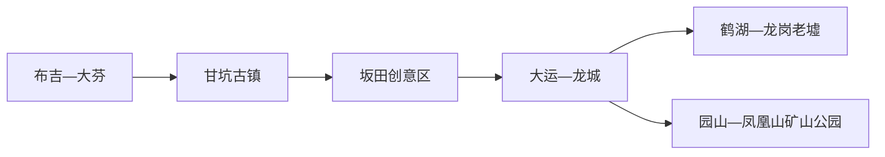
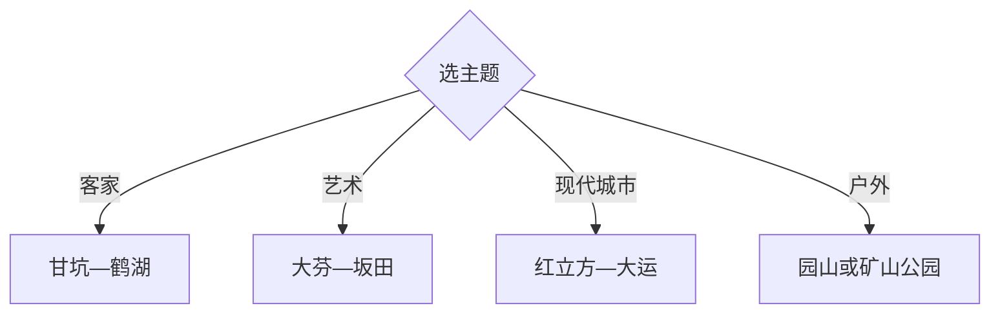

# 龙岗旅行指南

深圳龙岗适合按客家文化、当代艺术与大运文体三条线选择：甘坑和鹤湖看围屋与客家传统，大芬看艺术街区，大运中心与红立方看现代城区。区内东西跨度大，一天选一组相邻片区，两天再补另一条主题线。

## 城市速览

| 项目 | 信息 |
|---|---|
| 主线 | 甘坑—大芬—鹤湖—红立方—大运公园 |
| 停留 | 单主题1天；客家、艺术和大运组合2天 |
| 住宿 | 大运与龙城交通完整，布吉适合大芬甘坑，龙岗老墟靠近鹤湖 |
| 交通 | 深圳轨道、公交与短途网约车组合，跨片区预留换乘 |
| 风险 | 高温暴雨、山地雷电、大型赛事散场、古建筑与水库边界 |
| 边界 | 水库巡查路、矿山修复区、工业旅游生产线、校园和客家围屋按开放范围进入 |

## 城市格局与游览区域

固定 `Longgang / GeoNames 1802656` 对应深圳市龙岗区，本页以 `Q1001406` 组织完整区级旅行。布吉、大运、龙岗老墟与园山并非连续步行片区，轨道能承担主干移动，末端仍需公交或短途打车。

## 主要景点

| 景点 | 区域 | 类型 | 核心体验 | 用时 | 环境 | 体力 | 预约风险 | 天气影响 | 优先级 |
|---|---|---|---|---:|---|---|---|---|---|
| 甘坑古镇 | 吉华 | 客家街区 | 客家民居、凉帽文化与当期展陈 | 3–6小时 | 混合 | 中 | 高 | 中 | A |
| 大芬油画村 | 布吉 | 艺术街区 | 油画产业、画廊与公共艺术 | 2–4小时 | 混合 | 低中 | 中 | 中 | A |
| 鹤湖新居与龙岗客家民俗博物馆 | 龙岗老墟 | 围屋与博物馆 | 大型客家围屋、建筑与民俗 | 2–4小时 | 混合 | 低中 | 高 | 中 | A |
| 深圳·红立方 | 龙城 | 公共文化 | 科技、青少年与城市规划展陈 | 2–5小时 | 室内 | 低 | 高 | 低 | A |
| 大运中心与大运公园 | 大运 | 文体与公园 | 体育建筑、绿道、湖泊与赛事 | 半日 | 混合 | 中 | 高 | 高 | A |
| 龙岗儿童公园 | 龙城 | 亲子公园 | 儿童活动与城市绿地 | 2–5小时 | 室外 | 中 | 高 | 高 | B |
| 园山风景区公开线 | 横岗 | 山地 | 城郊山林与步道 | 半日 | 室外 | 中高 | 高 | 很高 | B |
| 凤凰山国家矿山公园公开区 | 平湖方向 | 工业生态 | 矿山修复、地质与生态观察 | 2–4小时 | 室外 | 中 | 高 | 很高 | B |

## 美食与餐饮

甘坑、龙岗老墟可找客家酿豆腐、盐焗鸡、盆菜和粄类，大芬与大运商圈适合多元餐饮。盆菜和鸡煲更适合共享，先问份量与过敏原；古镇活动餐饮和产业研学按当期开放选择。

## 经典行程

### 两日基础线
**路线**：大芬—甘坑—次日红立方—大运公园。**逻辑**：西部文化与东部现代城区分日。**预约锚点**：甘坑展陈、红立方和赛事。**休息**：甘坑与大运商圈。**删除条件**：天气不稳时取消公园。

### 客家文化线
**路线**：甘坑古镇—午餐—鹤湖新居—龙岗老墟。**逻辑**：从活化街区到大型围屋。**预约锚点**：两处展馆和讲解。**休息**：甘坑或老墟。**删除条件**：鹤湖闭馆时留甘坑完整半日。

### 大芬艺术线
**路线**：大芬美术馆或公开展览—油画村街巷—布吉餐饮。**逻辑**：先看策展，再观察产业街区。**预约锚点**：当期展览。**休息**：大芬地铁站周边。**删除条件**：场馆闭馆时保留公共街区。

### 大运文体线
**路线**：红立方—大运天地—大运中心—大运公园短段。**逻辑**：公共文化、商业与体育空间连续。**预约锚点**：红立方与赛事。**休息**：大运天地。**删除条件**：赛事封控时改龙岗儿童公园。

### 山地户外线
**路线**：园山或凤凰山矿山公园二选一—正式步道—返城。**逻辑**：完整半日留给单一户外点。**预约锚点**：入口、天气和防火。**休息**：游客服务区。**删除条件**：雷雨、高温或封控时取消。

### 雨天线
**路线**：红立方—大芬室内展览—商圈。**逻辑**：依轨道在室内移动。**预约锚点**：两馆。**休息**：龙城或布吉商圈。**删除条件**：强对流时就近单馆。

### 低体力线
**路线**：红立方—车辆到鹤湖新居—大运天地。**逻辑**：用场馆和商业体替代山地长走。**预约锚点**：无障碍和落客。**休息**：两处室内空间。**删除条件**：高温时只留场馆。

## 住宿区域

大运—龙城适合赛事、红立方和东部换线；布吉适合大芬、甘坑及深圳中心城区联程；龙岗中心城靠近鹤湖与老墟；坂田适合商务和北站衔接。按最近轨道站与次日第一站选择，跨区通勤可能超过预期。

## 市内交通

龙岗由多条深圳轨道线路和公交覆盖，甘坑、鹤湖、园山等末端仍需公交或网约车。大型赛事按散场交通倒推住宿；自驾关注停车预约。水库巡查路、矿坑施工道路和产业园生产通道不作为游览捷径。

## 不同旅行者须知

客家文化兴趣者选甘坑与鹤湖；艺术旅行者选大芬；亲子选红立方、儿童公园和短段大运公园；低体力者减少古镇石阶与山路。古建筑、工业生产线、校园、水库管理区和矿山修复区保留明确限制。

## 行前核对

- 核对甘坑、大芬展览、鹤湖、红立方、大运赛事与户外景区开放。
- 核对轨道公交、演出散场、暴雨雷电、高温、防火与停车。
- 工业旅游走预约线路，围屋按展馆边界参观，水库与矿山依管理公告通行。

## 来源与更新记录

| 来源 | 支持内容 | 核验日期 |
|---|---|---|
| [龙岗区情概貌](https://www.lg.gov.cn/bmzz/dag/dqzl/content/post_12824283.html) | 甘坑、大芬、鹤湖、红立方、大运与矿山公园 | 2026-09-01 |
| [龙岗文化旅游资源入口](https://www.lg.gov.cn/zjlg/qwlg/cy/wh/index.html) | 甘坑、大芬、鹤湖、创意园区与文化场馆 | 2026-09-01 |
| [龙岗大运公园](https://www.lg.gov.cn/zwfw/zdfw/csgl/yllh/gy/content/post_1674851.html) | 绿道、湖泊与公园功能 | 2026-09-01 |
| [GeoNames 1802656](https://www.geonames.org/1802656/) | Longgang 固定区级驻地点 | 2026-09-01 |
| [Wikidata Q1001406](https://www.wikidata.org/wiki/Q1001406) | 龙岗区实体与跨库标识 | 2026-09-01 |

| 日期 | 更新 |
|---|---|
| 2026-09-01 | 首次完成龙岗区旅行研究，按客家、艺术、大运与户外组织。 |
