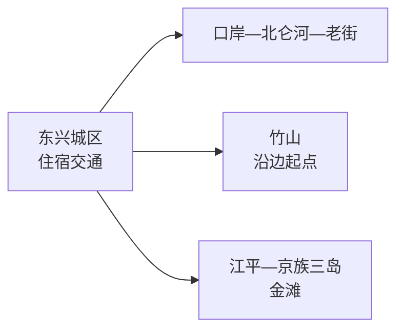
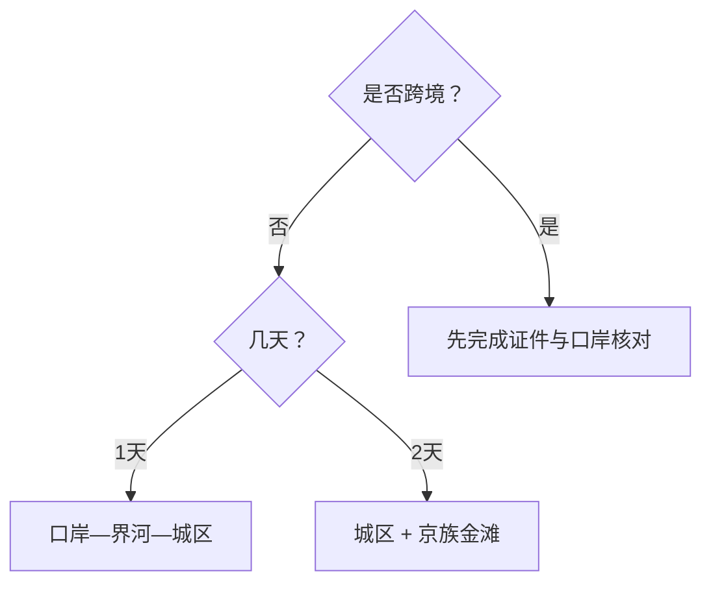

# 东兴旅行指南

东兴的核心选择很清楚：用一天认识口岸城市与界河，再用一天前往京族三岛的金滩方向。跨境、边境管理区、海滩和渔业生产空间各有规则，先确认开放和证件，再决定是否加入。

> 建议停留：城区 1 天；加入金滩与京族文化为 2 天 
> 旅行关键词：中越边境、北仑河、口岸、京族文化、金滩 
> 无障碍说明：口岸公共服务区和现代场馆可询问无障碍设施；老街、沙滩、堤岸和船舶的设施连续性需向官方确认

## 城市速览

| 项目 | 旅行信息 |
|---|---|
| 主要旅行价值 | 国门口岸城市、界河景观、京族文化和北部湾海岸 |
| 建议停留 | 1–2 天，跨境另按完整出入境行程计算 |
| 舒适季节 | 秋冬较舒适；夏秋关注台风、暴雨和高温 |
| 预算特点 | 城区较易控制；海岸接驳、海鲜和跨境产品增加预算 |
| 步行强度 | 城区中等；金滩低至中但日晒强 |
| 天气风险 | 台风、风浪、雷暴、暴雨、潮汐和高温 |
| 独行旅行 | 城区方便，海岸先锁返程 |
| 亲子旅行 | 京族文化展陈与正规海滩短段更合适 |
| 长者与低体力 | 车辆分段，沙滩只走平缓短段 |
| 行前重点 | 口岸开放、证件、边境拍摄、海况、铁路和返程 |

## 城市格局与游览区域

东兴是防城港代管的县级市，代码 `450681`。固定 GeoNames `1812138`、Wikidata `Q1241481` 与法定代码精确对应，但点坐标只定位城区。

| 区域 | 主要内容 | 怎么选 | 时间 |
|---|---|---|---|
| 东兴城区 | 口岸、界河、城市街区 | 首日步行加短程车辆 | 1 天 |
| 竹山方向 | 沿边公路起点、山海交汇 | 与城区组成半日，按边境开放活动 | 半日 |
| 江平—京族三岛 | 京族文化、金滩、渔村 | 海况稳定时单独安排 | 1 天 |
| 跨境联程 | 越南芒街等境外目的地 | 证件、签证、口岸运行和保险全部确认后再订 | 独立行程 |

## 主要景点

### 城区与边境

| 景点 | 区域 | 类型 | 主要看点 | 建议用时 | 室内外 | 体力 | 预约风险 | 天气影响 | 优先级 |
|---|---|---|---|---:|---|---|---|---|---|
| 东兴口岸公共参观区 | 城区 | 口岸、城市地标 | 国门、界河与口岸城市空间 | 2–3 小时 | 室外为主 | 中 | 高 | 高 | A |
| 北仑河公共岸线代表段 | 城区 | 界河、城市滨水 | 中越界河与两岸城市观察 | 1–2 小时 | 室外 | 低 | 中 | 高 | A |
| 东兴城市历史文化展陈场馆 | 城区 | 博物馆、城市史 | 边贸、口岸和地方历史 | 1.5–2.5 小时 | 室内 | 低 | 高 | 低 | B |
| 竹山正式开放游览区 | 竹山 | 山海、沿边文化 | 大陆海岸线与沿边公路主题 | 2–4 小时 | 室外 | 中 | 高 | 很高 | B |

### 京族与海岸

| 景点 | 区域 | 类型 | 主要看点 | 建议用时 | 室内外 | 体力 | 预约风险 | 天气影响 | 优先级 |
|---|---|---|---|---:|---|---|---|---|---|
| 京族博物馆或当期开放展馆 | 江平 | 民族文化 | 京族历史、服饰、生产生活与独弦琴 | 1.5–2.5 小时 | 室内 | 低 | 高 | 低 | A |
| 万尾金滩正式开放区 | 万尾 | 海滩 | 北部湾沙滩、日落与海岸生活 | 3–5 小时 | 室外 | 中 | 高 | 很高 | A |
| 京族三岛公开社区路线 | 江平—万尾 | 社区文化 | 渔业、村落与当期文化活动 | 2–4 小时 | 混合 | 中 | 高 | 高 | B |

金滩作为一个海岸景区安排，沙滩、日落点和水上项目统一规划。口岸参观使用公共开放区；边检、海关、桥梁作业面和国界水域按边境管理要求活动。

## 美食与餐饮

| 类型 | 怎么点 | 过敏原与计价 | 选择建议 |
|---|---|---|---|
| 海鲜 | 先看活鲜或明示菜单，再确认重量、单价和加工费 | 甲壳类、贝类、鱼类和交叉接触 | 选择明码标价、称重可见的餐馆 |
| 京族风味鱼露与海产菜 | 先问咸度、发酵调味和辣度 | 鱼类、虾酱和高钠 | 与米饭、青菜组合，少量尝试 |
| 越南风味粉与咖啡 | 单人一份较方便 | 汤底、花生、乳制品和咖啡因 | 在城区成熟商圈选择，不以跨境为前提 |
| 糖水与热带水果 | 小份分食 | 糖、椰浆、乳制品 | 高温日补水优先，留意冷链与卫生 |

## 经典行程

### 一日经典路线
**路线**：城市展陈场馆 → 口岸公共参观区 → 午餐 → 北仑河公共岸线 → 城区夜间餐饮
- **串联逻辑**：先了解城市，再观察口岸和界河。
- **预约锚点**：口岸公共区、场馆和边境活动公告。
- **休息安排**：午餐及下午都在城区室内休息。
- **时间不足时**：保留口岸公共区和界河短段。

### 两日城市路线
**第 1 天**：城区经典路线 
**第 2 天**：京族展馆 → 金滩开放区 → 江平或城区晚餐
- **串联逻辑**：第一天边贸城市，第二天京族海岸文化。
- **预约锚点**：展馆、海滩救生和返程车辆。
- **休息安排**：江平镇区与正式游客服务点。
- **时间不足时**：第二天只保留展馆和一段海岸。

### 三日深度路线
**第 1 天**：东兴城区 
**第 2 天**：京族三岛—金滩 
**第 3 天**：竹山正式开放路线或凭证件跨境二选一
- **串联逻辑**：城区、海岸、沿边或跨境分日处理。
- **预约锚点**：第三天开放、证件和车辆。
- **休息安排**：每天中午回到城区或镇区。
- **时间不足时**：删除第三天。

### 雨天路线
**路线**：城市展陈场馆 → 商圈午餐 → 口岸公共服务区短停
- **适用条件**：普通降雨、城市道路和口岸运行正常。
- **串联逻辑**：用室内内容替代海岸长线。
- **预约锚点**：场馆开放和口岸交通管制。
- **休息安排**：全程使用城区室内节点。
- **时间不足时**：只保留一座场馆。

### 亲子或低体力路线
**亲子路线**：京族展馆 → 午休 → 金滩救生区短段 
**低体力路线**：车辆到口岸公共区 → 午休 → 北仑河平缓短段
- **减负方式**：每次只走一个片区，沙滩不追长距离。
- **预约锚点**：轮椅、卫生间、救生和车辆落客。
- **休息安排**：展馆、商圈和游客中心。
- **时间不足时**：保留展馆或口岸公共区其一。

### 远郊路线
**路线**：竹山与京族三岛二选一
- **适用条件**：边境、海况和返程均已确认。
- **串联逻辑**：沿边与海岸分别成线。
- **预约锚点**：开放入口、活动和车辆。
- **休息安排**：正式服务点与镇区。
- **时间不足时**：回到城区界河路线。

## 住宿区域
| 区域 | 优点 | 取舍 | 适合人群 |
|---|---|---|---|
| 东兴城区 | 口岸、餐饮与交通集中 | 节假日客流波动大 | 首访、跨境前后、短住 |
| 江平—万尾正式住宿 | 靠近京族文化和金滩 | 海况与淡旺季影响服务 | 海岸慢旅行 |
| 防城港联程 | 铁路和地级市服务较多 | 属跨城住宿 | 多城联程 |

## 市内交通
- 东兴市站与城区、口岸和金滩之间仍需地面接驳，按票面车次和当日交通选择。
- 城区步行只适合口岸—界河短段；竹山、江平和万尾使用公交、出租或合规车辆。
- 跨境交通单独核对证件、通关时间、保险、通信与回程，并按口岸实际运行时间估算。

## 不同旅行者须知
| 情况 | 怎么安排 | 重点核对 |
|---|---|---|
| 独行 | 住城区，日落前确认返程 | 夜间叫车、口岸客流 |
| 亲子 | 展馆加救生区短段 | 浪况、救生员、防晒 |
| 长者与低体力 | 车辆分段，避开正午沙滩 | 电梯、座椅、卫生间 |
| 边境摄影 | 在公共参观区按标识拍摄 | 海关、边检、桥梁和无人机规定 |
| 海上活动 | 只选持证运营项目 | 风浪、救生衣、年龄身高和保险 |

## 行前核对
| 项目 | 何时核对 | 官方入口 |
|---|---|---|
| 口岸与出入境 | 订跨境产品前及当天 | [国家移民管理局](https://www.nia.gov.cn/)及东兴口岸公告 |
| 京族展馆与金滩 | 出发前一日 | 东兴市政府、景区与文旅渠道 |
| 铁路与市内接驳 | 购票时及前一日 | [中国铁路 12306](https://www.12306.cn/)及交通部门 |
| 台风、海浪和暴雨 | 出发前三日起每日 | [中国气象局](https://www.cma.gov.cn/)及海洋预警 |

## 来源与更新记录
| 来源 | 支持内容 | 核验日期 |
|---|---|---|
| [东兴市人民政府](https://www.dxzf.gov.cn/) | 市情与动态入口 | 2026-08-13 |
| [防城港市政府](https://www.fcgs.gov.cn/) | 东兴属地关系与区域文旅入口 | 2026-08-13 |
| [国家移民管理局](https://www.nia.gov.cn/) | 口岸与出入境动态核对 | 2026-08-13 |
| [民政部行政区划代码查询](https://dmfw.mca.gov.cn/xzqh/getList?code=45&trimCode=true&maxLevel=3) | `450681` 县级市层级 | 2026-08-13 |
| [GeoNames 1812138](https://www.geonames.org/1812138/dongxing.html) | 固定城市点 | 2026-08-13 |
| [Wikidata Q1241481](https://www.wikidata.org/wiki/Q1241481) | 法定实体与精确 `P1566` | 2026-08-13 |

| 日期 | 更新 |
|---|---|
| 2026-08-13 | 首次完成东兴市指南；区分城区、口岸、京族海岸和跨境行程。 |
