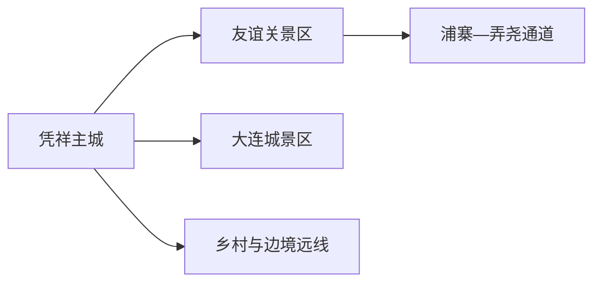
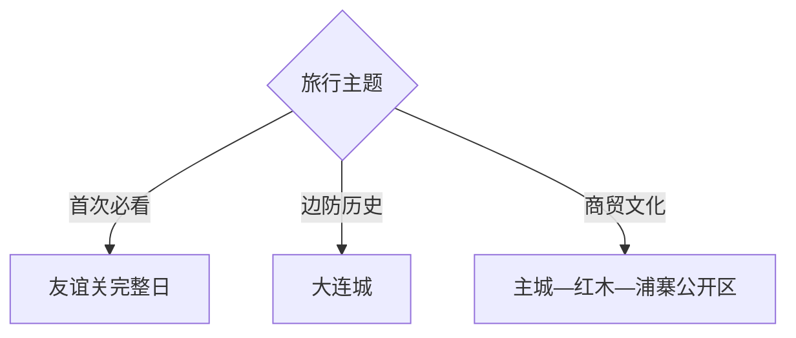

# 凭祥旅行指南

凭祥是崇左代管的边境县级市，旅行核心是友谊关与边关历史，主城负责住宿和餐饮，大连城、浦寨与边贸通道则各有不同开放属性。第一次来，用一天完成友谊关完整线，第二天在大连城历史或主城边贸文化中择一；跨境旅行另按证件、旅行社和口岸当期规则规划。

> 建议停留：2–3 天 
> 旅行关键词：友谊关、边关、口岸、大连城、浦寨、红木、跨境贸易、壮乡饮食 
> 主要体力：中等；关隘坡道、古道和高温会增加负担 
> 最近研究：2026-08-13

## 城市速览

| 项目 | 旅行信息 |
|---|---|
| 主要旅行价值 | 在友谊关理解中越陆路交通、关隘史与当代口岸，再从大连城和主城观察边境城市生活 |
| 建议停留 | 1 天友谊关；2 天加入大连城或主城；3 天按合规条件增加边贸或跨境主题 |
| 较舒适季节 | 秋冬较适合户外；夏季高温高湿，汛期和台风外围影响时关注山路与口岸运行 |
| 预算特点 | 主城住宿餐饮弹性较大；景区、包车、讲解和跨境手续是主要变量 |
| 步行强度 | 友谊关与大连城有坡道、古道和户外暴晒；浦寨以车辆和步行为主 |
| 主要天气风险 | 高温、雷暴、强降雨、山洪、台风外围大风与边境山区低能见度 |
| 独行旅行 | 主城和友谊关可独立安排；跨境与偏远点用正规旅行服务和明确返程 |
| 亲子旅行 | 友谊关历史展示适合学龄儿童；口岸交通、边贸市场和高温环境需持续看护 |
| 长者与低体力旅行 | 友谊关游客中心—关楼核心段加车辆接驳，减少古道和山地延伸 |
| 无障碍信息 | 口岸新建服务设施可询问；古关、炮台、古道和边贸街区设施连续性需向官方确认 |

## 城市格局与游览区域

凭祥市行政代码 `451481`，由崇左市代管。GeoNames `1798655` 与 Wikidata `Q1027734` 精确对应法定凭祥市。市域包括主城、友谊关镇、上石镇、夏石镇等边境和山地空间；口岸监管区、景区游客区、边贸市场与居民城镇各有边界。

| 区域 | 主要内容 | 游览特点 | 与其他区域的关系 |
|---|---|---|---|
| 凭祥主城 | 住宿、餐饮、铁路、红木与边贸城市生活 | 最适合作为基地 | 到友谊关约一条公路远线 |
| 友谊关 | 关楼、古道、城墙遗迹与口岸背景 | 历史景区与在运行口岸相邻 | 留完整半日至一日 |
| 浦寨—弄尧 | 边民互市、口岸通道与水果贸易 | 商贸和监管属性强 | 是否适合游客进入按当期通关和市场规则 |
| 大连城方向 | 炮台、兵营遗址与边防历史 | 山地历史景区 | 可与主城组合一日 |
| 乡村与边境山地 | 正式乡村旅游区、山地与民族文化 | 接待和道路变化较大 | 只选有明确运营的项目 |

友谊关景区开放不等于出入境监管区域可自由参观；旅行者按游客入口、证件检查和拍摄规定活动。浦寨与弄尧是运行中的客货通道和边贸空间，货场、查验区、仓库和车辆通道以生产与监管为先。边境古道、山头和军事设施也以公布景区范围为准。

## 主要景点

### 关隘、城防与城市文化

| 景点 | 区域 | 类型 | 主要看点 | 建议用时 | 室内外 | 体力 | 预约风险 | 天气影响 | 优先级 |
|---|---|---|---|---:|---|---|---|---|---|
| 友谊关景区 | 友谊关镇 | 关隘与历史景区 | 关楼、古道、城墙遗迹及中越交通史 | 4–6 小时 | 混合 | 中高 | 高 | 高 | A |
| 大连城景区 | 市郊 | 炮台与兵营遗址 | 清末边防、炮台和兵营遗迹 | 3–5 小时 | 室外为主 | 中高 | 高 | 很高 | A |
| 凭祥市博物馆或地方公共文化展馆 | 主城 | 地方历史 | 边关、民族、贸易与城市史 | 2–3 小时 | 室内 | 低 | 高 | 低 | B |
| 红木文博城当期开放展区 | 主城方向 | 产业与工艺展示 | 红木工艺、边贸与产业文化 | 2–3 小时 | 室内为主 | 低 | 高 | 低 | B |

### 边贸与乡村远线

| 景点 | 区域 | 类型 | 主要看点 | 建议用时 | 室内外 | 体力 | 预约风险 | 天气影响 | 优先级 |
|---|---|---|---|---:|---|---|---|---|---|
| 浦寨公开商贸区 | 浦寨 | 边贸市场与口岸生活 | 水果与跨境贸易、边境城市日常 | 2–4 小时 | 混合 | 中 | 很高 | 中高 | C |
| 友谊镇正式乡村旅游区 | 市域 | 边境乡村 | 壮乡村落、农业与当期活动 | 半日至一日 | 混合 | 中 | 很高 | 高 | C |

## 美食与餐饮

主城适合品尝米粉、烤肉、酸味与东南亚风味；边贸食品和水果购买要看检疫、来源与携带规定。跨境商品能在市场出现，不代表可任意携带过关。

| 菜品或餐饮类型 | 常见区域 | 一个人用餐与常见份量 | 风味、过敏原与饮食限制 | 排队风险与替代方法 |
|---|---|---|---|---|
| 凭祥米粉与卷筒粉 | 主城 | 一碗或一份适合独行 | 米浆、花生、芝麻、肉臊与鱼露按店确认 | 早餐高峰换邻近社区店 |
| 越南风味米粉与小吃 | 主城、正规边贸餐饮 | 可单份尝试 | 鱼露、花生、海鲜、香草和辣椒 | 选菜单清楚、证照齐全的店 |
| 烤肉、酸肉与边关家常菜 | 主城、镇区 | 多人共享，先问小份 | 肉类、发酵、辣椒和高盐 | 单人改点小炒、粉面 |
| 热带水果 | 正规市场 | 小份或按斤购买 | 糖分、乳胶相关过敏与储存 | 看明码标价和检疫来源，按携带规则购买 |

## 经典行程

### 一日经典路线

**路线**：友谊关游客中心 → 关楼与历史展陈 → 景区午餐与休息 → 古道或城墙公开段 → 返回主城

- **串联逻辑**：围绕友谊关一个父级景区完成关隘史与当代口岸背景。
- **预约锚点**：门票、证件、最晚入园与讲解。
- **休息安排**：使用游客中心和正式服务区。
- **时间不足时**：保留关楼与核心展陈，删除古道延伸。

### 两日城市路线

**第 1 天**：友谊关完整日 
**第 2 天**：凭祥地方文化展馆 → 主城午餐 → 大连城景区

- **串联逻辑**：第一天关隘，第二天用城市史和山地城防补充。
- **预约锚点**：两处场馆与大连城开放。
- **休息安排**：第二天午餐放主城，再乘车前往大连城。
- **时间不足时**：第二天下午只留大连城或主城展馆二选一。

### 三日深度路线

**第 1 天**：友谊关 
**第 2 天**：大连城—主城 
**第 3 天**：浦寨公开商贸区或正式乡村旅游项目二选一

- **串联逻辑**：第三天按商贸或乡村兴趣选择，先核开放和监管条件。
- **预约锚点**：浦寨游客可达范围、乡村接待与车辆。
- **休息安排**：主城或镇区正规餐馆。
- **时间不足时**：删除第三天；不把跨境手续压成半日临时决定。

### 雨天路线

**路线**：地方公共文化展馆 → 主城午餐 → 红木文博城当期开放展区

- **适用条件**：普通降雨；暴雨、山洪或口岸交通管制时留在主城。
- **预约锚点**：两处展馆开放。
- **休息安排**：主城室内空间。
- **时间不足时**：只保留地方文化展馆。

### 亲子或低体力路线

**亲子路线**：友谊关核心展陈 → 午休 → 关楼短线 
**低体力路线**：车辆到友谊关游客中心 → 核心展陈 → 车辆返回主城

- **减负方式**：亲子缩短古道；低体力线使用接驳并减少坡道。
- **预约锚点**：儿童证件、接驳、最近下客点和讲解。
- **休息安排**：游客中心与主城餐饮区。
- **时间不足时**：均只留关楼核心展陈。

### 远郊一日路线

**路线**：主城 → 正式乡村旅游接待点 → 镇区午餐 → 公布游线 → 返回

- **适用条件**：接待、道路、边境管理和返程明确。
- **预约锚点**：运营方、车辆和边境证件要求。
- **休息安排**：镇区或游客服务点。
- **时间不足时**：整段取消，改主城半日。

## 住宿区域

| 区域 | 优点 | 缺点 | 适合人群 | 交通特点 |
|---|---|---|---|---|
| 凭祥主城 | 餐饮、铁路、叫车和多方向出发方便 | 到友谊关仍需乘车 | 首访、独行、多日 | 默认基地 |
| 友谊关大道方向 | 去关口和景区较顺 | 具体酒店到入口距离差异大 | 友谊关早出发、自驾 | 核对接驳与夜间交通 |
| 浦寨正规住宿 | 便于边贸专题 | 口岸运行、货车和监管影响环境 | 已确认通行条件的商务或专题旅行 | 订房前核资质、噪声、证件与交通 |

## 市内交通

| 场景 | 建议与取舍 | 行前需要重查的内容 |
|---|---|---|
| 铁路抵达 | 凭祥站进入主城后再换乘景区或口岸方向 | 车次、出站交通、末班和行李 |
| 主城到友谊关 | 景区交通、公交、正规车辆或自驾 | 发车点、返程、停车和口岸管制 |
| 主城到大连城 | 车辆往返更稳 | 入口、道路、停车和返程 |
| 浦寨与口岸通道 | 先确认游客通行和监管要求 | 证件、开放时间、客货分流与拍摄 |
| 跨境旅行 | 通过合法旅行服务和当期开放口岸办理 | 护照签证、团队、自驾许可、保险与海关规则 |

## 不同旅行者须知

| 旅行维度 | 可行条件 | 主要取舍 | 需额外核对 |
|---|---|---|---|
| 独行旅行 | 主城与友谊关可自行安排 | 跨境和远线使用正规服务 | 返程、证件、口岸与夜间车辆 |
| 亲子旅行 | 关隘历史线主题明确 | 高温、坡道和商贸车辆需看护 | 儿童证件、接驳、饮水与医务 |
| 长者或低体力旅行 | 友谊关核心段加车辆 | 古道和炮台坡道删减 | 接驳、座椅、台阶和下客点 |
| 无障碍需求 | 新建游客中心可询问 | 古关、炮台和市场连续性不同 | 设施连续性需向官方确认 |
| 摄影旅行 | 关隘与边境城市题材鲜明 | 口岸、军事、查验和无人机有严格规则 | 拍摄许可、禁拍区、航拍与证件 |
| 预算有限 | 主城住宿和一日友谊关可控 | 包车、讲解与跨境服务增加费用 | 套票、车辆、服务资质与退改 |
| 特殊天气 | 普通雨天做主城展馆 | 高温暴雨时减少关隘山地 | 气象、山洪、景区与口岸公告 |

## 行前核对

| 核对事项 | 为什么需要重查 | 建议核对时间 | 官方入口 |
|---|---|---|---|
| 友谊关景区与口岸 | 景区和通关区规则不同 | 订票前及当天 | [广西凭祥综合保税区](https://pxzhbsq.gxzf.gov.cn/) |
| 浦寨与弄尧通道 | 客货通行、市场与游客可达范围变化 | 排入路线前 | [广西凭祥综合保税区](https://pxzhbsq.gxzf.gov.cn/xwzx/yqdt/t18494170.shtml) |
| 跨境旅行 | 证件、签证、团队和口岸开放具有时效 | 订票前及出发前 | [国家移民管理局](https://www.nia.gov.cn/)；[海关总署](http://www.customs.gov.cn/) |
| 铁路与道路 | 车次、末班和货运交通变化 | 订票时及当天 | [中国铁路 12306](https://www.12306.cn/) |
| 高温、暴雨与山洪 | 影响关隘、炮台和乡村路线 | 出发前三日及当天 | [广西气象局](https://gx.cma.gov.cn/) |

## 来源与更新记录

### 主要来源

| 来源 | 类型 | 支持内容 | 核验日期 |
|---|---|---|---|
| [广西国防动员办公室：友谊关](https://gdb.gxzf.gov.cn/ztjj_46964/bfhfzt_00998/bhfwh_76328/t18472411.shtml) | 自治区政府部门 | 友谊关、古道与城墙遗迹的历史背景 | 2026-08-13 |
| [浦寨—新清、弄尧—谷楠通道运行](https://pxzhbsq.gxzf.gov.cn/xwzx/yqdt/t18494170.shtml) | 自治区园区管委会 | 友谊关口岸三通道、浦寨位置与客货运行 | 2026-08-13 |
| [广西边关风情旅游带规划](https://wlt.gxzf.gov.cn/zfxxgk/fdzdgknr/ghjh/zcqgh/P020260402605468307444.pdf) | 自治区文旅厅规划 | 大连城、友谊关、凭祥边关旅游与设施 | 2026-08-13 |
| [凭祥口岸与边贸空间](https://dnr.gxzf.gov.cn/zfxxgk/fdzdgknr/dzgl/djxx/t16066921.shtml) | 自治区自然资源厅 | 主城、友谊关区与浦寨互市点空间关系 | 2026-08-13 |
| [GeoNames 1798655](https://www.geonames.org/1798655/) | 开放地理数据 | 凭祥城市点与坐标 | 2026-08-13 |
| [Wikidata Q1027734](https://www.wikidata.org/wiki/Q1027734) | 开放结构化数据 | 法定凭祥市与精确 GeoNames 映射 | 2026-08-13 |

### 更新记录

| 日期 | 更新内容 |
|---|---|
| 2026-08-13 | 首次完成凭祥市独立旅行研究；建立友谊关、大连城、主城与浦寨边贸尺度，补充跨境证件、口岸监管、边境拍摄、天气与交通决策 |
