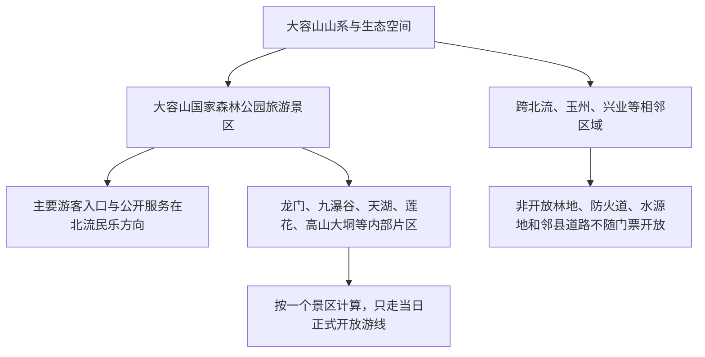
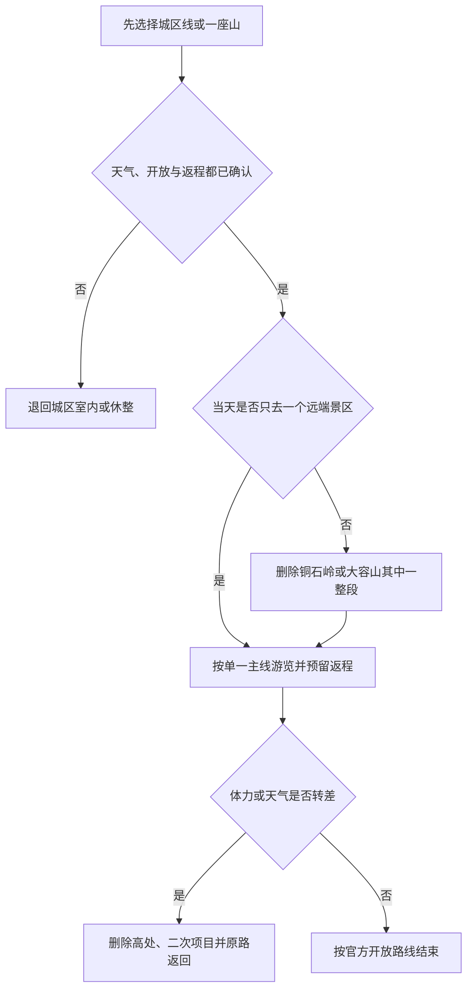

# 北流旅行指南

北流是玉林市代管的县级市，不是玉林主城区的一个景区片区。旅行结构可分成四组：城区的纪念场馆、公共公园和陶瓷文化线，城东近郊的勾漏洞，民安镇方向的铜石岭，以及民乐镇方向的大容山国家森林公园。玉林北站虽然使用地级市名称，站址实际位于北流市新圩镇；它是区域铁路门户，不等于从站台可以连续步行到北流城区或北部山地景区。第一次到访宜住在北流城区，用 2–3 天分别完成城市线和一条山地线。

> 建议停留：2–3 天；只走城区与勾漏洞可安排 1 天 
> 旅行关键词：勾漏喀斯特、铜石岭、大容山、陶瓷、革命纪念、荔枝与百香果 
> 主要体力：中等；铜石岭和大容山为中高强度 
> 最近研究：2026-08-12

## 城市速览

| 项目 | 旅行信息 |
|---|---|
| 主要旅行价值 | 在独立县级市尺度上，把城区公共文化、勾漏洞喀斯特、铜石岭铜冶文化与大容山森林体验分开理解；陶瓷是北流的重要产业和文化线索，但生产园区不是默认开放景点 |
| 行政与页面范围 | 北流市法定代码为 `450981`，由玉林市代管；本页不并入玉州区、福绵区、容县、陆川县、博白县或兴业县的景点，也不把“玉北容”规划走廊理解为一座城市 |
| 建议停留 | 1 天选城区—勾漏洞；2 天再选铜石岭或大容山；3 天可把两条北部山地线分别安排，并保留天气缓冲 |
| 较舒适季节 | 春秋较适合城市公园与山地活动；夏季湿热且可能受台风外围、雷雨和短时强降水影响，冬春干燥时需关注森林火险和临时禁火 |
| 预算特点 | 城区餐饮和公共公园较易控制支出；景区门票、景交或游乐项目、城区至山地的逐段用车是主要增量 |
| 步行强度 | 城区公共空间可缩短；勾漏洞有洞内湿滑与台阶，铜石岭和大容山有坡道、栈道或山地路面，不能因有车辆或设施就按低体力估算 |
| 主要天气风险 | 高温、雷电、暴雨、短时大风、道路积水、山洪或落石风险会影响洞穴、山路和林区；极端天气预警下取消户外线 |
| 独行旅行 | 城区吃住方便；勾漏洞、铜石岭和大容山的末段交通及返程必须提前落实，不依赖闭园后的临时拼车 |
| 亲子旅行 | 纪念展陈、陶瓷文化和城市公园较易形成主题；洞穴水边、铜石岭高差、大容山林道和经营性体验项目需持续看护并核对年龄条件 |
| 长者与低体力旅行 | 以城区半日或单一景点为宜；选择车辆近达入口、长休息和原路返回，不把观光车、缆车或电梯的存在理解为全程无台阶 |
| 无障碍信息 | 公开资料不足以证明各景点形成从落客、检票到卫生间、展陈和观景点的连续无障碍路线；会仙河公园等平缓公共空间也需现场确认坡道、路面与卫生间 |

GeoNames **1803551** 是用于定位北流主城的 `P/PPL` 居民点，Wikidata **Q814748** 与行政区划代码 **450981** 则对应法定县级北流市。Q814748 的 `P1566` 精确连接到 1803551，可交叉核对名称和主城位置，但居民点坐标不能代替整个法定市域边界。

大容山在地图和规划中有三种不同粒度：跨县区的山系与生态空间、国家森林公园范围、以及面向游客运营的景区。旅行者实际购买门票或接受服务的是运营方公布的入口、开放游线和项目，不能由“大容山”三个字推导整片山林均可进入。

旧项目资料出现的龙门、九瀑谷、天湖、莲花和高山大垌等名称，是同一大型景区的内部片区或建设单元，不应拆成多个独立景点；规划项目也不等于 2026 年全部建成、开放或包含在同一票制中。

## 城市格局与游览区域

北流城区承担住宿、餐饮和日常公共服务，勾漏洞在城东近郊，铜石岭在民安镇方向，大容山国家森林公园的常用入口在民乐镇方向。玉林北站位于北流市新圩镇平安山村附近，处在玉林主城与北流城区之间的区域交通带；站名中的“玉林”不改变其北流属地，站址在北流也不代表玉林主城区景点属于北流。

| 区域 | 主要内容 | 游览特点 | 与其他区域的关系 |
|---|---|---|---|
| 北流城区 | 李明瑞、俞作豫烈士纪念公园与纪念馆、陶瓷文化线索、住宿和餐饮 | 适合步行与短途车辆组合；场馆开放、团队接待和陶瓷文化馆参观需逐处确认 | 可与勾漏洞组成一日；不应在同一下午再赶大容山 |
| 城东—勾漏洞 | 勾漏洞风景区、喀斯特洞穴与地质遗迹 | 洞内湿滑、台阶与照明条件会影响体力；强降雨时需留意洞穴和道路管理 | 距城区相对近，适合与城市线组合，但仍是独立运营景区 |
| 新圩镇—玉林北站 | 高铁门户、站前换乘与区域服务 | 适合抵离或早晚车过渡；站前服务与北流传统城区不是同一生活圈 | 向西连接玉林主城，向东进入北流城区；两边都需核对实际接驳 |
| 民安镇—铜石岭 | 铜石岭国际旅游度假区及公开游线 | 山体、栈道、观景与经营性体验并存，项目和设施受天气及维护影响 | 宜独立半日至一日；与周边村庄、矿业或生产用地边界分开 |
| 民乐镇—大容山 | 大容山国家森林公园游客服务、森林与山地游线 | 山路长、天气变化快，景交、住宿和各内部片区开放具有时效性 | 最好独立一天；更大的大容山山系跨邻接县区，不按一张门票理解 |
| 城区南部及各乡镇生产空间 | 陶瓷制造、果园、养殖、矿业、水库和乡村道路 | 首先是生产、生活或生态管理空间，车辆和人员作业频繁 | 只有经营主体明确接待、完成预约并划出安全游线时才作为体验点 |

铜石岭国际旅游度假区是位于北流市民安镇丰村的具体经营性景区。文化和旅游部资料把其看点与汉代铜冶、铜鼓文化和山地景观联系起来，但周边山体、村路、采石或其他产业地块并不自动属于景区；门票只对应运营方当日公布的范围。勾漏洞同样是一个洞穴景区，洞内洞外地质点、石刻和传说共同组成一处游览单元，不重复计数，也不越过围挡进入未照明支洞。

北流的陶瓷文化与现代制造紧密相连。北流陶瓷文化馆、陶瓷名城等正式接待空间可以在确认开放后参观；日用陶瓷工业园、生产窑炉、原料堆场、仓库、货运专线和企业车间则是工业空间。政府规划提出发展工业旅游，只说明发展方向，不证明任意工厂可临时进入。涉及陶瓷体验时先锁定经营主体、集合点、保险和儿童规则，不通过厂门或物流通道自行探访。

圭江、北流河流域、水库和湿地承担供水、防洪、灌溉、发电或生态功能。会仙河公园的公共游览范围与饮用水源、水库大坝、泄洪区、河道工程及湿地保护区域不是同一概念；大容山水库被认定为重要湿地，也不等于水库岸线开放游泳、露营或乘船。果园同理：北流荔枝、百香果和芭乐是重要产业，但种植基地、采收道和加工车间只有在经营者明确接待时才是旅行体验。

## 主要景点

优先级用于安排时间，不代表绝对排名：**A** 为首访核心，**B** 为按兴趣补充，**C** 为远郊、季节性或通常需要独立半天以上的目的地。车站和游客中心只作为路线节点。同一景区及其内部子景点只计为一处。

### 城区与城东近郊

| 景点 | 区域 | 类型 | 主要看点 | 建议用时 | 室内外 | 体力 | 预约风险 | 天气影响 | 优先级 |
|---|---|---|---|---:|---|---|---|---|---|
| 李明瑞、俞作豫烈士纪念公园与纪念馆 | 北流城区田螺岭 | 革命纪念、展陈与公园 | 两位烈士生平展陈、纪念雕塑和公园空间；旧资料所列开放时间和团队预约不能直接作为当前承诺 | 1.5–2.5 小时 | 混合 | 中；园内有台阶 | 高 | 中 | B |
| 会仙河公园 | 北流城区 | 城市公园、湿地景观与公共慢行 | 公共绿地、水体和城市休闲空间；只进入有护栏、有照明且明确开放的步道 | 1.5–3 小时 | 户外为主 | 低至中 | 低至中 | 高 | B |
| 北流陶瓷文化馆或经确认的陶瓷展陈 | 北流城区相关企业文化设施 | 产业文化、陶瓷展陈 | 北流陶瓷历史、器物和现代产业线索；企业馆、陶瓷名城和工业园不是同一运营单元 | 1–2 小时 | 室内为主 | 低 | 高 | 低 | B |
| 勾漏洞风景区 | 北流城东近郊 | 喀斯特洞穴、地质遗迹与人文景观 | 洞穴系统、岩溶景观及相关历史文化解释；洞内外按一个景区理解 | 2–4 小时 | 混合 | 中 | 中至高 | 高 | A |

### 北部山地景区

| 景点 | 区域 | 类型 | 主要看点 | 建议用时 | 室内外 | 体力 | 预约风险 | 天气影响 | 优先级 |
|---|---|---|---|---:|---|---|---|---|---|
| 铜石岭国际旅游度假区 | 民安镇丰村 | 山地景区、铜冶文化与经营性体验 | 山体景观、古代铜冶与铜鼓文化线索，以及当日开放的栈道、观景和体验项目 | 4–7 小时 | 户外为主 | 中至高 | 高 | 高 | A |
| 大容山国家森林公园旅游景区 | 民乐镇方向 | 国家森林公园、山地与森林景观 | 森林、山谷、水体与高山游线；各内部片区、景交、住宿和二次项目按同一景区当日运营理解 | 1 天 | 户外为主 | 中至高 | 高 | 高 | A |

自治区文旅部门 2025 年资料把大容山国家森林公园和北流勾漏洞列在北流市名下；自治区 A 级景区表也把铜石岭、会仙河公园和大容山对应到北流。等级、票制和运营状态仍会调整，行程以到访日前的官方公告为准。陶瓷文化馆和纪念馆的公开资料相对较旧，因此适合作为“确认后加入”的城市点，不把旧开放时间抄成固定信息。

## 美食与餐饮

北流处在玉林饮食圈内，牛腩粉、牛巴等是区域共同风味；凉亭鸡、荔枝和百香果则具有更明确的北流产地线索。旅行中应把“产地产品”和“餐厅成菜”分开：点到以凉亭鸡制作的菜品并不意味着能进入养殖基地，购买果品也不等于果园开放采摘。单人用餐可用粉面和小份凉菜控制份量，鸡类和合菜最好先问半份或人数建议。

| 菜品或餐饮类型 | 常见区域 | 一个人用餐与常见份量 | 风味、过敏原与饮食限制 | 排队风险与替代方法 |
|---|---|---|---|---|
| 凉亭鸡、水蒸鸡或白切鸡类 | 北流城区家常菜馆、塘岸方向及合规餐饮点 | 常按半只或整只计，单人容易过量；先问小份、拼盘或按重量计价 | 含禽肉；蘸料可能有酱油小麦、芝麻、花生、蚝油和辣椒，清淡饮食者可要求蘸料分开 | 节假日晚餐可能等位；优先选明码标价、能说明原料和份量的同类型餐馆 |
| 玉林牛腩粉 | 城区粉店、市场周边和早餐店 | 通常一人一碗，可问小碗、少粉或另加牛腩 | 含牛肉和米粉；汤底、酱油或调味料可能含小麦、花生、芝麻，香菜与辣椒可分开 | 早餐与午餐高峰较忙；换到本地日常粉店，不必追逐单一热门门店 |
| 牛巴、牛巴粉或牛肉小食 | 城区粉店与家常餐馆 | 牛巴可作小碟共享，牛巴粉多为一人份；加工肉较咸，不宜按零食无限加量 | 含牛肉，腌制调味可能有糖、酱油小麦、芝麻或花生；低盐饮食者先问做法 | 缺货时改点普通牛腩粉或其他现做牛肉粉，不购买来源与储存条件不明的散装加工品 |
| 北流荔枝 | 市场、水果店与季节性正规展销点 | 按斤或小盒购买，单人先买少量并留意保存 | 果糖较高，鲜果汁液易沾衣；对荔枝或相关水果过敏、需控糖者应控制摄入 | 供应受季节和天气影响；非产季不追求“鲜摘”，改买有标签的正规加工品 |
| 北流百香果、芭乐及加工饮品 | 市场、水果店、饮品店与经预约的农业体验点 | 鲜果适合买小份，饮品先问容量、糖度和是否加浓缩浆 | 酸度和籽粒可能不适合部分胃肠或吞咽需求；饮品可能含乳制品、蜂蜜、糖浆或交叉接触原料 | 不进入未接待果园；市场无鲜果时选择标签、配料和保质条件清楚的加工品 |

严重食物过敏、纯素、无麸质、低盐或不能摄入特定肉类者，应直接询问汤底、腌料、酱油、蘸料、动物油和共用锅具。所谓“清汤粉”可能使用牛骨或鸡汤，“水果饮品”也可能加入奶制品、蜂蜜或预拌糖浆。大容山、铜石岭和勾漏洞内部餐饮选择及营业时段不如城区稳定，出发前准备饮水和简单补给，但遵守景区关于食物、垃圾和防火的规定。

## 经典行程

### 一日经典路线

**路线**：李明瑞、俞作豫烈士纪念公园与纪念馆 → 城区午餐 → 勾漏洞风景区 → 会仙河公园短线

- **适用与减负**：适合第一次到访、希望兼顾人文和自然者；纪念馆未确认开放时只保留公园公开区域，勾漏洞只走照明和护栏完整的开放线路。
- **串联逻辑**：上午在城区建立地方历史背景，午后向城东近郊移动，返城后用平缓公园结束；只需要一次主要跨片区移动。
- **预约锚点**：先确认纪念馆当日接待、勾漏洞开放与最晚入场，再核对往返车辆；会仙河公园不作为需要锁票的锚点。
- **休息安排**：长休息和正餐放在城区；进入洞穴前整理鞋具和照明，不把洞内平台当作长时间避雨点。
- **时间不足时**：优先保留勾漏洞和一处城区点；天黑前不再加入会仙河长线，也不临时转往铜石岭。

### 两日核心路线

**第 1 天**：李明瑞、俞作豫烈士纪念公园与纪念馆 → 城区午餐 → 勾漏洞 → 会仙河公园短线 
**第 2 天**：铜石岭或大容山二选一，完成单一景区完整日

- **适用与减负**：适合公共交通加合规用车或自驾者；第二天只选一座山，低体力者优先选已确认车辆可达、可原路折返的低位游线。
- **串联逻辑**：第一天集中城区和城东，第二天集中北部单一方向，避免在民安与民乐之间横向赶路。
- **预约锚点**：第 1 天为勾漏洞与纪念馆，第 2 天为所选景区的门票、景交、项目开放、最晚返程和森林防火。
- **休息安排**：第 1 天在城区午休；第 2 天只使用景区正式服务区和明确开放休息点，随身携带够用的水。
- **时间不足时**：第 1 天删除会仙河；第 2 天取消高处或二次体验项目，不把另一座山作为临时补点。

### 三日深度路线

**第 1 天（城市与洞穴）**：纪念公园与纪念馆 → 城区陶瓷文化展陈（确认开放后）→ 勾漏洞 
**第 2 天（铜石岭）**：北流城区 → 铜石岭国际旅游度假区 → 原路返城 
**第 3 天（大容山）**：北流城区或经核验的民乐住宿 → 大容山国家森林公园当日开放主线 → 返回

- **适用与减负**：适合有三整天并愿意承担两次山地接驳者；任何一天出现暴雨、雷电、大风或高森林火险，都把对应山地日改为城区休整。
- **串联逻辑**：三个主题分别占一天，铜石岭与大容山不因都在北部而合并；陶瓷展陈只在明确接待时加入。
- **预约锚点**：按日期分别锁定勾漏洞、铜石岭和大容山；住宿若放在民乐方向，还要确认消防、夜间到达和退改。
- **休息安排**：第 1 天回城区用餐，第 2、3 天在各自游客中心分段休息；第三天不在未开放林道野餐或生火。
- **时间不足时**：删去第 1 天陶瓷展陈，再在铜石岭和大容山中删除一整天；不要把两座山各走两小时当作替代。

### 铜石岭一日路线

**路线**：北流城区 → 铜石岭游客入口 → 当日开放的铜冶文化与山地主线 → 正式休息区 → 原路或官方指定线路返回

- **适用与减负**：适合能承受坡道、台阶和较长户外活动者；亲子先核对经营性项目的年龄、身高和陪同条件，低体力者只选低位主线。
- **串联逻辑**：文化解释、山体景观、栈道和体验项目均属于一个运营景区，进出使用同一套正式交通，不绕入村路或产业地块。
- **预约锚点**：门票、当日开放项目、栈道或设备维护、最晚入场、停车和返程车辆。
- **休息安排**：入山前补水，在游客中心和正式休息区停留；高温时增加遮阴休息，不在悬空或狭窄路段久停。
- **时间不足时**：先删二次收费和高处体验，仅保留文化展陈与一段安全主线；最晚返程不明时整段取消。

### 大容山一日路线

**路线**：北流城区 → 民乐方向游客入口 → 当日开放的单一主游线 → 正式服务区 → 原路或景区指定线路下山

- **适用与减负**：适合有完整白天、鞋具合适且能适应山地天气者；只按运营方建议选择一条主线，低体力者不追求多个内部片区。
- **串联逻辑**：龙门、九瀑谷、天湖、莲花或高山大垌等名称均在同一大景区体系内，实际只进入当日开放且交通连贯的部分。
- **预约锚点**：景区开放、景交、各内部片区、住宿或二次项目、森林防火、道路和最晚下山时间。
- **休息安排**：游客中心先确认补给点和卫生间，沿途只在正式设施休息；不以水库岸、林业道路或防火通道替代休息区。
- **时间不足时**：取消最远或最高片区，保留入口附近主线；景交停运且徒步时间不足时，不步行硬补全程。

### 雨天与高温路线

**路线**：确认开放的纪念馆 → 城区午餐与长休息 → 确认接待的陶瓷文化展陈；普通小雨且道路正常时才加会仙河有遮蔽短线

- **适用与减负**：只适用于普通降雨或高温避晒；暴雨、雷电、大风、内涝、山洪或地质灾害预警下留在安全室内，不进入洞穴、山地和临水空间。
- **串联逻辑**：把移动压缩在城区，以室内展陈为主；陶瓷文化馆不能确认接待时，宁可减少一站，也不改去工业园厂区。
- **预约锚点**：纪念馆与陶瓷展陈的当日开放、团队接待和临时闭馆；预警级别和城市道路状况同样是锚点。
- **休息安排**：在城区餐馆、住宿或有管理人员的公共室内空间长休息，不把公园亭、洞穴入口或景区售票棚当作极端天气避险点。
- **时间不足时**：只保留已确认的一座室内场馆；没有可靠室内点时改为休整，不为完成清单冒险出行。

### 亲子或低体力路线

**亲子路线**：李明瑞、俞作豫烈士纪念馆 → 城区午餐 → 会仙河公园有护栏短线 
**低体力路线**：车辆近达会仙河公园平缓入口 → 城区长休息 → 勾漏洞入口与经确认的低强度开放段二选一

- **适用与减负**：亲子路线避开高处经营项目和临水无护栏区；低体力路线每半天只保留一处，不把勾漏洞列为必须完成。
- **串联逻辑**：两条路线都以城区为基地，亲子侧重展陈与公共空间，低体力侧重车辆近达和随时折返，不增加铜石岭或大容山。
- **预约锚点**：儿童证件、推车寄存、场馆接待、卫生间和公园维护；低体力者逐点询问落客、坡道、洞内台阶、轮椅和陪同。
- **休息安排**：午餐后留足室内休息；公园只走座椅密度、路面和照明均可接受的短线，洞穴内不勉强连续站立。
- **时间不足时**：亲子路线删公园远端，低体力路线只保留城区公共空间；不要用游乐项目填补空档。

这套取舍把“能安全返回”放在多看一处之前。北流的远端景区方向不同，任何临时加点都会放大叫车、山路、天气和最晚入场的不确定性。

## 住宿区域

北流城区是大多数旅行者最稳妥的连续住宿基地。玉林北站位于北流，但站前片区与北流传统城区仍有一段公路距离；只有早晚高铁抵离时才优先考虑新圩方向。民安和民乐住宿应服务于单一景区日，不能仅凭名称中的“铜石岭”“大容山”判断步行可达入口。

| 区域 | 优点 | 缺点 | 适合人群 | 交通特点 |
|---|---|---|---|---|
| 北流城区 | 餐饮、商店、日常服务和各方向车辆选择相对集中，连续住两晚最均衡 | 前往玉林北站、铜石岭和大容山都需乘车，临主干道房间可能有交通噪声 | 首访、独行、公共交通加用车和希望控制餐饮成本者 | 可分别向城东、民安和民乐出发；订房时确认夜间前台与叫车范围 |
| 新圩镇—玉林北站方向 | 早班或晚到高铁换乘方便，携带大件行李可减少站前移动 | 与北流传统城区和主要景区有距离，晚间餐饮与车辆选择取决于具体位置 | 高铁过渡住宿、次日早班车或当日抵离者 | 站名为玉林北但行政上在北流；去北流城区和玉林主城是两个方向 |
| 民安镇—铜石岭方向 | 便于较早进入铜石岭，可减少当日城区往返 | 餐饮、夜间服务和公共交通通常少于城区，住宿与入口未必相邻 | 自驾、铜石岭单一主题和确认景区接驳者 | 先核对合法经营、停车、实际入口、夜间抵达和退改 |
| 民乐镇—大容山方向 | 可为大容山清晨入园或较长山地日留出时间 | 山区天气、供电、网络、空调或热水、餐饮与消防条件差异较大 | 山地摄影、连续森林活动或不想当天往返城区者 | 只选择证照和消防信息清楚的住宿；景区关闭时要能取消或改回城区 |

不推荐未经核验的具体酒店。预订前确认营业资质、电梯、无障碍房与卫生间、空调、热水、停车、充电、夜间前台、证件登记、行李寄存和取消政策。带轮椅或助行器者不要只问“有电梯”，还应确认入口台阶、房门宽度、淋浴与床侧空间，以及从落客点到客房的连续路线。

## 市内交通

北流没有城市轨道交通。高铁、普速铁路和航空只能解决跨城抵达的一部分，城区到勾漏洞、铜石岭和大容山仍要依靠公交、景区接驳、出租车、合规网约车或自驾分段完成。旧宣传中的公交编号、直通车和班次只说明曾有服务，不能作为到访日承诺。

| 场景 | 建议与取舍 | 行前需要重查的内容 |
|---|---|---|
| 从玉林北站抵达 | 玉林北站于 2024 年 12 月随南珠高铁南玉段开通，站址在北流新圩镇，是目前重要铁路门户；先明确去北流城区还是玉林主城 | 12306 票面站名、到站公交或客运接驳、出租车候车点、夜间服务、道路施工与末班 |
| 从北流站或玉林站抵达 | 地图可见“北流站”不等于到访日一定有旅客列车停靠；玉林站位于玉州区，不在北流 | 12306 可售车次、实际停靠、站前交通、行李与晚到接续，不用旧时刻表判断 |
| 航空抵达 | 北流没有民用运输机场；玉林福绵机场位于福绵区，应按跨县区公路接驳理解 | 当日航班、机场巴士或合规车辆、机场至北流实际路程、夜间抵达和延误方案 |
| 城区与勾漏洞 | 距离相对短，可用公交或车辆前往正式入口；洞穴游览后优先原路返城 | 公交与末班、售票入口、最晚入场、道路积水、洞内维护和返程叫车 |
| 铜石岭 | 适合独立半日至一日，车辆应送到运营方确认的游客入口 | 景区接驳、停车、项目停运、节假日交通组织、最晚返程和网络叫车覆盖 |
| 大容山 | 山地日需要最早出发并预留较长返程；不要把某个内部片区名称直接设为无核验导航终点 | 主入口、景交、道路、森林火险、天气、最晚下山、返程车辆和住宿退改 |
| 玉林主城联程 | 北流由玉林代管且交通联系紧密，但两地城区不是一处连续步行目的地；换城应另算住宿和行李 | 玉林北站两向接驳、玉林站、客运班次、拥堵和换宿成本 |
| 自驾 | 对铜石岭、大容山和多件行李最灵活，但山区、工业园和乡村道路的用途不同 | 停车、充电或加油、暴雨与落石、林区防火；不驶入厂区、果园、矿区、水库管理路和防火便道 |

玉林北站的“玉林”是区域服务名称，站址在北流也不能用来重写两座城区的所有权。联程时应在地图中同时核对“北流城区”“玉林北站”和“玉林主城区”三个点，不用城市名或车站名替代实际落客位置。

## 不同旅行者须知

| 旅行维度 | 可行条件 | 主要取舍 | 需额外核对 |
|---|---|---|---|
| 独行旅行 | 城区粉店、公共空间和单一景点容易安排 | 远端车辆费用不易分摊，淡季与闭园后的返程选择可能减少 | 末班、正规车辆、司机与集合点、夜间叫车、住宿前台和手机信号 |
| 亲子旅行 | 纪念展陈、陶瓷文化、会仙河公园和勾漏洞主题差异清楚 | 洞穴、临水、高处、栈道与经营性项目需要持续看护，不把刺激项目列为必做 | 儿童票与证件、年龄身高、陪同、推车寄存、护栏、照明和卫生间 |
| 长者或低体力旅行 | 每半天一处、车辆近达、城区午休和原路折返可明显减负 | 纪念公园台阶、洞内湿滑、铜石岭高差和大容山长距离仍会累积负担 | 落客点、坡道、轮椅、座椅、景交上下站、台阶和陪同服务 |
| 无障碍需求 | 城区公园、游客中心和较新公共设施可能提供单点无障碍设施 | 现有资料不能证明洞穴、山地、纪念公园和景区交通连续可达 | 逐点确认“下客—检票—卫生间—展陈或观景—出口”，并询问备用通道 |
| 摄影旅行 | 会仙河公共步道、勾漏洞开放区域、铜石岭和大容山公开游线题材不同 | 洞内闪光、三脚架、无人机、商业拍摄和林区起降可能受限，天气与能见度不可控 | 最早最晚开放、器材寄存、无人机空域、脚架、闪光灯和野生动物保护 |
| 预算有限 | 城区住宿、粉面、纪念公园和公共公园有助于控制支出 | 远端用车、景区门票、景交和二次项目会放大预算 | 优惠证件、免费不免预约、套票包含项、正规车辆报价和退改 |
| 陶瓷与工业兴趣 | 只选择有明确接待主体、展厅、集合点和参观规则的文化设施 | 工业园、窑炉、仓库、原料场和货运道路不因“工业旅游”规划而开放 | 预约、保险、儿童限制、拍摄、劳动防护、车间生产状态和购物退换 |
| 农业与乡村体验 | 只进入经营者确认接待的果园、合作社或活动路线 | 荔枝、百香果、芭乐产区首先是生产空间，采收期有车辆、农机、农药和包装作业 | 采摘季、价格、接待、农药安全间隔、鞋具、过敏、儿童和取消政策 |
| 暴雨、台风或洞穴水域风险 | 普通天气下按正式道路和开放游线活动 | 暴雨、雷电、短时大风、内涝或山洪预警下取消洞穴、河岸、山地和水库方向 | 中国气象局预警、景区闭园、道路、地质灾害、水位和票务退改 |
| 森林火险 | 火险较低且景区明确开放时，按防火检查和指定游线进入 | 禁止野外用火，不翻越防火封控，不把露营、烧烤或吸烟当作默认权利 | 当期禁火令、火险等级、景区公告、露营规定、应急出口和返程 |

无障碍票价优惠不能证明物理可达，观光车也可能只覆盖景区中间一段。需要轮椅、助行器、视听辅助或陪同服务时，应在付款前向具体运营方说明需求，并把景区给出的路线拆成落客、坡道或台阶、卫生间、休息点和出口逐项确认。

森林、洞穴、水库、河道、果园、矿区和陶瓷园区的风险不同，但共同原则是只进入明确接待和正式开放的空间。遇到围栏、警示牌、门岗、施工车辆或防火检查时，应按管理要求折返，不用旧游记或卫星图证明“以前有人走过”。

## 行前核对

| 核对事项 | 为什么需要重查 | 建议核对时间 | 官方入口 |
|---|---|---|---|
| 大容山、勾漏洞、铜石岭与会仙河公园的景区状态 | A 级、票制、入口、景交、项目、维护与最晚入场都可能调整 | 排入路线前、到访前三日及前一日 | [广西壮族自治区文化和旅游厅 A 级景区表](http://wlt.gxzf.gov.cn/ztzl/rdjj/gxajlyjq/t19045600.shtml)；[2025 年景区政策名单](http://wlt.gxzf.gov.cn/zfxxgk/wjzl/btjzcwj/t19719409.shtml) |
| 纪念馆与陶瓷文化展陈 | 可检索资料较旧，闭馆日、团队接待、企业馆开放和拍摄规则不能照搬 | 排入路线前直接联系；到访前一日复核 | [文化和旅游部：北流公共文化设施](https://www.mct.gov.cn/whzx/bnsj/ggwhs/201903/t20190329_840099.html)；[广西纪检监察网：纪念馆资料](https://www.gxjjw.gov.cn/staticpages/20160729/gxjjw579ac428-108401-2.shtml) |
| 玉林北站、北流站与玉林站 | 三个站名和属地容易混淆，实际可售车次、接驳和末班会变 | 订票时、出发前一周及当天 | [中国铁路 12306](https://www.12306.cn/) |
| 玉林福绵机场 | 航班、地面交通和延误会改变跨县区接续；机场不在北流 | 订票时、出发前一日及落地前 | [中国民航局广西运输机场目录](https://www.caac.gov.cn/GYMH/MHGK/MYJC/ZNDQ/GX/)；具体航班再向承运航司与机场核对 |
| 暴雨、台风、雷电和高温 | 桂东南强降水可能同时影响城区积水、洞穴、山路、林区和返程 | 出发前三日、前一日及每天早晨 | [中央气象台预警信号](https://www.nmc.cn/f/alarm.html)；[中国天气网玉林](https://www.weather.com.cn/weather1dn/101300901.shtml) |
| 森林火险、禁火和景区封控 | 大容山及其他林区可能因火险、施工或生态管理限制入山和项目 | 计划山地日前及当天早晨 | [广西壮族自治区林业局](http://lyj.gxzf.gov.cn/)；各景区当日官方公告 |
| 山洪、地质灾害、洞穴与山路 | 强降雨后风险可晚于降雨发生，旧路况和导航不可靠 | 山地日前、雨后及出发当天 | [广西自然资源厅地质灾害预警预报](https://dnr.gxzf.gov.cn/zfxxgk/fdzdgknr/dzhj/dzzhyjyb/)；[广西水利厅监测预警](http://slt.gxzf.gov.cn/page/index.html?act=3) |
| 水库、湿地与河道边界 | 水源保护、泄洪、工程维护和生态保护会改变可接近范围 | 计划临水活动前及到访当天 | [玉林市 2026 年政府工作报告](http://www.yulin.gov.cn/gkzl/fadingzhudonggongkaineirong/gzbg/t27261765.shtml)；现场管理公告 |
| 陶瓷、果园或乡村体验 | 工业与农业首先是生产空间，接待、保险、采摘和拍摄规则具有时效性 | 付款或出发前直接向经营主体确认 | [北流水果产业资料](https://www.agri.cn/zx/xxlb/202601/t20260108_8801248.htm)；经营主体官方渠道 |
| 无障碍连续路线 | 单个坡道、观光车、电梯或免票政策不能证明全程可达 | 预约与付款前直接咨询 | 各场馆、景区、车站、酒店的官方电话或服务台 |
| 具体餐厅、住宿与活动 | 营业状态、过敏原、房间设施、节庆活动和退改会变化 | 付款或排入路线前 | 经营者和活动主办方官方渠道、当地市场监管信息 |
| 入境、证件与实名购票 | 跨境旅客来华资格、住宿登记和实名票务要求会变化 | 订票前及出发前 | [国家移民管理局](https://www.nia.gov.cn/)；各票务平台 |

景区电话、票价、开放时段和公交班次以到访日公告为准。旧政府页面、规划和项目表只用于辨认地理关系与设施属性，不能替代运营方的当日通知。

## 来源与更新记录

### 主要来源

| 来源 | 类型 | 支持内容 | 核验日期 |
|---|---|---|---|
| [民政部行政区划查询：广西固定层级数据](https://dmfw.mca.gov.cn/xzqh/getList?code=45&trimCode=true&maxLevel=3) | 国家行政区划数据 | 玉林市 `450900` 及其代管的县级北流市 `450981`，北流不是玉州区或新增市辖区 | 2026-08-12 |
| [GeoNames：Beiliu](https://www.geonames.org/1803551/beiliu.html) | 开放地名数据 | GeoNames 标识 `1803551`、名称 Beiliu 与广西位置 | 2026-08-12 |
| [Wikidata：Q814748](https://www.wikidata.org/wiki/Q814748) | 开放结构化数据 | 北流市法定实体标识、县级市属性、上级玉林市及 P1566 精确指向 `1803551` | 2026-08-12 |
| [广西壮族自治区 4A 级旅游景区一览表](http://wlt.gxzf.gov.cn/ztzl/rdjj/gxajlyjq/t19045600.shtml) | 自治区文旅主管部门 | 铜石岭、大容山与会仙河公园的北流属地、地址、性质和景区登记信息 | 2026-08-12 |
| [广西国家 A 级景区“一票 3 日使用制”名单](http://wlt.gxzf.gov.cn/zfxxgk/wjzl/btjzcwj/t19719409.shtml) | 自治区文旅主管部门 | 2025 年名单中的大容山国家森林公园与北流勾漏洞，以及其北流市属地；政策本身不作为永久票制承诺 | 2026-08-12 |
| [广西自然资源厅：北流勾漏洞地质遗迹](https://dnr.gxzf.gov.cn/sjcx/gxdzyjmlcx/t17393212.shtml) | 自治区自然资源主管部门 | 勾漏洞位于北流城郊、喀斯特洞穴系统与地质遗迹属性 | 2026-08-12 |
| [文化和旅游部：铜石岭国际旅游度假区](https://www.mct.gov.cn/wlbphone/wlbydd/xxfb/qglb/gx/202111/t20211123_929160.html) | 国家文旅主管部门 | 铜石岭在北流民安镇丰村、山地景观、铜冶与铜鼓文化线索、经营性景区属性 | 2026-08-12 |
| [广西自然资源厅：北流文旅项目用地案例](https://dnr.gxzf.gov.cn/xwzx/sxdt/t19274812.shtml) | 自治区自然资源主管部门 | 铜石岭等正式旅游项目与村镇、产业和土地管理空间的区别 | 2026-08-12 |
| [文化和旅游部：北流公共文化服务](https://www.mct.gov.cn/whzx/bnsj/ggwhs/201903/t20190329_840099.html) | 国家文旅主管部门 | 李明瑞、俞作豫烈士纪念公园、会仙河公园、独石湖公园和北流陶瓷文化馆的公共文化背景；旧运营细节需重查 | 2026-08-12 |
| [广西纪检监察网：李明瑞、俞作豫烈士纪念馆](https://www.gxjjw.gov.cn/staticpages/20160729/gxjjw579ac428-108401-2.shtml) | 自治区官方机构资料 | 纪念公园与纪念馆组成、展陈、台阶和历史预约信息；当前开放另行确认 | 2026-08-12 |
| [广西自然资源厅：玉林市土地利用总体规划](https://dnr.gxzf.gov.cn/zfxxgk/fdzdgknr/ghjh/ghjh/t16051984.shtml) | 自治区自然资源主管部门 | 大容山更大生态与森林空间跨北流、玉州和兴业，北流城区水源地与生产空间边界 | 2026-08-12 |
| [广西文旅重大项目表：大容山景区一期](http://wlt.gxzf.gov.cn/data/uploadfile/2019/11/29/90e0e816dcd2d702f0140287ccfb9b30.pdf) | 自治区文旅项目资料 | 大容山旅游景区位于北流民乐，龙门、九瀑谷、天湖、莲花和高山大垌为内部片区；旧建设项目不代表当前全部开放 | 2026-08-12 |
| [南宁至玉林铁路环境影响报告书](http://sthjt.gxzf.gov.cn/zfxxgk/zfxxgkgl/fdzdgknr/hjjccf/xzxk/hjyxslgk/W020190610420548211445.pdf) | 自治区生态环境主管部门公开环评 | 玉林北站位于北流市新圩镇平安山村附近，办理客运作业 | 2026-08-12 |
| [国务院国资委：南珠高铁南玉段开通](http://wap.sasac.gov.cn/n2588025/n2588129/c32497172/content.html) | 国务院部门与项目业主信息 | 2024 年 12 月 30 日南玉段与玉林北站开通运营，实际票价和车次仍查 12306 | 2026-08-12 |
| [玉林市 2026 年政府工作报告](http://www.yulin.gov.cn/gkzl/fadingzhudonggongkaineirong/gzbg/t27261765.shtml) | 市政府 | 北流河水环境、大容山水库重要湿地、森林防火和当前区域交通建设背景 | 2026-08-12 |
| [广西自然资源厅：北流工业园区空间边界](https://dnr.gxzf.gov.cn/zfxxgk/fdzdgknr/dzgl/tdly/t16075641.shtml) | 自治区自然资源主管部门 | 民安、民乐、西埌等日用陶瓷产业空间与铁路站场周边工业用地；工业区不等于游客区 | 2026-08-12 |
| [玉林市工业发展行动计划](http://www.yulin.gov.cn/zcwj/yzh/t8629018.shtml) | 市政府 | 北流日用、艺术与建筑陶瓷产业及陶瓷小镇的工业旅游发展方向；规划不等于任意企业开放 | 2026-08-12 |
| [农业农村部信息网：北流水果产业](https://www.agri.cn/zx/xxlb/202601/t20260108_8801248.htm) | 国家农业信息平台 | 北流荔枝、百香果、芭乐的种植、加工和销售产业，以及生产空间边界 | 2026-08-12 |
| [广西农业农村厅：北流百香果品牌](http://nynct.gxzf.gov.cn/xwdt/gxlb/yl/t17591947.shtml) | 自治区农业主管部门 | 北流百香果区域品牌、鲜果与加工品、产销背景 | 2026-08-12 |
| [文化和旅游部：2022 广西全域旅游大集市](https://www.mct.gov.cn/preview/whzx/qgwhxxlb/gx/202207/t20220714_934659.htm) | 国家文旅主管部门 | 玉林牛腩粉、牛巴、荔枝和百香果的区域餐饮与产品背景，北流陶瓷的属地产品线索 | 2026-08-12 |
| [中国保护知识产权网：玉林地理标志保护](https://ipr.mofcom.gov.cn/article/gnxw/sfjg/rmfy/dffy/202409/1988146.html) | 商务部知识产权公共服务资料 | 北流凉亭鸡作为地方地理标志特色产业 | 2026-08-12 |
| [中国气象局：北流防御台风“蝴蝶”](https://www.cma.gov.cn/2011xwzx/2011xqxxw/2011xjctz/202506/t20250613_7139435.html) | 国家气象主管部门 | 台风影响下北流可能出现暴雨到大暴雨、局地更强降水，以及排涝和农业风险 | 2026-08-12 |
| [中国铁路 12306](https://www.12306.cn/) | 铁路运营平台 | 玉林北站、北流站和玉林站可售车次、票价与动态运行核对入口 | 2026-08-12 |
| [中国民航局广西运输机场目录](https://www.caac.gov.cn/GYMH/MHGK/MYJC/ZNDQ/GX/) | 国家民航主管部门 | 玉林福绵机场为广西运输机场；具体航班、机场服务和地面接驳另向承运航司与机场核对 | 2026-08-12 |

### 更新记录

| 日期 | 更新内容 |
|---|---|
| 2026-08-12 | 首次完成公众版北流城市指南；核验县级市身份、GeoNames 与 Wikidata 映射，区分北流城区、勾漏洞、铜石岭、大容山及玉林北站属地，建立陶瓷工业、果园、水库、森林与跨县山系边界，并补充路线、餐饮、住宿、交通、暴雨火险和无障碍核对条件 |
