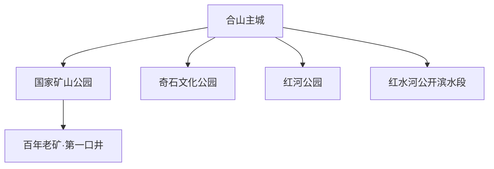
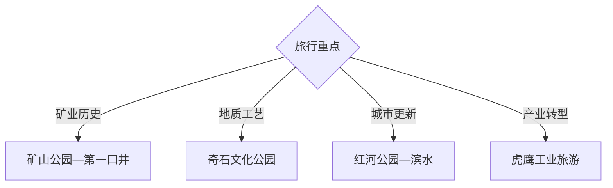

# 合山旅行指南

合山位于桂中红水河畔，是以煤矿工业遗产塑造城市身份的县级市。合山国家矿山公园、百年老矿第一口井、奇石文化公园、红河公园与红水河滨水构成紧凑的工业遗产路线。固定快照中的 **Heshan / GeoNames 12334859** 对应合山主城。

## 城市速览

| 项目 | 信息 |
|---|---|
| 主线 | 国家矿山公园—第一口井—奇石—红河公园 |
| 停留 | 核心1天；增加乡村或红水河方向共2天 |
| 住宿 | 主城适合工业遗产与滨水路线 |
| 交通 | 公路进入，遗产园区与乡村点短途接驳 |
| 季节 | 秋冬舒适；汛期核对红水河水情 |
| 预算 | 讲解、园区交通和乡村车辆为主要增量 |

## 城市格局与游览区域

主城、矿山遗产园区和城市公园距离相对紧凑，适合一天串联；红水河及乡村方向另行接驳。工业遗产展示区与活跃生产设施、废弃坑道、塌陷区、铁路设施和水电航运空间分别管理，依正式开放范围参观。

## 主要景点

| 景点 | 区域 | 类型 | 核心体验 | 用时 | 环境 | 体力 | 研究价值 | 拥挤 | 优先级 |
|---|---|---|---|---:|---|---|---|---|---|
| 合山国家矿山公园 | 主城周边 | 工业遗产 | 煤矿城市、设备、矿业景观与转型 | 半天 | 混合 | 中 | 很高 | 节假日中 | A |
| 百年老矿·第一口井历史文化景区 | 矿区遗产带 | 工业史 | 矿井起点、工人记忆与城市形成 | 2–3小时 | 混合 | 中 | 很高 | 中 | A |
| 里兰园区公开部分 | 里兰方向 | 矿业遗产 | 矿区空间、运输和工业地貌 | 2小时 | 室外 | 中 | 高 | 低 | B |
| 奇石文化公园 | 主城 | 地质与工艺 | 红水河奇石、地方收藏和工艺 | 2小时 | 混合 | 低 | 高 | 周末中 | B |
| 红河公园 | 主城 | 城市公园 | 市民休闲、矿城更新与绿地 | 1–2小时 | 室外 | 低 | 中 | 傍晚中 | B |
| 红水河公开滨水段 | 河岸 | 河流与城市 | 河谷景观、水运与城市关系 | 2–3小时 | 室外 | 低 | 高 | 周末中 | B |
| 虎鹰工业旅游公开区 | 城郊 | 工业与转型 | 资源型城市产业转型观察 | 2小时 | 混合 | 低 | 高 | 低 | B |

## 美食与餐饮

合山可体验桂中米粉、酸食、河鲜合规养殖菜品、壮乡糯食和家常炖菜。工业遗产日可在主城集中用餐；河鲜选择来源与明码标价清晰的正规餐馆。

## 经典行程

### 矿业遗产主线
**路线**：国家矿山公园—百年老矿第一口井—遗产展示。**逻辑**：从开采起点理解城市形成。**预约锚点**：园区开放与讲解。**休息**：游客服务区。**删除条件**：部分维护时保留开放展陈。

### 里兰园区线
**路线**：主城—里兰园区正式入口—公开工业遗产—返城。**逻辑**：补充矿区空间和运输系统。**预约锚点**：园区开放与车辆。**休息**：正规服务点。**删除条件**：停止接待时并入矿山公园主线。

### 奇石文化线
**路线**：奇石文化公园—城市公共文化空间—正规展销。**逻辑**：连接红水河地质资源与工艺。**预约锚点**：场馆开放。**休息**：主城。**删除条件**：闭馆时改滨水线。

### 红水河滨水线
**路线**：红河公园—公开滨水步道—城市晚餐。**逻辑**：以低体力观察矿城转型和河流。**预约锚点**：水情与岸线开放。**休息**：主城。**删除条件**：洪水、大风或岸线维护时缩短。

### 工业转型线
**路线**：矿山公园—虎鹰工业旅游公开区—城市新区。**逻辑**：从旧矿业过渡到产业转型。**预约锚点**：企业接待与安全流程。**休息**：主城。**删除条件**：企业暂停接待时保留矿山公园。

### 轻松一日线
**路线**：第一口井—奇石文化公园—红河公园。**逻辑**：用低强度串联城市代表点。**预约锚点**：场馆开放与天气。**休息**：主城多次安排。**删除条件**：高温时把公园移到傍晚。

### 两日组合线
**路线**：首日矿山公园与第一口井；次日里兰、奇石与红水河。**逻辑**：把深度工业史与城市休闲分开。**预约锚点**：园区和讲解。**休息**：主城连续住宿。**删除条件**：一天时保留首日并加奇石公园。

## 住宿区域

主城住宿便于矿山遗产、公园和餐饮，可一处连续入住。选择消防、停车和夜间交通清晰的正规住宿；乡村和园区周边只有接待资质、通信与返程安排明确时纳入。

## 市内交通

合山主要通过公路连接来宾及周边城市，班次以出发日信息为准。主城景点可短途接驳，里兰和乡村方向另核对车辆；工业园区依访客入口通行，红水河沿岸根据汛情调整。

## 不同旅行者须知

工业遗产旅行者预约讲解并给矿山公园半天；亲子与长者选择第一口井公开区、奇石公园和红河公园；摄影者在开放观察点记录工业景观；研学团队按园区流程进入。活跃矿井、废弃坑道、塌陷区、爆破区、铁路专用线、生产车间、水电设施和航道保留明确限制。

## 行前核对

- 核对矿山公园、第一口井、里兰与虎鹰开放。
- 核对讲解预约、工业安全要求和访客入口。
- 核对红水河水情、岸线维护与高温雷雨。
- 核对来宾方向公路班次与返程车辆。

## 来源与更新记录

| 来源 | 支持内容 | 核验日期 |
|---|---|---|
| [广西文旅厅：A级旅游景区名录](https://wlt.gxzf.gov.cn/zfxxgk/fdzdgknr/tzgg/t11739994.shtml) | 矿山公园、第一口井、奇石、红河及虎鹰景区 | 2026-09-03 |
| [广西文旅厅：文化旅游发展规划](https://wlt.gxzf.gov.cn/zfxxgk/fdzdgknr/ghjh/zcqgh/P020230620379275895820.pdf) | 合山工业遗产与滨江文旅方向 | 2026-09-03 |
| [GeoNames 12334859](https://www.geonames.org/12334859/) | Heshan 固定人口点与合山主城位置 | 2026-09-03 |
