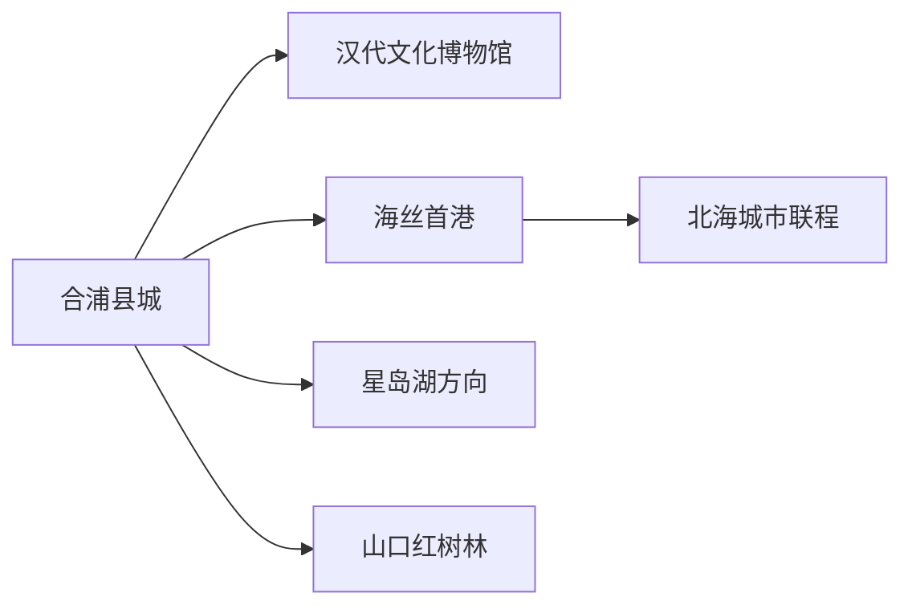
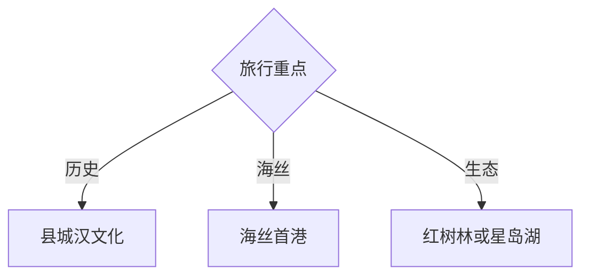

# 合浦旅行指南

合浦的旅行主线是汉代海上丝绸之路、汉墓考古、南珠文化与北部湾湿地。县城文博可以用一天完成，海丝首港、星岛湖和山口红树林分处不同方向；先确定当天主题，再安排车辆和返程。

## 城市速览

| 项目 | 信息 |
|---|---|
| 主线 | 县城汉文化—海丝首港—湿地或湖区 |
| 停留 | 县城1天；每条远线另留半日至1天 |
| 住宿 | 合浦县城便于文博；海岸方向按正规景区选择 |
| 交通 | 合浦站、县城公交、北海联程与包车 |
| 风险 | 台风暴雨、高温、潮汐、水上活动和湿地保护 |
| 边界 | 汉墓保护区、港口滩涂、红树林、养殖塘和村落分别管理 |

## 城市格局与游览区域

县城集中汉墓与海丝文博，海丝首港靠近南部海岸，山口红树林位于县域东南，星岛湖另处内陆水域。固定清单以 `Wujia` **GeoNames 1791214** 建页并承接合浦县；Wikidata `Q1268277` 的 P1566 指向行政记录 `1803842`，不把乌家镇等同于全县。

## 主要景点

| 景点 | 区域 | 类型 | 核心体验 | 用时 | 环境 | 体力 | 研究价值 | 拥挤 | 优先级 |
|---|---|---|---|---:|---|---|---|---|---|
| 合浦汉代文化博物馆 | 县城 | 考古文博 | 汉墓出土文物与海上交流 | 2–4小时 | 室内 | 低 | 很高 | 中 | A |
| 合浦汉墓群公开展示区 | 县城周边 | 考古遗址 | 墓葬制度与遗址保护 | 2–3小时 | 混合 | 中 | 很高 | 低 | A |
| 海丝首港景区 | 南部海岸 | 主题景区 | 港口叙事、演艺与海丝体验 | 4–6小时 | 混合 | 中 | 中高 | 高 | A |
| 东坡亭及县城历史点 | 县城 | 历史人文 | 地方文脉与传统园林 | 1–2小时 | 混合 | 低 | 中 | 低 | B |
| 星岛湖正式开放区 | 西北方向 | 湖泊景区 | 湖岛、水上观光与季节景色 | 半日至1天 | 室外 | 中 | 中 | 中 | C |
| 山口红树林正式开放区 | 东南方向 | 湿地生态 | 红树林、潮间带与生态科普 | 1天含往返 | 室外 | 中 | 高 | 低 | B |

汉墓群按博物馆与批准展示区参观；红树林核心区、滩涂养殖、港口作业与非正规船只路线按保护和运营边界通行。

## 美食与餐饮

合浦月饼、沙虫、海鸭蛋、海鲜、米粉和南珠相关伴手礼适合县城与正规海鲜餐馆体验。海鲜按时价和重量确认，说明过敏、辣度与加工费；南珠在有凭证商家比较品质和售后。

## 经典行程

### 两日基础线
**路线**：县城汉文化—海丝首港。**逻辑**：先看文物，再进入港口叙事。**预约锚点**：博物馆、演艺和车辆。**休息**：县城午餐与景区室内段。**删除条件**：滨海天气不佳时保留县城。

### 汉代考古线
**路线**：博物馆—汉墓公开展示区—东坡亭。**逻辑**：从出土文物到城市历史。**预约锚点**：开放、讲解和拍摄。**休息**：县城茶饮。**删除条件**：遗址区关闭时延长博物馆。

### 海丝首港线
**路线**：县城—海丝首港—返程。**逻辑**：给大型景区和演艺完整时段。**预约锚点**：节目、夜场和返程车。**休息**：景区正规餐饮。**删除条件**：台风或停演时改文博线。

### 红树林生态线
**路线**：县城—山口正规入口—科普步道—返程。**逻辑**：按潮汐和保护要求观察湿地。**预约锚点**：开放、潮汐和交通。**休息**：游客中心。**删除条件**：暴雨、大风或保护管制时取消。

### 星岛湖线
**路线**：县城—星岛湖正式景区—返程。**逻辑**：湖区独立成日。**预约锚点**：船班、救生和天气。**休息**：码头服务区。**删除条件**：停航时改县城线。

### 亲子研学线
**路线**：汉代文化博物馆—海丝首港日场。**逻辑**：文物与情境体验互相补充。**预约锚点**：讲解、演艺和儿童票。**休息**：午后室内。**删除条件**：高温时缩短户外。

### 低体力线
**路线**：县城博物馆—车辆游县城—海丝首港可落客区。**逻辑**：减少潮滩与长步道。**预约锚点**：落客、座椅和无障碍。**休息**：酒店午休。**删除条件**：跨区车程不适时只留县城。

## 住宿区域

合浦县城便于火车站、文博和多方向出发；北海住宿适合把合浦作为一日联程；滨海住宿按正规运营和返程需求选择。确认台风退改、停车、早餐、蚊虫防护和夜间交通。

## 市内交通

合浦站到县城需接驳，海丝首港、星岛湖和山口红树林不构成连续公交游线。每个远线单独核对车辆、末班和返程；水上项目选择持证运营并穿戴救生装备。

## 不同旅行者须知

历史爱好者优先汉代文化博物馆与讲解；亲子家庭选择文博加日场演艺；观鸟者按季节和潮汐进入正规观察区；购买南珠保留票据；海鲜过敏者提前沟通餐具与汤底。

## 行前核对

- 核对博物馆、海丝首港演艺、星岛湖船班和红树林开放。
- 核对台风、强降雨、高温、潮汐与北海—合浦交通。
- 汉墓、红树林、港口、养殖塘和水域活动按保护及运营边界进入。

## 来源与更新记录

| 来源 | 支持内容 | 核验日期 |
|---|---|---|
| [文化和旅游部：海丝首港景区](https://zhuanti.mct.gov.cn/dhxlsfn2022/guangxi/detail/2390.html) | 海丝首港位置、主题体验与合浦月饼 | 2026-09-01 |
| [文化和旅游部：合浦汉代文化博物馆](https://www.mct.gov.cn/wlbphone/wlbydd/xxfb/qglb/gx/202311/t20231103_949504.html) | 汉墓出土文物、海上交通史与博物馆主题 | 2026-09-01 |
| [民政部行政区划代码查询](https://dmfw.mca.gov.cn/xzqh/getList?code=45&trimCode=true&maxLevel=3) | 合浦县行政层级与代码 | 2026-09-01 |
| [GeoNames 1791214](https://www.geonames.org/1791214/) | Wujia 固定城市点 | 2026-09-01 |
| [Wikidata Q1268277](https://www.wikidata.org/wiki/Q1268277) | 合浦县实体与行政记录关系 | 2026-09-01 |

| 日期 | 更新 |
|---|---|
| 2026-09-01 | 首次完成合浦旅行研究；建立汉文化、海丝首港与湿地湖区路线 |
