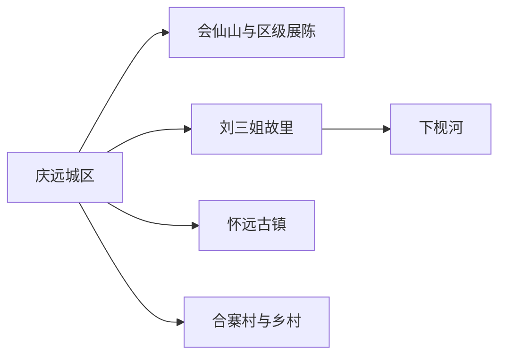
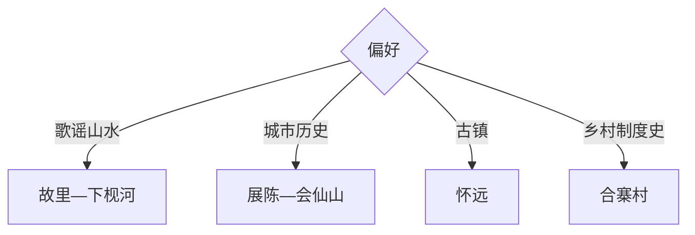

# 宜州旅行指南

宜州适合围绕刘三姐歌谣、龙江—下枧河喀斯特水景、庆远古城和怀远古镇安排：城区会仙山与博物馆适合半日至一天，刘三姐故里和下枧河是核心自然文化线，怀远、合寨村与古龙河可分别追加。

## 城市速览

| 项目 | 信息 |
|---|---|
| 主线 | 庆远城区—会仙山—刘三姐故里—下枧河—怀远古镇—合寨村 |
| 停留 | 城区与故里1–2天；增加古镇乡村共3天 |
| 住宿 | 庆远城区交通餐饮方便，下枧河适合山水慢住，怀远适合古镇早晚 |
| 交通 | 从河池、柳州方向乘铁路或公路进入，区内用公交、旅游车或预约车 |
| 风险 | 河流水情、游船、喀斯特洞穴、夏季高温雷雨与节庆客流 |
| 边界 | 航道、河岸封控段、洞穴未开放区、蚕桑生产区和村寨私域按开放范围进入 |

## 城市格局与游览区域

固定 `Yizhou / GeoNames 1797632` 对应宜州主城，本页以法定宜州区 `Q1028080` 组织。刘三姐故里与下枧河相连，怀远古镇在西部方向，合寨村等乡村点另需半日至一天。

## 主要景点

| 景点 | 区域 | 类型 | 核心体验 | 用时 | 环境 | 体力 | 预约风险 | 天气影响 | 优先级 |
|---|---|---|---|---:|---|---|---|---|---|
| 刘三姐故里景区 | 刘三姐镇 | 民俗与山水 | 歌谣文化、故居、壮寨与河景 | 4–7小时 | 室内外 | 中 | 极高 | 很高 | A |
| 下枧河正规游览段 | 刘三姐镇 | 喀斯特河流 | 碧水、竹岸、峰林与山歌体验 | 3–6小时 | 水上与室外 | 中 | 极高 | 极高 | A |
| 会仙山景区 | 庆远城区 | 城市山地 | 摩崖、地方历史、民俗活动与俯瞰 | 2–5小时 | 室外 | 中高 | 高 | 很高 | A |
| 宜州区博物馆或刘三姐文化展陈 | 城区 | 地方文博 | 庆远历史、歌谣与多民族文化 | 1.5–3小时 | 室内 | 低 | 很高 | 低 | A |
| 怀远古镇 | 怀远镇 | 历史古镇 | 骑楼街巷、龙江水运与地方饮食 | 3–6小时 | 室外为主 | 低中 | 高 | 高 | A |
| 合寨村村民自治展示点 | 屏南方向 | 乡村历史 | 中国村民自治制度起源与村落 | 2–4小时 | 室内外 | 低中 | 高 | 高 | B |
| 古龙河当期开放景区 | 北牙方向 | 河谷生态 | 喀斯特峡谷、漂流或游船 | 半日至1天 | 水上与室外 | 中高 | 极高 | 极高 | B |
| 壮古佬或桑蚕非遗正规体验点 | 区内 | 非遗农旅 | 壮族生活、蚕桑丝绸与手作 | 2–5小时 | 室内外 | 低中 | 很高 | 中 | B |

## 美食与餐饮

可尝宜州牛肉条、凉菜、豆腐圆、五色糯米饭、粽子、果酱烧烤与桂西北家常菜。节庆市集少量多样，河鱼先问来源、时价和做法；蚕桑乡村体验提前确认供餐与饮食禁忌。

## 经典行程

### 一日经典线
**路线**：区级展陈—刘三姐故里—下枧河正规项目。**逻辑**：先理解歌谣背景，再进入山水与活态表演。**预约锚点**：景区、演出、游船和返程。**休息**：故里游客中心。**删除条件**：水情异常时只留陆上景区。

### 两日山水古城线
**路线**：首日会仙山—城区；次日刘三姐故里—下枧河。**逻辑**：城市历史与高天气敏感河流分日。**预约锚点**：展馆、船班与演出。**休息**：庆远城区。**删除条件**：暴雨时第二日改怀远古镇。

### 怀远古镇线
**路线**：庆远—怀远古镇—龙江公开岸线—古镇晚餐。**逻辑**：沿水运商镇慢行。**预约锚点**：展陈、交通和夜间返程。**休息**：古镇。**删除条件**：水情或施工时缩短岸线。

### 山歌非遗线
**路线**：刘三姐文化展陈—故里山歌体验—正规非遗工坊。**逻辑**：从资料到演唱和手作。**预约锚点**：演出、传承人活动与费用。**休息**：故里。**删除条件**：活动停演时保留展陈和村寨。

### 乡村制度史线
**路线**：合寨村展示点—村落公开空间—乡镇午餐。**逻辑**：通过资料理解村民自治历史。**预约锚点**：展馆与讲解。**休息**：村内服务点。**删除条件**：接待未确认时改城区博物馆。

### 亲子山水线
**路线**：区级展陈—故里互动—下枧河短船或陆岸。**逻辑**：以年龄和水情选择水上段。**预约锚点**：救生装备、儿童规则与演出。**休息**：游客中心。**删除条件**：儿童不适水上项目时只走陆线。

### 低体力线
**路线**：区级展陈—车辆到故里核心—龙江滨水短段。**逻辑**：以平路、观光车和短停控制强度。**预约锚点**：无障碍、落客与座椅。**休息**：故里。**删除条件**：高温时只留室内。

## 住宿区域

庆远城区适合铁路公路、餐饮和多方向换线；刘三姐镇适合清晨河景与故里慢游；怀远适合古镇夜宿；乡村住宿用于非遗或康养主题，确认经营、消防、蚊虫防护与返程。

## 市内交通

城区到刘三姐故里、怀远和合寨分属不同方向，公交班次与旅游车按当期查询。水上项目只选持证经营者并穿救生衣；自驾乡村线留意雨季水毁、窄路会车和夜间能见度。

## 不同旅行者须知

文化旅行者优先展陈与山歌活动；山水旅行者以水情决定船线；亲子家庭选择短船或陆岸；低体力者用观光交通。航道、泄洪封控河段、未开放洞穴、蚕桑生产车间和村民院落保留明确限制。

## 行前核对

- 核对刘三姐故里、下枧河、会仙山、怀远、合寨与展馆开放。
- 核对降雨、水位、游船、演出、节庆交通和返程班次。
- 水上活动穿救生衣，非遗拍摄先征得同意，乡村体验按接待范围进入。

## 来源与更新记录

| 来源 | 支持内容 | 核验日期 |
|---|---|---|
| [国家发展改革委：宜州文旅康养](https://www.ndrc.gov.cn/xwdt/ztzl/ylyx/dxjy/202512/t20251201_1402087.html) | 刘三姐故里、下枧河、怀远、合寨与壮古佬 | 2026-09-01 |
| [广西日报：宜州文化旅游活动](https://ssw.gxrb.com.cn/json/interface/epaper/index.php?code=002&date=2026-04-13&name=gxrb&xuhao=1) | 会仙山、怀远、下枧河、故里与非遗美食 | 2026-09-01 |
| [GeoNames 1797632](https://www.geonames.org/1797632/) | Yizhou 固定主城点 | 2026-09-01 |
| [Wikidata Q1028080](https://www.wikidata.org/wiki/Q1028080) | 宜州区实体与跨库标识 | 2026-09-01 |

| 日期 | 更新 |
|---|---|
| 2026-09-01 | 首次完成宜州旅行研究，按歌谣山水、庆远城区、怀远古镇与乡村组织。 |
