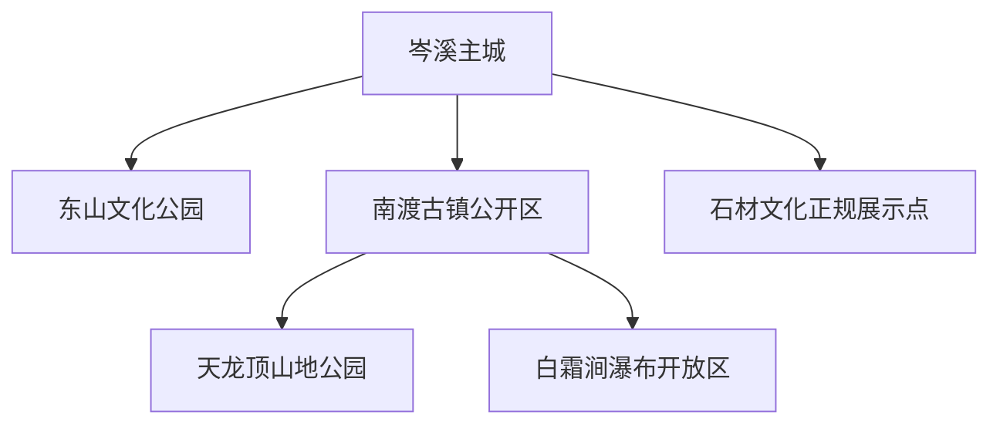
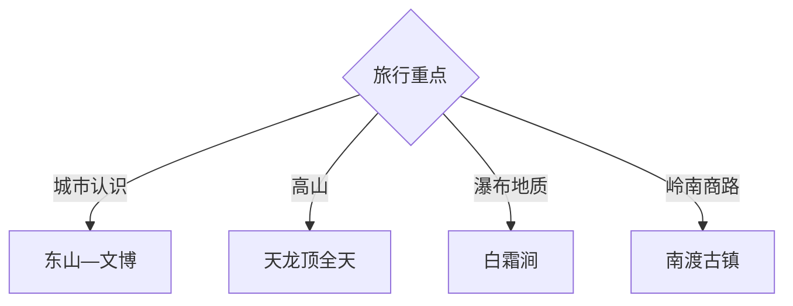

# 岑溪旅行指南

岑溪位于桂东南、粤桂通道西侧，以东山文化公园、天龙顶山地公园、白霜涧瀑布、南渡古镇与石材产业形成城市、山地和岭南商路组合。固定快照中的 **Cenxi / GeoNames 1815917** 对应岑溪主城；天龙顶与白霜涧位于南渡方向，山路和天气决定当天取舍。

## 城市速览

| 项目 | 信息 |
|---|---|
| 主线 | 东山公园—天龙顶—白霜涧—南渡—石材文化 |
| 停留 | 主城1天；南渡山地另留1天 |
| 住宿 | 主城便于公路铁路换乘，山地选择正规接待 |
| 交通 | 铁路、公路进入，山地方向需专门车辆 |
| 季节 | 春秋适合登高；雨季关注瀑布水情和山路 |
| 预算 | 山地车辆、景区交通和住宿增加预算 |

## 城市格局与游览区域

主城承担住宿、交通和城市休闲；南渡承接古镇与通往天龙顶、白霜涧的山地路线。森林、防火区、瀑布深潭、漂流水域、石材矿山与加工厂分别按景区、林业、水情和生产安全边界进入。

## 主要景点

| 景点 | 区域 | 类型 | 核心体验 | 用时 | 环境 | 体力 | 研究价值 | 拥挤 | 优先级 |
|---|---|---|---|---:|---|---|---|---|---|
| 东山文化公园 | 主城 | 城市公园与文化 | 登高、城市眺望与公共文化 | 半天 | 室外 | 中 | 高 | 周末中 | A |
| 岑溪公共文化场馆 | 主城 | 文博与城市史 | 岭南通道、地方历史与民俗 | 2小时 | 室内 | 低 | 高 | 低 | B |
| 天龙顶山地公园 | 南渡方向 | 山地与森林 | 山顶草甸、山岳景观与户外活动 | 1天 | 室外 | 高 | 很高 | 旺季中 | A |
| 白霜涧瀑布开放区 | 吉太方向 | 瀑布与地质 | 多级瀑布、火山岩地貌与峡谷 | 半天 | 室外 | 中高 | 很高 | 丰水期中 | A |
| 南渡古镇公开街区 | 南渡 | 古镇与商路 | 骑楼、河街与粤桂交通记忆 | 半天 | 混合 | 低 | 高 | 节假日中 | B |
| 石庙山公开游览区 | 乡镇 | 山地与文化 | 山石地貌与地方信俗 | 半天 | 室外 | 中 | 中高 | 节日中 | B |
| 石材文化正规展示点 | 主城周边 | 产业与工艺 | 花岗岩、加工技艺与城市产业 | 2小时 | 室内 | 低 | 高 | 低 | B |

## 美食与餐饮

岑溪三黄鸡、米粉、豆腐酿、古典鸡菜肴和山地时蔬适合在主城与正规乡村接待点体验。山地日准备饮水和简餐，农产品与石材工艺购买选择明码标价的正规经营点。

## 经典行程

### 主城文化线
**路线**：公共文化场馆—东山文化公园—地方餐饮。**逻辑**：从城市史到山城格局。**预约锚点**：场馆与公园开放。**休息**：主城。**删除条件**：高温或雷雨时缩短登高段。

### 天龙顶山地线
**路线**：主城—南渡—天龙顶正式入口—开放步道—返程。**逻辑**：独立一天容纳山路和徒步。**预约锚点**：景区、天气和防火。**休息**：游客服务点。**删除条件**：雷雨、大雾、大风或封控时顺延。

### 白霜涧地质线
**路线**：南渡—吉太方向—白霜涧开放游线—返程。**逻辑**：围绕瀑布和火山岩地貌安排半天。**预约锚点**：水情、步道与交通。**休息**：正规服务点。**删除条件**：暴雨、山洪或步道维护时取消。

### 南渡古镇线
**路线**：古镇公开街区—河岸开放段—地方餐饮。**逻辑**：用慢行理解粤桂商路节点。**预约锚点**：古建开放与活动。**休息**：镇区。**删除条件**：河岸积水时保留街区段。

### 石材产业线
**路线**：主城—正规石材展示馆或企业接待区—工艺展销。**逻辑**：从材料到加工理解地方产业。**预约锚点**：企业接待与安全要求。**休息**：主城。**删除条件**：停止接待时改公共文化场馆。

### 轻松公园线
**路线**：主城街区—东山低强度段—三黄鸡主题餐饮。**逻辑**：适配到离日和低体力需求。**预约锚点**：天气和个人饮食。**休息**：主城多次安排。**删除条件**：高温时改傍晚游览。

### 三日组合线
**路线**：首日主城与南渡；次日天龙顶；第三日白霜涧或石材文化。**逻辑**：古镇、山顶和瀑布分开。**预约锚点**：山地天气与道路。**休息**：主城连续住宿。**删除条件**：两天时删第三日。

## 住宿区域

主城适合连续住宿，便于铁路、公路和山地车辆衔接。南渡及景区周边选择资质、消防、停车和通信清晰的正规住宿，山地行程尽量在白天完成往返。

## 市内交通

岑溪铁路和公路节点服务主城，车次以出发日信息为准。天龙顶、白霜涧均在南渡方向但入口和开放项目不同，按导航、景区公告与返程时间分别核对；雨季为落石、积水和绕行留余量。

## 不同旅行者须知

户外旅行者给天龙顶完整一天；地质旅行者组合白霜涧与官方地质资料；亲子与长者选择东山低强度段及南渡；产业旅行者预约正规展示。森林封控区、瀑布深潭、漂流作业水域、矿坑、爆破区、石材车间和古建非开放空间保留明确限制。

## 行前核对

- 核对天龙顶、白霜涧、东山与南渡开放。
- 核对雷雨、山洪、瀑布水位、森林防火和山路。
- 核对正规车辆、步道装备与白天返程。
- 核对石材企业接待、安全培训和参观区域。

## 来源与更新记录

| 来源 | 支持内容 | 核验日期 |
|---|---|---|
| [广西文旅厅：4A级旅游景区一览表](https://wlt.gxzf.gov.cn/ztzl/rdjj/gxajlyjq/t19045600.shtml) | 天龙顶、东山文化公园及属地 | 2026-09-03 |
| [广西自然资源厅：白霜涧瀑布](https://dnr.gxzf.gov.cn/sjcx/gxdzyjmlcx/t17393131.shtml) | 瀑布地貌、位置与地质特征 | 2026-09-03 |
| [GeoNames 1815917](https://www.geonames.org/1815917/) | Cenxi 固定人口点与岑溪主城位置 | 2026-09-03 |
