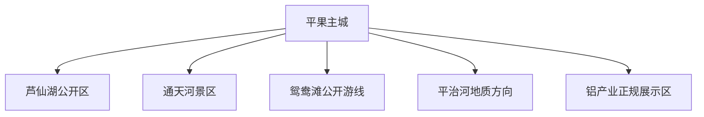
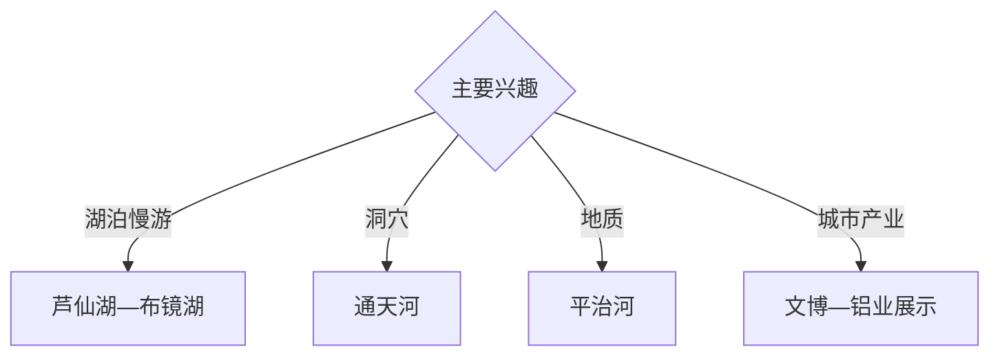

# 平果旅行指南

平果位于右江河谷与桂西喀斯特过渡地带，以芦仙湖、通天河、鸳鸯滩、平治河地质景观和铝产业城市背景形成湖泊、洞穴与工业城市组合。固定快照中的 **Pingguo / GeoNames 1801019** 对应平果主城；自然景区与铝业生产空间分开组织。

## 城市速览

| 项目 | 信息 |
|---|---|
| 主线 | 芦仙湖—通天河—鸳鸯滩—平治河—铝城认识 |
| 停留 | 主城1天；自然远线1–2天 |
| 住宿 | 主城便于铁路、公路和各方向接驳 |
| 交通 | 铁路、公路进入，乡镇景点需专门车辆 |
| 季节 | 春秋舒适；雨季核对洞穴、河谷和山路 |
| 预算 | 远线车辆、景区项目和产业讲解增加预算 |

## 城市格局与游览区域

主城承担住宿、铁路和城市服务；芦仙湖位于主城周边，通天河、鸳鸯滩与平治河按乡镇方向分别安排。铝土矿采区、冶炼加工区、运输设施、洞穴地下河和水库岸线各有独立安全与开放边界。

## 主要景点

| 景点 | 区域 | 类型 | 核心体验 | 用时 | 环境 | 体力 | 研究价值 | 拥挤 | 优先级 |
|---|---|---|---|---:|---|---|---|---|---|
| 芦仙湖公开游览区 | 主城周边 | 湖泊与森林 | 湖岸、城市休闲与森林景观 | 半天 | 室外 | 低中 | 高 | 周末中 | A |
| 通天河景区 | 乡镇 | 溶洞与地下河 | 洞穴、地下河与喀斯特地貌 | 半天 | 洞内 | 中 | 很高 | 节假日中 | A |
| 鸳鸯滩公开游线 | 乡镇 | 河滩与山水 | 河谷、滩地与乡村景观 | 半天 | 室外 | 中 | 高 | 旺季中 | B |
| 平治河地质公园公开点 | 平治河方向 | 地质与河谷 | 岩溶、河谷和地质观察 | 半天至1天 | 室外 | 中高 | 很高 | 低 | A |
| 布镜湖正规游览区 | 坡造方向 | 湖泊与乡村 | 喀斯特湖泊、水岸与村落 | 半天 | 室外 | 低 | 高 | 周末中 | B |
| 平果公共文化场馆 | 主城 | 城市史与民族 | 右江河谷、壮族文化与城市发展 | 2小时 | 室内 | 低 | 高 | 低 | B |
| 铝产业正规展示点 | 主城周边 | 工业与资源 | 铝土矿、加工链与资源型城市 | 2–3小时 | 室内 | 低 | 很高 | 低 | B |

## 美食与餐饮

可体验卷筒粉、五色糯米饭、壮乡酸食、米酒风味和右江河谷时令食材。乡村餐饮选择正规接待点；铝产业参观与餐饮、生活区分开，按企业安排活动。

## 经典行程

### 主城认识线
**路线**：公共文化场馆—城市街区—芦仙湖公开段。**逻辑**：先理解右江河谷和铝城背景。**预约锚点**：场馆与湖区开放。**休息**：主城。**删除条件**：高温时把湖区改到傍晚。

### 通天河洞穴线
**路线**：主城—通天河正式入口—洞穴开放游线—返城。**逻辑**：用半天观察地下河喀斯特。**预约锚点**：景区、水位和交通。**休息**：游客中心。**删除条件**：强降雨或洞穴维护时顺延。

### 平治河地质线
**路线**：主城—平治河正规入口—公开地质观察点—返程。**逻辑**：将河谷地貌单列半天至一天。**预约锚点**：道路、开放和天气。**休息**：正规服务点。**删除条件**：暴雨、山洪或落石预警时取消。

### 芦仙湖轻松线
**路线**：主城—芦仙湖步道—正规水岸活动—地方餐饮。**逻辑**：适合到离日和低体力旅行者。**预约锚点**：湖区项目与天气。**休息**：主城。**删除条件**：大风或岸线维护时改场馆。

### 布镜湖乡村线
**路线**：主城—布镜湖正规接待区—水岸乡村—返城。**逻辑**：观察喀斯特湖泊与村落关系。**预约锚点**：接待、道路和水情。**休息**：正规乡村接待点。**删除条件**：雨季道路受限时改芦仙湖。

### 铝城产业线
**路线**：公共文化场馆—正规铝产业展示区—城市新区。**逻辑**：从资源到加工理解城市发展。**预约锚点**：企业接待与安全要求。**休息**：主城。**删除条件**：停止接待时保留文博与城市观察。

### 三日组合线
**路线**：首日主城与芦仙湖；次日通天河；第三日平治河或布镜湖。**逻辑**：城市、洞穴和河谷分日。**预约锚点**：天气、道路和景区。**休息**：主城连续住宿。**删除条件**：两天时删第三日。

## 住宿区域

主城靠近铁路、公路和餐饮，适合作为各方向基地。乡镇住宿选择资质、消防、停车和通信明确的经营主体；湖区、洞穴和地质路线均预留白天返程时间。

## 市内交通

平果站及公路客运连接主城，班次以出发日信息为准。芦仙湖、通天河、平治河和布镜湖分别核对末段道路；雨季按积水、山洪和地质灾害预警取舍，产业园区按企业车辆与访客流程进入。

## 不同旅行者须知

地质旅行者组合通天河与平治河；亲子与长者优先芦仙湖和场馆；产业旅行者提前预约铝业展示；乡村旅行者选择布镜湖正规接待。矿坑、尾矿设施、冶炼车间、铁路专用线、洞穴封闭支洞、地下河和非开放水岸保留明确限制。

## 行前核对

- 核对芦仙湖、通天河、平治河与布镜湖开放。
- 核对洞穴水位、暴雨山洪、地灾和乡镇道路。
- 核对铝产业参观预约、个人防护和访客区域。
- 核对铁路班次、正规车辆和返程余量。

## 来源与更新记录

| 来源 | 支持内容 | 核验日期 |
|---|---|---|
| [广西文旅厅：乡村旅游高质量发展规划](https://wlt.gxzf.gov.cn/zfxxgk/fdzdgknr/ghjh/zcqgh/P020230727668881516447.pdf) | 布镜湖、芦仙湖与乡村旅游方向 | 2026-09-03 |
| [广西文旅厅：A级旅游景区名录](https://wlt.gxzf.gov.cn/zfxxgk/fdzdgknr/tzgg/t11739994.shtml) | 平果景区体系与属地核对 | 2026-09-03 |
| [GeoNames 1801019](https://www.geonames.org/1801019/) | Pingguo 固定人口点与平果主城位置 | 2026-09-03 |
