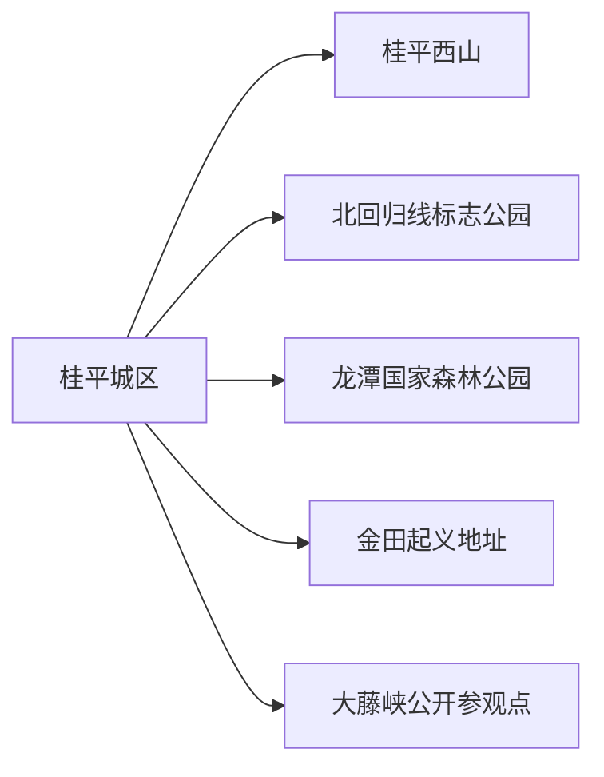
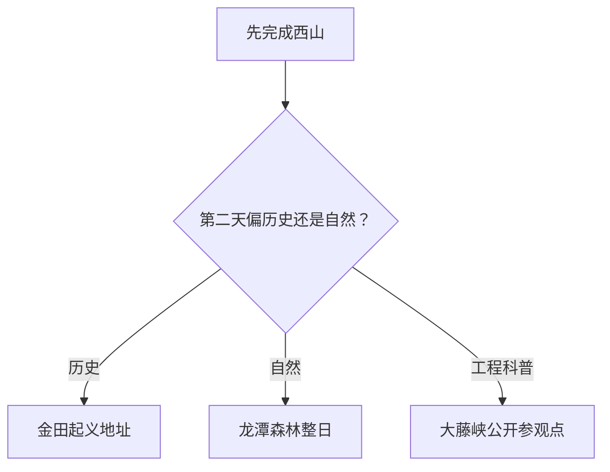

# 桂平旅行指南

桂平位于黔江、郁江汇合成浔江的区域，是贵港代管的县级市。最实用的路线以桂平城区和西山为核心，再从龙潭国家森林公园、金田起义地址、大藤峡三个远点中按兴趣分日选择。每个远点都有自己的道路、开放和住宿逻辑，主城连住能让行程更从容。

## 城市速览

| 项目 | 信息 |
|---|---|
| 旅行主线 | 桂平西山、龙潭国家森林公园、金田起义地址、北回归线标志公园、大藤峡 |
| 建议停留 | 1 天西山；2 天加入金田或龙潭；3 天再选大藤峡或城市文博 |
| 住宿基地 | 桂平城区最均衡，靠近餐饮和多方向车辆 |
| 步行强度 | 城区低；西山中高；龙潭高；金田低至中 |
| 主要天气 | 高温高湿、雷暴、强降雨、山洪、江河水位、台风外围与森林火险 |
| 水利提示 | 大藤峡是运行中的水利航运枢纽，只使用官方明确开放的参观点和道路 |
| 亲子 | 北回归线科普、西山短线与金田博物馆类展陈较易组合 |
| 低体力 | 城区、金田博物馆和西山车辆可近达区域更合适 |
| 生态边界 | 森林公园、自然保护区、河道、港口和水库按保护与生产管理范围活动 |
| 无障碍 | 设施连续性需向官方确认，重点核对景区车、台阶、卫生间与落客点 |

## 城市格局与游览区域

桂平市法定代码为 `450881`。固定 GeoNames `1809486` 是桂平主城点，Wikidata 法定实体 `Q963782` 的 `P1566` 同时连接 `1809486` 与另一记录 `1809485`；另有薄地点实体 `Q49278904` 连接同一固定点。本页以法定桂平市为对象，P1566 仅用于地点交叉核对。贵港主城和平南县分别是其他旅行目的地。

| 区域 | 旅行价值 | 怎么安排 |
|---|---|---|
| 桂平城区—西山 | 住宿、餐饮、西山、城市公园和北回归线科普 | 首日完整一天；西山内部按台阶、天气与体力从容安排 |
| 南木—龙潭 | 亚热带森林、峡谷与生态观察 | 独立一日，先锁道路、天气和景区交通 |
| 金田镇 | 起义遗址、博物馆与近代史 | 半日至一日，适合文博主题 |
| 黔江—大藤峡 | 峡谷、水利、航运与公开观景 | 只按官方接待和开放点安排，半日至一日 |
| 麻垌、罗秀与乡村 | 荔枝、米粉、腐竹等物产与农业 | 结合正规市场或节庆，不进入生产田块 |

## 主要景点

### 城区与西山

| 景点 | 所在区域 | 类型 | 核心看点 | 建议用时 | 室内/室外 | 体力 | 预约难度 | 天气敏感度 | 适合旅程 |
|---|---|---|---|---|---|---|---|---|---|
| 桂平西山风景名胜区 | 西山镇 | 山寺园林、4A | 古树、奇石、泉水、茶文化与宗教建筑 | 4–8 小时 | 室外为主 | 中高 | 中高 | 高 | A |
| 桂平北回归线标志公园 | 城区外缘 | 地理科普、3A | 北回归线标志、基础天文地理与城市位置 | 1–1.5 小时 | 室外 | 低至中 | 低 | 高 | B |
| 桂平中山公园 | 城区 | 城市公园、3A | 城市公共休闲和地方生活 | 1–2 小时 | 室外 | 低 | 低 | 中 | B |
| 桂平市公共文化场馆 | 城区 | 地方史与公共文化 | 地方历史、非遗和当期展览 | 1–2 小时 | 室内 | 低 | 中 | 低 | B |

### 森林、历史与水利远线

| 景点 | 所在区域 | 类型 | 核心看点 | 建议用时 | 室内/室外 | 体力 | 预约难度 | 天气敏感度 | 适合旅程 |
|---|---|---|---|---|---|---|---|---|---|
| 广西龙潭国家森林公园 | 南木镇 | 森林公园、4A | 亚热带常绿阔叶林、峡谷与生态观察 | 1 天 | 室外 | 高 | 高 | 极高 | A |
| 太平天国金田起义地址景区 | 金田镇 | 遗址、博物馆、4A | 起义遗址、金田起义博物馆与近代史 | 3–5 小时 | 混合 | 低至中 | 中 | 中 | A |
| 大藤峡景区公开单元 | 黔江沿线 | 峡谷、水利与科普、3A | 江峡地貌、防洪、航运与正式开放展示 | 2–4 小时 | 混合 | 低至中 | 高 | 高 | B |
| 西山泉旅游度假景区 | 西山镇方向 | 户外休闲、4A | 正规运营的户外、度假和营地项目 | 3–6 小时 | 混合 | 中 | 高 | 高 | B |

西山、龙潭、金田和大藤峡分别是完整目的地。龙潭所在山林兼具生态保护价值，活动保持在开放游径；大藤峡船闸、坝区、厂房、航道和施工管理区属于生产运行空间，参观以公开游客设施为准。

## 美食与餐饮

| 类型 | 适合场景 | 份量 | 过敏与饮食提示 | 选择方法 |
|---|---|---|---|---|
| 罗秀米粉 | 早餐或简餐 | 一人一碗 | 汤底、鸡蛋、花生、大豆与共厨麸质 | 问清汤底和配料，包装品看生产日期 |
| 社坡腐竹 | 合菜 | 一盘适合分享 | 大豆；腐竹煲可能含肉汤、蚝油和海鲜 | 问清泡发、汤底与素食做法 |
| 麻垌荔枝、石硖龙眼 | 夏季水果 | 按重量购买 | 高糖、果核、过敏和高温储存 | 明码标价，少量购买并及时食用 |
| 西山茶 | 茶歇、伴手礼 | 按杯或包装 | 咖啡因与空腹饮用 | 看产地、生产者和包装信息 |
| 江河鱼鲜 | 多人正餐 | 整鱼按重量 | 鱼刺、水产过敏、大豆、小麦与禁捕规定 | 选合法来源、明码标价和充分熟制的餐馆 |

## 经典行程

### 一日经典路线

**路线**：桂平城区 → 桂平西山 → 城区晚餐 → 中山公园或公共空间短线

- **串联逻辑**：把首日完整留给西山，晚间只增加低强度城市活动。
- **预约锚点**：西山票务、景区车、宗教活动、天气与最晚下山。
- **休息安排**：景区游客中心、正规茶点和城区餐饮。
- **时间不足时**：缩短登高，只完成西山核心开放区域。

### 两日西山与金田路线

**第 1 天**：桂平西山 
**第 2 天**：城区 → 金田起义地址景区 → 返回

- **串联逻辑**：第一天看山寺园林，第二天转向近代史，主题清晰。
- **预约锚点**：金田博物馆开馆、讲解、道路和返程车辆。
- **休息安排**：金田镇正规餐饮和景区服务设施。
- **时间不足时**：第二天只保留博物馆与核心遗址。

### 三日深度路线

**第 1 天**：西山 
**第 2 天**：金田 
**第 3 天**：龙潭国家森林公园 **或** 大藤峡公开参观点

- **串联逻辑**：第三天依据体力在高强度森林和低强度水利科普中二选一。
- **预约锚点**：龙潭道路、防火和景区车；大藤峡公开接待、证件与交通。
- **休息安排**：第三天使用正式游客中心，返城前预留一小时缓冲。
- **时间不足时**：删去第三天，不把龙潭压成半日。

### 雨天路线

**路线**：桂平市公共文化场馆 → 城区午餐 → 金田起义博物馆当期开放室内区域 → 返回

- **适用条件**：普通降雨且道路、场馆正常开放。
- **串联逻辑**：用两座文化场馆替代山地、林区和水边活动。
- **预约锚点**：场馆开馆、道路积水和强降雨预警。
- **休息安排**：城区和金田镇室内餐饮。
- **时间不足时**：只保留一个场馆。

### 亲子路线

**路线**：北回归线标志公园 → 城区午餐 → 桂平市公共文化场馆 → 中山公园短段

- **适用条件**：高温与雷雨风险较低，场馆活动年龄适合。
- **串联逻辑**：地理科普、地方史和短户外都在城区周边完成。
- **预约锚点**：活动名额、儿童座椅、卫生间和防晒休息。
- **休息安排**：正午进入室内，户外安排早晚。
- **时间不足时**：保留北回归线公园与一座场馆。

### 低体力路线

**路线**：城区住宿 → 公共文化场馆 → 午间长休 → 西山车辆可近达区域或中山公园

- **适用条件**：景区车、落客、台阶、座椅和卫生间已确认。
- **串联逻辑**：一座室内主项配一段平缓公共空间。
- **预约锚点**：无障碍入口、最近停车和返程车辆。
- **休息安排**：午间至少两小时，户外随时可结束。
- **时间不足时**：只完成场馆或公园其中一项。

### 龙潭或大藤峡主题路线

**路线**：桂平城区 → 选定景区入口 → 游客服务区 → 原路返回

- **适用条件**：龙潭与大藤峡二选一，按体力、天气和开放选择。
- **串联逻辑**：保持单一远线，避免跨森林与水利枢纽折返。
- **预约锚点**：景区开放、道路、船艇或参观规则、防火与最晚返程。
- **休息安排**：正式游客中心、镇区餐饮和车辆。
- **时间不足时**：缩短开放游径，不切换到另一个远点。

## 住宿区域

| 区域 | 优点 | 取舍 | 适合人群 | 交通提示 |
|---|---|---|---|---|
| 桂平城区 | 餐饮、铁路接驳和多方向车辆均衡 | 远线都要早出 | 首访、三日内、多方向旅行 | 确认桂平站接驳、停车和早出早餐 |
| 西山周边 | 便于早晚登山与度假 | 节假日价格和客流较高 | 西山慢游、摄影 | 核对景区入口、车辆和夜间餐饮 |
| 金田镇正规住宿 | 便于遗址与北部方向 | 服务选择少于城区 | 历史专题或次日继续北部路线 | 确认夜间入住、返程和消防 |
| 龙潭或大藤峡正规接待 | 减少远线折返 | 运营、通信与医疗条件差异大 | 单一主题慢游 | 只选地址、资质、接驳和退改清楚的项目 |

## 市内交通

桂平站是铁路门户，出站后仍需车辆进入城区、西山或远线。西山靠近城区，龙潭、金田和大藤峡分别在不同方向，按整日车辆安排。贵港站、桂平站和平南南站服务不同城市和县域，购票时核对完整站名。

| 场景 | 怎么走 | 出发前确认 |
|---|---|---|
| 铁路抵达 | 从桂平站乘公交、出租或住宿接站 | 车次、出站口、夜间车辆与行李 |
| 西山 | 城区公交、出租或自驾 | 入口、停车、景区车与最晚下山 |
| 龙潭、金田、大藤峡 | 正规包车、自驾或当期旅游交通 | 道路、上下客点、返程、天气与运营 |
| 贵港联程 | 铁路或道路换城 | 票面站名、住宿切换和独立目的地预约 |

## 不同旅行者须知

| 旅行者 | 更合适的安排 | 重点核对 |
|---|---|---|
| 亲子家庭 | 北回归线科普、场馆与金田展陈 | 高温、护栏、卫生间、活动年龄和车辆 |
| 长者或低体力 | 城区加西山近入口；金田可作为第二日 | 台阶、景区车、落客、座椅和医疗 |
| 徒步旅行者 | 西山与龙潭分日 | 防火、雷暴、山洪、补水和最晚返程 |
| 历史旅行者 | 金田半日至一日，配讲解 | 场馆开馆、文保范围、摄影与团队活动 |
| 工程兴趣者 | 大藤峡公开参观点 | 预约、证件、安检、摄影与生产边界 |

## 行前核对

| 项目 | 为什么会变 | 何时核对 | 官方入口 |
|---|---|---|---|
| A 级景区 | 票务、开放、景区车和活动调整 | 订住宿前、前一日、当天 | [广西文旅厅 A 级景区一览](https://wlt.gxzf.gov.cn/ztzl/rdjj/gxajlyjq/t19045600.shtml) |
| 龙潭与森林火险 | 天气、防火和道路影响游径 | 出发前三日及当天 | 广西林草、应急与景区公告 |
| 金田 | 博物馆、讲解、修缮和团体活动变化 | 前一日 | [文化和旅游部：桂平红色研学路线](https://zhuanti.mct.gov.cn/xcszbwg2022/guangxi/detail/1945.html) |
| 大藤峡 | 水利调度、安保、参观和航运运行变化 | 预约前及当天 | 大藤峡管理机构与贵港、桂平官方公告 |
| 铁路 | 车次和停靠动态变化 | 购票及出发前 | [中国铁路 12306](https://www.12306.cn/) |
| 天气与水情 | 强降雨和江河水位影响山地与岸线 | 出发前三日滚动查看 | [广西气象局](https://gx.cma.gov.cn/)及珠江水利部门 |

## 来源与更新记录

| 来源 | 支持内容 | 核验日期 |
|---|---|---|
| [广西文旅厅 4A 景区一览](https://wlt.gxzf.gov.cn/ztzl/rdjj/gxajlyjq/t19045600.shtml) | 桂平西山、龙潭和金田的等级、地址与运营主体信息 | 2026-08-13 |
| [广西文旅厅一票三日指引](https://wlt.gxzf.gov.cn/zfxxgk/wjzl/btjzcwj/t19719409.shtml) | 龙潭、金田、北回归线等现行景区名录；具体票务以运营方为准 | 2026-08-13 |
| [文化和旅游部：桂平红色研学路线](https://zhuanti.mct.gov.cn/xcszbwg2022/guangxi/detail/1945.html) | 金田起义地址、博物馆、遗址与地方物产 | 2026-08-13 |
| [广西广播电视台：桂平文旅产业](https://news.gxtv.cn/article/detail_9893ad0104df43b4be94d24a5c8f6877.html) | 西山、龙潭、金田、大藤峡和北回归线的市域主题 | 2026-08-13 |
| [贵港市生态修复规划](https://gg.dnr.gxzf.gov.cn/xxgk/tzgg/P020250402627254332016.pdf) | 龙潭、西山、农业与生态保护空间 | 2026-08-13 |
| [民政部行政区划代码服务](https://dmfw.mca.gov.cn/xzqh/getList?code=45&trimCode=true&maxLevel=3) | 桂平市法定层级与代码 `450881` | 2026-08-13 |
| [GeoNames 1809486](https://www.geonames.org/1809486/guiping.html) | 固定城市点名称、坐标与要素分类 | 2026-08-13 |
| [Wikidata Q963782](https://www.wikidata.org/wiki/Q963782) | 法定桂平市实体、双 P1566 与代码交叉核对 | 2026-08-13 |
| [中国铁路 12306](https://www.12306.cn/) | 实时铁路车次 | 2026-08-13 |
| [广西气象局](https://gx.cma.gov.cn/) | 天气预警入口 | 2026-08-13 |

| 日期 | 更新 |
|---|---|
| 2026-08-13 | 首次完成桂平公众旅行指南；将西山、龙潭、金田与大藤峡分日，并明确水利、森林、跨城和标识符边界。 |
