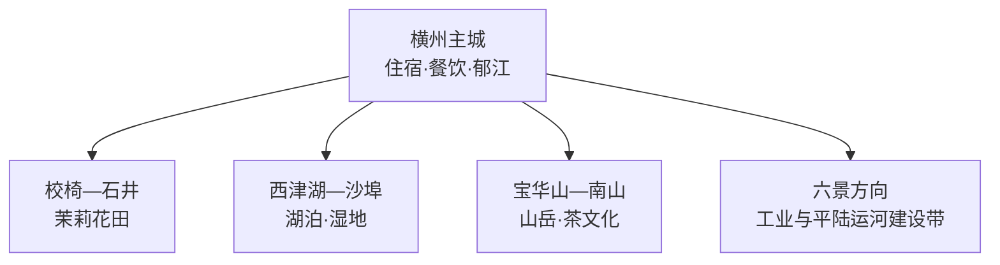
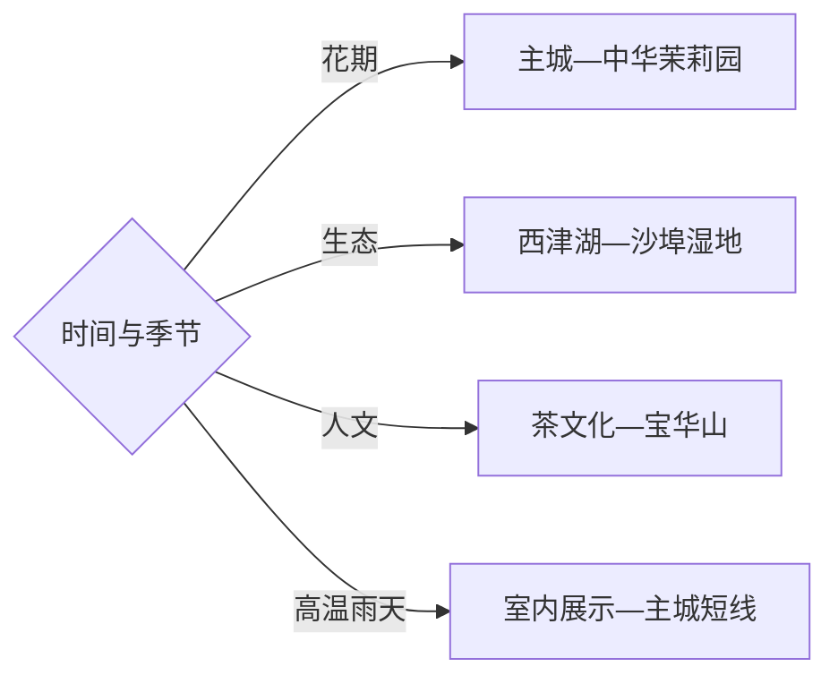

# 横州旅行指南

横州位于郁江中游，以横州主城、世界茉莉花产业、校椅镇中华茉莉园、西津湖与湿地、宝华山和南山茶文化形成花、茶、江湖与山地组合。固定快照中的 **Heng / GeoNames 1808361** 对应原横县县城、现横州市主城；南宁主城、宾阳与贵港均是市界外旅行单元。

> 建议停留：2–3 天\
> 旅行关键词：茉莉花、花茶、郁江、西津湖、鱼生\
> 主要体力：低至中等\
> 最近研究：2026-09-03

## 城市速览

| 项目 | 旅行信息 |
|---|---|
| 主要旅行价值 | 从花田、茶厂与博物展示理解茉莉花全产业链，再延伸到郁江与西津湖 |
| 建议停留 | 2天覆盖主城、茉莉花和西津湖；宝华山或乡村茶谷另加1天 |
| 较舒适季节 | 茉莉花期体验最集中；冬春温和，盛夏注意高温、暴雨与强对流 |
| 预算特点 | 主城成本温和，乡镇车辆、水上项目与节庆住宿是主要变量 |
| 步行强度 | 主城与花田较低；宝华山和部分湿地步道中等 |
| 主要天气风险 | 高温、暴雨、雷电、洪水、水位变化和山地湿滑 |
| 独行旅行 | 主城点餐方便，乡镇与湖区提前确认返程 |
| 亲子旅行 | 茉莉花展示、城市公园与湿地短线较合适 |
| 长者与低体力旅行 | 选择主城—茉莉园—西津湖观景短线 |
| 无障碍信息 | 城市公共空间相对平缓，花田、湿地和山地连续性需确认 |

## 城市格局与游览区域

| 区域 | 主要内容 | 游览特点 | 与其他区域的关系 |
|---|---|---|---|
| 横州主城 | 城市公园、郁江、餐饮与茉莉产业展示 | 平缓易游，适合抵离日 | 各方向交通基地 |
| 校椅—石井 | 中华茉莉园、花田与茶文化体验 | 花期和采摘时段影响体验 | 适合半日至一天 |
| 西津湖—沙埠 | 湖泊、湿地和水利景观 | 水位、天气与运营决定游法 | 与主城可组合 |
| 宝华山—南山 | 山地、茶文化与正式景区 | 需要公路接驳和一定步行 | 单列半日至一天 |

## 主要景点

| 景点 | 区域 | 类型 | 主要看点 | 建议用时 | 室内外 | 体力 | 预约风险 | 天气影响 | 优先级 |
|---|---|---|---|---:|---|---|---|---|---|
| 中华茉莉园景区 | 校椅镇石井村 | 农业与花文化 | 连片茉莉花田、产业景观与季节体验 | 半天 | 室外 | 低 | 花期中 | 高 | A |
| 茉莉花茶文化展示场馆 | 主城或产业园 | 博物展示 | 种植、窨制、贸易与品牌发展 | 1–2小时 | 室内 | 低 | 中 | 低 | A |
| 西津湖景区公开区 | 主城西部 | 湖泊与水利 | 湖面、水库环境与城市水利史 | 半天 | 室外 | 低中 | 水上项目中 | 高 | A |
| 西津国家湿地公园沙埠景区 | 莲塘方向 | 湿地 | 湿地生态、鸟类与公共步道 | 2–3小时 | 室外 | 低中 | 中 | 高 | B |
| 宝华山风景区公开区 | 南山方向 | 山岳与宗教 | 山林、寺观文化与登高 | 半天–1天 | 混合 | 中高 | 中 | 高 | B |
| 南山茶乡正规体验点 | 南山方向 | 茶文化与乡村 | 茶园、白毛茶与山地农业 | 半天 | 混合 | 低中 | 季节中 | 中 | B |
| 主城郁江公共岸线与公园 | 横州主城 | 城市公共空间 | 江城格局、日常生活与休息 | 1–2小时 | 室外 | 低 | 低 | 中 | B |

## 美食与餐饮

| 菜品或餐饮类型 | 常见区域 | 一个人用餐与常见份量 | 风味、过敏原与饮食限制 | 排队风险与替代方法 |
|---|---|---|---|---|
| 横州鱼生 | 主城正规餐馆 | 适合多人分享，独行可选熟制鱼菜 | 生食有寄生虫与食品安全风险，按个人健康条件选择 | 优先卫生信息明确的餐馆，也可选择熟鱼替代 |
| 茉莉花茶与花香饮品 | 主城、校椅 | 单杯或品鉴装适合独行 | 咖啡因、糖和奶制品按需求选择 | 花节期间换正规茶店 |
| 木瓜丁与酱菜 | 主城市场、伴手礼店 | 小份易尝 | 盐、辣椒与添加物看标签 | 选择密封、标识完整产品 |
| 粉类与家常桂菜 | 主城 | 单碗方便 | 汤底、花生、猪肉与辣椒先确认 | 就近选择客流稳定的同类店 |
| 茉莉主题点心 | 景区与主城 | 单份友好 | 花香配料、蛋奶与糖按标签选择 | 节庆排队时改买正规包装产品 |

## 经典行程

### 一日经典路线

**路线**：茉莉花茶文化展示 → 主城午餐 → 中华茉莉园 → 主城郁江公共岸线

- **串联逻辑**：先理解产业，再到花田观察种植，最后回主城休息。
- **预约锚点**：展馆、茉莉园开放与花情。
- **休息安排**：主城午餐，花田正规服务点补水。
- **时间不足时**：删郁江散步，保留展示与花田。

### 两日城市路线

**第 1 天**：主城茉莉文化 → 中华茉莉园。\
**第 2 天**：西津湖 → 沙埠湿地公开步道。

- **串联逻辑**：花茶产业和湖泊湿地分日，降低跨方向移动。
- **预约锚点**：水上项目、湿地开放与车辆。
- **休息安排**：主城连住，湖区使用正规服务点。
- **时间不足时**：第二日只保留西津湖公开区。

### 三日深度路线

**第 1 天**：主城与茉莉文化。\
**第 2 天**：西津湖—沙埠。\
**第 3 天**：宝华山或南山茶乡。

- **串联逻辑**：产业、江湖生态和山地茶文化各占一天。
- **预约锚点**：第三日景区、茶旅接待和车辆。
- **休息安排**：以主城为固定住宿点。
- **时间不足时**：先删第三日，再收缩湿地段。

### 雨天路线

**路线**：茉莉花茶室内展示 → 正规茶馆品鉴 → 主城餐饮 → 雨势减弱后城市公园短线

- **适用条件**：普通降雨采用室内线；暴雨、雷电与洪水预警时减少临江临湖活动。
- **预约锚点**：展馆开放与茶文化体验。
- **休息安排**：主城室内空间。
- **时间不足时**：保留一个展示场馆与一顿正餐。

### 亲子或低体力路线

**亲子路线**：茉莉文化展示 → 中华茉莉园短线 → 主城。\
**低体力路线**：主城公园 → 茉莉文化展示 → 西津湖观景点。

- **减负方式**：亲子线避开正午高温；低体力线用车辆连接并选择平缓入口。
- **预约锚点**：花田接待、无障碍入口与车辆。
- **休息安排**：主城和游客服务点。
- **时间不足时**：两线都保留室内展示。

### 远郊一日路线

**路线**：主城 → 宝华山正式入口 → 公开步道 → 南山茶乡正规体验点 → 返回

- **适用条件**：适合天气稳定且已落实接驳的日期。
- **预约锚点**：景区、茶旅体验和最晚返程。
- **休息安排**：游客中心与正规茶旅点。
- **时间不足时**：整段删除，改中华茉莉园。

### 花期与节庆路线

**路线**：中华茉莉园 → 花茶制作或品鉴 → 主城节庆公开活动 → 夜间返回住宿

- **串联逻辑**：围绕采花时段和正式活动组织，避免在田间反复往返。
- **预约锚点**：花期、采摘接待、节庆场地与交通。
- **休息安排**：午后回室内避暑。
- **时间不足时**：保留花田与一项茶文化体验。

## 住宿区域

| 区域 | 优点 | 缺点 | 适合人群 | 交通特点 |
|---|---|---|---|---|
| 横州主城 | 餐饮、住宿和车辆集中 | 前往花田与山地需接驳 | 首访、独行与公共交通旅行者 | 各方向共同基地 |
| 校椅正规乡村住宿 | 靠近花田和清晨花事 | 选择与夜间交通较少 | 花期摄影和深度茶旅 | 确认具体村庄与接送 |
| 西津湖周边正规住宿 | 适合湖区慢游 | 水位和项目运营影响体验 | 生态与休闲旅行者 | 确认入口、返程和水上规则 |

## 市内交通

| 场景 | 建议与取舍 | 行前需要重查的内容 |
|---|---|---|
| 从南宁等地抵达 | 公路客运或自驾先到横州主城 | 班次、到达站、末班与施工 |
| 前往校椅 | 公交、出租或包车按花田具体入口选择 | 花期专线、返程与停车 |
| 西津湖和湿地 | 按正式景区入口进入，水上活动选持证运营方 | 水位、航线、天气与停航 |
| 自驾 | 乡镇线更灵活，高温雨季预留道路冗余 | 道路、停车、暴雨和临时管制 |

## 不同旅行者须知

| 旅行维度 | 可行条件 | 主要取舍 | 需额外核对 |
|---|---|---|---|
| 独行旅行 | 主城方便 | 乡镇返程选择有限 | 接驳和最晚班次 |
| 亲子旅行 | 花文化与湿地短线直观 | 高温、蚊虫与临水空间需照看 | 儿童活动和防护 |
| 长者或低体力旅行 | 主城与观景短线平缓 | 宝华山爬升较多 | 接驳和休息点 |
| 无障碍需求 | 优先城市公园和室内展示 | 农田、湿地与山地连续性有限 | 无障碍入口和卫生间 |
| 摄影旅行 | 花田、郁江与湖泊题材丰富 | 花期人流和强光明显 | 航拍、三脚架与花田规则 |
| 预算有限 | 主城公共空间成本低 | 乡镇车辆增加支出 | 公交、拼车合规性和退改 |
| 晚出发或紧凑行程 | 主城茉莉文化半日线可行 | 湖区和山地不宜压缩 | 展馆最晚入场和返程 |
| 特殊天气或自然条件 | 室内茶文化线易调整 | 暴雨、洪水和高温影响花田与水域 | 气象、水利和景区公告 |

花田和茶园按经营主体划定的参观、采摘与摄影区域进入；郁江航道、西津水库坝区、湿地核心保育区、平陆运河施工区、工业园与农业生产区保留明确限制。

## 行前核对

| 核对事项 | 为什么需要重查 | 建议核对时间 | 官方入口 |
|---|---|---|---|
| 茉莉园、花期与节庆 | 花情、采摘和活动日程变化快 | 出发前一周及当天 | [广西农业农村厅](https://nynct.gxzf.gov.cn/) |
| 西津湖与湿地 | 水位、航线和步道维护影响游览 | 出发前三日及当天 | [广西文化和旅游厅](https://wlt.gxzf.gov.cn/) |
| 乡镇交通 | 班次、停车和返程决定可执行范围 | 出发前及当天 | [横州市人民政府](http://www.hengzhou.gov.cn/) |
| 天气、水情和施工 | 暴雨、洪水与工程管理会改变水域边界 | 出发前三日及当天 | [广西气象局](http://gx.cma.gov.cn/) |

## 来源与更新记录

### 主要来源

| 来源 | 类型 | 支持内容 | 核验日期 |
|---|---|---|---|
| [广西文旅厅：A级景区名录](https://wlt.gxzf.gov.cn/ztzl/rdjj/gxajlyjq/t19045601.shtml) | 政府 | 中华茉莉园、西津湖与沙埠湿地属性 | 2026-09-03 |
| [南宁国际旅游消费中心城市规划](https://wlt.gxzf.gov.cn/zfxxgk/fdzdgknr/ghjh/zcqgh/P020260402610317646336.pdf) | 政府规划 | 茉莉花农文旅、西津湖、茶谷与乡村格局 | 2026-09-03 |
| [广西农业农村厅：横州茉莉花](https://nynct.gxzf.gov.cn/lssp/gzdt_85027/t16535818.shtml) | 政府 | 茉莉花产业、花茶与文旅延伸 | 2026-09-03 |
| [GeoNames 1808361](https://www.geonames.org/1808361/) | 开放数据 | Heng 固定人口点、坐标与行政代码 | 2026-09-03 |

### 更新记录

| 日期 | 更新内容 |
|---|---|
| 2026-09-03 | 首次完成资料研究、花江湖山空间拆分、七条路线与县级市映射 |
