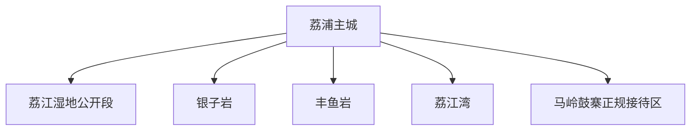
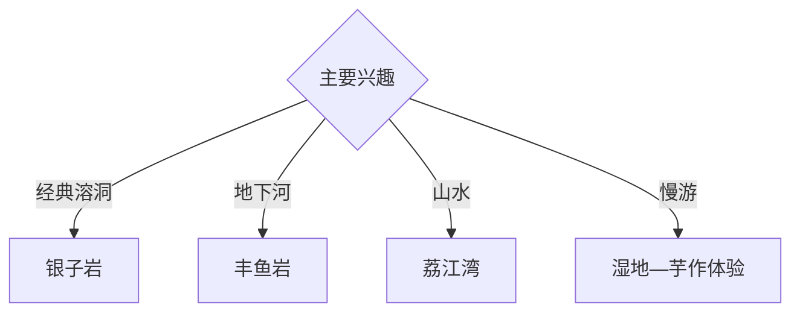

# 荔浦旅行指南

荔浦位于桂林南部，以银子岩、丰鱼岩、荔江湾、荔江湿地与荔浦芋产业组成喀斯特洞穴、河湾和乡村饮食路线。固定快照中的 **Lipu / GeoNames 1803790** 对应荔浦主城；各洞穴和河湾分处不同乡镇，适合按方向分日。

## 城市速览

| 项目 | 信息 |
|---|---|
| 主线 | 银子岩—丰鱼岩—荔江湾—湿地—荔浦芋 |
| 停留 | 主城1天；每个洞穴或河湾方向另留半天至1天 |
| 住宿 | 主城便于换线；景区周边选择正规接待 |
| 交通 | 公路进入，乡镇景区以合规车辆衔接 |
| 季节 | 春秋舒适；雨季核对洞穴、河流与山路 |
| 预算 | 景区门票、游船、车辆和餐饮体验是主要增量 |

## 城市格局与游览区域

主城承担住宿和公路换乘；银子岩、丰鱼岩与荔江湾是不同景区单元，湿地和乡村路线另按公开入口组织。洞穴地质遗迹、河道、湿地核心范围、果园农田和食品加工区分别按保护、运营与生产边界进入。

## 主要景点

| 景点 | 区域 | 类型 | 核心体验 | 用时 | 环境 | 体力 | 研究价值 | 拥挤 | 优先级 |
|---|---|---|---|---:|---|---|---|---|---|
| 银子岩旅游度假区 | 马岭方向 | 溶洞与地质 | 钟乳石、地下空间与喀斯特 | 半天 | 洞内 | 中 | 很高 | 节假日高 | A |
| 丰鱼岩旅游度假区 | 龙怀方向 | 溶洞与暗河 | 洞穴、地下河与地质景观 | 半天 | 洞内 | 中 | 很高 | 节假日中 | A |
| 荔江湾景区 | 青山方向 | 河湾与喀斯特 | 山水河湾、游船与岸线 | 半天 | 混合 | 中 | 高 | 旺季中 | A |
| 荔江国家湿地公园公开段 | 主城周边 | 湿地与生态 | 河流湿地、栈道与鸟类观察 | 2–3小时 | 室外 | 低 | 高 | 周末中 | B |
| 马岭鼓寨正规游览区 | 马岭 | 民俗与村寨 | 地方民俗、鼓文化与乡村景观 | 半天 | 混合 | 低 | 中高 | 节庆中 | B |
| 鹅翎寺公开区 | 主城南侧 | 宗教与建筑 | 地方寺院与城市南部地标 | 1–2小时 | 混合 | 低中 | 中 | 节日中 | B |
| 荔浦芋正规农业体验点 | 乡镇 | 农业与饮食 | 芋作种植、加工和地方菜 | 半天 | 混合 | 低 | 高 | 收获季中 | B |

## 美食与餐饮

荔浦芋扣肉是主线，也可体验马蹄、砂糖橘、米粉和桂北家常菜。农业采摘和加工参观选择明确接待的经营主体，洞穴长线前准备饮水并在主城完成主要补给。

## 经典行程

### 银子岩半日线
**路线**：主城—银子岩正式入口—洞内开放游线—返程。**逻辑**：用半天集中理解喀斯特洞穴。**预约锚点**：景区开放与分时入园。**休息**：游客中心。**删除条件**：强降雨或洞内维护时顺延。

### 丰鱼岩半日线
**路线**：主城—丰鱼岩—开放洞穴与暗河项目—返城。**逻辑**：突出地下河与洞穴组合。**预约锚点**：水位、项目运行和交通。**休息**：景区服务区。**删除条件**：高水位或项目停运时只游开放陆路段。

### 荔江湾山水线
**路线**：主城—荔江湾—正规游船或岸线—返城。**逻辑**：把河湾山水单列半天。**预约锚点**：水情、船班和开放。**休息**：景区服务区。**删除条件**：暴雨、洪水或大风时改主城。

### 湿地慢游线
**路线**：荔江湿地公开段—滨江步道—主城餐饮。**逻辑**：以低体力观察城市与河流。**预约锚点**：湿地开放和天气。**休息**：主城。**删除条件**：岸线积水或维护时缩短步行。

### 民俗乡村线
**路线**：主城—马岭鼓寨正规接待区—乡村餐饮—返程。**逻辑**：把民俗体验与社区接待结合。**预约锚点**：活动与接待时间。**休息**：正规接待点。**删除条件**：暂停接待时改芋作体验。

### 荔浦芋寻味线
**路线**：主城市场—正规农业展示点—芋头主题餐饮。**逻辑**：从农产品到地方菜理解产业。**预约锚点**：季节和经营主体。**休息**：主城。**删除条件**：非收获季保留餐饮与展销。

### 三日组合线
**路线**：首日银子岩与主城；次日丰鱼岩；第三日荔江湾或湿地乡村。**逻辑**：洞穴、河湾和城市分线。**预约锚点**：水情与景区开放。**休息**：主城连续住宿。**删除条件**：两天时删第三日。

## 住宿区域

主城适合连续住宿和各方向换乘，靠近公路客运及餐饮更便于早出。景区周边住宿核对资质、消防、停车与夜间返程；乡村接待以公开经营区域为活动范围。

## 市内交通

荔浦以公路交通为主，班次和停靠点以出发日信息为准。银子岩、丰鱼岩、荔江湾分属不同方向，组合时保留换线时间；雨季按积水、落石、河流水位和临时管制调整。

## 不同旅行者须知

地质旅行者可分两天比较银子岩与丰鱼岩；亲子与长者选择一处洞穴加湿地；美食旅行者加入芋作体验；摄影者按水情选择荔江湾。洞穴未开放支洞、地下河作业区、湿地核心区、河道、农田果园、食品车间和居民住宅保留明确限制。

## 行前核对

- 核对银子岩、丰鱼岩、荔江湾与湿地开放。
- 核对洞穴水位、游船运行、暴雨和道路信息。
- 核对正规车辆、乡村接待与农业体验时段。
- 核对防滑鞋、洞内保暖与个人饮食需求。

## 来源与更新记录

| 来源 | 支持内容 | 核验日期 |
|---|---|---|
| [广西文旅厅：4A级旅游景区一览表](https://wlt.gxzf.gov.cn/ztzl/rdjj/gxajlyjq/t19045600.shtml) | 银子岩、丰鱼岩与荔江湾景区及属地 | 2026-09-03 |
| [广西交通运输厅：乡村道路与荔浦旅游](https://jtt.gxzf.gov.cn/zfxxgk/fdzdgk/zcfg/zcjd/t12824468.shtml) | 景区、乡村、农业和道路关系 | 2026-09-03 |
| [GeoNames 1803790](https://www.geonames.org/1803790/) | Lipu 固定人口点与荔浦主城位置 | 2026-09-03 |
