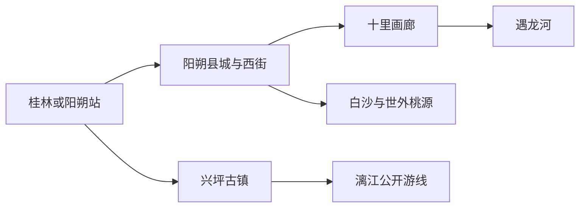
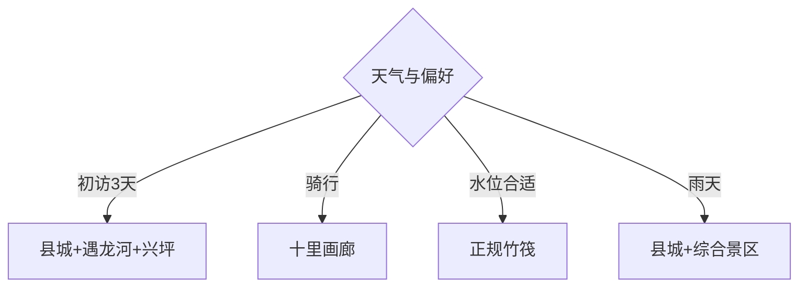

# 阳朔旅行指南

阳朔的旅行价值来自喀斯特山水与村镇生活，而不只是一条西街。第一次来可用3天覆盖县城、遇龙河、十里画廊和兴坪；竹筏、骑行、攀岩与相公山日出都受天气和运营规则影响，先锁定核心项目，再补自由步行。

## 城市速览

| 项目 | 信息 |
|---|---|
| 主线 | 阳朔县城—西街—十里画廊—遇龙河—兴坪—漓江 |
| 停留 | 县城半日；山水基础3天，增加村镇与户外共4—5天 |
| 住宿 | 县城便利；遇龙河适合田园慢住；兴坪适合漓江晨昏 |
| 交通 | 桂林、阳朔站或公路进入，县内用公交、景区接驳、骑行和合规车辆 |
| 风险 | 漓江与遇龙河水情、骑行混行、攀岩资质、暑热雷雨和旺季拥堵 |
| 边界 | 河道、码头、攀岩线路、洞穴、耕地与村居民宅按正式开放和社区边界进入 |

## 城市格局与游览区域

固定 **Yangshuo / GeoNames 1787323** 对应桂林市阳朔县，本页以实体 `Q31358` 锁定县域。阳朔站实际靠近兴坪，县城与高铁站需要接驳；遇龙河、十里画廊可组合，兴坪和漓江宜另留一天，避免在同一天横跨县域。

## 主要景点

| 景点 | 区域 | 类型 | 核心体验 | 用时 | 环境 | 体力 | 研究价值 | 拥挤 | 优先级 |
|---|---|---|---|---:|---|---|---|---|---|
| 遇龙河正式漂游与步道 | 白沙—高田 | 河谷景观 | 竹筏、田园、峰林与沿河慢行 | 半日至1天 | 室外 | 中 | 很高 | 旺季很高 | A |
| 十里画廊公共廊道 | 高田方向 | 山水廊道 | 骑行、峰林、村庄与月亮山外观 | 半日至1天 | 室外 | 中 | 很高 | 旺季高 | A |
| 兴坪古镇公共街区 | 兴坪镇 | 历史村镇 | 漓江码头、老街与山水聚落 | 半日 | 室外 | 中 | 高 | 旺季高 | A |
| 漓江阳朔段正规游船或竹筏 | 兴坪等码头 | 河流景观 | 峰林倒影与经典江段 | 半日 | 室外 | 低中 | 很高 | 旺季很高 | A |
| 阳朔西街 | 县城 | 商业历史街区 | 城市夜间、餐饮与跨文化旅游史 | 2–4小时 | 室外 | 低 | 高 | 夜间很高 | B |
| 世外桃源旅游区 | 白沙镇 | 综合景区 | 水路、田园与民俗展示 | 2–4小时 | 混合 | 低中 | 中 | 团队时高 | B |
| 阳朔公园与山水园 | 县城 | 城市公园 | 县城峰林、碑刻与短程登高 | 2–4小时 | 室外 | 中 | 高 | 中 | B |
| 正规攀岩体验点 | 县域岩场 | 户外运动 | 喀斯特岩壁与技术体验 | 半日 | 室外 | 高 | 高 | 季节高 | C |

## 美食与餐饮

县城与兴坪可选啤酒鱼、桂林米粉、酿菜、荔浦芋扣肉和油茶。啤酒鱼通常按鱼种和重量计价，点餐前确认活鱼、单价、加工方式与总重量；西街适合多样餐饮，县城外围和乡镇更方便体验日常米粉与家常菜。

## 经典行程

### 三日基础线
**路线**：县城西街—遇龙河与十里画廊—兴坪与漓江。**逻辑**：每一天集中一片区域。**预约锚点**：竹筏、游船、接驳与住宿。**休息**：县城或换宿兴坪。**删除条件**：水运停航时改沿河步道与古镇。

### 遇龙河慢游线
**路线**：正规码头—开放漂游段—沿河步道—村镇。**逻辑**：水上与陆上各看一次河谷。**预约锚点**：筏段、实名、身高年龄与水情。**休息**：码头服务区。**删除条件**：涨水、雷雨或停航时只走公开步道。

### 十里画廊骑行线
**路线**：县城—十里画廊—月亮山外观—高田返程。**逻辑**：用慢交通观察峰林。**预约锚点**：车辆状态、头盔与返程。**休息**：沿线正规服务点。**删除条件**：暴雨、高温或道路拥堵时改接驳车。

### 兴坪漓江线
**路线**：兴坪老街—正规码头—漓江游线—古镇。**逻辑**：把码头史与河流景观结合。**预约锚点**：船筏、班车和末班接驳。**休息**：兴坪镇。**删除条件**：封航或浓雾时留古镇与陆上观景。

### 县城人文线
**路线**：阳朔公园—山水园—西街日间—夜间短逛。**逻辑**：从碑刻与县城山水读到旅游街区。**预约锚点**：场馆与演出。**休息**：县城。**删除条件**：夜间客流过高时提前返回。

### 攀岩体验线
**路线**：持证机构集合—安全讲解—适级岩线—复盘。**逻辑**：让专业向导匹配能力与装备。**预约锚点**：资质、保险、头盔与天气。**休息**：岩场安全区。**删除条件**：雨后岩湿、雷电或装备不合格时取消。

### 低体力线
**路线**：车辆到遇龙河正式观景点—短段步道—县城公园—西街早段。**逻辑**：以车辆、水景和平路替代骑行登高。**预约锚点**：落客点、船筏限制与无障碍。**休息**：游客中心。**删除条件**：高温或大雨时转室内餐饮与休息。

## 住宿区域

县城适合餐饮、夜间与多方向接驳；遇龙河沿线适合田园环境和清晨，但需确认进出车辆；兴坪适合漓江晨昏与高铁站。订房时核对噪声、台阶、接送、早餐、旺季退改和从主路到住宿的实际距离。

## 市内交通

阳朔站位于兴坪附近，从高铁站到县城需预留接驳时间。县城与十里画廊有公交和景区交通，遇龙河不同码头并非同一地点；下单竹筏或车辆时确认起终点。骑行选择合适车辆、佩戴头盔并避开夜间车流。

## 不同旅行者须知

初访者优先遇龙河、兴坪与十里画廊；摄影者按晨雾、日落和水位安排；亲子家庭先核对竹筏年龄身高限制；长者选择游船、车辆和短步道；户外旅行者通过正规机构攀岩。河道非运营段、未授权岩壁、野洞、农田作业区和居民院落保留明确限制。

## 行前核对

- 核对遇龙河各筏段、漓江船筏、景区、演出和高铁接驳的当日开放与起终点。
- 核对水位、雷雨、高温、骑行路况、客流和县城至阳朔站的返程时间。
- 攀岩选持证机构与适级线路，水上项目穿救生装备，乡村和农田从公共道路游览。

## 来源与更新记录

| 来源 | 支持内容 | 核验日期 |
|---|---|---|
| [广西自然资源厅：阳朔户外运动与乡村规划](https://dnr.gxzf.gov.cn/xwzx/sxdt/t26746962.shtml) | 高田、遇龙河、骑行与户外运动空间 | 2026-09-01 |
| [广西自然资源厅：遇龙河地质景观保护](https://dnr.gxzf.gov.cn/xwzx/zrzx/t16042301.shtml) | 遇龙河喀斯特地质景观与保护 | 2026-09-01 |
| [GeoNames 1787323](https://www.geonames.org/1787323/) | Yangshuo 固定人口点及坐标 | 2026-09-01 |
| [Wikidata Q31358](https://www.wikidata.org/wiki/Q31358) | 阳朔县实体与跨库标识 | 2026-09-01 |

| 日期 | 更新 |
|---|---|
| 2026-09-01 | 首次完成阳朔旅行研究，按县城、遇龙河、十里画廊和兴坪漓江组织。 |
