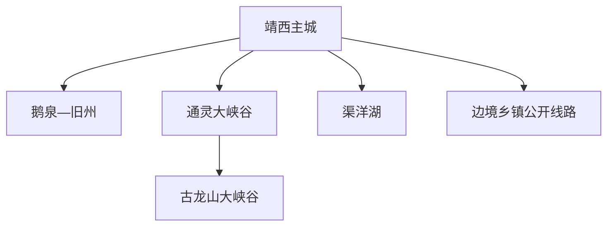
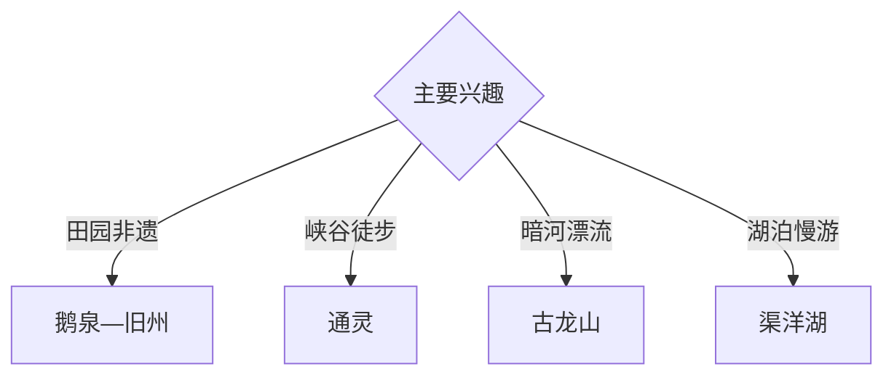

# 靖西旅行指南

靖西位于桂西南边境，以鹅泉、旧州、通灵大峡谷、古龙山大峡谷、渠洋湖和壮族绣球文化构成山水边城路线。固定快照中的 **Jingxi / GeoNames 1788772** 对应靖西主城；边境、峡谷、暗河和湖泊各有独立管理边界。

## 城市速览

| 项目 | 信息 |
|---|---|
| 主线 | 鹅泉—旧州—通灵—古龙山—渠洋湖 |
| 停留 | 主城与鹅泉1天；峡谷1天；渠洋湖另留半天至1天 |
| 住宿 | 主城便于分线，旧州等地选择正规民宿 |
| 交通 | 铁路、公路进入，峡谷和湖区需景区接驳 |
| 季节 | 春夏水景充沛；雨季重点核对峡谷和漂流 |
| 预算 | 景区门票、漂流、车辆与边境路线冗余增加预算 |

## 城市格局与游览区域

主城承担住宿、铁路和补给；鹅泉与旧州可组合，通灵与古龙山相近但各自有票务和游线，渠洋湖位于另一方向。国境线、口岸通道、自然保护范围、峡谷暗河、漂流河段和村寨生活空间分别遵循当期管理。

## 主要景点

| 景点 | 区域 | 类型 | 核心体验 | 用时 | 环境 | 体力 | 研究价值 | 拥挤 | 优先级 |
|---|---|---|---|---:|---|---|---|---|---|
| 鹅泉景区 | 新靖周边 | 泉水与田园 | 泉眼、古桥、稻田与壮乡景观 | 半天 | 室外 | 低 | 很高 | 节假日高 | A |
| 旧州景区 | 旧州 | 古镇与非遗 | 绣球、壮族民居与山水田园 | 半天 | 混合 | 低 | 很高 | 节假日高 | A |
| 通灵大峡谷 | 湖润方向 | 峡谷与瀑布 | 瀑布、峡谷森林和溶洞 | 半天至1天 | 室外 | 高 | 很高 | 旺季高 | A |
| 古龙山大峡谷 | 湖润方向 | 峡谷与暗河 | 峡谷、暗河与正规漂流项目 | 半天至1天 | 混合 | 高 | 很高 | 旺季高 | A |
| 渠洋湖景区 | 渠洋方向 | 湖泊与峰林 | 喀斯特峰林、湖面与壮寨 | 半天 | 室外 | 低中 | 高 | 旺季中 | B |
| 龙潭湿地公园公开段 | 主城 | 湿地与城市 | 城市休闲、湿地和喀斯特水系 | 2小时 | 室外 | 低 | 中高 | 傍晚中 | B |
| 锦绣古镇公开区 | 主城周边 | 街区与夜游 | 壮族文化展示与夜间休闲 | 2–3小时 | 混合 | 低 | 中 | 夜间中 | B |

## 美食与餐饮

大香糯粽、卷筒粉、米饺、五色糯米饭、黄皮果焖鸭和壮乡家常菜适合在主城与正规村寨接待点体验。峡谷日提前准备饮水和防水收纳，漂流后安排热食与换装。

## 经典行程

### 鹅泉旧州线
**路线**：主城—鹅泉—旧州公开街区—返城。**逻辑**：组合泉水田园与绣球非遗。**预约锚点**：两处开放与活动。**休息**：旧州正规接待点。**删除条件**：高水位时缩短临水段。

### 通灵峡谷线
**路线**：主城—通灵正式入口—开放步道—瀑布观景—返程。**逻辑**：以完整半天至一天承接峡谷徒步。**预约锚点**：景区、天气和步道。**休息**：游客中心。**删除条件**：暴雨、山洪或落石预警时取消。

### 古龙山漂流线
**路线**：主城—古龙山—安全说明—正规漂流或陆路游线—返程。**逻辑**：把水上项目单独安排。**预约锚点**：水位、项目运行和年龄健康要求。**休息**：景区服务区。**删除条件**：项目停运时选择开放陆路段或改鹅泉。

### 双峡谷观察线
**路线**：通灵公开核心段—古龙山非漂流短线—返城。**逻辑**：适合只做地貌观察的旅行者。**预约锚点**：两景区入园时段。**休息**：两景区游客中心。**删除条件**：时间紧时只选一处。

### 渠洋湖慢游线
**路线**：主城—渠洋湖正规入口—开放岸线或合规船只—返城。**逻辑**：以低强度观察峰林湖泊。**预约锚点**：水情、船务与天气。**休息**：正规服务点。**删除条件**：大风、暴雨或航行管制时改主城。

### 主城适应线
**路线**：龙潭湿地公开段—公共文化空间—锦绣古镇夜游。**逻辑**：用到离日认识边城水系与壮族文化。**预约锚点**：场馆和街区活动。**休息**：主城。**删除条件**：强对流时保留室内段。

### 三日组合线
**路线**：首日鹅泉与旧州；次日通灵或古龙山；第三日渠洋湖与主城。**逻辑**：田园、峡谷和湖泊分日。**预约锚点**：峡谷天气与项目。**休息**：主城连续住宿。**删除条件**：两天时删渠洋湖。

## 住宿区域

主城便于铁路到发、餐饮与不同方向换线；旧州等景区周边适合慢游，选择资质、消防和停车清晰的正规民宿。边境乡镇住宿同时核对证件、交通、通信和当期管理要求。

## 市内交通

靖西站和公路客运连接主城，班次以出发日信息为准。鹅泉—旧州、通灵—古龙山、渠洋湖分为三组方向；雨季把峡谷水位、山路落石和项目停运纳入计划，边境公路按检查与绕行留余量。

## 不同旅行者须知

非遗旅行者给旧州充足时间；亲子与长者选择鹅泉、旧州和渠洋湖；徒步者选择通灵；水上项目参与者按景区健康条件选择古龙山。国境线附近、口岸作业区、界河、峡谷封闭段、暗河非运营区域、湿地核心区、居民住宅和农田保留明确限制。

## 行前核对

- 核对鹅泉、旧州、通灵、古龙山和渠洋湖开放。
- 核对峡谷降雨、水位、漂流条件和装备要求。
- 核对边境证件、摄影、无人机与道路管理。
- 核对正规车辆、民宿资质和返程时间。

## 来源与更新记录

| 来源 | 支持内容 | 核验日期 |
|---|---|---|
| [文化和旅游部：山水边城锦绣靖西线路](https://zhuanti.mct.gov.cn/rxhmxjgn2022/beijing/detail_g7yU_506/3463.html) | 通灵、古龙山、旧州、鹅泉、渠洋湖与交通组合 | 2026-09-03 |
| [广西文旅厅：2025年A级景区操作指引](https://wlt.gxzf.gov.cn/zfxxgk/wjzl/btjzcwj/t19719409.shtml) | 靖西主要A级景区及属地 | 2026-09-03 |
| [GeoNames 1788772](https://www.geonames.org/1788772/) | Jingxi 固定人口点与靖西主城位置 | 2026-09-03 |
