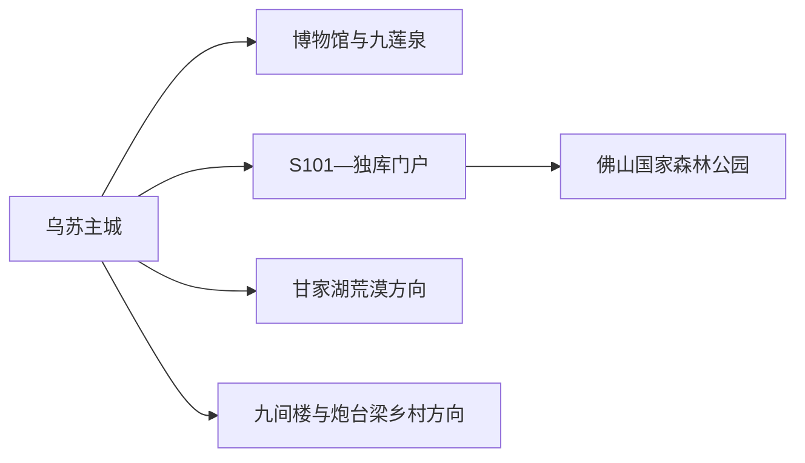
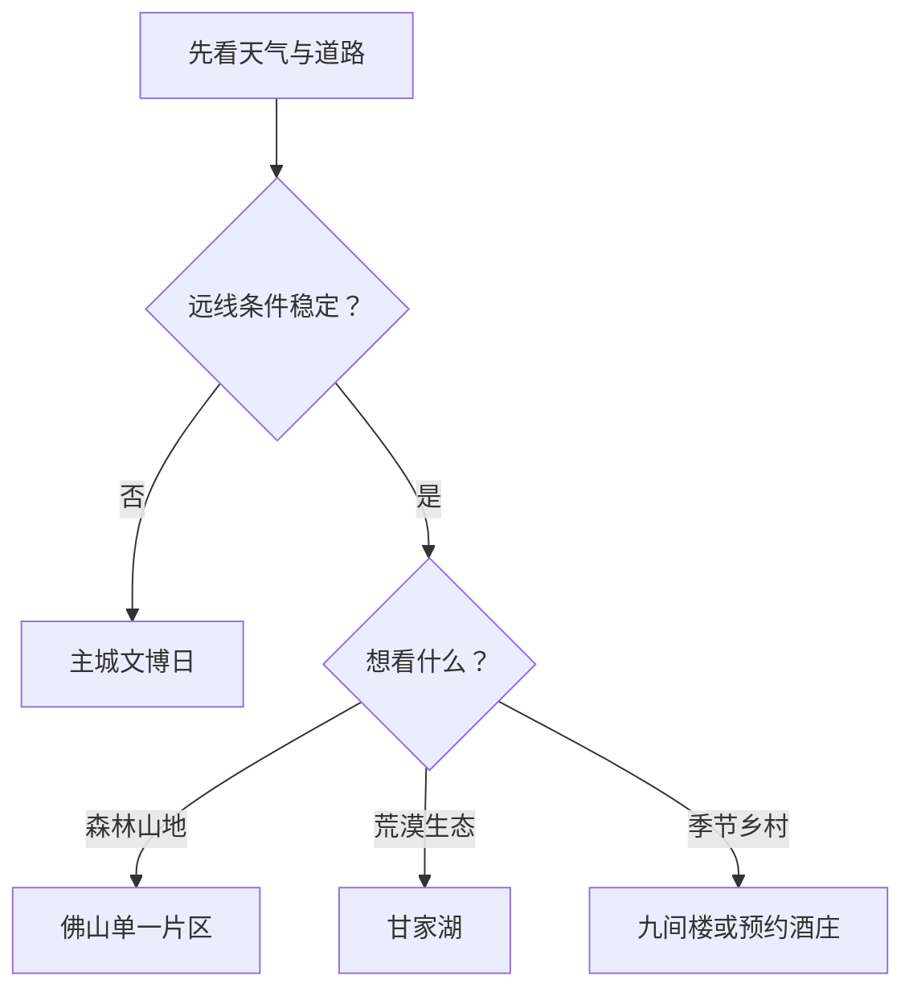

# 乌苏旅行指南

乌苏位于天山北麓、准噶尔盆地西南缘。最实用的安排是把主城文博与城市公园作为抵离日，把佛山国家森林公园、甘家湖荒漠和 S101—独库公路交会方向分别作为整日远线。先确认景区开放、道路和返程，再从山地、荒漠、乡村三个主题中选一个，体验会比在一天内追逐多个坐标更完整。

## 城市速览

| 项目 | 信息 |
|---|---|
| 旅行主线 | 乌苏市博物馆、九莲泉公园、佛山国家森林公园、甘家湖荒漠、S101 与独库公路门户 |
| 建议停留 | 1 天主城；2 天加入一条山地或荒漠远线；3 天可再选一个不同方向 |
| 住宿基地 | 乌苏主城；山地日仍优先当天往返，只有正规项目明确接待时才在景区附近住宿 |
| 步行强度 | 主城低至中；森林、峡谷和荒漠中高，车辆接驳距离长 |
| 主要天气 | 大风、沙尘、雷暴、山洪、降雪结冰、昼夜温差与森林火险 |
| 自驾重点 | 同一天只走一条远线，核对加油、通信、封路、返程天黑时间与备用方案 |
| 亲子 | 博物馆、九莲泉和有游客中心的短线较易组合 |
| 低体力 | 主城半日最稳定；远线选择可乘车抵达、休息点明确的开放段 |
| 生态边界 | 荒漠植被、胡杨林、林场、牧场与水源地按保护和生产管理范围活动 |
| 无障碍 | 设施连续性需向官方确认，重点询问景区车、坡道、卫生间与落客点 |

## 城市格局与游览区域

乌苏市为塔城地区所辖县级市，法定代码 `654202`。固定 GeoNames `1529099` 是乌苏主城居民点，Wikidata `Q1023067` 代表法定乌苏市且 `P1566=1529099`；两者可以交叉核对城市名称与主城位置，市域边界仍以法定行政资料为准。奎屯市与克拉玛依市独山子区是相邻但独立的目的地，车程接近不改变行政和旅行所有权。

| 区域 | 旅行价值 | 怎么安排 |
|---|---|---|
| 乌苏主城 | 博物馆、公园、住宿、餐饮和补给 | 抵达日或雨雪替代日，半日至一日 |
| 佛山国家森林公园 | 待甫僧、巴音沟、乌兰萨德克等山地单元 | 按当期开放入口选择一个片区，完整一日 |
| S101—独库门户 | 乌苏驿、天山北坡公路景观与自驾服务 | 作为远线集散和补给节点，不以公路里程替代景区开放信息 |
| 甘家湖方向 | 荒漠生态、胡杨与科普 | 选择正式景区入口和开放游径，完整一日 |
| 九间楼—炮台梁 | 荷花季、乡村餐饮、酒庄与农业生产 | 花期或预约接待明确时专程前往，半日至一日 |

## 主要景点

### 主城与近郊

| 景点 | 所在区域 | 类型 | 核心看点 | 建议用时 | 室内/室外 | 体力 | 预约难度 | 天气敏感度 | 适合旅程 |
|---|---|---|---|---|---|---|---|---|---|
| 乌苏市博物馆 | 主城 | 地方史博物馆 | 城市历史、民族文化与当期展览 | 1.5–2.5 小时 | 室内 | 低 | 中 | 低 | A |
| 九莲泉水景公园 | 新区 | 城市公园、3A | 九莲泉地方记忆、绿地和城市休闲 | 1–2 小时 | 室外 | 低 | 低 | 中 | A |
| 乌苏驿旅游服务中心 | S101 与 G217 交会方向 | 自驾集散、路线节点 | 停车、卫生间、餐饮和自驾信息补给 | 0.5–1.5 小时 | 混合 | 低 | 低 | 高 | 路线节点 |

### 山地、荒漠与乡村

| 景点 | 所在区域 | 类型 | 核心看点 | 建议用时 | 室内/室外 | 体力 | 预约难度 | 天气敏感度 | 适合旅程 |
|---|---|---|---|---|---|---|---|---|---|
| 乌苏佛山国家森林公园 | 天山北坡 | 森林与山地、4A | 待甫僧等开放片区的松林、峡谷、草甸与游客服务 | 1 天 | 室外 | 中至高 | 高 | 极高 | A |
| 甘家湖沙漠公园 | 市域西北 | 荒漠生态、3A | 荒漠植被、内陆河环境与科普游径 | 1 天 | 室外 | 中 | 高 | 极高 | B |
| 九间楼乡荷花池景区 | 九间楼乡 | 季节乡村、3A | 盛夏荷花、乡村休闲与正规农家接待 | 3–5 小时 | 室外 | 低至中 | 中 | 高 | B |
| 沙舟酒庄 | 炮台梁方向 | 葡萄种植与工业旅游、3A | 有机葡萄与经预约开放的生产展示 | 2–3 小时 | 混合 | 低至中 | 高 | 中 | B |
| 泥火山景区 | 白杨沟镇 | 地质景观、3A | 活动泥火山群与地质科普 | 4–6 小时 | 室外 | 中至高 | 高 | 极高 | C |
| 乌拉斯台旅游景区 | 白杨沟镇 | 山地草原、3A | 天山北坡草场、季节花草与高地景观 | 4–6 小时 | 室外 | 中 | 高 | 极高 | C |

佛山国家森林公园由多个相距较远的片区组成，一天选一个正式入口。甘家湖、泥火山和乌拉斯台也分别核对道路、开放与返程。荒漠保护地、牧场、林场和生产葡萄园以标识、围栏和接待安排为边界。

## 美食与餐饮

| 类型 | 适合场景 | 份量 | 过敏与饮食提示 | 选择方法 |
|---|---|---|---|---|
| 乌苏八块鸡 | 正餐、多人分享 | 常为整鸡或大盘 | 禽肉、辣椒、花椒与小麦主食；问清是否带骨 | 按人数确认份量，也可点半份或小盘 |
| 抓饭、拌面与汤饭 | 主城简餐 | 多为一人份 | 小麦、羊肉、牛肉和动物油；素食需问汤底 | 选择菜单和价格清楚的社区餐馆 |
| 烤肉与大盘菜 | 晚餐 | 两人以上更合适 | 肉类、孜然、辣椒及共用烤具 | 先点小串和蔬菜，按食量追加 |
| 丰收季瓜果与葡萄 | 夏秋加餐 | 按重量购买 | 高糖、果核和清洗条件 | 在正规市场少量购买，确认产地与价格 |
| 包装啤酒与酒庄产品 | 伴手礼或成年人体验 | 按包装规格 | 酒精、麸质与驾驶安全 | 查看标签、生产者和储存条件；自驾当天由不饮酒者驾驶 |

## 经典行程

### 一日经典路线

**路线**：乌苏市博物馆 → 主城午餐 → 九莲泉水景公园 → 主城晚餐

- **串联逻辑**：先建立地方历史背景，再用城市公园观察当代乌苏。
- **预约锚点**：博物馆开馆、实名要求和临展；公园活动或施工公告。
- **休息安排**：博物馆观众区、主城餐馆和公园正式座椅。
- **时间不足时**：保留博物馆与一顿本地餐，九莲泉缩短为散步。

### 两日城市与森林路线

**第 1 天**：博物馆 → 九莲泉 → 主城住宿 
**第 2 天**：主城 → 乌苏驿补给 → 佛山国家森林公园当期开放片区 → 返回

- **串联逻辑**：第一天完成城市认识，第二天集中处理山地交通与体力。
- **预约锚点**：森林公园入口、景区车、演出或活动、道路和返程车辆。
- **休息安排**：第二天使用乌苏驿和景区游客服务设施，午后预留缓冲。
- **时间不足时**：第二天只走短游径与观景段，按原路返程。

### 三日深度路线

**第 1 天**：主城文博与公园 
**第 2 天**：佛山国家森林公园 
**第 3 天**：甘家湖沙漠公园 **或** 九间楼—炮台梁乡村线

- **串联逻辑**：把城市、天山山地和荒漠或农业景观分成三个完整主题。
- **预约锚点**：第三天景区接待、花期、酒庄预约、车辆和通信条件。
- **休息安排**：每天返回主城；远线在正式服务区安排午餐和卫生间。
- **时间不足时**：第三天优先删去更远或信息更不稳定的方向。

### 雨雪与大风替代路线

**路线**：乌苏市博物馆 → 主城室内午餐 → 经确认开放的公共文化活动 → 早点返回住宿

- **适用条件**：城市道路和场馆正常开放的普通降雨或低温日。
- **串联逻辑**：活动集中在主城，减少公路、山口和荒漠暴露。
- **预约锚点**：场馆临时闭馆、公交、道路积雪和预警等级。
- **休息安排**：全程使用室内场馆、餐馆和住宿。
- **时间不足时**：只保留博物馆，其他时间用于调整后续远线。

### 亲子路线

**路线**：乌苏市博物馆 → 九莲泉短段 → 乌苏驿或主城用餐

- **适用条件**：场馆活动年龄、儿童卫生间和车辆安全条件已经确认。
- **串联逻辑**：用一座场馆、一段公园和一个服务节点控制移动量。
- **预约锚点**：亲子活动名额、推车寄存、儿童座椅与午休条件。
- **休息安排**：午间回餐馆或住宿，户外放在早晚。
- **时间不足时**：保留博物馆，公园只走近入口段。

### 低体力路线

**路线**：主城住宿 → 博物馆单馆 → 午间长休 → 九莲泉近入口短段

- **适用条件**：落客、台阶、座椅、轮椅借用和卫生间已逐处确认。
- **串联逻辑**：一天只设一个室内主项，公园作为可随时结束的补充。
- **预约锚点**：最近落客点、无障碍入口和返程车辆。
- **休息安排**：午间至少留两小时，随身准备饮水和防风保暖。
- **时间不足时**：只完成博物馆或九莲泉其中一项。

### 山地、荒漠或乡村主题路线

**路线**：乌苏主城 → 选定的单一景区入口 → 游客服务区 → 原路返回

- **适用条件**：只选佛山、甘家湖、泥火山、乌拉斯台或九间楼中的一个方向。
- **串联逻辑**：一条公路走廊对应一个主题，减少跨山地与荒漠折返。
- **预约锚点**：景区开放、道路、车辆、森林防火、通信和最晚返程。
- **休息安排**：在主城、乌苏驿或景区正式服务区停留。
- **时间不足时**：缩短景区内部游径，不临时换到另一条远线。

## 住宿区域

| 区域 | 优点 | 取舍 | 适合人群 | 交通提示 |
|---|---|---|---|---|
| 乌苏主城 | 餐饮、补给、铁路和道路接驳更集中 | 去各远线都要早出 | 首访、多日、自驾与公共交通旅行 | 订房时确认停车、早出早餐和夜间到达 |
| 乌苏站或客运节点周边 | 抵离方便 | 与博物馆、餐饮核心仍有末段距离 | 早晚车、短停与行李较多者 | 先核对票面站名和夜间车辆 |
| 正规山地或乡村接待点 | 接近日出、森林或季节活动 | 服务、医疗、通信和退改差异大 | 已锁定单一远线且接待方可确认者 | 询问供暖、热水、消防、餐食和返程 |

## 市内交通

乌苏站、客运站和主城之间用公交、出租或预约车辆连接。前往佛山、甘家湖、泥火山、乌拉斯台与乡村景区时，地图距离只是第一步，真正决定行程的是开放入口、道路等级、天气和返程。S101 与 G217 的交会带来良好自驾条件，也意味着节假日可能出现集中车流。

| 场景 | 怎么走 | 出发前确认 |
|---|---|---|
| 铁路抵达 | 按 12306 实际车次到乌苏站，再接主城住宿 | 票面站名、出站交通、末班和夜间接站 |
| 主城移动 | 公交加短程出租，博物馆与公园分段步行 | 开馆、道路施工、极端天气与行李寄存 |
| 佛山与 S101 方向 | 正规包车、自驾或当期旅游交通 | 景区入口、路况、加油、通信、返程天黑时间 |
| 甘家湖与白杨沟方向 | 车辆整日往返，保留备用时间 | 沙尘、山洪、森林火险、导航离线地图和救援联络 |
| 跨到奎屯或独山子 | 按跨城交通规划 | 到发点、返程班次、住宿和独立目的地边界 |

## 不同旅行者须知

| 旅行者 | 更合适的安排 | 重点核对 |
|---|---|---|
| 亲子家庭 | 博物馆、九莲泉、乌苏驿和有游客中心的短游径 | 儿童座椅、护栏、卫生间、饮水和防晒 |
| 长者或低体力 | 主城半日；远线只选车辆可近达的开放段 | 落客点、坡度、景区车、座椅和医疗联络 |
| 自驾旅行 | 每天一条远线，主城连住 | 加油、轮胎、通信、封路、疲劳驾驶和救援 |
| 摄影旅行 | 日出、山地和荒漠各自留足候光时间 | 无人机、边界、天气、防火与商业拍摄规则 |
| 冬季旅行 | 主城为基地，把山地路线设为天气允许时的可选项 | 降雪、结冰、日照、供暖和车辆冬季装备 |

## 行前核对

| 项目 | 为什么会变 | 何时核对 | 官方入口 |
|---|---|---|---|
| 博物馆 | 开馆、临展和团体活动会调整 | 前一日及当天 | [乌苏市博物馆开放信息](https://xjws.gov.cn/zwgk/zfxxgkml/zdly11wssrmzf/lyfw2025/content_12250) |
| 16 家 A 级景区 | 入口、票务、演出、交通和季节项目分别变化 | 订车前、前一日、当天 | [乌苏市 A 级景区名录](https://xjws.gov.cn/zwgk/zfxxgkml/zdly11wssrmzf/ggwhfw/content_12243) |
| S101、G217 与山地道路 | 车流、施工、降雪、山洪和封控影响通行 | 出发前三日滚动查看 | [乌苏市人民政府](https://www.xjws.gov.cn/)及新疆交通、交警公告 |
| 火险与荒漠保护 | 防火期和生态保护会改变开放边界 | 远线出发前 | 新疆林草、应急及景区公告 |
| 铁路 | 车次和停靠时刻动态变化 | 购票时、出发前一日 | [中国铁路 12306](https://www.12306.cn/) |
| 天气 | 山地与荒漠局地差异大 | 出发前三日及当天 | [中国气象局](https://www.cma.gov.cn/) |

## 来源与更新记录

| 来源 | 支持内容 | 核验日期 |
|---|---|---|
| [乌苏市人民政府](https://www.xjws.gov.cn/) | 市情、行政范围、公共服务与动态入口 | 2026-08-13 |
| [乌苏市 A 级景区名录](https://xjws.gov.cn/zwgk/zfxxgkml/zdly11wssrmzf/ggwhfw/content_12243) | 九莲泉、佛山、甘家湖、九间楼、酒庄、泥火山和乌拉斯台等景区身份与位置 | 2026-08-13 |
| [乌苏市博物馆开放信息](https://xjws.gov.cn/zwgk/zfxxgkml/zdly11wssrmzf/lyfw2025/content_12250) | 场馆名称、开馆与动态核对入口 | 2026-08-13 |
| [乌苏市国土空间总体规划](https://www.xjws.gov.cn/upload/main/infopublicity/publicinformation/file/2024/09/24/202409241954556361.pdf) | 主城公共文化、公园、客运和保护空间 | 2026-08-13 |
| [乌苏市政府工作报告：驿站文化与旅游环线](https://xjws.gov.cn/zwgk/zfxxgkml/zfgz11wssrmzf/content_8205) | S101—G217 沿线、待甫僧和乌苏驿站文化的旅行关系 | 2026-08-13 |
| [民政部行政区划代码服务](https://dmfw.mca.gov.cn/xzqh/getList?code=65&trimCode=true&maxLevel=3) | 乌苏市法定层级与代码 `654202` | 2026-08-13 |
| [GeoNames 1529099](https://www.geonames.org/1529099/wusu.html) | 固定城市点名称、坐标与要素分类 | 2026-08-13 |
| [Wikidata Q1023067](https://www.wikidata.org/wiki/Q1023067) | 法定城市实体、P1566 与行政代码交叉核对 | 2026-08-13 |
| [中国铁路 12306](https://www.12306.cn/) | 实时铁路车次与停靠 | 2026-08-13 |
| [中国气象局](https://www.cma.gov.cn/) | 天气预警入口 | 2026-08-13 |

| 日期 | 更新 |
|---|---|
| 2026-08-13 | 首次完成乌苏公众旅行指南；建立主城、佛山、甘家湖和乡村远线的选择框架，并说明道路、生态、生产与标识符边界。 |
