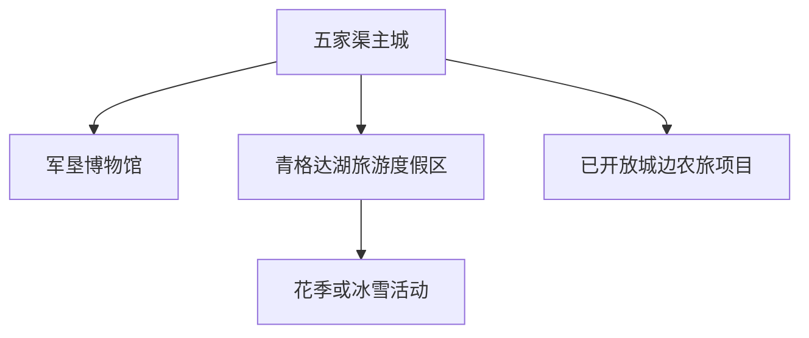
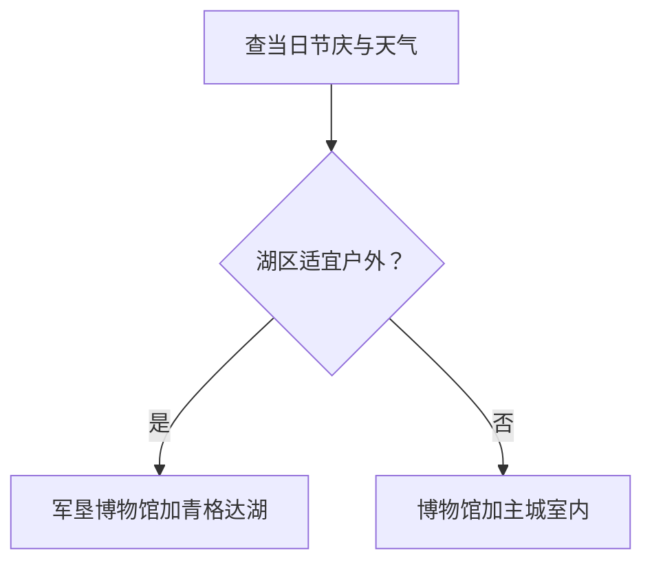

# 五家渠市旅行指南

五家渠的旅行主线很集中：青格达湖负责花季、湿地与冬季活动，军垦博物馆负责解释城市与第六师的建设历史。从乌鲁木齐或昌吉到访时，把这里当作一个可住宿的独立小城，而不是临时路过的花田，行程会更完整。

> 建议停留：1–2 天\
> 旅行关键词：军垦历史、青格达湖、花季、兵团城市\
> 主要体力：低至中等\
> 最近研究：2026-08-12

## 城市速览

| 项目 | 旅行信息 |
|---|---|
| 主要旅行价值 | 在青格达湖湿地与军垦博物馆之间，理解一座兵团城市如何因水、农垦与交通形成 |
| 建议停留 | 1 天完成军垦博物馆和青格达湖；2 天再按花季、冰雪或正式开放乡村项目补充 |
| 较舒适季节 | 春季花展、夏秋湖滨、冬季冰雪各有主题；准确日期按当年公告 |
| 预算特点 | 城区食宿中等；花季周末的住宿、停车与活动项目是主要变量 |
| 步行强度 | 场馆低，湖滨中等；盛夏暴晒、冬季冰雪和大风会放大负担 |
| 主要天气风险 | 大风、沙尘、高温、寒潮、暴雪与冰面风险 |
| 独行旅行 | 主城与主景区易组合；节庆散场后先锁定返城或住宿交通 |
| 亲子旅行 | 博物馆和正式花展适合亲子；水边、骑乘、冰雪项目需按年龄与运营规则选择 |
| 长者与低体力旅行 | 以博物馆、游客中心和湖滨短段为主，减少花季高峰长距离步行 |
| 无障碍信息 | 博物馆、景区停车场、游客中心、湖滨步道和卫生间需分段核对；设施连续性需向官方确认 |

## 城市格局与游览区域

法定五家渠市是自治区直辖县级市，与新疆生产建设兵团第六师实行师市合一管理。第六师的其他团场和景区分散在更广范围，本页的默认行程以五家渠城区、青格达湖和城边明确接待项目为主。

| 区域 | 主要内容 | 游览特点 | 与其他区域的关系 |
|---|---|---|---|
| 主城—军垦路 | 军垦博物馆、餐饮和公共文化 | 适合抵达日、雨雪天和半日 | 可与青格达湖同日 |
| 青格达湖 | 湖泊、湿地、郁金香和冰雪活动 | 内容随季节变化，花季客流集中 | 与博物馆串成一日主线 |
| 青湖御园与城边项目 | 园林、农事、亲子或当期活动 | 营业、费用和项目变动大 | 只在已确认开放时加入第二天 |
| 第六师其他团场 | 军垦、农业、山地或沙漠项目 | 空间分散，不是五家渠主城步行圈 | 按实际属地、接待与交通独立研究 |

## 主要景点

### 军垦历史与城市文化

| 景点 | 区域 | 类型 | 主要看点 | 建议用时 | 室内外 | 体力 | 预约风险 | 天气影响 | 优先级 |
|---|---|---|---|---:|---|---|---|---|---|
| 第六师五家渠市军垦博物馆 | 主城 | 专题博物馆 | 部队转型、军垦建设、城市形成和文物展陈 | 2–3 小时 | 室内 | 低 | 中 | 低 | A |
| 城市公共文化空间 | 主城 | 图书馆、文化馆或临展 | 当期展览、群众文化和兵团城市日常 | 1–2 小时 | 室内 | 低 | 高 | 低 | B |
| 城市公园与主城慢行段 | 主城 | 城市公园 | 防护林、灌溉城市和日常生活 | 1–2 小时 | 室外 | 低 | 低 | 高 | B |

### 青格达湖与季节项目

| 景点 | 区域 | 类型 | 主要看点 | 建议用时 | 室内外 | 体力 | 预约风险 | 天气影响 | 优先级 |
|---|---|---|---|---:|---|---|---|---|---|
| 青格达湖旅游度假区 | 城北湖区 | 湖泊、湿地、度假区 | 湖滨景观、军垦水利记忆和公开游览空间 | 3–5 小时 | 室外 | 中 | 中 | 很高 | A |
| 青格达湖郁金香节当期展区 | 青格达湖 | 季节花展 | 当年花田、主题活动与节庆空间，与湖区统一计为父景区 | 2–4 小时 | 室外 | 中 | 高 | 很高 | 路线节点 |
| 青格达湖冬季公开活动区 | 青格达湖 | 冰雪活动 | 当年公告的雪地、冰上或节庆项目 | 2–4 小时 | 室外 | 中高 | 很高 | 很高 | C |
| 青湖御园景区 | 城边 | 园林、休闲 | 当期开放的园林、亲子和休闲项目 | 2–4 小时 | 混合 | 中 | 高 | 高 | C |

花展、冰雪节和湖滨步道都属青格达湖父级旅游区，行程中只按一个目的地安排。水源、湿地保护区和冬季未公告开放的冰面是清晰边界；官方活动区已经提供更安全的观赏与拍摄位置。

## 美食与餐饮

| 菜品或餐饮类型 | 常见区域 | 一个人用餐与常见份量 | 风味、过敏原与饮食限制 | 排队风险与替代方法 |
|---|---|---|---|---|
| 抓饭、拌面与丸子汤 | 主城 | 单人容易点，先看主食克重 | 羊肉、牛肉、小麦、胡萝卜和油脂；清真需按餐厅标识核对 | 花季在主城就近选同类餐厅 |
| 烤肉与大盘菜 | 主城餐饮区 | 适合多人，独行选按串或小份 | 肉类、小麦、芝麻、大豆和共用烤具 | 超过等候上限时换社区餐厅，不为单店错过散场交通 |
| 瓜果与乳制品 | 商超、市场、当期农旅项目 | 可按小包装购买 | 乳糖、牛奶蛋白、果糖和冷链 | 选标签完整的正规销售点 |
| 节庆快餐与摊位 | 青格达湖活动区 | 适合少量多样，高峰期排队 | 配料、冷链、生熟分开和共用炸油需留意 | 携带基础补给，或错峰回主城用餐 |

## 经典行程

### 一日经典路线

**路线**：军垦博物馆 → 主城午餐 → 青格达湖当期公开游览区 → 主城

- **串联逻辑**：先理解军垦建城历史，再在湖区看水利与城市生态的现代结果。
- **预约锚点**：博物馆开馆、青格达湖入口、花展或冰雪项目规则。
- **休息安排**：主城午餐，湖区游客中心补水或取暖。
- **时间不足时**：保留博物馆和湖区一个主活动，删其他园区。

### 两日城市路线

**第 1 天**：军垦博物馆 → 主城慢行。\
**第 2 天**：青格达湖开放区 → 湖边休息 → 青湖御园或一处已确认城边项目。

- **串联逻辑**：文化和户外分日，第二天将最易受天气影响的内容集中。
- **预约锚点**：第二天所有运营项目的营业、费用与返程。
- **休息安排**：湖边午间避风避晒，必要时回城区用餐。
- **时间不足时**：删青湖御园或城边项目，第二天只留青格达湖。

### 三日深度路线

**第 1 天**：军垦博物馆与主城。\
**第 2 天**：青格达湖主题整日。\
**第 3 天**：一处已正式开放的城边农旅或文体项目 → 主城休息。

- **串联逻辑**：第三天只补一个当季主题，不把第六师分散团场都纳入市区行程。
- **预约锚点**：接待日期、准入、费用、体验内容和返程。
- **休息安排**：午后回主城安排室内休息。
- **时间不足时**：第三天整体删减，保留前两天主线。

### 雨天路线

**路线**：军垦博物馆 → 主城午餐 → 当期开放公共文化空间

- **适用条件**：普通降雨或轻度风沙时可执行；强风、暴雪或道路管制时优先减少移动。
- **预约锚点**：两处场馆开放与车辆到达。
- **休息安排**：主城餐饮区可同时补给、等车和避天气。
- **时间不足时**：只保留军垦博物馆。

### 亲子或低体力路线

**亲子路线**：军垦博物馆 → 午餐 → 青格达湖当期适龄活动区。\
**低体力路线**：博物馆 → 车辆抵达湖区游客中心 → 短段观景 → 主城。

- **减负方式**：亲子线核对项目年龄、安全装备和看护；低体力线预约近入口落客并避开客流峰值。
- **预约锚点**：推车、轮椅、卫生间、座椅、停车和冰雪项目年龄限制。
- **休息安排**：博物馆后先完成午餐，湖区只走一段且随时返回。
- **时间不足时**：保留博物馆，把湖区移到天气更好时。

### 远郊一日路线

**路线**：主城 → 青格达湖整日主题活动 → 游客中心休息 → 主城

- **适用条件**：花展、湖滨或冰雪主题的日期、入场和天气均已确认。
- **预约锚点**：车位、入口、活动、退改、散场交通与冬季安全规则。
- **休息安排**：错峰用餐，夏季避开正午长距离步行，冬季定时进入暖房。
- **时间不足时**：只保留一个主展区，不追加城边其他项目。

## 住宿区域

| 区域 | 优点 | 缺点 | 适合人群 | 交通特点 |
|---|---|---|---|---|
| 主城成熟商业区 | 餐饮、商超、出租车与夜间服务稳定 | 花季周末房价与车流上升 | 首访、无车、冬季到访 | 便于往返青格达湖与乌昌地区 |
| 青格达湖周边合规住宿 | 可提早进入花展或冬季活动 | 营业季、餐饮、供暖、噪声和退改差异大 | 已锁定湖区整日主题的旅行者 | 订房前确认到入口的真实路线与散场交通 |
| 乌鲁木齐或昌吉 | 大枢纽和住宿选择更多 | 当日往返受交通、天气与散场拥堵影响 | 只做一日湖区行程者 | 同日返程要留足时间缓冲 |

## 市内交通

- **区域到达**：五家渠与乌鲁木齐、昌吉之间以公路客运、公交化线路或正规车辆为主；线路、站点和末班应在出发当天核对。
- **主城与湖区**：节庆期按临时交通、停车分区和公交加班安排出行；反程交通与入场同样需先锁定。
- **机场衔接**：乌鲁木齐机场与五家渠之间的公路项目、导航道路和客运不是同一件事；以当日实际运营交通为准。

## 不同旅行者须知

| 旅行维度 | 可行条件 | 主要取舍 | 需额外核对 |
|---|---|---|---|
| 独行 | 住主城、博物馆与湖区同日 | 散场后车辆和夜间步行 | 末班、出租车、入口、手机电量和住宿到店 |
| 亲子 | 博物馆、花展和适龄项目 | 水边、大风、冰面和人流中的看护 | 年龄身高、救生防护、推车、卫生间和取暖 |
| 长者或低体力 | 车辆门到门与湖区短段 | 花季停车距离、冬季防滑和大风 | 落客、座椅、坡道、轮椅、室内休息点与急救 |
| 摄影 | 花田、湖滨、防护林与城市记忆题材集中 | 早晚光线增加低温、冰雪和返程负担 | 三脚架、无人机、商业拍摄、湿地与活动现场规则 |

## 行前核对

| 核对事项 | 为什么需要重查 | 建议核对时间 | 官方入口 |
|---|---|---|---|
| 军垦博物馆 | 开馆、讲解、团队与临展会变 | 排路线时及前一日 | [新疆生产建设兵团](https://www.xjbt.gov.cn/c/2024-09-12/8357233.shtml) |
| 青格达湖及节庆 | 花期、活动、入场、停车、水位与冰雪项目会变 | 预订前、前一日和当天 | [五家渠市政务网](https://www.wjq.gov.cn/) |
| 乌鲁木齐—五家渠交通 | 线路、临时加班、道路施工和散场管制会变 | 出发前一日及当天 | [新疆交通运输厅](https://jtyst.xinjiang.gov.cn/)、师市交通公告 |
| 大风、高温与冰雪 | 湖区开放、道路和户外活动受实时天气影响 | 前三日起连续查 | [新疆气象局](https://xj.cma.gov.cn/)、[兵团应急管理局](https://yjglj.xjbt.gov.cn/) |

## 来源与更新记录

### 主要来源

| 来源 | 类型 | 支持内容 | 核验日期 |
|---|---|---|---|
| [民政部行政区划查询](https://dmfw.mca.gov.cn/) | 国家民政部门 | 五家渠市直辖县级市层级与代码 `659004` | 2026-08-12 |
| [Wikidata：Wujiaqu（Q787317）](https://www.wikidata.org/wiki/Q787317) | CC0 开放数据 | 法定实体与 GeoNames `1529085` 交叉核对；同 ID 的薄居民点实体不另建页 | 2026-08-12 |
| [GeoNames：Wujiaqu（1529085）](https://www.geonames.org/1529085/wujiaqu.html) | CC BY 4.0 开放数据 | PPL 城市点、坐标与名称；点位不代替市域边界 | 2026-08-12 |
| [五家渠市：师市文旅发展](https://www.wjq.gov.cn/zcxw/ssxw/art/2025/art_b68c90e965845cd6256fd97c210069c1.html) | 师市政府 | “一核两带四区”、青格达湖、四季节庆与城市文旅格局 | 2026-08-12 |
| [兵团：五家渠军垦博物馆](https://www.xjbt.gov.cn/c/2024-09-12/8357233.shtml) | 兵团官方 | 博物馆建成、免费开放、展厅与军垦历史内容 | 2026-08-12 |
| [五家渠市：2026 年文旅活动补贴公示](https://www.wjq.gov.cn/wykwybwyw/wyk/zcwj/tzgg/art/2026/art_8c23d1527dff4477a17fce1f4dcf65a9.html) | 师市文旅部门 | 青格达湖景区运营主体与冬季活动的当期存在性 | 2026-08-12 |
| [五家渠市绿色发展资料](https://www.wjq.gov.cn/wykwybwyw/wyk/zcwj/tzgg/art/2026/art_6ccca2e8799846c7b1c78749593d3934.html) | 师市官方 | 青格达水库水质、水源配置、防护林和生态保护边界 | 2026-08-12 |

### 更新记录

- 2026-08-12：建立首个完整版本；以 GeoNames `1529085`、Wikidata `Q787317` 和法定代码 `659004` 核对五家渠市；区分县级市与第六师更广团场尺度，按军垦博物馆、青格达湖和当季项目组织路线，补齐水源、冰面、大风、散场交通与无障碍边界。
