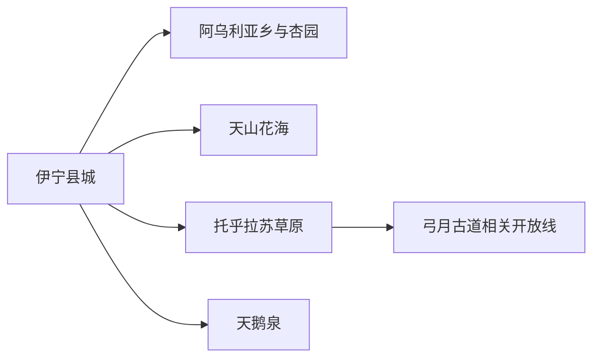
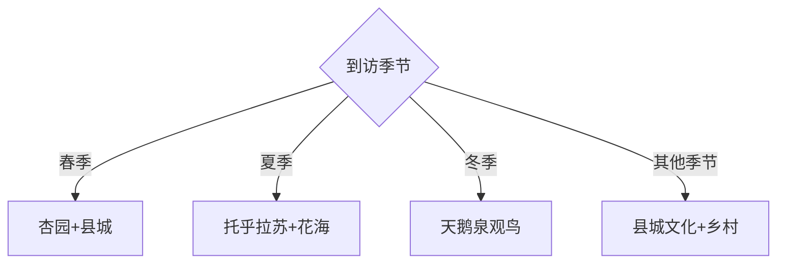

# 伊宁县旅行指南

伊宁县位于伊犁河谷中东部，县城与伊宁市相邻但属于独立县域，旅行主线是托乎拉苏草原、天山花海、春季杏园和冬季天鹅泉。花期、候鸟、水位与草原道路决定体验，按季节选一条核心远线比追赶全部点位更稳妥。

## 城市速览

| 项目 | 信息 |
|---|---|
| 主线 | 县城—杏园—托乎拉苏—天山花海—天鹅泉 |
| 停留 | 县城半日至1天；每条草原或湿地远线另留1天 |
| 住宿 | 县城便于县域公路；伊宁市适合跨县联程；草原接待点适合确认后住宿 |
| 交通 | 公路与包车为主，乡镇班线承担基础连接 |
| 风险 | 山地降温、雷雨、积雪、草原火险、湿地结冰与野生动物干扰 |
| 边界 | 湿地核心区、候鸟栖息地、牧场、农田和边境管理空间分别管理 |

## 城市格局与游览区域

县城是补给与道路分流点，托乎拉苏在北部山地，天鹅泉和花海各有明显季节窗口。固定清单的 **GeoNames 12440504 Awuliya** 对应伊宁县阿乌利亚乡，本页以该点建页，再由 Wikidata `Q1207838` 和法定代码 `654021` 锁定县域；其 P1566 指向行政记录 `1529011`。

## 主要景点

| 景点 | 区域 | 类型 | 核心体验 | 用时 | 环境 | 体力 | 研究价值 | 拥挤 | 优先级 |
|---|---|---|---|---:|---|---|---|---|---|
| 托乎拉苏景区 | 北部山地 | 草原山地 | 丘陵草原、古牧道与天山景观 | 1天 | 室外 | 中高 | 很高 | 旺季中高 | A |
| 天山花海景区 | 河谷农区 | 花田农业 | 薰衣草与现代农业景观 | 3–5小时 | 室外 | 中 | 中 | 花期高 | B |
| 祥和杏园及开放杏园 | 阿乌利亚方向 | 季节乡村 | 杏花、果园与河谷春景 | 3–5小时 | 室外 | 中 | 中 | 花期高 | B |
| 天鹅泉生态旅游景区 | 湿地方向 | 候鸟湿地 | 冬季疣鼻天鹅与湿地生态 | 半日至1天 | 室外 | 中 | 很高 | 观鸟季高 | A |
| 愉群温回族花儿景区 | 愉群翁方向 | 民俗乡村 | 回族花儿、村落与地方生活 | 半日 | 混合 | 低中 | 高 | 活动时中 | B |
| 伊宁县文化馆与县城公共文化空间 | 县城 | 地方文化 | 河谷历史、非遗活动与旅行背景 | 2–3小时 | 室内 | 低 | 高 | 低 | B |

天鹅泉以观景设施和规定时段开展观鸟，保持安静距离；草原牧道、农田与果园按经营者和社区开放范围进入，弓月古道长线按正式组织、天气与向导条件选择。

## 美食与餐饮

手抓肉、抓饭、烤包子、奶茶、馕、熏马肉与河谷瓜果常见。县城适合日常用餐，乡村与草原方向提前准备饮水和简餐；说明羊肉、马肉、乳制品、麸质、坚果和甜度需求，尊重清真餐饮规则与当地家庭接待习惯。

## 经典行程

### 两日基础线
**路线**：县城文化—天山花海或杏园—托乎拉苏。**逻辑**：河谷与山地各占一天。**预约锚点**：草原开放、花期和车辆。**休息**：县城。**删除条件**：天气不稳时删草原线。

### 托乎拉苏线
**路线**：县城—景区入口—草原开放游线—返程。**逻辑**：给海拔变化和公路留完整时段。**预约锚点**：门票、道路与天气。**休息**：游客服务区。**删除条件**：雷雨、积雪或火险预警时取消。

### 杏花乡村线
**路线**：阿乌利亚方向开放杏园—乡村餐饮—县城。**逻辑**：围绕短花期慢游。**预约锚点**：花况、果园接待和车辆。**休息**：乡镇餐饮点。**删除条件**：花期结束时改县城文化线。

### 天鹅泉观鸟线
**路线**：县城—天鹅泉正式观景区—返程。**逻辑**：把冬季光线和候鸟活动集中安排。**预约锚点**：候鸟情况、开放与结冰。**休息**：游客点或车内。**删除条件**：大雾、风雪或官方关闭时取消。

### 花海农业线
**路线**：天山花海—现代农业开放区—县城晚餐。**逻辑**：同一河谷方向串联。**预约锚点**：花期和开放项目。**休息**：景区服务区。**删除条件**：非花期只保留有展陈的开放区域。

### 民俗慢游线
**路线**：县城文化空间—愉群温开放点—乡村餐饮。**逻辑**：用公共文化和社区活动理解多民族河谷。**预约锚点**：演出或节庆。**休息**：县城。**删除条件**：无活动时缩为半日。

### 低体力线
**路线**：县城公共文化—车辆到花海主要观景区—近距离乡村餐饮。**逻辑**：用车辆和短步行替代草原长线。**预约锚点**：无障碍入口与休息设施。**休息**：午后县城。**删除条件**：风雪时只留室内文化空间。

## 住宿区域

伊宁县城适合县域公路日和早出发；伊宁市住宿选择更多，适合把伊宁县作为单日远线；托乎拉苏周边接待点适合慢游，但需确认营业季、供暖、餐食、洗浴、通信和退改。观鸟季宜住县城并在天亮前后安排车辆。

## 市内交通

伊宁机场与伊宁站位于区域交通网络中，到伊宁县城仍需公路接驳。县内班线覆盖乡镇，但景区开放时间与班线往返未必匹配；草原、湿地和花海更适合提前约车。山地车辆核对路况、冬胎、返程时间和司机熟悉度。

## 不同旅行者须知

摄影者按花期与候鸟季选择单一主题；亲子家庭优先花海与县城；观鸟者保持观景距离和低噪声；徒步者通过正规活动进入古道与草原；长者和低体力旅行者采用车辆观景与短步行，避开山地长线。

## 行前核对

- 核对托乎拉苏、天山花海、杏园与天鹅泉的开放、花况和候鸟情况。
- 核对山地天气、积雪、火险、道路、车辆与通信条件。
- 湿地核心区、候鸟栖息地、牧场、农田和果园按公告及经营边界进入。

## 来源与更新记录

| 来源 | 支持内容 | 核验日期 |
|---|---|---|
| [伊宁县政府：阿乌利亚乡概况](https://www.xjyn.gov.cn/xjyn/c113642/202312/32bbe4006de04a85be9339b0085a9927.shtml) | Awuliya 中文身份与县域归属 | 2026-09-01 |
| [伊宁县政府：托乎拉苏景区](https://www.xjyn.gov.cn/xjyn/c125634/202505/60eb2e72097f46f081bf119f79019ce9.shtml) | 草原位置、景观和开放信息 | 2026-09-01 |
| [伊宁县政府：天鹅泉景区](https://www.xjyn.gov.cn/xjyn/c113628/202401/a83e4bbe5adf466cba4be623e9eb37e3.shtml) | 湿地、候鸟与县域旅游资源 | 2026-09-01 |
| [伊宁县政府：2023年统计公报](https://www.xjyn.gov.cn/xjyn/c113704/202406/f7259c5deba84bf385c99b228e9c506c.shtml) | 景区名录与县内交通基础 | 2026-09-01 |
| [GeoNames 12440504](https://www.geonames.org/12440504/) | Awuliya 固定城市点 | 2026-09-01 |
| [Wikidata Q1207838](https://www.wikidata.org/wiki/Q1207838) | 伊宁县实体、代码与行政记录 | 2026-09-01 |

| 日期 | 更新 |
|---|---|
| 2026-09-01 | 首次完成伊宁县旅行研究；建立草原、花海、杏园和湿地季节路线 |
