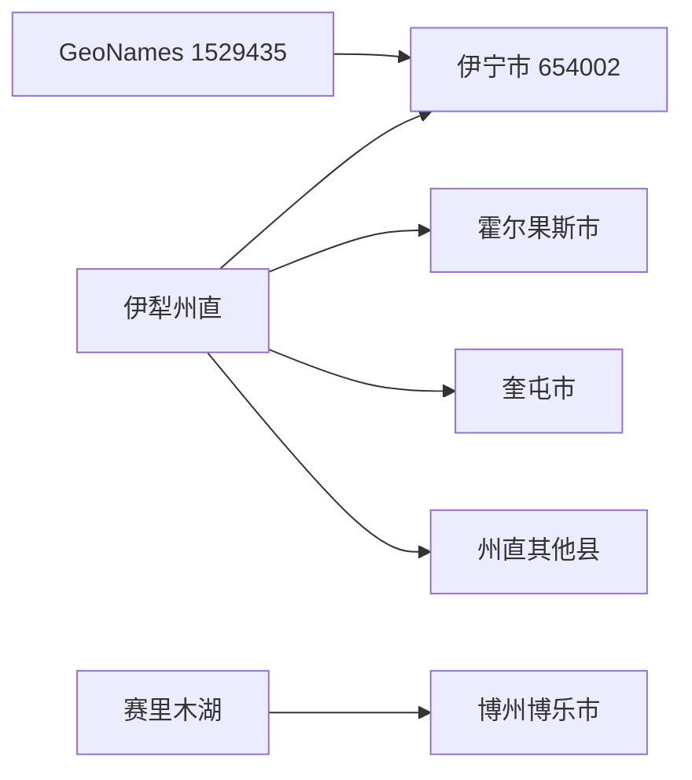
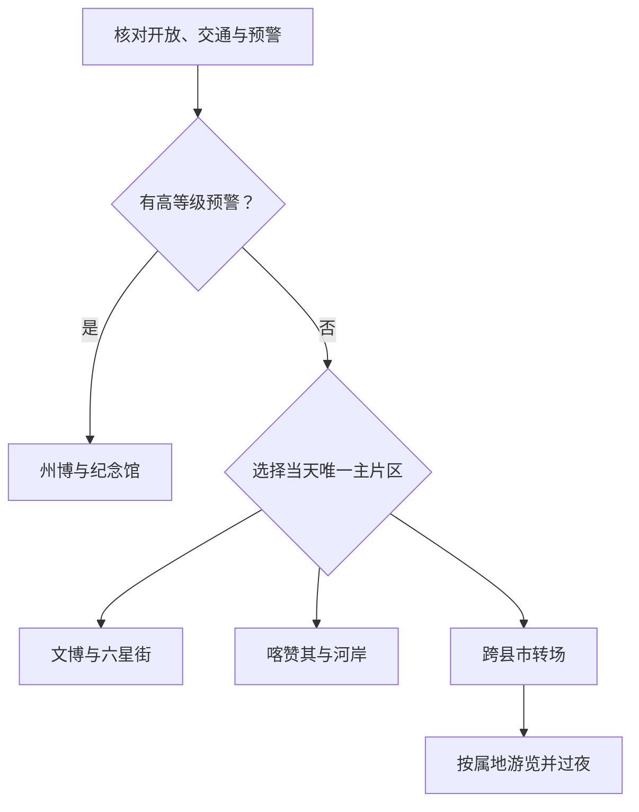

# 伊宁旅行指南

伊宁市是行政区划代码为 **654002** 的县级市，也是伊犁哈萨克自治州首府。首访价值集中在伊犁州博物馆、林则徐纪念馆、六星街、喀赞其和伊犁河公共游览段：州级场馆帮助建立河谷历史背景，两处历史街区仍是居民生活社区，河岸则适合在天气与水情稳定时作傍晚短线。州府集散功能不把伊宁县、霍尔果斯市、奎屯市或伊犁州其他县的景点变成伊宁市景点。

> 建议停留：市区 2 天；跨县市联程按实际目的地另留 1 天以上 
> 旅行关键词：伊犁州文博、六星街、喀赞其、伊犁河、多民族城市生活 
> 主要体力：低至中等；历史街区步行为主，跨片区宜乘车 
> 最近研究：2026-08-12

## 城市速览

| 项目 | 旅行信息 |
|---|---|
| 主要旅行价值 | 先以伊犁州博物馆认识河谷历史与多民族文化，再分别体验六星街的放射状街巷、喀赞其的生活社区和伊犁河公共景观带；不把全州草原、口岸和高山湖泊塞进城市路线。 |
| 建议停留 | 1 天可选博物馆加一处历史街区；2 天把六星街、喀赞其和伊犁河分开；3 天适合慢游和增补林则徐纪念馆。跨县市目的地至少另留一天。 |
| 较舒适季节 | 春秋通常适合街区步行，但春季融雪会提高北部山地和沿河地灾风险；夏季客流与日照增强，冬季低温、积雪和结冰会影响街巷、河岸与交通。 |
| 预算特点 | 州级公共场馆、街区公共空间和市内公交有利于控制成本；旺季住宿、观光车、跨县车辆和单程转场是主要增量。 |
| 步行强度 | 博物馆可慢速参观；六星街与喀赞其需要街巷步行，核心区车辆管控会增加从停车点到游线的距离；伊犁河只走正式平缓公共段。 |
| 主要天气风险 | 春季融雪型滑坡、崩塌和泥石流，强降雨与沿河崩塌、洪水，夏季日晒与雷雨，冬季低温、降雪和道路结冰；北部山地风险高于主城平原。 |
| 独行旅行 | 文博、历史街区和主城餐饮容易独立组合；夜间和偏远乡镇应锁定返程，不参加无资质徒步、露营、拼车或“野线穿越”。 |
| 亲子旅行 | 博物馆、六星街短线和伊犁河正式公共段可按年龄拆分；人流、观光车、居民巷道、水边和冬季冰面需要持续看护。 |
| 长者与低体力旅行 | 用一座场馆加一处历史街区短段最容易减负；街区观光车曾有官方记录，但当前车型、运营和上下车条件必须重查。 |
| 无障碍信息 | 六星街外围停车体系有无障碍车位，州级场馆可电话核对；现有资料不足以证明停车场、街巷、展馆、观光车和河岸形成连续无障碍链。 |

开放地名资料中，**GeoNames 1529435** 记录名为 `Ghulja`、类别为 `PPLA2`，对应伊宁主城居民点及州府定位；`Ghulja` 是伊宁的外文地名写法，不是另一个法定城市。法定伊宁市使用 **Wikidata Q866021** 与行政代码 **654002**，但其 GeoNames 属性 **P1566** 为 `8563527`，没有精确对应 1529435。因此 1529435 只用于定位主城居民点；居民点坐标、州府功能和县级市法定范围必须分开。

2025 年 7 月，胡地亚于孜镇和阿热吾斯塘镇由伊宁县调整归伊宁市管辖。市民政局随后公布伊宁市下辖 6 镇、5 乡、13 街道。这项调整没有取消伊宁县，也不意味着伊犁州其他县市成为伊宁市远郊。旧资料中出现的区划数量和边界只能作为历史记录，当前路线按调整后的官方区划识别。

## 城市格局与游览区域

伊宁市可分成西部州级文博与新城、北部六星街、南东部喀赞其老城、南部伊犁河景观带，以及北部乡镇与山地五种尺度。前三类可用车辆串成两天，伊犁河适合天气稳定时的傍晚短段；北部山地和牧道不属于默认城市游览区。

| 区域 | 主要内容 | 游览特点 | 与其他区域的关系 |
|---|---|---|---|
| 西部文博与新城片区 | 伊犁州博物馆、伊犁林则徐纪念馆、州图书馆和文化馆等公共文化设施 | 室内为主，适合首日建立背景和恶劣天气备选；场馆之间仍宜乘车 | 展陈覆盖全州历史，不等于那拉提、特克斯、昭苏或口岸景点归入伊宁市 |
| 六星街片区 | 六星街历史街区、历史与民俗文化陈列及手风琴展示、正规餐饮 | 放射状街巷、居民生活与商业并存；高峰期核心区禁机动车和非机动车 | 可与西部文博同日，傍晚至夜间客流较高；车辆停外围，不能占无障碍车位或居民出入口 |
| 喀赞其老城片区 | 喀赞其民俗旅游区、公开街巷、指定体验点与正规餐饮 | 生活社区尺度较大，适合半日至一日；观光车和家访点需当期确认 | 不与六星街视作一个可连续步行的“古城”，两区分日更从容 |
| 伊犁河城南景观带 | 伊犁河旅游风景区及两岸正式开放的公共游览段 | 河岸生态、城市景观与傍晚休闲；两岸只按当期开放入口、步道和广场游览 | 可接喀赞其或主城晚餐；水位、赛事、封控和崩塌隐患会改变可进入范围 |
| 北部乡镇、丘陵与牧道 | 巴彦岱、英也尔、达达木图、潘津等方向的农业、草场、沟谷与生产空间 | 滑坡、崩塌、泥石流、采煤塌陷和通信弱区集中；没有开放证据的道路不是户外路线 | 伊赛牧道涉伊宁市段已公告封闭，严禁徒步、登山、探险或自驾穿越；山区活动服从最新公告 |

伊宁市东连伊宁县，西邻霍城县，南隔伊犁河与察布查尔锡伯自治县相望。伊宁县是仍然存在的普通县，不能因同名或两镇划转而写成伊宁市组成部分。霍尔果斯市和奎屯市均是伊犁州内独立县级市；州府在伊宁不改变它们的行政边界。霍城县的薰衣草或惠远、霍尔果斯口岸、新源县那拉提、特克斯县喀拉峻、昭苏县草原都按各自属地另作行程。

常见联程中的赛里木湖不在伊犁州，而在博尔塔拉蒙古自治州博乐市范围；从伊宁出发或途经果子沟不改变归属。奎屯市位于伊犁州直辖范围的另一片城市组团，也不是伊宁西郊。任何“伊宁出发”“伊犁一日游”或“伊宁周边”产品名，都不能替代实际行政区、景区入口、单程车时和当晚住宿地。

六星街和喀赞其既是 A 级景区，也是原住民日常家园。只进入公共街巷、正式展馆、明示营业商户和指定体验点，不推门进入住宅，不围堵居民通道，不把儿童、礼拜、院落和日常劳作当成无须同意的拍摄对象。伊犁河景观带兼具生态修复、防洪和公共休闲功能；不下河、不踏上沙洲或自然冰面，也不绕过封控进入河岸隐患段。

## 主要景点

优先级用于安排行程，不代表绝对排名：**A** 为首访核心，**B** 为按兴趣补充，**C** 为开放证据较弱或具有明显条件限制的地点。商业街、停车场和夜间餐饮可标为“路线节点”；同一历史街区内的巷道、展馆、家访、演出和店铺不重复拆成多个景点。

### 州级文博与公共文化

| 景点 | 区域 | 类型 | 主要看点 | 建议用时 | 室内外 | 体力 | 预约风险 | 天气影响 | 优先级 |
|---|---|---|---|---:|---|---|---|---|---|
| 伊犁哈萨克自治州博物馆 | 西部如意街片区 | 综合博物馆、4A 景区 | 伊犁河谷考古、历史、多民族文化与州域自然人文背景 | 2–3 小时 | 室内 | 低至中 | 中；开馆、临展、实名与讲解需确认 | 低；极端天气可能临时调整 | A |
| 伊犁林则徐纪念馆 | 西部福州路片区 | 纪念馆 | 林则徐在伊犁相关历史与专题展陈；官方州级场馆表列有地址、电话和开放安排 | 1.5–2.5 小时 | 室内 | 低 | 中；开馆、展陈和讲解需确认 | 低；极端天气可能临时调整 | B |
| 伊犁州图书馆与文化馆当期公共活动 | 西部边合区 | 公共文化空间 | 阅读、地方文化活动和恶劣天气备选；只在活动正式对公众开放时安排 | 1–2.5 小时 | 室内 | 低 | 高；活动、座席和开放日需确认 | 低 | C／路线节点 |

州级四馆的公开一览表可支持地址、联系电话和基础开放安排，但资料发布日期较早，不能直接当作 2026 年每日营业保证。博物馆和纪念馆到访前应核对临时闭馆、节假日、实名、讲解、摄影和无障碍；没有确认时，不把馆外广场或办公区域当作替代展馆。

### 历史街区与城市生活

| 景点 | 区域 | 类型 | 主要看点 | 建议用时 | 室内外 | 体力 | 预约风险 | 天气影响 | 优先级 |
|---|---|---|---|---:|---|---|---|---|---|
| 六星街景区 | 北部主城 | 4A 历史文化街区与生活社区 | 1934 年形成的放射状街巷、历史与民俗文化陈列、手风琴展示、居民生活和正规餐饮 | 3–5 小时 | 混合 | 中 | 中；展馆、活动和观光车需确认 | 中；高温、强降雨、积雪和结冰影响 | A |
| 喀赞其民俗旅游区 | 南东部老城 | 4A 历史街区与生活社区 | 老城街巷、传统民居外部景观、多民族城市生活及指定文化体验 | 4–6 小时 | 混合 | 中 | 中至高；观光车、家访点、演出和展馆需确认 | 中；日晒、降雨、积雪和结冰影响 | A |
| 丝路之光及正规夜间餐饮片区 | 西部边合区 | 当代商业与夜间活动 | 当代城市消费、餐饮和演出；不把商业布景解释成历史遗产 | 1.5–3 小时 | 混合 | 低至中 | 中；营业和活动具有时效性 | 降雨、低温与交通影响 | 路线节点 |

六星街 2026 年通行规则显示，核心红色区域全年禁止机动车和非机动车，高峰期还扩大限行范围，周边设多个停车场。规则要求不得占用无障碍车位、消防通道和居民出入口。观光车曾在 2023 年官方报道中提供不同座位车型，但必须重新确认当前运营、上下车点、价格与轮椅装载，不能把旧报道写成固定服务。

### 伊犁河公共景观带

| 景点 | 区域 | 类型 | 主要看点 | 建议用时 | 室内外 | 体力 | 预约风险 | 天气影响 | 优先级 |
|---|---|---|---|---:|---|---|---|---|---|
| 伊犁河旅游风景区正式开放段 | 城南及两岸开放入口 | 4A 河岸生态与城市休闲 | 河谷城市景观、生态修复、防洪景观与傍晚公共空间 | 1.5–3 小时 | 室外 | 低至中 | 中；活动、停车和开放段需确认 | 很高；洪水、强降雨、雷暴、结冰和大风影响 | A |

伊犁河景区宣传范围较长，不等于整条河岸都能连续步行。两岸均只选择主管部门或景区明确开放的广场、步道和停车入口，按原路或短段游览；不跨护栏进入河滩、施工区和崩塌隐患点。冬季只在明确开放和维护的岸上路面活动，不把自然冰面当作观景平台。

北部乡镇、牧道与山地只作为安全边界说明，不计作景点。伊赛牧道涉伊宁市段的公告明确禁止徒步、登山、探险、自驾穿越，以及为违规穿越提供向导、交通和补给，开放时间另行通知；非正式徒步点和露营点没有稳定开放与救援证据。北部山区还存在采煤塌陷、草场、农田、水利、输电和乡村生产空间，即使地图上出现道路或社交平台轨迹，也不构成开放许可。

## 美食与餐饮

伊宁适合在六星街、喀赞其、主城社区餐馆和正规市场按菜品寻找食物。官方美食入口列有过油肉拌面、肉馕、熏肉与马肠子、油塔子等类型，历史街区官方线路还提到烤包子、馕坑烤肉和手工冰淇淋。单家门店经营变化快，页面不把任何一家网红店设为唯一答案。

| 菜品或餐饮类型 | 常见区域 | 一个人用餐与常见份量 | 风味、过敏原与饮食限制 | 排队风险与替代方法 |
|---|---|---|---|---|
| 过油肉拌面及其他拌面 | 主城社区餐馆、六星街与喀赞其周边 | 通常一人一盘，面和配菜量较足；可问小份或少油 | 含小麦麸质，常见牛羊肉、洋葱、辣椒和油；素食需问共锅 | 午餐高峰排队；选择菜单、卫生和价格清楚的同类社区店 |
| 抓饭 | 主城、市场与历史街区正规餐馆 | 通常一人一盘，可先问小份和肉量 | 常见羊肉、胡萝卜、米和动物油；素食需确认肉汤与共锅 | 中午可能售罄；不为单店跨城，改选附近正规餐馆 |
| 烤包子、肉馕与馕 | 六星街、喀赞其、打馕店和市场 | 可按个购买，适合少量尝试；馕可能较大可分食 | 含小麦麸质，肉馅常见牛羊肉、洋葱；可能接触芝麻、奶蛋 | 出炉时段排队；选择现制和储存条件清楚的替代点 |
| 馕坑烤肉与烤串 | 主城夜间餐饮和正规经营点 | 烤串可少量加点，大块肉先问重量、计价与主食 | 牛羊肉、孜然、盐和辣椒常见；可能接触芝麻 | 晚餐高峰等待；比较明码标价和出餐速度，不跟随无证流动摊贩 |
| 熏肉、马肠子与冬季肉食 | 正规民族餐馆和市场 | 味重、脂肪和盐分可能较高，适合小份共享 | 马肉及其他肉类，可能含较多盐和脂肪；饮食禁忌者先确认 | 强季节性且品质差异大；选择冷链、标识和切配卫生清楚的经营点 |
| 油塔子等面点 | 早餐店、市场和社区餐馆 | 可单份或与汤食搭配，先问份量 | 含小麦麸质和油脂，可能含奶或动物油 | 早餐高峰会售罄；选同类正规店，不买久置食品 |
| 手工冰淇淋、酸奶与奶制品 | 喀赞其指定经营点、六星街和主城甜品店 | 单杯或小份，儿童先少量尝试 | 含乳糖和较多糖；可能加入坚果、蜂蜜、蛋或香料 | 旺季历史街区排队；查看冷链与配料，改选正规同类店 |
| 瓜果、蜂蜜与干果 | 正规市场、商店和当季经营点 | 少量购买、按食用量称重，留意携带与储存 | 天然糖分较高；干果区可能交叉接触核桃等坚果 | 产季和品种变化；不进入果园、蜂场或居民院落自行采摘购买 |
| 奶茶与发酵乳饮品 | 正规餐馆和饮品店 | 可单杯，酒精敏感者应逐项询问发酵程度 | 含乳糖；部分传统饮品可能发酵并含酒精，甜饮糖分高 | 选择配料、冷藏和经营资质清楚的门店 |

清真餐饮、宗教与民族生活都是城市日常，不是娱乐化布景。进入餐厅、街区、院落体验点和宗教空间时遵守服饰、酒类、禁烟、拍照与空间分区提示。纯素、麸质过敏、乳糖不耐、坚果过敏或不能饮酒者，应逐项询问汤底、油脂、馅料、发酵、配料和共用厨具。

## 经典行程

### 一日城市经典路线

**路线**：伊犁州博物馆 → 西部片区室内午餐与完整休息 → 喀赞其公开街巷与指定体验点 → 伊犁河正式开放段短走 → 返回主城

- **串联逻辑**：上午先用州博建立背景，下午只进入一处生活街区，傍晚在天气和水情允许时接河岸短线；场馆、街区与河岸之间使用车辆，不强求连续步行。
- **预约锚点**：博物馆开馆、实名与讲解，喀赞其观光车或指定体验点，以及伊犁河当日开放段；任何一项未确认都可单独删除。
- **休息安排**：博物馆后安排室内午餐和午休，喀赞其使用游客中心或正规经营点休息，河岸只作日落前后短段。
- **时间不足时**：先删伊犁河，再删喀赞其深走；保留博物馆和一顿主城餐食，不把六星街临时塞进同日。

### 两日文博与双街区路线

**第 1 天**：伊犁州博物馆 → 午餐与休息 → 伊犁林则徐纪念馆 → 六星街傍晚短线与晚餐

**第 2 天**：喀赞其公开街巷 → 指定体验点或正规餐饮 → 午后完整休息 → 伊犁河正式开放段 → 返回住宿地

- **串联逻辑**：第一天集中西部文博后进入北部六星街，第二天把尺度更大的喀赞其留出半天，再视天气接伊犁河；两处历史街区不压成一段“古城步行”。
- **预约锚点**：两馆开放与讲解、六星街展馆和交通管制、喀赞其观光车或体验点、伊犁河活动与开放段。
- **休息安排**：每天中午都保留长休；六星街从外围停车或公交落客后再步行，第二天河岸前回住宿或室内补水休整。
- **时间不足时**：第一天删纪念馆或六星街其一，第二天删伊犁河；不缩短两馆参观后在夜间奔走两个街区。

### 三日慢游路线

**第 1 天**：伊犁州博物馆 → 西部公共文化片区午餐 → 伊犁林则徐纪念馆 → 返回休息

**第 2 天**：六星街历史与民俗文化陈列 → 街区正规午餐与休息 → 六星街公共街巷短线 → 傍晚返回

**第 3 天**：喀赞其公开游线 → 正式经营点午餐与休息 → 伊犁河正式开放段 → 主城告别晚餐

- **串联逻辑**：每天只处理一个主题和相邻片区，适合想减少久走、认真看展或避开旺季拥堵的人；不加入霍尔果斯、赛里木湖、那拉提或其他跨县市点位。
- **预约锚点**：两馆、六星街展馆与交通、喀赞其接待、伊犁河开放；街区观光车须确认当前运营，不沿用 2023 年价格或车型。
- **休息安排**：三天都安排完整午休，历史街区每小时寻找正规座椅或经营点停留；冬季把河岸换成室内公共文化活动。
- **时间不足时**：优先删除第三天下午河岸，再把纪念馆改到下次；不把三日内容压成一天完成。

### 强降雨、融雪或冬季调整路线

**路线**：住宿地核对预警与道路 → 伊犁州博物馆 → 室内午餐与休息 → 伊犁林则徐纪念馆或已确认的州图书馆、文化馆公共活动 → 返回住宿地

- **串联逻辑**：用两个现代室内点替代河岸、街巷和北部山地，车辆跨点；若道路结冰或高等级预警影响城区交通，则只保留距离住宿最近的一馆。
- **适用条件**：普通小雨或常规寒冷且场馆、道路正常时执行；强降雨、洪水、融雪地灾、暴雪、冻雨和道路结冰预警时不去伊犁河、北部乡镇或街区长距离步行。
- **预约锚点**：两馆临时开放、车辆与住宿延住；公共文化活动只有正式对外公告时才作为替代。
- **休息安排**：馆间车辆移动，午餐后长休；冬季携带防滑保暖装备，不在结冰人行道和河岸增加步行。
- **时间不足时**：只保留州博主展或离住宿最近的一馆；不以商场外街区漫步补足行程。

### 亲子或低体力路线

**亲子路线**：伊犁州博物馆 → 午餐与休息 → 六星街历史与民俗文化陈列及公共街巷短线 → 返回住宿地

**低体力路线**：伊犁州博物馆主展 → 车辆到六星街外围可落客点 → 确认可用的观光车或最短平缓街巷 → 室内休息后返程

- **串联逻辑**：两条路线都用博物馆建立背景，再只选六星街一个户外片区；不追加喀赞其和伊犁河，避免人流、车辆与水边风险叠加。
- **减负方式**：亲子路线核对推车、儿童预约、展馆互动和人流；低体力路线确认无障碍车位、落客距离、观光车上下车、轮椅装载、卫生间和座椅。
- **预约锚点**：州博、六星街展馆和观光车当前运营；无障碍车位存在不等于核心街巷全程无台阶。
- **休息安排**：博物馆后长休，六星街只走一小环并在正规店内休息；冬季或雨天直接取消户外段。
- **时间不足时**：删除六星街，只保留博物馆和就近用餐；不改去河岸或喀赞其增加体力。

### 跨县市联程衔接路线

**路线**：伊宁市住宿地 → 伊宁站、伊宁机场或正规公路客运节点 → 前往霍尔果斯市、霍城县、奎屯市或其他实际目的地中的一个 → 在目的地按属地规则游览并过夜

- **串联逻辑**：把离开伊宁后的交通日和目的地游览分开，只选择一个方向；霍尔果斯、奎屯是独立县级市，霍城是普通县，赛里木湖又属于博州博乐市，均不作为伊宁市内路线。
- **适用条件**：车票、末段接驳、道路、天气、证件、住宿和返程都确认；边境口岸工作区、国门和跨境通行另按主管部门规则，不因到达霍尔果斯市就自动开放。
- **预约锚点**：实际到发站、景区或口岸游客入口、目的地住宿和返程；跨县产品必须核对运营资质与取消条件。
- **休息安排**：长途移动日只在正规服务区和交通枢纽休息，到达后不再安排高强度夜游；每个县市至少留出独立时间。
- **时间不足时**：只完成转场并入住，不把霍尔果斯、赛里木湖、奎屯、那拉提或特克斯压成同日多点；无法过夜时删除整段联程。

## 住宿区域

| 区域 | 优点 | 缺点 | 适合人群 | 交通特点 |
|---|---|---|---|---|
| 西部新城与州博周边 | 靠近州级场馆、较宽道路和现代住宿，便于首日文博 | 到六星街、喀赞其和伊犁河仍需车辆，夜间街巷体验较弱 | 首访、亲子、低体力、文博优先者 | 便于叫车和连接车站、机场方向；订房时核对实际门牌与落客点 |
| 六星街外围 | 傍晚餐饮、街区体验和夜间返回方便 | 高峰期车辆管控、客流、音乐与经营噪声明显，核心区不宜携大件行李穿行 | 街区、美食、摄影和夜间活动优先者 | 车辆停外围，住宿是否可到门口要逐家确认；不能占居民通道和无障碍车位 |
| 喀赞其外围 | 便于把老城安排成半日至一日，接近日常餐饮与街巷 | 街区范围大、路面与停车差异明显，部分住宿可能无电梯 | 慢游、喜欢生活街区且能接受步行者 | 先确认出租车落客、观光车、夜间返程和行李搬运，不以“古城内”营销判断距离 |
| 伊犁河路与城南正规住宿 | 便于傍晚河岸短线，环境相对开阔 | 洪水、活动、道路施工和冬季结冰会削弱优势；到州博仍需车辆 | 河岸散步、慢节奏、已确认开放段者 | 只选择正式公共入口附近，订房时核对停车、照明和夜间交通 |
| 伊宁站或机场接驳方向 | 适合早班、晚班或次日跨县转场 | 旅行核心与餐饮密度未必优于主城，机场、车站不是同一点 | 中转、赶早交通和携大件行李者 | 确认酒店接送对象、时段、费用和实际站名，不把“近枢纽”理解为可步行 |

旺季住宿应优先确认制冷、热水、夜间前台、停车、噪声、行李和取消规则；冬季则确认供暖、清雪、防滑和机场车站延误应对。正规住宿实名登记和外宾接待能力可能变化，国际旅行者应在下单前取得明确答复。

## 市内交通

伊宁机场、伊宁站和公路客运共同承担伊犁河谷集散。市内没有城市轨道交通，主要依靠公交、出租车、合规网约车和街区短段步行。2026 年官方交通信息显示城市公交网络覆盖机场、火车站、国际旅游集散中心等节点，但具体线路、站名和首末班仍要按出发日核对。

| 场景 | 建议与取舍 | 行前需要重查的内容 |
|---|---|---|
| 从伊宁机场抵达 | 使用当期公交、出租车、合规网约车或住宿接送进入主城；机场仍在现址运行，规划搬迁不等于已搬迁 | 航班、航站楼、公交线路、出租车上客点、夜间叫车和天气延误 |
| 从伊宁站抵达 | 公交或车辆接驳州博、六星街和住宿；携大件行李先入住，不在核心街区拖行李 | 车次、出站口、公交首末班、出租车候车、重点旅客服务和道路施工 |
| 州博—六星街—喀赞其跨片区 | 公交适合时间宽松的单段，出租车或网约车适合控制步行；两街区之间不要全靠步行 | 线路调整、末班车、叫车范围、活动封路、旺季拥堵和移动支付 |
| 六星街核心区 | 按 2026 年长期通行规则从外围停车或下客后步行，遵守单行、道闸和现场指挥 | 高峰期限行范围、停车场饱和、观光车、无障碍下客和临时活动 |
| 喀赞其片区 | 先到游客中心或官方公布入口，再决定步行或当期观光车；不乘坐无证车辆 | 入口、手绘路线、观光车车型与价格、末班、居民通行和道路施工 |
| 伊犁河景区 | 导航到正式开放停车或公交入口，河岸只走短段并原路返回 | 开放段、活动交通、洪水与地灾封控、夜间照明、冬季结冰和返程 |
| 跨县市移动 | 先到伊宁站、机场或正规客运节点，再按实际目的地处理末段接驳；包车写清资质、等待和取消 | 霍尔果斯、霍城、奎屯、博乐、新源、特克斯、昭苏等目的地车票、道路、住宿和证件 |
| 自驾 | 市内核心不必自驾，六星街管控和旺季停车反而增加负担；跨县可减少换乘但长距离与天气风险更高 | 租车资质、保险、限行、停车、道路施工、雨雪、结冰、边境和目的地准入 |

机场搬迁目前属于规划事项，不应把“新机场”写成现用到达点。霍尔果斯口岸、边境管理和出入境也不是普通市内交通问题；参观国门、进入口岸限定区域、办理出入境和实际跨境分别遵守当期正式规则。

## 不同旅行者须知

| 旅行维度 | 可行条件 | 主要取舍 | 需额外核对 |
|---|---|---|---|
| 独行旅行 | 州博、六星街、喀赞其和主城餐饮容易独立安排 | 旺季夜间人流、跨县包车成本和偏远道路返程是主要限制 | 末班公交、正规车辆、住宿前台、街区最晚营业和紧急联系人 |
| 亲子旅行 | 州博、六星街展陈和伊犁河岸上短段可分龄选择 | 街区观光车、人群、水边、自然冰面和夜间活动增加看护负担 | 推车、儿童预约、安全带、护栏、卫生间、饮水和休息区 |
| 长者或低体力旅行 | 单馆慢看、车辆跨片区和历史街区小环可显著减量 | 外围停车到核心区的步行、久站和观光车上下车仍会累积疲劳 | 落客点、座椅、轮椅、观光车、卫生间、电梯和返程车辆 |
| 无障碍需求 | 六星街外围有无障碍车位，现代场馆可提前联系 | 车位不证明街巷、展馆和河岸连续无障碍；老街路面、门槛和拥挤可能中断通行 | 坡道、门宽、电梯、无障碍卫生间、轮椅借用、车辆装载和陪同规则 |
| 摄影旅行 | 州博按馆规、两处历史街区公共巷道和河岸公开段题材丰富 | 居民生活、宗教空间、儿童与店内拍摄需同意；冬夏光线和器材负担明显 | 三脚架、闪光灯、无人机、商业拍摄、肖像同意和边境区域规则 |
| 预算有限 | 公共场馆、公交、街区公共空间和社区餐饮可控制成本 | 旺季住宿和单人跨县车辆最易超支 | 免费开放、公交支付、观光车票、拼车资质、退改与隐藏费用 |
| 晚出发或紧凑行程 | 只选六星街或喀赞其中的一处，再配一顿主城餐食 | 不临时去伊犁河偏段、北部山区或任何跨县目的地 | 最晚入馆、街区管制、观光车末班、夜间叫车和住宿入住 |
| 春季融雪或强降雨 | 主城场馆在道路正常时可作替代 | 北部山地、沿河崩塌点、沟谷和牧道取消；灾害可能滞后于降雨 | 气象、地灾、洪水预警、道路管制、景区闭园和退改 |
| 冬季低温、降雪或结冰 | 天气稳定时可用短户外、长室内节奏 | 街巷、停车场和河岸结冰提高跌倒风险，自然河冰禁止进入 | 清雪、防滑、公交、航班列车、场馆供暖和临时关闭 |
| 国际旅行者 | 正规住宿、铁路、民航和主要景区通常可按公开流程办理 | 护照实名、移动支付、语言、线上预约和边境规则可能需要人工替代 | 来华签证与停留、住宿登记、护照购票、口岸参观和跨境证件 |

伊宁市北部地灾方案显示，滑坡、崩塌、泥石流和采煤塌陷在部分乡镇、沟谷、河岸与工程区集中。普通城市旅行不进入矿区、砂坑、草场、农田、输电、水利和施工便道；地面已有车辙、当地有人劳作或网络上有轨迹，都不能替代开放与安全确认。

## 行前核对

| 核对事项 | 为什么需要重查 | 建议核对时间 | 官方入口 |
|---|---|---|---|
| 伊犁州博物馆 | 开馆、临展、预约、实名、讲解和免预约政策会调整 | 确定日期后及到访前一日 | [伊犁州级场馆信息](https://www.xjyl.gov.cn/xjylz/c112605/202207/8463627bf30847cdb55b302ad6e390be.shtml)；博物馆当期官方渠道 |
| 伊犁林则徐纪念馆 | 旧表可支持地址与基础开放，不能代替 2026 年闭馆和展览公告 | 排线前及到访前一日 | [伊犁州级场馆信息](https://www.xjyl.gov.cn/xjylz/c112605/202207/8463627bf30847cdb55b302ad6e390be.shtml) |
| 六星街 | 展馆、演出、商户、观光车和交通管控会随旺季、活动与施工变化 | 到访前一周、前一日及当天 | [六星街通行规则](https://www.yining.gov.cn/yining/c115630/202604/acbe8f52314b41e78c7a284a5f37a236.shtml) · [伊宁市人民政府景区资料](https://www.yining.gov.cn/yining/tsyn/201603/a831d06ed7254e01b0246bd681916b5e.shtml) |
| 喀赞其 | 公开巷道、游客中心、家访点、观光车、演出和施工状态会变化 | 排线时、前一日及当天 | [伊宁市人民政府景区资料](https://www.yining.gov.cn/yining/tsyn/201603/a7a907966c754b66ab388443c81d4337.shtml)；景区当期官方渠道 |
| 伊犁河景区 | 河岸开放段、洪水、崩塌治理、赛事、停车和冬季结冰具有时效性 | 前三日、前一晚及当天 | [伊犁河景区官方资料](https://www.yining.gov.cn/yining/wtlyj/202505/43059ab5b6d848afb382b3092ac1db42/files/571125f9c7884f6b91a596bec38aa4cb.pdf) · [伊宁市地灾方案](https://www.yining.gov.cn/yining/kyqcr/202505/def9f35cd39446bda5b35a86a43dbe29.shtml) |
| 公交、铁路与机场 | 线路、站名、首末班、车次、航线、接驳和延误会变化 | 购票时、出发前一周及当天 | [伊宁市交通出行](https://www.yining.gov.cn/yining/jtjjtcx/202607/0ae5208ac5d549ddaadf2665ae68ed7c.shtml) · [中国铁路 12306](https://www.12306.cn/) · [伊犁州机场航线](https://www.xjyl.gov.cn/xjylz/c112410/202605/af561ee90eca465a81d21177633a94b3.shtml) |
| 春融、强降雨、洪水和地灾 | 北部山地、河岸与道路风险可能在降雨后滞后发生，直接取消户外路线 | 出发前三日、每日早晨及户外出发前 | [新疆气象局](http://xj.cma.gov.cn/) · [伊宁市地灾方案](https://www.yining.gov.cn/yining/kyqcr/202505/def9f35cd39446bda5b35a86a43dbe29.shtml) · [伊宁市山区活动公告](https://www.yining.gov.cn/yining/wtjjgzf/202603/9b46496033504934a661fb2994d99891.shtml) |
| 冬季低温、降雪与结冰 | 街巷、河岸、道路、航班和列车可能同时受影响 | 出发前三日、前一晚及当天 | [伊宁市冬季旅游安全提示](https://www.yining.gov.cn/yining/wtjjgzf/202601/6483289efc7e4de1a969878c5c7da9c6.shtml) · [新疆气象局](http://xj.cma.gov.cn/) |
| 伊赛牧道与北部山地 | 涉伊宁市段已封闭，存在地灾、山洪、野生动物、无通信和牧民转场风险 | 规划任何户外活动前 | [伊赛牧道封闭公告](https://www.yining.gov.cn/yining/wtjjgzf/202512/5589ba120f5148b0a3e0869a5bae89f7.shtml) |
| 无障碍、观光车和旅游厕所 | 现有证据分散且部分较旧，设施改善仍在进行，不能推定连续通行 | 订房、预约场馆和进入街区前 | [街区观光车历史资料](https://www.yining.gov.cn/yining/zwxx/202309/86a074209a15453abb2e4ad22a280e7f.shtml) · [伊宁市旅游服务整改](https://www.yining.gov.cn/yining/wtlyj/202509/cf64ecbc12574d4f911adcf26d16c5f3.shtml) |
| 跨县市与边境联程 | 霍尔果斯、奎屯、伊宁县及各县景点有独立交通、天气、住宿和准入 | 订车订房前及出发前 | [伊犁州人民政府](https://www.xjyl.gov.cn/)；实际目的地政府、公安、交通和景区正式渠道 |
| 餐饮、夜间活动与节庆 | 门店营业、夜市、演出、食材和活动日期变化快 | 排入路线前及当天 | [伊宁市特色美食](https://www.yining.gov.cn/yining/tsms/list.shtml)；经营主体和市场监管正式公示 |
| 入境、住宿与口岸规则 | 国际旅行者的签证、停留、住宿登记、口岸参观与跨境要求不同 | 订票订房前及出发前 | [国家移民管理局](https://www.nia.gov.cn/)；住宿方、口岸和属地公安正式答复 |

## 来源与更新记录

### 主要来源

| 来源 | 类型 | 支持内容 | 核验日期 |
|---|---|---|---|
| [伊宁市民政局：行政区划基本情况](https://www.yining.gov.cn/yining/qhrk/202508/43fe871b5a9a4c6eab1183e51cf88212.shtml) | 市政府、民政 | 县级市、伊犁州首府、周边边界及 6 镇 5 乡 13 街道 | 2026-08-12 |
| [伊犁州民政局：伊宁市与伊宁县区划调整](https://www.xjyl.gov.cn/xjylz/c112428/202507/2eebfe65d8cc440a9857fee37cc372d9.shtml) | 州政府、民政 | 胡地亚于孜镇、阿热吾斯塘镇于 2025 年转隶伊宁市 | 2026-08-12 |
| [伊宁市国土空间总体规划](https://www.yining.gov.cn/yining/kjgh/202409/001eb7e9c547483cac635f7e55b379a8.shtml) | 市政府、自然资源 | 伊宁市全域、中心城区、生态农业和北部山地空间边界 | 2026-08-12 |
| [伊宁市景区资料（2025）](https://www.yining.gov.cn/yining/wtlyj/202505/43059ab5b6d848afb382b3092ac1db42/files/571125f9c7884f6b91a596bec38aa4cb.pdf) | 市政府、文旅 | 六星街、喀赞其和伊犁河的官方景区身份与等级，以及伊犁河生态修复、防洪背景；其他场馆逐项核对 | 2026-08-12 |
| [伊犁州级场馆信息一览](https://www.xjyl.gov.cn/xjylz/c112605/202207/8463627bf30847cdb55b302ad6e390be.shtml) | 州政府、场馆 | 州博物馆、林则徐纪念馆、图书馆与文化馆的地址、电话和基础开放安排 | 2026-08-12 |
| [伊犁州博物馆获评 4A](https://www.xjyl.gov.cn/xjylz/c116238/202212/28b4d7a385ea4c2e91a681d657a1e3ff.shtml) | 州政府、场馆 | 博物馆正式景区属性、免费开放与历史开放安排 | 2026-08-12 |
| [六星街旅游](https://www.yining.gov.cn/yining/tsyn/201603/a831d06ed7254e01b0246bd681916b5e.shtml) | 市政府、文旅 | 1934 年规划、历史街区、手风琴展示及生活文化属性 | 2026-08-12 |
| [六星街道路通行规则](https://www.yining.gov.cn/yining/c115630/202604/acbe8f52314b41e78c7a284a5f37a236.shtml) | 市政府、景区管理 | 旺季限行、核心步行区、外围停车及无障碍车位管理 | 2026-08-12 |
| [六星街社区与商户管理通告](https://www.yining.gov.cn/yining/c115630/202511/5ddb016517da461599bd02bf927fc0c0.shtml) | 市政府、景区管理 | 原住民家园、交通、正规经营及禁止危险无证项目 | 2026-08-12 |
| [喀赞其民俗旅游区](https://www.yining.gov.cn/yining/tsyn/201603/a7a907966c754b66ab388443c81d4337.shtml) | 市政府、文旅 | 老城范围、居民社区、传统街巷与正式旅游区属性 | 2026-08-12 |
| [喀赞其保护与基础设施](https://www.yining.gov.cn/yining/c115634/202508/64487b2bf35e44899f2c859247e5877c.shtml) | 市政府、城市建设 | 历史街区水系、基础设施与保护更新边界 | 2026-08-12 |
| [伊宁市特色美食](https://www.yining.gov.cn/yining/tsms/list.shtml) | 市政府、餐饮文化 | 过油肉拌面、肉馕、马肠子、熏肉、油塔子等餐饮类型 | 2026-08-12 |
| [喀赞其半日线路](https://www.yining.gov.cn/yining/tsyn/201603/86a6faddc4554e93a6a14773dc518af8.shtml) | 市政府、文旅 | 指定街区体验、正规经营点与手工冰淇淋等餐饮线索 | 2026-08-12 |
| [伊宁市公交与重要时段运输](https://www.yining.gov.cn/yining/jtjjtcx/202607/0ae5208ac5d549ddaadf2665ae68ed7c.shtml) | 市政府、交通 | 城市公交网络、机场与旅游集散节点及运输保障 | 2026-08-12 |
| [伊犁州机场航线信息](https://www.xjyl.gov.cn/xjylz/c112410/202605/af561ee90eca465a81d21177633a94b3.shtml) | 州政府、民航 | 伊宁机场当期航线和航空门户 | 2026-08-12 |
| [伊宁市综合交通规划](https://www.yining.gov.cn/yining/jtjjtcx/202601/79461853a5ef4254992c926a59cafa6d.shtml) | 市政府、交通规划 | 机场搬迁属于规划而非已完成状态，铁路、公路与公交结构 | 2026-08-12 |
| [伊宁市地质灾害防治方案](https://www.yining.gov.cn/yining/kyqcr/202505/def9f35cd39446bda5b35a86a43dbe29.shtml) | 市政府、自然资源 | 融雪、降雨、滑坡、崩塌、泥石流、采煤塌陷与重点风险区 | 2026-08-12 |
| [伊宁市山区徒步露营公告](https://www.yining.gov.cn/yining/wtjjgzf/202603/9b46496033504934a661fb2994d99891.shtml) | 市政府、文旅安全 | 春融期北部山区徒步、露营风险及临时禁止范围 | 2026-08-12 |
| [伊赛牧道封闭公告](https://www.yining.gov.cn/yining/wtjjgzf/202512/5589ba120f5148b0a3e0869a5bae89f7.shtml) | 市政府、文旅安全 | 涉伊宁市段封闭、禁止穿越、地灾山洪野生动物与无通信风险 | 2026-08-12 |
| [伊宁市冬季旅游安全提示](https://www.yining.gov.cn/yining/wtjjgzf/202601/6483289efc7e4de1a969878c5c7da9c6.shtml) | 市政府、文旅安全 | 低温、降雪、结冰及不进入未开发山地、河流和冰面 | 2026-08-12 |
| [街区观光车历史资料](https://www.yining.gov.cn/yining/zwxx/202309/86a074209a15453abb2e4ad22a280e7f.shtml) | 市政府、景区服务 | 六星街与喀赞其曾提供多座观光车；2026 年运营需重查 | 2026-08-12 |
| [伊宁市旅游服务整改](https://www.yining.gov.cn/yining/wtlyj/202509/cf64ecbc12574d4f911adcf26d16c5f3.shtml) | 市政府、文旅 | 旅游厕所、停车等设施仍在补强，支持不推定连续无障碍 | 2026-08-12 |
| [中国铁路 12306](https://www.12306.cn/) | 铁路运营服务 | 伊宁站车次、票务、实名与到发动态核对 | 2026-08-12 |
| [新疆维吾尔自治区气象局](http://xj.cma.gov.cn/) | 气象主管部门 | 强降雨、雷暴、低温、降雪和分区预警入口 | 2026-08-12 |
| [民政部行政区划代码查询](https://dmfw.mca.gov.cn/) | 国家主管部门 | 伊宁市县级市身份与行政区划代码 654002 | 2026-08-12 |
| [GeoNames：Ghulja 1529435](https://www.geonames.org/1529435/ghulja.html) | 开放地名数据 | 伊宁主城居民点名称、位置、外文名及 `PPLA2` 州府标记 | 2026-08-12 |
| [Wikidata：Q866021](https://www.wikidata.org/wiki/Q866021) | 开放结构化数据 | 伊宁市法定实体、县级市身份、代码及 P1566 `8563527` 的粒度差异 | 2026-08-12 |

### 更新记录

| 日期 | 更新内容 |
|---|---|
| 2026-08-12 | 首次整理县级伊宁市指南；核对 GeoNames `1529435`、Wikidata `Q866021`、P1566 `8563527` 与行政代码 `654002` 的居民点和法定市粒度差异；纳入 2025 年两镇划转，明确伊宁县、霍尔果斯市、奎屯市、霍城县及伊犁州外赛里木湖边界；补充州级文博、双历史街区、伊犁河、牧道封闭、地灾、交通、无障碍和可执行路线 |
