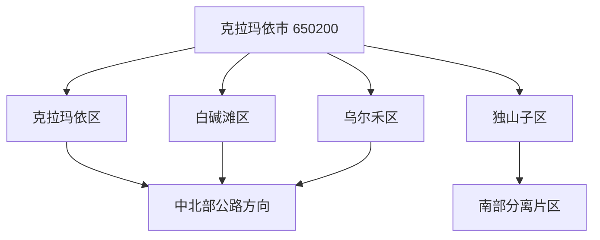
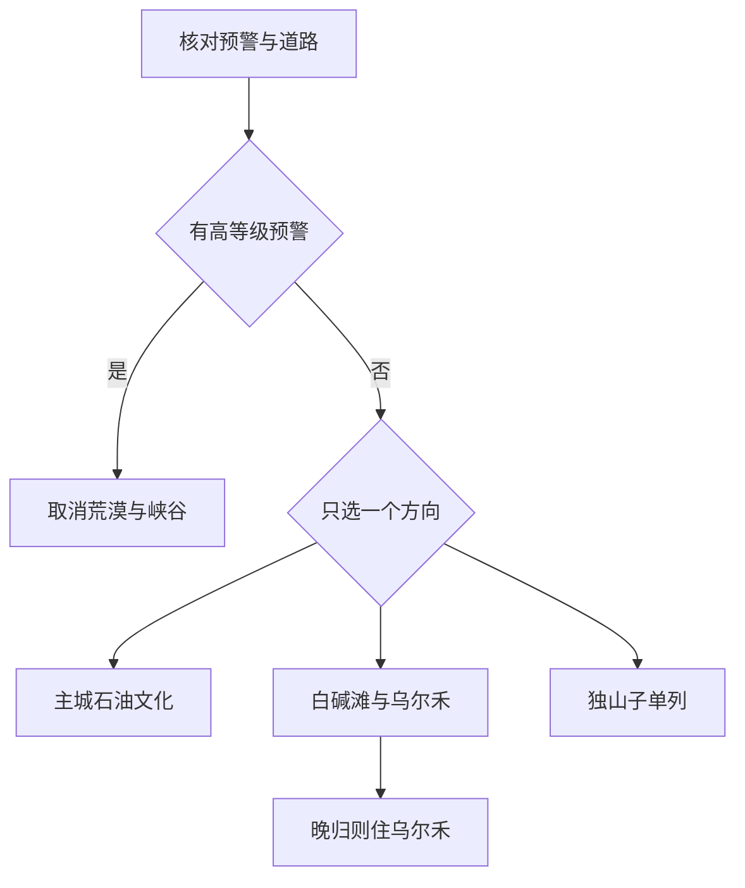

# 克拉玛依旅行指南

克拉玛依是行政区划代码为 **650200** 的地级市，下辖克拉玛依区、独山子区、白碱滩区和乌尔禾区，没有下辖县或独立县级市。首访价值在于把石油工业城市的历史、荒漠风蚀地貌和现代公共空间放在同一条时间线上理解；真正安排行程时，则要把主城区、白碱滩—乌尔禾北段和南部独山子分离片区拆开，不能按普通连续城区估算路程。

> 建议停留：主城 1 天；乌尔禾方向另留 1–2 天；独山子另列 1 天并核算转场 
> 旅行关键词：石油工业史、雅丹地貌、荒漠公路、克拉玛依河、独山子峡谷
>
> 主要体力：低至中等；极端天气和长距离公路比步行量更影响行程
>
> 最近研究：2026-08-13

## 城市速览

| 项目 | 旅行信息 |
|---|---|
| 主要旅行价值 | 在克拉玛依区理解石油城市起点，在乌尔禾看正式开放的雅丹景区，在独山子按独立模块认识炼化城市与天山北麓地貌。 |
| 建议停留 | 只有 1 天时留在克拉玛依区；2–3 天可加入白碱滩—乌尔禾北线；独山子与主城相隔很远，应另留整日或过夜。 |
| 较舒适季节 | 春秋通常更适合户外，但大风、沙尘和昼夜温差仍会改变游览；夏季高温，冬季严寒、积雪、结冰和风吹雪风险更高。 |
| 预算特点 | 主城公共空间容易控制成本；乌尔禾、独山子和跨区包车、租车、住宿是主要增量，不能只按门票估算。 |
| 步行强度 | 主城景点可分段步行；魔鬼城、峡谷等景区依赖景区交通或车辆到达，风口、碎石地和高温会放大体力消耗。 |
| 主要天气风险 | 大风、沙尘、高温、寒潮、降雪、道路结冰和风吹雪；独山子峡谷与乌尔禾荒漠还需核对崩塌、泥石流和临时封控。 |
| 独行旅行 | 主城公共景点容易安排；不独自进入油田生产路、戈壁便道、峡谷非开放段或通信弱区，不把社交平台轨迹当作通行许可。 |
| 亲子旅行 | 主城石油文化点、正式场馆和景区接驳较容易拆分；风沙、高温、临崖、水边、工程设施与车辆盲区需要持续看护。 |
| 长者与低体力旅行 | 采用“一处室内或短线景点＋长休息＋傍晚公共空间”的节奏；跨区日只选一个方向，预先核对景区车与无障碍条件。 |
| 无障碍信息 | 独山子客运站公开列有无障碍通道、卫生间等服务；这不能证明各景区、车站与住宿之间形成连续无障碍链，仍需逐点确认。 |

开放地名资料中，**GeoNames 1529401** 与城市实体 **Wikidata Q658240** 的 GeoNames 属性相对应，可用于跨资料识别克拉玛依；法定行政身份和范围以 **650200** 及政府区划资料为准。地名点只提供城市定位，不是市域边界，也不能据此把四个区理解成一个连续建成区。

市政府资料显示，克拉玛依现辖四个市辖区，基层建制为 14 个街道、1 个镇和 1 个乡。四区都属于同一地级市，因此本页不另造“下辖县级市”；但旅行尺度明显不同，尤其独山子位于南部的分离片区，与克拉玛依主城不是连续建成区。出发前应以实际道路、到发点和当晚住宿地重新核算。

克拉玛依因油气生产而形成，但看到抽油机、管线或炼化装置，不等于生产道路、井场、集输站、储罐区或厂区对游客开放。普通旅行只使用公共道路、依法运营景区和运营单位明确接待的研学或工业旅游线路；企业作业区只有在明确接受预约、完成身份核验和安全告知后才能进入。导航和网络轨迹都不构成准入许可。

## 城市格局与游览区域

先把克拉玛依看成三个旅行模块：克拉玛依区是住宿、文博和城市公共空间中心；白碱滩区与乌尔禾区形成向北延伸的公路方向；独山子区在南部单列。四区是平行的市辖区，不是“主城区下辖三个景区”。

| 区域 | 主要内容 | 游览特点 | 与其他区域的关系 |
|---|---|---|---|
| 克拉玛依区 | 黑油山、克一号井、大油泡、克拉玛依河及城市公共文化设施 | 石油城市历史与当代生活最集中，适合作为首日和住宿基地 | 可用市内公交、出租车或网约车分段；市博物馆自 2026 年 6 月 11 日起闭馆升级，复开另行公告 |
| 白碱滩区 | 百里油区景区及油田城市景观 | 从正式景区入口、观景平台和公共道路认识油区 | GeoNames `1529626` 是白碱滩城市点，旅行内容纳入本页北向模块；可与乌尔禾同方向组合，并提前核对开放、车程和返程 |
| 乌尔禾区 | 世界魔鬼城、翼龙主题馆、白杨河大峡谷等正式景点 | 雅丹、古生物和荒漠环境为主，大风、高温、严寒对体验影响很大 | 宜独立安排整日，晚归风险高时住乌尔禾；不驶入戈壁便道追逐机位 |
| 独山子区 | 独山子大峡谷、独库公路博物馆、独山子展览馆等 | 南部独立模块，兼有炼化城市、工业史和天山北麓地貌 | 与主城不是顺路步行片区；独库公路是否通行也不能由市区天气推断 |
| 油田、炼化与荒漠生产空间 | 井场、集输站、管线、储罐、厂区、矿业和内部道路 | 高危生产与生态管理空间，不是无门槛的工业旅游背景 | 只进入明确接待的正式线路；不越门禁、围栏和警戒，不在设施旁停车、吸烟、用火或擅飞无人机 |

白碱滩和乌尔禾虽然与主城大致位于同一北向公路方向，也不能把每个点都压进半日。世界魔鬼城需要为景区交通、风况、日晒和返程留余量；白碱滩的百里油区应按正式景区游览，而不是临时改走生产路。若大风、沙尘、高温、寒潮或道路管制升级，删去远点比赶夜路更稳妥。

独山子同时是市辖区、工业城区和南部转场节点。独山子大峡谷位于区政府资料所述的城区以南方向，不能因为宣传中常与独库公路连用，就默认峡谷开放等于独库公路全线开放。峡谷、博物馆、客运站、住宿和下一程道路应逐项确认；若只在独山子住一晚，也不必为了“集齐四区”折返主城。

## 主要景点

优先级用于分配时间，不代表绝对排名：**A** 为首访核心，**B** 为按兴趣补充，**C** 为受开放、天气或交通条件明显制约的点。停车场、商业街和观景途中停靠不单独拆成景点；生产设施只有转化为正式开放景区或预约项目后才进入游线。

### 克拉玛依区的石油城市主线

| 景点 | 区域 | 类型 | 主要看点 | 建议用时 | 室内外 | 体力 | 预约风险 | 天气影响 | 优先级 |
|---|---|---|---|---:|---|---|---|---|---|
| 黑油山景区 | 克拉玛依区 | 4A 石油文化景区 | 天然沥青丘、石油城市起源叙事和正式步道 | 1.5–2.5 小时 | 室外为主 | 低至中 | 中；开放、讲解和施工需确认 | 高；大风、高温、严寒影响明显 | A |
| 克一号井与大油泡景观 | 克拉玛依区 | 石油工业史、3A 景区 | 1955 年发现工业油流的历史节点、纪念性城市景观 | 1–2 小时 | 室外为主 | 低 | 中；核心区开放和活动需确认 | 中至高 | A |
| 克拉玛依河中心景区正式开放段 | 克拉玛依区 | 城市水景与公共休闲 | 城市河道、桥梁、绿地和傍晚公共空间 | 1–2.5 小时 | 室外 | 低至中 | 低至中；活动和维护段需确认 | 高；大风、雷雨、低温影响 | B |
| 克拉玛依市博物馆 | 克拉玛依区 | 城市与石油史博物馆 | 城市建设、石油工业和地方历史展陈 | 复开后 2–3 小时 | 室内 | 低 | **很高；自 2026-06-11 起闭馆升级，复开另告** | 低 | C／当前关闭 |

市博物馆的旧开放信息已被 2026 年闭馆公告取代。未看到复开公告前，不把它设为路线锚点，也不以馆外办公区域替代参观；可在行前核对中保留电话或官网确认。

### 白碱滩与乌尔禾北线

| 景点 | 区域 | 类型 | 主要看点 | 建议用时 | 室内外 | 体力 | 预约风险 | 天气影响 | 优先级 |
|---|---|---|---|---:|---|---|---|---|---|
| 百里油区景区正式游线 | 白碱滩区 | 3A 工业旅游景区 | 从正式入口和观景平台认识油田生产景观 | 1.5–3 小时 | 室外为主 | 低至中 | 高；开放线路、接待和身份要求需确认 | 高；大风、沙尘和高低温影响 | B |
| 世界魔鬼城景区 | 乌尔禾区 | 5A 雅丹地貌景区 | 风蚀地貌、荒漠尺度和景区正式观景线路 | 3–5 小时 | 室外为主 | 中 | 中至高；门票、景区交通和临时封控需确认 | **很高**；大风、沙尘、高温、严寒影响 | A |
| “乌尔禾之翼”翼龙主题馆 | 乌尔禾区 | 古生物主题场馆 | 翼龙主题展陈，为恶劣天气下的短时室内补充 | 1.5–2.5 小时 | 室内 | 低 | 高；2025 年开放的新馆，开放日和预约需重查 | 低；极端天气仍影响到达 | B |
| 白杨河大峡谷正式开放段 | 乌尔禾区 | 3A 河谷与胡杨景观 | 河谷地貌、胡杨及荒漠水系 | 2–4 小时 | 室外 | 中 | 高；入口、开放段和接驳需确认 | 很高；强降雨、大风、严寒和地灾影响 | C |

### 独山子南部模块

| 景点 | 区域 | 类型 | 主要看点 | 建议用时 | 室内外 | 体力 | 预约风险 | 天气影响 | 优先级 |
|---|---|---|---|---:|---|---|---|---|---|
| 独山子大峡谷景区 | 独山子区 | 4A 峡谷景区 | 天山北麓峡谷地貌和正式观景设施 | 3–5 小时 | 室外为主 | 中 | 高；开放、项目、接驳和临时封控需确认 | **很高**；降雨、崩塌、泥石流、大风和冰雪影响 | A |
| 独库公路博物馆 | 独山子区 | 3A 专题博物馆 | 公路建设历史、道路文化和独山子节点背景 | 1.5–2.5 小时 | 室内 | 低 | 中至高；开放日、实名和讲解需确认 | 低；道路天气影响到达 | B |
| 独山子展览馆 | 独山子区 | 3A 城区展馆 | 独山子城市发展与工业历史相关展陈 | 1–2 小时 | 室内 | 低 | 高；当前开放安排需确认 | 低 | C |

独山子泥火山及周边地质点不列为默认景点。官方地灾资料把独山子泥火山、北坡及奎屯河峡谷方向列入重点风险区域；没有正式开放、维护和救援证据时，不进入非正式观景点，不在崖边、沟口或冲沟停留。

## 美食与餐饮

克拉玛依的城市餐饮同时反映新疆通行风味和油城人口流动。市政府 2025 年文旅发布资料点名克拉玛依凉皮、“一把抓”烤包子和凉粉大盘鸡，可优先从这些有官方记录的类型开始；具体门店更替快，本页不把单店设为唯一答案。

| 菜品或餐饮类型 | 常见区域 | 一个人用餐与常见份量 | 风味、过敏原与饮食限制 | 排队风险与替代方法 |
|---|---|---|---|---|
| 克拉玛依凉皮 | 主城社区餐馆、正规市场 | 可单份，适合独食或作为小吃 | 含小麦或其他淀粉制品，常有辣椒、蒜、芝麻或花生；过敏者逐项问料 | 用餐高峰会排队；选明码标价、调料可分放的同类店 |
| “一把抓”烤包子 | 主城与正规餐饮点 | 可按个购买，先少量尝试 | 含小麦麸质，常见牛羊肉、洋葱和油脂 | 出炉时段可能售罄；选择现制、储存清楚的替代点 |
| 凉粉大盘鸡 | 主城多人餐馆 | 通常更适合 2 人以上；独食先问小份 | 常见鸡肉、辣椒、油和淀粉，可能与面食共锅 | 晚餐高峰等待；人数少可改选小盘鸡或普通拌面 |
| 抓饭、拌面和烤肉 | 四区正规餐馆 | 抓饭、拌面常为一人一份，烤肉可少量加点 | 牛羊肉、小麦、洋葱和孜然常见；素食需问汤底与共锅 | 不为单家网红店绕远，按住宿地寻找卫生和价格清楚的同类餐馆 |
| 馕、奶茶与奶制品 | 早餐店、市场和饮品店 | 馕可分食，奶茶与酸奶先点小份 | 含麸质、乳糖；可能含芝麻、坚果或较多糖盐 | 查看冷藏、配料和生产日期；乳糖不耐者不以“发酵”推定安全 |
| 乌尔禾烤肉与本地农产品 | 乌尔禾镇正规餐饮和活动市场 | 烤肉可按串或重量点，农产品按实际食用量购买 | 牛羊肉、孜然、辣椒常见；干果可能接触坚果 | 节庆活动具有时效性；活动结束后改选镇内正常营业餐馆 |
| 瓜果与干果 | 正规市场、商店 | 少量购买并留意车内高温储存 | 天然糖分较高，干果区可能交叉接触坚果 | 不进入农田、果园或生产区自行采摘；远途当天只买可妥善保存的量 |

清真餐饮和各民族生活是城市日常，不是表演布景。进入餐馆、社区和市场时遵守拍照、酒类、禁烟和空间提示；纯素、麸质过敏、乳糖不耐、坚果过敏或不能饮酒者，应逐项询问油脂、汤底、馅料、发酵程度与共用厨具。

## 经典行程

### 一日主城石油文化路线

**路线**：黑油山景区 → 主城午餐与完整休息 → 克一号井与大油泡 → 克拉玛依河正式开放段 → 返回住宿地

- **串联逻辑**：先看城市起源，再到发现工业油流的历史节点，最后用当代河道公共空间收尾；各点之间使用市内交通，不把闭馆中的市博物馆塞入路线。
- **预约锚点**：黑油山和克一号井核心区开放、讲解或活动，克拉玛依河当日维护和公共活动范围。
- **休息安排**：中午在主城室内长休，傍晚河岸只走短段；高温或大风时把室外活动前后移并增加补水。
- **时间不足时**：删去克拉玛依河，再缩短黑油山；保留克一号井历史节点和一顿主城餐食。

### 两日主城与乌尔禾路线

**第 1 天**：黑油山 → 午餐与休息 → 克一号井与大油泡 → 克拉玛依河短线

**第 2 天**：前往乌尔禾 → 世界魔鬼城正式游线 → 乌尔禾镇午餐与休息 → 翼龙主题馆 → 住乌尔禾或在天黑前返回已确认的住宿地

- **串联逻辑**：第一天只理解石油城市，第二天才处理荒漠地貌与古生物；不在魔鬼城游览后临时加独山子。
- **预约锚点**：世界魔鬼城门票、景区交通和风况，翼龙主题馆开放，往返车辆、驾驶员工时和当晚房间。
- **休息安排**：第二天在乌尔禾镇安排至少一次室内长休；自驾每段均设置合法停车和驾驶休息，不在路肩或生产设施旁停车。
- **时间不足时**：删翼龙主题馆；若大风或景区封控，则取消整个乌尔禾户外段，不改走戈壁野点。

### 三日白碱滩与乌尔禾慢游路线

**第 1 天**：克拉玛依区主线 → 主城住宿

**第 2 天**：前往白碱滩 → 百里油区正式景区游线 → 室内午餐与休息 → 前往乌尔禾镇 → 乌尔禾住宿

**第 3 天**：世界魔鬼城 → 乌尔禾镇午餐与长休 → 翼龙主题馆或已确认开放的白杨河大峡谷二选一 → 返回乌尔禾住宿或按确认车辆离开

- **串联逻辑**：把北向转场拆成两日，只通过正式景区认识油田与荒漠；第三天下午必须二选一，不把场馆和峡谷都当作顺路点。
- **预约锚点**：百里油区接待和准入、魔鬼城景区交通、翼龙主题馆或白杨河入口、两晚住宿及返程车辆。
- **休息安排**：第二、三天午间都在城镇室内长休；荒漠点之间不连续赶路，驾驶者在正规服务区或停车点轮休。
- **时间不足时**：先删白杨河，再删百里油区；只保留主城与世界魔鬼城，不抄近路进入油田生产道路。

### 独山子独立一日路线

**路线**：独山子住宿地或已确认到达点 → 独库公路博物馆 → 午餐与完整休息 → 独山子大峡谷正式开放段 → 返回独山子住宿地

- **串联逻辑**：先用室内展陈理解公路与城市背景，再在天气稳定时进入峡谷；这是一条独山子区内路线，不以克拉玛依主城当天往返为默认前提。
- **预约锚点**：博物馆开馆、峡谷门票与项目、地灾和天气预警、客运或自驾路线、独库公路当期通行状态。
- **休息安排**：午间回城区用餐和长休，峡谷只走正式步道与观景设施；夜间不继续尝试未确认的山路。
- **时间不足时**：删峡谷娱乐项目并缩短户外段；若预警或封控，整段改为博物馆加展览馆，不前往非正式地质点。

### 大风、沙尘、极端高温或冰雪调整路线

**路线**：住宿地核对预警与道路 → 距离最近且已确认开放的公共场馆 → 室内午餐与长休 → 同一区内短时公共文化活动 → 返回住宿地

- **串联逻辑**：只在交通正常且场馆确认开放时使用室内点，不以跨区赶馆替代荒漠景区；市博物馆闭馆期间不能作为主城雨备。
- **预约锚点**：预警级别、道路管制、场馆临时开放、车辆与住宿延住；若在独山子，可优先核对独库公路博物馆或展览馆。
- **休息安排**：减少室外候车和步行，午间完整休息；沙尘或空气污染时按个人健康情况减少外出并关闭车窗。
- **时间不足时**：只保留离住宿最近的一处确认开放场馆；高等级预警或道路管制下取消出行，不用商场外街区或生产道路补足行程。

### 亲子路线

**路线**：克一号井与大油泡短线 → 主城室内午餐与长休 → 克拉玛依河正式开放段短线 → 返回住宿地

- **串联逻辑**：先用短时石油历史节点建立城市背景，再到公共河岸空间活动；两段都留在主城，不把乌尔禾或独山子塞入同日。
- **预约锚点**：核对景点开放、亲子卫生间、婴儿车通行、河岸维护段和当日大风高温预警；儿童活动须始终远离水边、道路和工业设施。
- **休息安排**：午间回住宿或有固定座位的室内空间，室外每 30–45 分钟补水休息，避开正午高温与傍晚低温突变。
- **时间不足时**：先删克拉玛依河，只保留克一号井与大油泡；儿童疲劳或天气不适时直接返回住宿地。

### 长者或低体力路线

**路线**：车辆到达克一号井与大油泡可通行段 → 主城室内午餐与长休 → 黑油山低强度开放段或克拉玛依河短段二选一 → 返回住宿地

- **减负方式**：每天只保留一个历史节点和一个短时室外点，以车辆接驳代替连续步行；黑油山与河岸不同时安排，乌尔禾和独山子另日处理。
- **预约锚点**：逐点确认无障碍落客、卫生间、轮椅通行、座椅、坡度和景点当前开放；需要景区交通时还要问能否装载轮椅。
- **休息安排**：午间回住宿或有固定座位的室内空间，室外每 30–45 分钟休息；随身备水和常用药，不用延长车游替代平躺或医疗休息。
- **时间不足时**：先删下午室外点，只保留克一号井与大油泡；体力下降、道路结冰或极端天气时取消全部室外段。

## 住宿区域

| 区域 | 适合人群 | 优点 | 主要代价与核对项 |
|---|---|---|---|
| 克拉玛依区主城 | 首访、公共交通、只住一地者 | 餐饮、城市服务和主城景点较集中，是北线出发的常见基地 | 乌尔禾和独山子都不是晚饭后顺路点；核对接送范围、早出和晚归费用 |
| 乌尔禾镇 | 魔鬼城日出日落时段、北线慢游、自驾者 | 减少魔鬼城游览后的夜间返程，可衔接翼龙主题馆 | 房量、餐饮营业和淡旺季变化大；核对停车、供暖制冷、退改及返程 |
| 独山子区 | 峡谷、独库公路博物馆或继续向南者 | 避免把南部模块做成主城超长往返，便于按道路状态决策 | 与克拉玛依主城分离；独库公路封闭时仍需准备替代去向和延住方案 |
| 白碱滩区 | 有正式接待安排、工作或次日早访百里油区者 | 靠近本区正式景区和生产服务城市 | 旅游型住宿选择可能少于主城；无准入预约时不因住宿靠近而进入油区 |

预订住宿时，把“克拉玛依市”继续细化到区和实际地址。平台显示同城，不代表能以相同价格或时间接送；独山子、乌尔禾与主城区尤其要核对取消政策、夜间前台、停车、充电、供暖制冷、无障碍房和紧急就医距离。

## 市内交通

克拉玛依的交通决策分两层：主城区内可依靠公交、出租车和网约车，四区之间则按城际公路和独立到发点安排。机场、火车站或客运站到达，只解决了第一段；下一段是否有班车、正规包车、夜间接驳和返程座位，必须另行确认。

| 场景 | 可用方式 | 适用范围 | 出发前确认 |
|---|---|---|---|
| 抵达克拉玛依 | 航班、铁路、长途客运 | 到主城后换乘住宿或景点 | 实际机场或车站、到达时刻、末班接驳、行李和无障碍服务 |
| 克拉玛依区内 | 公交、出租车、合规网约车 | 黑油山、克一号井、大油泡、河景区与餐饮住宿 | 站点调整、候车环境、夜间叫车、落客点和返程 |
| 主城至白碱滩、乌尔禾 | 城乡公交、客运、正规包车或自驾 | 北向公路模块 | 当日班次、车票、景区末班交通、驾驶时长、油电补给和晚归方案 |
| 前往独山子 | 长途客运、正规包车或自驾 | 南部分离片区 | 不以直线距离估时；核对道路、天气、客运到发点、当晚住宿和下一程 |
| 景区内部 | 景区车、正式步道和明示接驳 | 魔鬼城、峡谷及明确运营景区 | 票种、末班车、上下车点、轮椅或婴儿车装载、项目停运与退改 |
| 油区与荒漠 | 仅公共道路和明确开放的景区线路 | 百里油区正式景区、获准研学线路 | 生产道路、井场和厂区不因地图可见而开放；无人机、停车、拍摄和火源规则 |

克拉玛依客运站和独山子客运站的官方服务指南可用于确认站址、服务电话和无障碍设施，但班次与票价会变。铁路以中国铁路 12306 的实际到发站和日期为准，航班与机场运行以民航和承运方当期信息为准；不要把旧新闻中的航线或班次长期固化。

自驾最容易误判的是荒漠环境中的“路看起来能走”。只在公共道路、正规停车区和景区规定区域停靠；不驶入油田便道、检修路、管线通道、河道、冲沟和无明确开放的戈壁轨迹。大风、风吹雪、沙尘或结冰时，服从交通管制，不绕行未验证道路。

## 不同旅行者须知

| 旅行者 | 更适合的安排 | 需要主动核对 | 应避免 |
|---|---|---|---|
| 独行旅行者 | 主城一日线、乌尔禾正规景区加镇内住宿 | 返程、通信、住宿报到和紧急联系人 | 独自进入戈壁、峡谷非开放段、油田生产路或夜间长途驾驶 |
| 亲子家庭 | 克一号井、大油泡、短时场馆和有景区车的正规景区 | 儿童票、座椅、卫生间、遮阳保暖和车内安全 | 攀爬地貌、靠近水边或临崖、在设备和车辆盲区停留 |
| 长者与低体力者 | 主城短线、独山子室内场馆、单一景区车游 | 无障碍落客、坡度、座椅、轮椅装载和医疗距离 | 同日串联乌尔禾与独山子、长时间暴晒或寒风中候车 |
| 轮椅使用者 | 先选择客运站和场馆已明确提供设施的环节 | 从客房、车辆、落客到入口、卫生间和核心展线的连续性 | 根据“有无障碍卫生间”推断全程无台阶或景区车可装载 |
| 自驾旅行者 | 一天一个方向，乌尔禾或独山子适时过夜 | 驾驶员工时、油电补给、轮胎、道路预警和救援覆盖 | 在路肩拍摄、疲劳驾驶、越过门禁或用离线轨迹走便道 |
| 摄影与无人机使用者 | 公共观景点、景区明确允许的机位 | 景区、机场净空、油田炼化设施、临时管制和个人肖像规则 | 拍摄门禁安保细节、跨越围栏、在油气设施附近擅飞或用火 |
| 有呼吸或心血管基础病者 | 室内短线、早晚低强度活动、可随时返回住宿的路线 | 高温、大风、沙尘、空气质量、急救药物和最近医疗点 | 在污染、高温或寒潮预警下坚持荒漠和峡谷长线 |

遇到高等级大风、沙尘、高温、暴雪、道路结冰或地灾预警，最稳妥的动作是取消受影响方向，而不是换一条更偏僻的路。独山子曾发布重污染天气响应，敏感人群还应在当天查看空气质量并减少户外活动；任何长期页面都不能代替实时预警。

## 行前核对

- 先确认住宿和计划景点分别位于克拉玛依区、白碱滩区、乌尔禾区还是独山子区；独山子按南部分离片区重新核算交通与过夜。
- 通过[克拉玛依市人民政府](https://www.klmy.gov.cn/)查询景区、道路、公共文化、活动与应急公告；独山子区内事项同时查询[独山子区人民政府](https://dsz.gov.cn/)。
- 通过[新疆维吾尔自治区气象局](http://xj.cma.gov.cn/)查看大风、沙尘、高温、寒潮、降雪和道路结冰预警；峡谷与荒漠日还要查看属地地灾、交通管制和景区停运。
- 市博物馆自 2026 年 6 月 11 日起闭馆升级，只有看到正式复开公告后才加入路线；旧开放时间、旧预约入口和旧讲解安排全部作废。
- 世界魔鬼城、百里油区、独山子大峡谷、翼龙主题馆和各博物馆逐项确认开放日、实名、门票、景区车、最后入园、停车与退改。
- 油田、炼化和荒漠生产空间只按运营单位明确开放的入口与线路进入；不越门禁、围栏和警戒，不在井场、管线、储罐或厂区旁停车、吸烟、用火或擅飞无人机。
- 铁路使用[中国铁路 12306](https://www.12306.cn/)核对实际到发站和车次；航班、机场运行与民航安全信息查询[中国民用航空局新疆管理局](https://xj.caac.gov.cn/)及承运方。
- 克拉玛依与独山子客运班次、站址和服务以市政府交通服务指南及车站当期答复为准；不沿用旧新闻中的固定时刻和票价。
- 自驾检查油电补给、轮胎、备水、保暖遮阳、离线应急联系与驾驶员休息；不以离线地图、导航轨迹或旅行平台帖子判断生产路准入。
- 需要无障碍服务时，逐段询问客房、车辆、站场、落客点、入口、卫生间、坡度、景区车和核心游线；任何单点设施都不代表连续可达。
- 独库公路、峡谷项目和荒漠景点均按出发当天公告决定，不用克拉玛依主城的晴天替代天山北麓或乌尔禾的局地天气。
- 至少准备一个同一区内的删除方案和一个延住方案；道路管制或高等级预警时，不通过夜间赶路、戈壁便道或油田检修路补救。

## 来源与更新记录

以下资料用于核对行政层级、正式景点、交通、风险与开放边界。政府介绍中的规划项目、历史班次和旧开放时间只作背景；本页没有把尚未完成的提升工程写成现有服务，也没有把生产空间写成公共景区。

| 主题 | 一手或权威入口 | 支持范围 | 使用边界 |
|---|---|---|---|
| 行政沿革与四区 | [克拉玛依市建置沿革](https://www.klmy.gov.cn/klmys/lsrw/202511/cc61b1d333f34cc5bfec0f7aca9c06a1.shtml) | 地级市身份、四个市辖区、基层建制 | 面积口径在不同资料间有差异，本页不固化总面积 |
| 法定代码 | [民政部行政区划代码查询](https://dmfw.mca.gov.cn/) | 650200 的法定代码核对 | 以查询当期结果为准 |
| 地名标识 | [GeoNames 1529401](https://www.geonames.org/1529401/karamay.html)、[Wikidata Q658240](https://www.wikidata.org/wiki/Q658240) | 开放地名跨资料识别与 P1566 对应 | 地名点和知识库实体不替代法定边界 |
| 独山子分离片区 | [独山子区概况](https://dsz.gov.cn/dsz/zjdsz/zjdszq.shtml)、[独山子客运站服务指南](https://www.klmy.gov.cn/klmys/xxgkmljbszn/202504/c9e03c0a8ba748d88b4efc359afdb2ac.shtml) | 独山子区的单列旅游资源、到发点及与克拉玛依的县际客运关系 | 结合四区行政资料识别分离片区，实际里程和班次另查 |
| 国土与生产空间 | [自治区自然资源厅国土空间规划报道](https://zrzyt.xinjiang.gov.cn/xjgtzy/dzdt/202407/7c22aa1f468042518fae5ae36799f5ab.shtml) | 油气、石化园区等生产空间与生态、城镇空间的区分 | 规划边界不等于游客准入范围 |
| 世界魔鬼城 | [自治区文旅厅景区介绍](https://wlt.xinjiang.gov.cn/wlt/c112782/202208/f49a5a7d9ade441d952d5dc2f3410917.shtml)、[5A 公告](https://wlt.xinjiang.gov.cn/wlt/wltyw/202101/bde7b2c75c4d421a97fc6e42f478099b.shtml) | 雅丹特征、正式景区和等级 | 门票、景区车和临时停运需另查运营方 |
| 黑油山 | [黑油山景区建设答复](https://www.klmy.gov.cn/klmys/zxwytadf/202607/ac96037ea1184af186cd65d77a14ae61.shtml) | 4A 身份、现有游览和安全提升背景 | 答复中的未来建设不写成现有设施 |
| 克一号井 | [克一号井景区文旅设施答复](https://www.klmy.gov.cn/klmys/zxwytadf/202607/00fceb8cf54346a3856a2a0f38761889.shtml) | 油田发现标志、红色旅游与景区属性 | 答复中的未来建设不写成现有设施，开放与讲解仍需确认 |
| 城市公共景点 | [克拉玛依市景点索引](https://www.klmy.gov.cn/klmys/fjms/list.shtml) | 河景区、大油泡、峡谷等官方景点入口 | 索引不保证每天开放 |
| 市博物馆闭馆 | [克拉玛依市博物馆升级闭馆公告](https://www.klmy.gov.cn/klmys/ggwhfw/202606/55af057e027c4212a99f2d1a4ba7c133.shtml) | 2026-06-11 起闭馆、复开另告 | 结论高于早期开放介绍 |
| 百里油区 | [白碱滩区旅游信息服务指南](https://www.bjtq.gov.cn/bjtq/bjtly/202505/f209a7194d074b1496e28e971a8d5687.shtml)、[百里油区景区报道](https://www.klmy.gov.cn/klmys/tzdt/202603/a4a1053366b7434682d77641fba54624.shtml) | 3A 景区、正式观景平台、停车与讲解入口 | 不外推为全部油田道路开放，旧开放时段仍须重查 |
| 白碱滩城市点 | [GeoNames：Baijiantan 1529626](https://www.geonames.org/1529626/baijiantan.html) | 白碱滩区城市落点，与本页北向区域、景点、住宿和交通共同使用 | 城市点用于定位，法定边界仍以克拉玛依市和白碱滩区政府资料为准 |
| 翼龙主题馆 | [“乌尔禾之翼”开馆报道](https://www.klmy.gov.cn/klmys/szyw/202510/142234ef01e1405bad109d403d670d81.shtml) | 2025 年开馆和主题定位 | 2026 开放日与预约须重新确认 |
| 独山子景点 | [独山子区概况](https://dsz.gov.cn/dsz/zjdsz/zjdszq.shtml)、[独山子大峡谷介绍](https://www.klmy.gov.cn/klmys/fjms/202404/593675faee75452e8df8ca2b94c4f549.shtml) | 大峡谷、独库公路博物馆、展览馆等正式资源 | 独库公路与峡谷开放分别核对 |
| 本地餐饮 | [克拉玛依市文旅发布资料](https://www.klmy.gov.cn/klmys/szyw/202510/790deefec38040a6bf25191600ad1985.shtml) | 凉皮、烤包子、凉粉大盘鸡等官方点名类型 | 单店、价格和营业时间不长期固化 |
| 公交与客运 | [城市公交服务指南](https://www.klmy.gov.cn/klmys/xxgkmljbszn/202606/cd062a95f5db43499eab345597c4f9ce.shtml)、[克拉玛依客运站指南](https://www.klmy.gov.cn/klmys/xxgkmljbszn/202504/9824cab7a4e041138ad488969482118d.shtml) | 公交、城乡客运和站场服务入口 | 班次、票价和线路以出发日为准 |
| 独山子客运与无障碍 | [独山子客运站服务指南](https://www.klmy.gov.cn/klmys/xxgkmljbszn/202504/c9e03c0a8ba748d88b4efc359afdb2ac.shtml) | 无障碍通道、卫生间、母婴室等站场服务 | 不外推到车辆、住宿或景区全链路 |
| 气象与综合灾害 | [克拉玛依市综合防灾减灾规划](https://www.klmy.gov.cn/klmys/qtglgh/202206/295c620e7c0c4f1db572894a4a9c42e0.shtml)、[大风灾害法规报道](https://www.klmy.gov.cn/klmys/szyw/202606/499c4ab56d054449be5da35ca2821db3.shtml) | 大风、低温、冰雪、道路及复合风险 | 出发日仍查实时预警 |
| 地质灾害 | [克拉玛依市地质灾害防治规划](https://www.klmy.gov.cn/klmys/qczcwj/202306/ca4ae2b9a91a437db36c91a17444eb3f.shtml) | 独山子、乌尔禾、峡谷和道路风险区域 | 风险区不作为非正式徒步推荐 |
| 高温与寒潮 | [高温应对资料](https://www.klmy.gov.cn/klmys/c100179/202408/682e265755134c8eaa6128d4c7c8b8e1.shtml)、[寒潮与道路影响](https://www.klmy.gov.cn/klmys/szyw/202512/15a10d05c00a45b9a94e692378c61465.shtml) | 37℃ 以上高温、雪冰与风吹雪风险 | 历史事件只用于说明风险类型 |
| 生态保护 | [保护林草湿地公告](https://www.klmy.gov.cn/klmys/zygg/202603/a68337a001e64d18bc497d260aa0d166.shtml) | 林草湿地保护和禁止破坏边界 | 不替代具体景区入口规则 |
| 生产空间安全 | [白碱滩区安全生产调研](https://www.bjtq.gov.cn/bjtq/zwdt/202606/37a6d83cc56c49fda6b801dcd585fc66.shtml) | 石油装备、物流、矿业、危化品等生产风险管理 | 与正式景区资料共同支持谨慎准入，不外推成统一游客通行规则 |
| 空气质量 | [独山子重污染天气响应](https://www.klmy.gov.cn/klmys/sthj/202602/0371b16fd7674a3c8a6160be75b6e56a.shtml) | 污染预警下减少户外活动 | 仅说明动态风险，不代表长期空气状况 |

本页最近研究日期为 **2026-08-13**。本次补充 GeoNames `1529626` 与白碱滩北向旅行模块的关系。长期保留的是四区空间关系、景点类型和安全决策；开放时间、票价、班次、道路、气象、空气质量、地灾、无人机与生产区准入均属于出发前重查事项。
